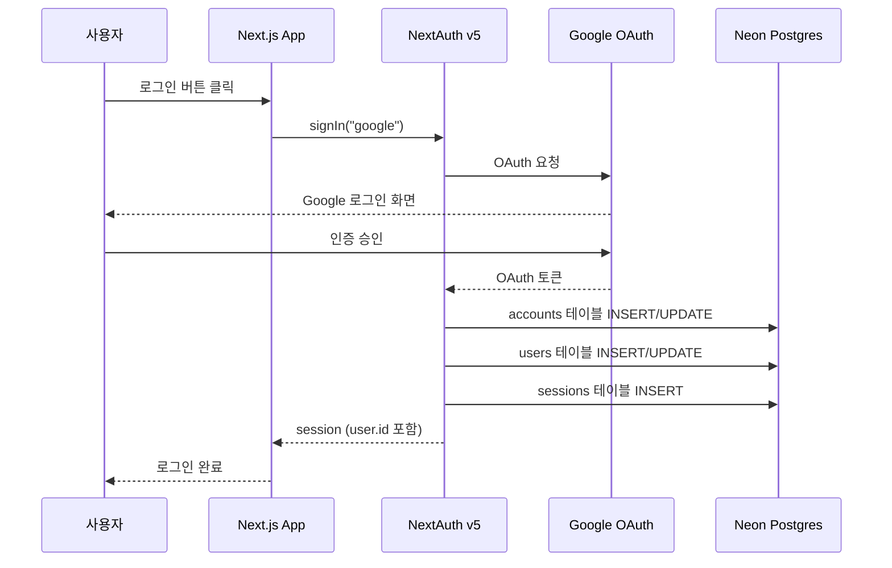
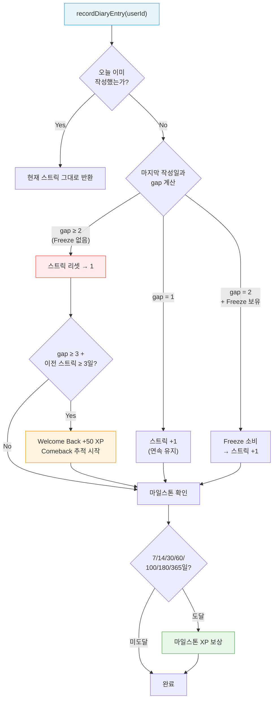
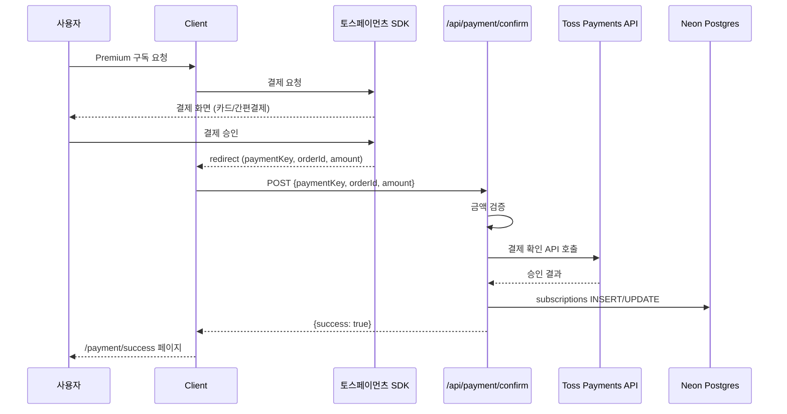

# Common Systems

| 항목 | 값 |
|------|-----|
| **버전** | 2.0.0 |
| **상태** | `완료` |
| **최종 수정일** | 2026-02-12 |
| **관련 문서** | [OVERVIEW.md](./OVERVIEW.md) · [API-SPEC.md](./API-SPEC.md) · [CHAT-SEQUENCE.md](./CHAT-SEQUENCE.md) · [DATA-MODEL.md](./DATA-MODEL.md) · [db-schema/03-SEED-DATA.md](./db-schema/03-SEED-DATA.md) |

이 문서는 여러 기능에서 공통으로 사용되는 횡단 관심사(Cross-Cutting Concerns)를 다룬다.

---

## 목차

1. [인증 (Authentication)](#1-인증-authentication)
2. [구독 & 사용량 관리](#2-구독--사용량-관리-subscription--usage)
3. [스트릭 시스템](#3-스트릭-시스템-streak)
4. [XP & 레벨 시스템](#4-xp--레벨-시스템-gamification)
5. [결제 시스템](#5-결제-시스템-payment)
6. [보물상자 시스템](#6-보물상자-시스템-treasure-chest)
7. [입력 검증](#7-입력-검증-input-validation)

---

## 1. 인증 (Authentication)

### 구현

- **라이브러리**: NextAuth v5 (Beta)
- **Provider**: Google OAuth
- **Adapter**: Drizzle Adapter (`@auth/drizzle-adapter`)
- **설정 파일**: `lib/auth.ts`

### 인증 흐름

```
사용자 → Google OAuth 로그인
    ↓
NextAuth 처리
    ├─ accounts 테이블: OAuth 계정 연결
    ├─ users 테이블: 사용자 생성/조회
    └─ sessions 테이블: 세션 생성
    ↓
session.user.id 로 API 인증
```



### 주요 코드

```typescript
// lib/auth.ts
export const { handlers, auth, signIn, signOut } = NextAuth({
  adapter: DrizzleAdapter(db, {
    usersTable: users,
    accountsTable: accounts,
    sessionsTable: sessions,
    verificationTokensTable: verificationTokens,
  }),
  providers: [Google({ clientId, clientSecret })],
  callbacks: {
    session({ session, user }) {
      session.user.id = user.id;  // 세션에 userId 포함
      return session;
    },
  },
});
```

### 비로그인 사용자 처리

- 비로그인도 일기 교정 사용 가능
- `userId = session?.user?.id || "default-user"` 형태로 폴백
- 비로그인 시: 기록 미저장, XP 미부여, 스트릭 미추적

### 관련 테이블

| 테이블 | 용도 |
|--------|------|
| `users` | 사용자 기본 정보 (id, name, email, image) |
| `accounts` | OAuth 연결 (provider, providerAccountId) |
| `sessions` | 활성 세션 (sessionToken, expires) |
| `verification_tokens` | 이메일 인증 토큰 |

---

## 2. 구독 & 사용량 관리 (Subscription & Usage)

### Freemium 모델

| 구분 | Free | Premium (₩6,900/월) |
|------|------|---------------------|
| 일기 교정 | 3회/일 | 무제한 |
| XP 레벨 상한 | Lv.10 | Lv.30 |
| 주간 퀘스트 | X | O |
| 보물상자 | X | O |
| AI Pen Pal | X | O (예정) |

### 사용량 확인 흐름

```
API 요청 → auth() 호출
    ↓
getUsageStatus(userId)
    ├─ checkSubscription() → subscriptions 테이블 조회
    │   └─ plan="premium" && status="active" && endDate 미만료
    ├─ getDailyUsage() → daily_usage 테이블 조회
    │   └─ 오늘 날짜 기준 count 조회
    └─ UsageStatus 반환
        {isPremium, dailyLimit, usedToday, remaining, canUse}
```

### 주요 코드 (`lib/subscription/check-usage.ts`)

```typescript
const FREE_DAILY_LIMIT = 3;  // 무료 일일 교정 횟수

export async function getUsageStatus(userId: string): Promise<UsageStatus> {
  const isPremium = await checkSubscription(userId);
  const usedToday = await getDailyUsage(userId);

  if (isPremium) {
    return { isPremium: true, dailyLimit: Infinity, canUse: true, ... };
  }

  const remaining = Math.max(0, FREE_DAILY_LIMIT - usedToday);
  return { isPremium: false, dailyLimit: FREE_DAILY_LIMIT, canUse: remaining > 0, ... };
}
```

### 관련 테이블

| 테이블 | 용도 |
|--------|------|
| `subscriptions` | 구독 상태 (plan, status, paymentKey, endDate) |
| `daily_usage` | 일일 사용 횟수 (userId + date 기준) |

---

## 3. 스트릭 시스템 (Streak)

### 개요

연속 일기 작성 일수를 추적하여 습관 형성을 유도한다. KST(한국 시간) 기준 자정에 리셋된다.

### 핵심 로직 (`lib/streak/streak-manager.ts`)

```
recordDiaryEntry(userId) 호출 시:

[1] 오늘 이미 작성했는가?
    → Yes: 현재 스트릭 그대로 반환
    → No: [2]로 이동

[2] 마지막 작성일과의 간격(gap) 계산
    ├─ gap = 1 (어제 작성): 스트릭 +1 (연속 유지)
    ├─ gap = 2 + Freeze 보유: Freeze 소비 → 스트릭 +1 (보호)
    └─ gap ≥ 2 (Freeze 없음): 스트릭 리셋 → 1

[3] 복귀 보너스 확인
    ├─ gap ≥ 3 + 이전 스트릭 ≥ 3일: Welcome Back +50 XP
    └─ Comeback 추적 시작

[4] Comeback 진행
    ├─ 3일 연속: Comeback Kid +100 XP
    └─ 7일 연속: 이전 스트릭 50% 복구

[5] 마일스톤 확인 (7/14/30/60/100/180/365일)
    └─ 해당 일수 도달 시 XP 보상 (1회 한정)
```



### Streak Freeze

- **용도**: 하루 빠져도 스트릭 유지
- **보유 상한**: 2개
- **획득 방법**: 보물상자 보상 또는 IAP 구매
- **소비 조건**: gap = 2일 (어제 미작성) + Freeze 보유 시 자동 소비

### 마일스톤 보상

| 연속 일수 | XP 보상 | 특별 칭호 |
|-----------|---------|----------|
| 7일 | +100 | — |
| 14일 | +200 | — |
| 30일 | +500 | Monthly Writer |
| 60일 | +1,000 | — |
| 100일 | +1,500 | Century Writer |
| 180일 | +3,000 | — |
| 365일 | +5,000 | Year-Round Writer |

### 관련 테이블

| 테이블 | 용도 |
|--------|------|
| `diary_streaks` | 스트릭 상태 (currentStreak, longestStreak, lastWrittenAt 등) |
| `user_profiles` | Freeze 보유 수 (`streakFreezeCount`) |

---

## 4. XP & 레벨 시스템 (Gamification)

### 레벨 구조 (30단계, 6티어)

| 티어 | 레벨 | 칭호 | 필요 XP | Free 가능 |
|------|------|------|---------|----------|
| 1 | Lv.1~5 | Diary Beginner | 0~300 | O |
| 2 | Lv.6~10 | Daily Writer | 300~1,000 | O |
| 3 | Lv.11~15 | Story Teller | 1,000~2,500 | X (Premium) |
| 4 | Lv.16~20 | Word Crafter | 2,500~5,000 | X |
| 5 | Lv.21~25 | English Native | 5,000~10,000 | X |
| 6 | Lv.26~30 | Master Author | 10,000+ | X |

레벨 공식: `floor(80 × N^1.7)` — Premium 유저 기준 약 7.2개월에 Lv.30 달성.

### XP 획득 규칙

#### 일기 작성 보상 (일일 상한 3회)

| 행동 | XP | 조건 |
|------|-----|------|
| 일기 제출 | +30 | — |
| 30단어 이상 | +5 | TTR ≥ 0.4 |
| 60단어 이상 | +10 | TTR ≥ 0.4 |
| 100단어 이상 | +20 | TTR ≥ 0.4 |
| 약점 극복 | +20 | 최근 7일 TOP 오답 미발생 (1회/일) |

#### 학습 활동 보상

| 행동 | XP | 상한 |
|------|-----|------|
| 표현노트 저장 | +5 | 5회/일 |

#### TTR (Type-Token Ratio) 검증

어뷰징 방지를 위해 분량 보너스 XP 지급 전 TTR을 검증한다.

```
TTR = 고유 단어 수 / 전체 단어 수
  - TTR ≥ 0.4: 분량 보너스 지급
  - TTR < 0.4: 분량 보너스 미지급 (반복 텍스트로 판단)
```

### 주요 코드

- `lib/gamification/xp-service.ts`: XP 부여, 레벨 계산, 프로필 업데이트
- `lib/gamification/xp-constants.ts`: 레벨 테이블, XP 보상 값, 일일 상한
- `lib/xp/daily-tracking.ts`: 일일 XP 상한 추적 (`daily_xp_tracking` 테이블)
- `lib/xp/weakness-overcome.ts`: 약점 극복 판정
- `lib/validation/ttr.ts`: TTR 계산 및 분량 보너스 판정

### 관련 테이블

| 테이블 | 용도 |
|--------|------|
| `user_profiles` | XP, 레벨, 칭호, Freeze 수, 부스터 상태 |
| `xp_history` | 모든 XP 획득 이벤트 기록 |
| `daily_xp_tracking` | 일일 상한 추적 (diary/vocab/weakness 카운트) |

---

## 5. 결제 시스템 (Payment)

### 토스페이먼츠 연동

- **라이브러리**: REST API 직접 호출 (`lib/payment/toss.ts`)
- **엔드포인트**: `POST /api/payment/confirm`

### 결제 흐름

```
[1] 클라이언트: 토스페이먼츠 SDK로 결제 요청
[2] 사용자: 결제 승인 (카드, 간편결제 등)
[3] 토스페이먼츠 → 리다이렉트 (successUrl + paymentKey, orderId, amount)
[4] 클라이언트: /api/payment/confirm 호출
[5] 서버: 토스페이먼츠 API로 결제 확인
[6] DB 업데이트: subscriptions 또는 iap_purchases 테이블
[7] 결과 페이지: /payment/success 또는 /payment/fail
```



### 상품 유형

| 유형 | 상품 | 가격 |
|------|------|------|
| 월 구독 | Premium (무제한 교정 + 전체 기능) | ₩6,900/월 |
| IAP | 추가 교정권 (1회) | ₩500 |
| IAP | Streak Freeze (1개) | ₩500 |
| IAP | Streak Freeze (3개) | ₩1,200 |
| IAP | XP 2배 부스터 (24시간) | ₩1,500 |
| IAP | 보물상자 열쇠 (5개) | ₩2,500 |

### 관련 테이블

| 테이블 | 용도 |
|--------|------|
| `subscriptions` | 월 구독 상태 (plan, status, paymentKey, endDate) |
| `iap_purchases` | IAP 구매 기록 (productType, amount, paymentKey, status) |

---

## 6. 보물상자 시스템 (Treasure Chest)

### 개요

일기 작성 완료 시 보상으로 보물상자가 제공된다. 확률 기반 보상으로 가변 비율(Variable Ratio) 강화를 제공한다.

### 보상 유형

| 보상 | 설명 |
|------|------|
| `xp_bonus` | 추가 XP (10~50) |
| `quote` | 영어 명언 카드 |
| `rare_expression` | 고급 영어 표현 |
| `streak_freeze` | Streak Freeze 아이템 |
| `rare_title` | 레어 칭호 (확률 낮음) |

### 보물상자 열기

| 방법 | 조건 |
|------|------|
| 일일 무료 | 일기 작성 완료 후 1회 |
| 열쇠 사용 | IAP로 구매한 열쇠 소비 |

### 주요 코드

- `lib/gamification/treasure-chest.ts`: 보상 결정 로직
- `app/api/treasure-chest/open/route.ts`: 일일 무료 열기
- `app/api/treasure-chest/open-with-key/route.ts`: 열쇠 사용

### 관련 테이블

| 테이블 | 용도 |
|--------|------|
| `treasure_chest_log` | 보물상자 보상 히스토리 |
| `user_profiles` | 열쇠 보유 수 (`chestKeyCount`) |

---

## 7. 입력 검증 (Input Validation)

### 클라이언트 사이드 검증

일기 제출 전 프론트엔드에서 다음 규칙을 검증한다:

| 규칙 | 조건 | 실패 시 메시지 |
|------|------|---------------|
| 빈 텍스트 금지 | `text.trim().length === 0` | 버튼 비활성화 |
| 최소 20자 | 공백 제외 20자 이상 | "조금 더 써볼까요?" |
| 최소 5단어 | 공백 기준 5단어 이상 | "문장을 조금 더 만들어보세요!" |
| 반복 문자 감지 | 동일 문자 5회+ 연속 | "의미 있는 영어 문장을 써주세요." |
| 반복 단어 감지 | 동일 단어 50%+ | "다양한 단어로 일기를 써보세요!" |

### 서버 사이드 검증 (TTR)

XP 분량 보너스 지급 시 TTR(Type-Token Ratio)을 서버에서 검증한다:

- `lib/validation/ttr.ts`: TTR 계산 + 분량 보너스 판정
- TTR < 0.4이면 분량 보너스 미지급 (기본 교정 XP는 정상 지급)
