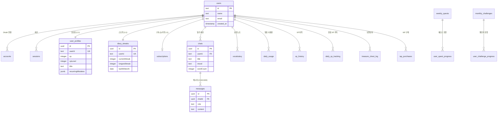

# Data Model

| 항목 | 값 |
|------|-----|
| **버전** | 2.0.0 |
| **상태** | `완료` |
| **최종 수정일** | 2026-02-12 |
| **스키마 파일** | `db/schema.ts` |
| **관련 문서** | [db-schema/01-TABLE-DEFINITIONS.md](./db-schema/01-TABLE-DEFINITIONS.md) · [db-schema/02-ERD.md](./db-schema/02-ERD.md) · [db-schema/03-SEED-DATA.md](./db-schema/03-SEED-DATA.md) · [OVERVIEW.md](./OVERVIEW.md) |

> **역할 구분**: 이 문서는 데이터 모델의 **설계 의도와 관계**를 다룬다. 컬럼 수준의 DDL 상세는 [01-TABLE-DEFINITIONS.md](./db-schema/01-TABLE-DEFINITIONS.md), 시각적 ERD는 [02-ERD.md](./db-schema/02-ERD.md) 참조.

---

## 목차

1. [개요](#1-개요)
2. [도메인별 테이블 목록](#2-도메인별-테이블-목록)
3. [핵심 테이블 상세](#3-핵심-테이블-상세)
4. [JSONB 필드 스키마](#4-jsonb-필드-스키마)
5. [주요 관계](#5-주요-관계)
6. [마이그레이션](#6-마이그레이션)

---

## 1. 개요

Neon (Serverless Postgres) + Drizzle ORM으로 타입 안전한 스키마를 관리한다. 테이블은 **4개 도메인**으로 분류된다.

| 도메인 | 테이블 수 | 설명 |
|--------|----------|------|
| Auth | 4 | NextAuth 인증 |
| Core | 6 | 일기/교정/학습 |
| Gamification | 8 | XP/스트릭/퀘스트 |
| Billing | 3 | 구독/결제 |

---

## 2. 도메인별 테이블 목록

### 2.1 Auth 도메인

NextAuth v5 + Drizzle Adapter가 사용하는 인증 테이블.

| 테이블 | PK | 설명 |
|--------|-----|------|
| `users` | `id` (text) | 사용자 기본 정보 |
| `accounts` | `provider` + `providerAccountId` | OAuth 계정 연결 |
| `sessions` | `sessionToken` (text) | 활성 세션 |
| `verification_tokens` | `identifier` + `token` | 이메일 인증 토큰 |

### 2.2 Core 도메인

일기 교정, 사용자 프로필, 학습 데이터를 관리한다.

| 테이블 | PK | 설명 |
|--------|-----|------|
| `chats` | `id` (uuid) | 일기(채팅) 세션 |
| `messages` | `id` (uuid) | 채팅 메시지 (user/assistant/penpal) |
| `user_profiles` | `id` (uuid) | 사용자 프로필 + 게이미피케이션 상태 |
| `user_mistakes` | `id` (uuid) | 오답 패턴 분석 |
| `vocabulary` | `id` (uuid) | 표현노트 (저장 어휘) |
| `learning_stats` | `id` (uuid) | 일별 학습 통계 |

### 2.3 Gamification 도메인

XP, 스트릭, 퀘스트, 보물상자 등 게이미피케이션 시스템.

| 테이블 | PK | 설명 |
|--------|-----|------|
| `diary_streaks` | `id` (uuid) | 연속 작성 스트릭 |
| `daily_xp_tracking` | `id` (uuid) | 일일 XP 상한 추적 |
| `xp_history` | `id` (uuid) | XP 획득 이벤트 로그 |
| `treasure_chest_log` | `id` (uuid) | 보물상자 보상 히스토리 |
| `weekly_quests` | `id` (uuid) | 주간 퀘스트 정의 |
| `user_quest_progress` | `id` (uuid) | 사용자 퀘스트 진행도 |
| `monthly_challenges` | `id` (uuid) | 월간 챌린지 정의 |
| `user_challenge_progress` | `id` (uuid) | 사용자 챌린지 진행도 |

### 2.4 Billing 도메인

구독, 사용량, 인앱 구매를 관리한다.

| 테이블 | PK | 설명 |
|--------|-----|------|
| `subscriptions` | `id` (uuid) | 구독 상태 (free/premium) |
| `daily_usage` | `id` (uuid) | 일일 교정 횟수 |
| `iap_purchases` | `id` (uuid) | IAP 구매 기록 |

---

## 3. 핵심 테이블 상세

### 3.1 `chats` — 일기 세션

```
chats
├── id: uuid (PK)
├── userId: text (NOT NULL)
├── title: text (NOT NULL)          -- 일기 제목 (첫 50자)
├── mood: enum [happy, neutral, sad, excited, tired, anxious]
├── wordCount: integer (default 0)  -- 원문 단어 수
├── challengeWordUsed: boolean      -- 오늘의 단어 사용 여부 (레거시)
├── createdAt: timestamp
└── updatedAt: timestamp

인덱스: (userId, createdAt)
```

### 3.2 `messages` — 채팅 메시지

```
messages
├── id: uuid (PK)
├── chatId: uuid (FK → chats.id, CASCADE)
├── role: enum [user, assistant, penpal]
├── content: text (NOT NULL)
│   ├── user: 원문 텍스트
│   ├── assistant: JSON (CorrectionResponse)
│   └── penpal: 일반 텍스트 (AI Pen Pal 답장)
└── createdAt: timestamp
```

### 3.3 `user_profiles` — 사용자 프로필 + 게이미피케이션

```
user_profiles
├── id: uuid (PK)
├── userId: text (UNIQUE, NOT NULL)
├── learningGoal: text              -- 학습 목표
├── recurringMistakes: jsonb        -- 반복 오답 패턴 배열
├── learningPreferences: jsonb      -- 학습 선호 설정
│
│  -- v3.0 Gamification --
├── xp: integer (default 0)         -- 누적 XP
├── xpLevel: integer (default 1)    -- 현재 레벨 (1~30)
├── title: text (default "Diary Beginner")
├── equippedTitle: text             -- 장착 레어 칭호
├── earnedTitles: jsonb             -- 획득 칭호 목록
├── streakFreezeCount: integer (0)  -- Freeze 보유 (max 2)
├── xpBoosterExpiresAt: timestamp   -- XP 2배 부스터 만료 시각
├── chestKeyCount: integer (0)      -- 보물상자 열쇠 보유
├── createdAt: timestamp
└── updatedAt: timestamp

인덱스: (userId)
```

### 3.4 `user_mistakes` — 오답 패턴

```
user_mistakes
├── id: uuid (PK)
├── userId: text (NOT NULL)
├── mistakeType: enum [grammar, vocabulary, expression]
├── subType: text                   -- 세부 유형 (tense, agreement 등)
├── pattern: text (NOT NULL)        -- 패턴명 (kebab-case)
├── frequency: integer (default 1)
├── examples: jsonb (default [])    -- 예시 문장 배열
├── lastOccurredAt: timestamp
├── createdAt: timestamp
└── updatedAt: timestamp

인덱스: (userId), (mistakeType), (userId, pattern)
```

### 3.5 `vocabulary` — 표현노트

```
vocabulary
├── id: uuid (PK)
├── userId: text (FK → users.id, CASCADE)
├── word: text (NOT NULL)           -- 저장된 단어/표현
├── meaning: text                   -- 한국어 뜻
├── example: text                   -- 예문
├── memo: text                      -- 사용자 메모
├── sourceType: enum [diary, chat, manual]
├── sourceId: uuid                  -- 출처 참조
│
│  -- AI-enriched --
├── pronunciation: text             -- IPA 발음
├── partOfSpeech: text              -- 품사
├── synonyms: text[]                -- 유의어 (최대 3개)
├── context: text                   -- 원문 문맥
├── difficulty: enum [beginner, intermediate, advanced]
├── createdAt: timestamp
└── updatedAt: timestamp

인덱스: (userId), (createdAt), (userId, createdAt)
```

### 3.6 `xp_history` — XP 히스토리

```
xp_history
├── id: uuid (PK)
├── userId: text (FK → users.id, CASCADE)
├── amount: integer (NOT NULL)      -- 획득 XP
├── action: enum [
│     diary_submit, weakness_overcome,
│     length_30, length_60, length_100,
│     expression_save,
│     streak_7d ~ streak_365d,
│     monthly_challenge_15/20/25,
│     weekly_quest, weekly_bonus, treasure_chest,
│     welcome_back, comeback_kid
│   ]
├── boosterApplied: boolean         -- 2배 부스터 적용 여부
├── referenceId: uuid               -- 관련 엔티티 ID
└── createdAt: timestamp

인덱스: (userId), (userId, createdAt), (userId, action)
```

### 3.7 `diary_streaks` — 스트릭

```
diary_streaks
├── id: uuid (PK)
├── userId: text (UNIQUE, FK → users.id, CASCADE)
├── currentStreak: integer (default 0)
├── longestStreak: integer (default 0)
├── lastWrittenAt: date
├── totalEntries: integer (default 0)
│
│  -- v3.0 Freeze & Comeback --
├── previousStreak: integer (0)     -- 리셋 전 스트릭
├── streakFreezeUsedAt: date        -- 마지막 Freeze 사용일
├── comebackStartedAt: date         -- 복귀 추적 시작일
├── comebackDays: integer (0)       -- 복귀 연속 일수
├── createdAt: timestamp
└── updatedAt: timestamp

인덱스: (userId)
```

---

## 4. JSONB 필드 스키마

### `user_profiles.recurringMistakes`

```json
[
  {
    "pattern": "tense-confusion",
    "examples": ["I eat lunch yesterday", "She go to school"],
    "count": 5,
    "lastSeen": "2026-02-10T10:30:00Z"
  }
]
```

### `user_profiles.learningPreferences`

```json
{
  "preferredExplanationStyle": "detailed",
  "focusAreas": ["grammar", "idioms"]
}
```

### `user_profiles.earnedTitles`

```json
["Monthly Writer", "Comeback Kid"]
```

### `treasure_chest_log.rewardData`

```json
{ "xp": 30 }                          // xp_bonus
{ "quote": "The early bird...", "author": "..." }  // quote
{ "expression": "on cloud nine", "meaning": "..." } // rare_expression
{ "titleName": "Lucky Writer" }        // rare_title
```

---

## 5. 주요 관계

```
users (1) ─── (N) accounts
users (1) ─── (N) sessions
users (1) ─── (1) user_profiles
users (1) ─── (1) diary_streaks
users (1) ─── (1) subscriptions
users (1) ─── (N) chats
users (1) ─── (N) vocabulary
users (1) ─── (N) daily_usage
users (1) ─── (N) xp_history
users (1) ─── (N) iap_purchases
users (1) ─── (N) treasure_chest_log

chats (1) ─── (N) messages

weekly_quests (1) ─── (N) user_quest_progress
monthly_challenges (1) ─── (N) user_challenge_progress
```

### Mermaid ER 다이어그램



> 전체 ERD 상세는 [@docs/architecture/db-schema/02-ERD.md](./db-schema/02-ERD.md) 참조.

---

## 6. 마이그레이션

```bash
# 스키마 변경 후 마이그레이션 생성
npx drizzle-kit generate

# 마이그레이션 실행
npx drizzle-kit migrate

# 개발 환경 빠른 적용 (마이그레이션 없이)
npx drizzle-kit push
```

자세한 테이블 DDL은 [db-schema/01-TABLE-DEFINITIONS.md](./db-schema/01-TABLE-DEFINITIONS.md) 참조.
