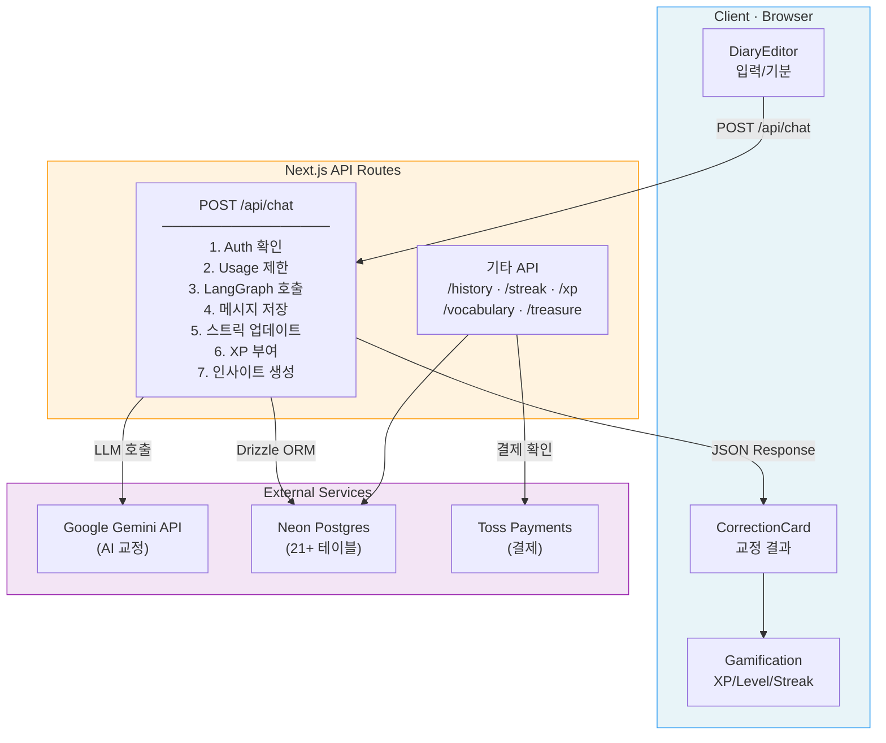
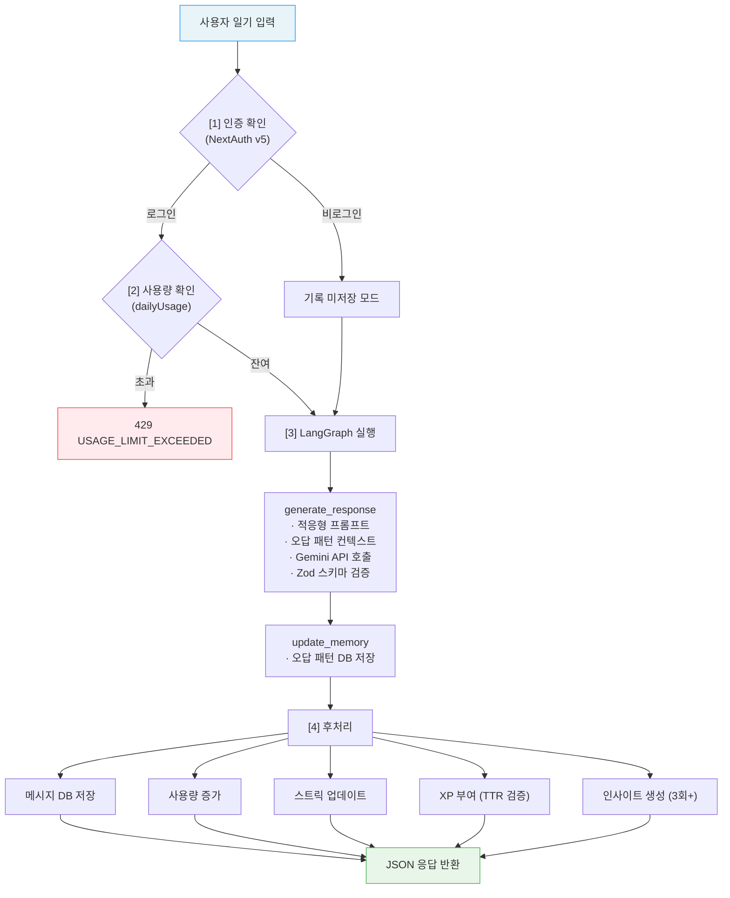

# Architecture Overview

| 항목 | 값 |
|------|-----|
| **버전** | 3.1.1 |
| **상태** | `완료` |
| **최종 수정일** | 2026-02-12 |
| **관련 문서** | [DIRECTORY.md](./DIRECTORY.md) · [AI-SYSTEM.md](./AI-SYSTEM.md) · [DATA-MODEL.md](./DATA-MODEL.md) · [API-SPEC.md](./API-SPEC.md) · [CHAT-SEQUENCE.md](./CHAT-SEQUENCE.md) · [UI-DESIGN.md](./UI-DESIGN.md) · [COMMON-SYSTEMS.md](./COMMON-SYSTEMS.md) |

---

## 목차

1. [프로젝트 개요](#1-프로젝트-개요)
2. [기술 스택](#2-기술-스택)
3. [고수준 시스템 아키텍처](#3-고수준-시스템-아키텍처)
4. [핵심 처리 흐름](#4-핵심-처리-흐름-일기-교정)
5. [주요 아키텍처 레이어](#5-주요-아키텍처-레이어)
6. [데이터 모델 요약](#6-데이터-모델-요약)
7. [환경 변수](#7-환경-변수)
8. [배포 환경](#8-배포-환경)
9. [관련 문서](#9-관련-문서)

---

## 1. 프로젝트 개요

**Daily English**는 AI 기반 영어 일기 교정 앱으로, 게이미피케이션을 통해 매일 영어 쓰기 습관을 형성하도록 돕는다.

### 핵심 가치

- 사용자가 짧은 영어 일기를 작성하면 AI가 즉시 교정
- XP/레벨/보물상자/스트릭/퀘스트 등 다층 게이미피케이션으로 매일 복귀 유도
- 레벨에 따라 한국어/영어 설명 비율을 자동 조절하는 적응형 피드백

### 비즈니스 모델

| 수익원 | 설명 | 목표 비중 |
|--------|------|----------|
| 월 구독 (Premium) | ₩6,900/월 — 무제한 교정, 전체 게이미피케이션 | 60% |
| 인앱 소모품 (IAP) | Streak Freeze, XP 부스터, 보물상자 열쇠 등 | 30% |
| 향후 확장 (B2B) | 기업/학원 대상 단체 구독 (v3.0 범위 외) | 10% |

---

## 2. 기술 스택

| 영역 | 기술 | 비고 |
|------|------|------|
| **Framework** | Next.js 15 (App Router) | React 19, TypeScript Strict |
| **AI/LLM** | Google Gemini (`gemini-2.5-pro`) | LangChain + LangGraph로 상태 관리 |
| **AI SDK** | Vercel AI SDK 4.x, `@ai-sdk/google` | `streamObject` 기반 구조화된 응답 |
| **Database** | Neon (Serverless Postgres) | Drizzle ORM으로 타입 안전한 쿼리 |
| **Auth** | NextAuth v5 (Beta) | Google OAuth, Drizzle Adapter |
| **UI** | Shadcn UI + Radix UI + Tailwind CSS | Lucide React 아이콘 |
| **Validation** | Zod | AI 응답 스키마 강제 + 입력 검증 |
| **Payment** | 토스페이먼츠 (Toss Payments) | 구독 및 IAP 결제 |
| **Package Manager** | npm | — |

---

## 3. 고수준 시스템 아키텍처

```
┌─────────────────────────────────────────────────────────┐
│                      Client (Browser)                   │
│  ┌─────────────┐  ┌──────────────┐  ┌───────────────┐  │
│  │ DiaryEditor  │  │ CorrectionCard│  │ Gamification  │  │
│  │ (입력/기분)  │  │ (교정 결과)   │  │ (XP/Level/    │  │
│  │             │  │              │  │  Streak)       │  │
│  └──────┬──────┘  └──────▲───────┘  └───────▲───────┘  │
│         │               │                   │           │
└─────────┼───────────────┼───────────────────┼───────────┘
          │               │                   │
          ▼               │                   │
┌─────────────────────────┼───────────────────┼───────────┐
│            Next.js API Routes (Route Handlers)           │
│  ┌─────────────────────────────────────────────────────┐ │
│  │ POST /api/chat                                      │ │
│  │  1. Auth 확인 (NextAuth)                            │ │
│  │  2. Usage 제한 확인 (Free: 1회/일)                   │ │
│  │  3. LangGraph 호출 (AI 교정)                        │ │
│  │  4. 메시지 저장 (Drizzle → Neon)                    │ │
│  │  5. 스트릭 업데이트                                  │ │
│  │  6. XP 부여 (TTR 검증, 일일 상한)                   │ │
│  │  7. 오답 패턴 저장 및 인사이트 생성                  │ │
│  └─────────────────────────────────────────────────────┘ │
│  ┌──────────────┐ ┌──────────────┐ ┌──────────────────┐  │
│  │ /api/history  │ │ /api/streak  │ │ /api/user/xp     │  │
│  │ /api/calendar │ │ /api/usage   │ │ /api/vocabulary   │  │
│  │ /api/payment  │ │ /api/treasure│ │ /api/user/profile │  │
│  └──────────────┘ └──────────────┘ └──────────────────┘  │
└──────────────────────────┬───────────────────────────────┘
                           │
          ┌────────────────┼────────────────┐
          ▼                ▼                ▼
┌──────────────┐  ┌──────────────┐  ┌──────────────────┐
│  Google       │  │  Neon         │  │  Toss Payments   │
│  Gemini API   │  │  Postgres     │  │  (결제)          │
│  (AI 교정)    │  │  (15+ 테이블) │  │                  │
└──────────────┘  └──────────────┘  └──────────────────┘
```

### Mermaid 시스템 아키텍처



---

## 4. 핵심 처리 흐름 (일기 교정)

> 상세 시퀀스는 [@docs/architecture/CHAT-SEQUENCE.md](./CHAT-SEQUENCE.md) 참조.

```
사용자 일기 입력
    │
    ▼
[1] 인증 확인 (NextAuth v5)
    │  └─ 비로그인도 사용 가능 (기록 미저장)
    ▼
[2] 사용량 확인 (dailyUsage)
    │  └─ 무료: 1회/일, Premium: 무제한
    ▼
[3] LangGraph 실행
    │  ├─ generate_response (AI 교정)
    │  │   ├─ 사용자 레벨 기반 적응형 프롬프트 구성
    │  │   ├─ 최근 오답 패턴(7일) 컨텍스트 포함
    │  │   ├─ Gemini API 호출
    │  │   └─ Zod 스키마 검증
    │  └─ update_memory (비동기)
    │      └─ 오답 패턴 DB 저장
    ▼
[4] 후처리
    ├─ 메시지 DB 저장 (user + assistant)
    ├─ 사용량 증가
    ├─ 스트릭 업데이트
    ├─ XP 부여 (TTR 검증 + 일일 상한 적용)
    └─ 반복 오답 인사이트 생성 (3회+ 발생 시)
    │
    ▼
JSON 응답 반환
```

### Mermaid 처리 흐름



---

## 5. 주요 아키텍처 레이어

### 5.1 AI Layer (`lib/ai/`)

| 파일 | 역할 |
|------|------|
| `graph.ts` | LangGraph StateGraph 정의 — `generate_response` → `update_memory` 노드 |
| `schema.ts` | Zod 기반 AI 응답 스키마 (`CorrectionResponse`) |
| `response-validator.ts` | 레벨별 응답 품질 검증 (한국어 비율 등) |
| `user-profile.ts` | `UserProfileManager` — 반복 오답 패턴 관리 |
| `vocabulary-enricher.ts` | 저장 어휘에 발음, 유의어, 난이도 등 AI 보강 |

### 5.2 Gamification Layer (`lib/gamification/`)

| 파일 | 역할 |
|------|------|
| `xp-service.ts` | XP 부여 (일기 제출, 분량 보너스, 약점 극복) |
| `xp-constants.ts` | 레벨 테이블, 칭호, XP 보상 값 정의 |
| `treasure-chest.ts` | 보물상자 보상 시스템 |

### 5.3 Data Layer (`db/`)

| 파일 | 역할 |
|------|------|
| `schema.ts` | 15+ Drizzle 테이블 정의 (Auth, Core, Gamification, Billing) |
| `index.ts` | Neon Serverless 연결 (싱글톤) |

### 5.4 Auth & Subscription (`lib/auth.ts`, `lib/subscription/`)

- **NextAuth v5** + Google OAuth + Drizzle Adapter
- Freemium 모델: `dailyUsage` 테이블로 일일 사용량 추적
- `subscriptions` 테이블로 Free/Premium 구분

### 5.5 Payment (`lib/payment/`)

- 토스페이먼츠 API 연동
- 월 구독 (`subscriptions`) 및 IAP 소모품 (`iapPurchases`) 처리

---

## 6. 데이터 모델 요약

총 **15개 이상 테이블**이 4개 도메인으로 분류된다:

| 도메인 | 테이블 | 설명 |
|--------|--------|------|
| **Auth** | `users`, `accounts`, `sessions`, `verification_tokens` | NextAuth 인증 |
| **Core** | `chats`, `messages`, `user_profiles`, `user_mistakes`, `vocabulary`, `learning_stats` | 일기/교정/학습 |
| **Gamification** | `diary_streaks`, `daily_xp_tracking`, `xp_history`, `treasure_chest_log`, `weekly_quests`, `user_quest_progress`, `monthly_challenges`, `user_challenge_progress` | 게이미피케이션 |
| **Billing** | `subscriptions`, `daily_usage`, `iap_purchases` | 구독/결제 |

자세한 스키마는 [db-schema/01-TABLE-DEFINITIONS.md](./db-schema/01-TABLE-DEFINITIONS.md) 참조.

---

## 7. 환경 변수

```bash
# AI
GOOGLE_GENERATIVE_AI_API_KEY=   # Gemini API (Vercel AI SDK)
GOOGLE_API_KEY=                 # Gemini API (LangChain)

# Database
DATABASE_URL=                   # Neon Postgres 연결 문자열

# Auth (NextAuth v5)
AUTH_SECRET=                    # NextAuth 시크릿
GOOGLE_CLIENT_ID=               # Google OAuth
GOOGLE_CLIENT_SECRET=           # Google OAuth

# Payment
TOSS_SECRET_KEY=                # 토스페이먼츠 시크릿 키
```

---

## 8. 배포 환경

- **Hosting**: Vercel (Next.js 최적화)
- **Database**: Neon Serverless Postgres (connection pooling)
- **API Timeout**: 최대 60초 (Vercel Hobby plan `maxDuration`)
- **Environment Variables**: Vercel Dashboard에서 관리

---

## 9. 관련 문서

| 문서 | 경로 | 설명 |
|------|------|------|
| 디렉토리 구조 | [DIRECTORY.md](./DIRECTORY.md) | 파일/폴더 배치 규칙 |
| 공통 시스템 | [COMMON-SYSTEMS.md](./COMMON-SYSTEMS.md) | 인증, 구독, 스트릭 |
| AI 시스템 | [AI-SYSTEM.md](./AI-SYSTEM.md) | LangGraph, 프롬프트, 메모리 |
| 데이터 모델 | [DATA-MODEL.md](./DATA-MODEL.md) | 전체 스키마 설계 |
| API 스펙 | [API-SPEC.md](./API-SPEC.md) | 엔드포인트 상세 |
| 채팅 시퀀스 | [CHAT-SEQUENCE.md](./CHAT-SEQUENCE.md) | 일기 교정 흐름 상세 |
| UI 설계 | [UI-DESIGN.md](./UI-DESIGN.md) | 컴포넌트 구조 |
| DB 스키마 | [db-schema/](./db-schema/) | 테이블 정의, ERD, 시드 데이터 |
