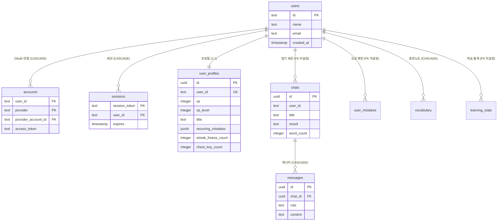
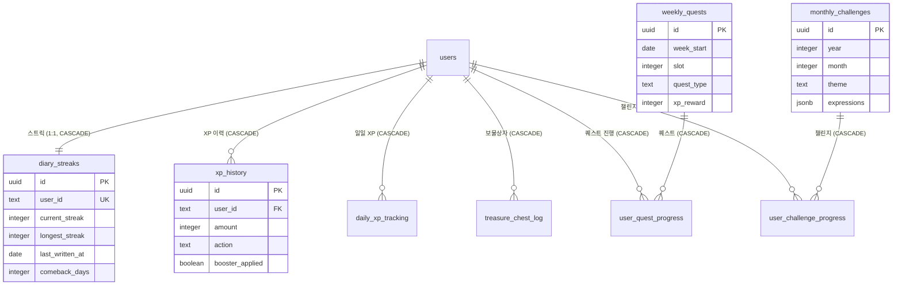
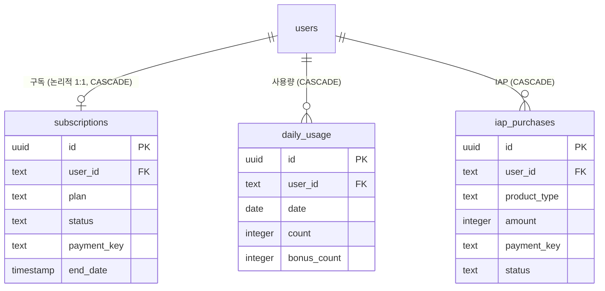

# Entity-Relationship Diagram

| 항목 | 값 |
|------|-----|
| **버전** | 2.0.0 |
| **상태** | `완료` |
| **최종 수정일** | 2026-02-12 |
| **관련 문서** | [DATA-MODEL.md](../DATA-MODEL.md) · [01-TABLE-DEFINITIONS.md](./01-TABLE-DEFINITIONS.md) · [03-SEED-DATA.md](./03-SEED-DATA.md) |

---

## 목차

1. [전체 ERD (텍스트)](#전체-erd-텍스트)
2. [Mermaid ER 다이어그램](#mermaid-er-다이어그램)
3. [관계 요약](#관계-요약)
4. [CASCADE 삭제 영향](#cascade-삭제-영향)

---

## 전체 ERD (텍스트)

```
┌─────────────────────────────────────────────────────────────────────────┐
│                           AUTH DOMAIN                                   │
│                                                                         │
│  ┌──────────┐    ┌──────────┐    ┌──────────┐    ┌────────────────┐   │
│  │  users    │◄──┤ accounts │    │ sessions │    │ verification   │   │
│  │──────────│    │──────────│    │──────────│    │ _tokens        │   │
│  │ id (PK)  │    │ userId   │    │ token(PK)│    │────────────────│   │
│  │ name     │    │ provider │    │ userId   │    │ identifier     │   │
│  │ email    │    │ provAccId│    │ expires  │    │ token          │   │
│  │ image    │    │ (PK comp)│    └──────────┘    │ expires        │   │
│  └─────┬────┘    └──────────┘                    └────────────────┘   │
│        │                                                                │
└────────┼────────────────────────────────────────────────────────────────┘
         │
         │  1:N FK (user_id → users.id, CASCADE)
         │
┌────────┼────────────────────────────────────────────────────────────────┐
│        │                    CORE DOMAIN                                  │
│        │                                                                 │
│        ├──────┐                                                          │
│        │      │                                                          │
│        ▼      │     ┌──────────┐                                        │
│  ┌──────────┐ │     │ messages │                                        │
│  │  chats   │─┼────►│──────────│                                        │
│  │──────────│ │     │ id (PK)  │                                        │
│  │ id (PK)  │ │     │ chatId   │◄── FK (chats.id, CASCADE)             │
│  │ userId   │ │     │ role     │                                        │
│  │ title    │ │     │ content  │                                        │
│  │ mood     │ │     └──────────┘                                        │
│  └──────────┘ │                                                          │
│               │     ┌──────────────┐                                    │
│               ├────►│ user_profiles │    (1:1)                          │
│               │     │──────────────│                                    │
│               │     │ id (PK)      │                                    │
│               │     │ userId (UQ)  │                                    │
│               │     │ xp, xpLevel  │                                    │
│               │     │ title        │                                    │
│               │     │ recurring... │                                    │
│               │     │ freezeCount  │                                    │
│               │     │ chestKeyCount│                                    │
│               │     └──────────────┘                                    │
│               │                                                          │
│               │     ┌──────────────┐                                    │
│               ├────►│ user_mistakes │    (1:N)                          │
│               │     │──────────────│                                    │
│               │     │ mistakeType  │                                    │
│               │     │ pattern      │                                    │
│               │     │ frequency    │                                    │
│               │     └──────────────┘                                    │
│               │                                                          │
│               │     ┌──────────────┐                                    │
│               ├────►│  vocabulary  │    (1:N)                           │
│               │     │──────────────│                                    │
│               │     │ word         │                                    │
│               │     │ meaning      │                                    │
│               │     │ pronunciation│                                    │
│               │     │ difficulty   │                                    │
│               │     └──────────────┘                                    │
│               │                                                          │
│               │     ┌──────────────┐                                    │
│               └────►│learning_stats│    (1:N)                           │
│                     │──────────────│                                    │
│                     │ date         │                                    │
│                     │ mistakeRate  │                                    │
│                     └──────────────┘                                    │
│                                                                          │
└──────────────────────────────────────────────────────────────────────────┘

┌──────────────────────────────────────────────────────────────────────────┐
│                        GAMIFICATION DOMAIN                                │
│                                                                           │
│  users (1:1)        users (1:N)          users (1:N)                     │
│     │                  │                    │                              │
│     ▼                  ▼                    ▼                              │
│  ┌──────────────┐  ┌──────────────┐  ┌─────────────────┐                │
│  │ diary_streaks │  │  xp_history  │  │treasure_chest_log│               │
│  │──────────────│  │──────────────│  │─────────────────│                │
│  │ userId (UQ)  │  │ userId       │  │ userId          │                │
│  │ currentStreak│  │ amount       │  │ rewardType      │                │
│  │ longestStreak│  │ action       │  │ rewardData      │                │
│  │ lastWrittenAt│  │ boosterApplied│ │ source          │                │
│  │ previousStreak│ │ referenceId  │  └─────────────────┘                │
│  │ comebackDays │  └──────────────┘                                      │
│  └──────────────┘                                                         │
│                                                                           │
│  users (1:N)                                                              │
│     │                                                                     │
│     ▼                                                                     │
│  ┌──────────────────┐                                                    │
│  │ daily_xp_tracking │                                                   │
│  │──────────────────│                                                    │
│  │ userId           │                                                    │
│  │ date             │                                                    │
│  │ diaryCount       │                                                    │
│  │ vocabCount       │                                                    │
│  │ weaknessOvercome │                                                    │
│  └──────────────────┘                                                    │
│                                                                           │
│  ┌──────────────┐    ┌─────────────────────┐                            │
│  │ weekly_quests │◄──┤ user_quest_progress  │                            │
│  │──────────────│    │─────────────────────│                            │
│  │ weekStart    │    │ userId              │◄── FK (users.id)           │
│  │ slot         │    │ questId             │◄── FK (weekly_quests.id)   │
│  │ questType    │    │ currentCount        │                            │
│  │ xpReward     │    │ completed           │                            │
│  └──────────────┘    └─────────────────────┘                            │
│                                                                           │
│  ┌──────────────────┐  ┌──────────────────────────┐                     │
│  │monthly_challenges │◄─┤ user_challenge_progress  │                     │
│  │──────────────────│  │──────────────────────────│                     │
│  │ year, month      │  │ userId                   │◄── FK (users.id)   │
│  │ theme            │  │ challengeId              │◄── FK              │
│  │ expressions      │  │ usedExpressions          │                     │
│  │ xpReward         │  │ completed                │                     │
│  └──────────────────┘  └──────────────────────────┘                     │
│                                                                           │
└───────────────────────────────────────────────────────────────────────────┘

┌───────────────────────────────────────────────────────────────────────────┐
│                          BILLING DOMAIN                                    │
│                                                                            │
│  users (1:1)               users (1:N)             users (1:N)            │
│     │                         │                       │                    │
│     ▼                         ▼                       ▼                    │
│  ┌──────────────┐  ┌──────────────┐  ┌──────────────┐                    │
│  │ subscriptions │  │ daily_usage  │  │ iap_purchases│                    │
│  │──────────────│  │──────────────│  │──────────────│                    │
│  │ userId       │  │ userId       │  │ userId       │                    │
│  │ plan         │  │ date         │  │ productType  │                    │
│  │ status       │  │ count        │  │ amount       │                    │
│  │ paymentKey   │  │ bonusCount   │  │ paymentKey   │                    │
│  │ endDate      │  └──────────────┘  │ status       │                    │
│  └──────────────┘                    └──────────────┘                    │
│                                                                            │
└────────────────────────────────────────────────────────────────────────────┘
```

---

## 관계 요약

### 1:1 관계

| 부모 | 자식 | FK | 설명 |
|------|------|-----|------|
| `users` | `user_profiles` | user_id (UNIQUE) | 사용자 프로필 |
| `users` | `diary_streaks` | user_id (UNIQUE) | 스트릭 |
| `users` | `subscriptions` | user_id | 구독 (논리적 1:1) |

### 1:N 관계

| 부모 | 자식 | FK | CASCADE |
|------|------|-----|---------|
| `users` | `accounts` | user_id | DELETE |
| `users` | `sessions` | user_id | DELETE |
| `users` | `chats` | user_id | — |
| `users` | `vocabulary` | user_id | DELETE |
| `users` | `daily_usage` | user_id | DELETE |
| `users` | `xp_history` | user_id | DELETE |
| `users` | `daily_xp_tracking` | user_id | DELETE |
| `users` | `treasure_chest_log` | user_id | DELETE |
| `users` | `iap_purchases` | user_id | DELETE |
| `users` | `user_quest_progress` | user_id | DELETE |
| `users` | `user_challenge_progress` | user_id | DELETE |
| `chats` | `messages` | chat_id | DELETE |
| `weekly_quests` | `user_quest_progress` | quest_id | DELETE |
| `monthly_challenges` | `user_challenge_progress` | challenge_id | DELETE |

### FK 없는 논리적 관계

| 테이블 | 컬럼 | 참조 | 설명 |
|--------|------|------|------|
| `chats` | user_id | users.id | FK 미설정 (default-user 허용) |
| `user_mistakes` | user_id | users.id | FK 미설정 |
| `learning_stats` | user_id | users.id | FK 미설정 |

---

## CASCADE 삭제 영향

사용자 삭제 시 CASCADE로 자동 삭제되는 테이블:

```
users DELETE
  ├─ accounts         ← CASCADE
  ├─ sessions         ← CASCADE
  ├─ subscriptions    ← CASCADE
  ├─ daily_usage      ← CASCADE
  ├─ diary_streaks    ← CASCADE
  ├─ vocabulary       ← CASCADE
  ├─ xp_history       ← CASCADE
  ├─ daily_xp_tracking ← CASCADE
  ├─ treasure_chest_log ← CASCADE
  ├─ iap_purchases    ← CASCADE
  ├─ user_quest_progress ← CASCADE
  └─ user_challenge_progress ← CASCADE
```

**CASCADE 미적용**: `chats`, `messages`, `user_mistakes`, `learning_stats` (user_id에 FK 미설정)

---

## Mermaid ER 다이어그램

### Auth + Core 도메인



### Gamification 도메인



### Billing 도메인


