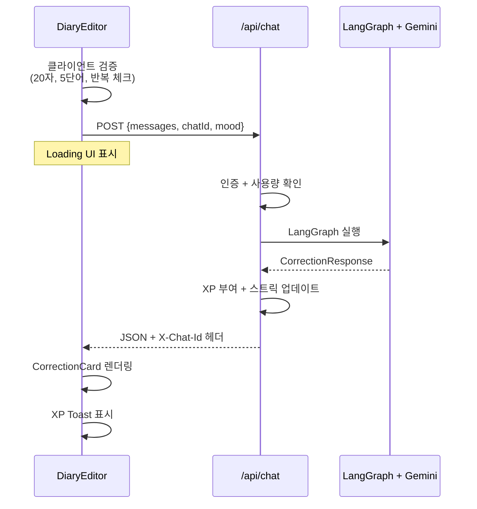
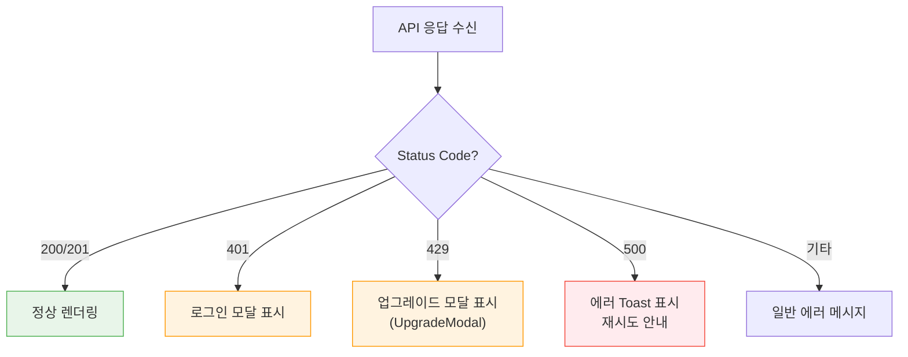
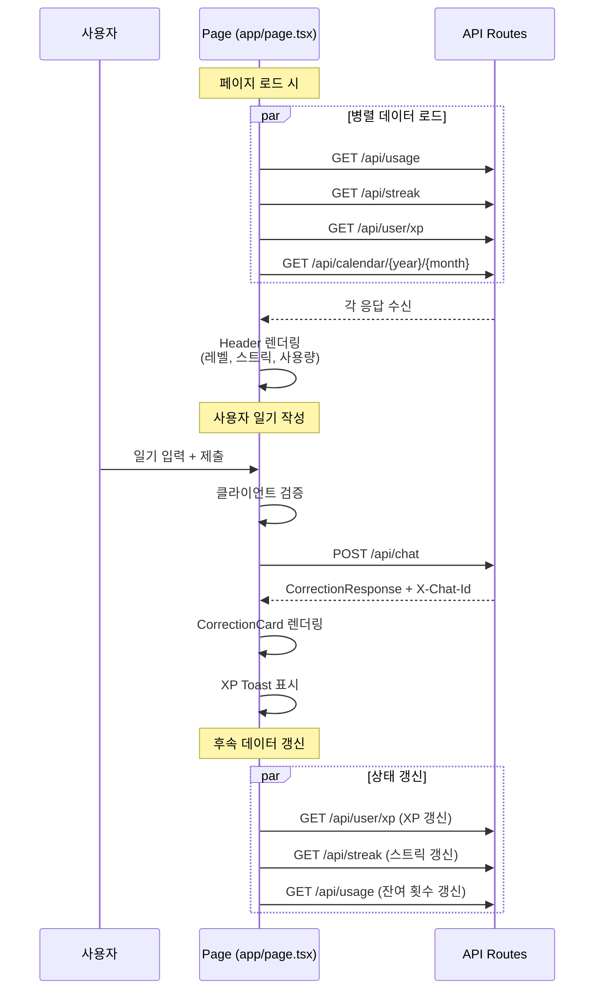

# API Client Guide

| 항목 | 값 |
|------|-----|
| **버전** | 1.0.0 |
| **상태** | `완료` |
| **최종 수정일** | 2026-02-12 |
| **관련 문서** | [API-SPEC.md](../architecture/API-SPEC.md) · [CHAT-SEQUENCE.md](../architecture/CHAT-SEQUENCE.md) · [CONVENTIONS.md](./CONVENTIONS.md) |

이 문서는 프론트엔드에서 Daily English API를 호출하는 패턴과 에러 처리 전략을 기술한다.

---

## 목차

1. [API 개요](#1-api-개요)
2. [핵심 호출 패턴 — 일기 교정](#2-핵심-호출-패턴--일기-교정)
3. [데이터 조회 패턴](#3-데이터-조회-패턴)
4. [에러 처리 전략](#4-에러-처리-전략)
5. [인증 처리](#5-인증-처리)
6. [타입 정의](#6-타입-정의)
7. [호출 흐름 요약](#7-호출-흐름-요약)

---

## 1. API 개요

- **Base URL**: `/api` (Same-origin, 별도 호스트 불필요)
- **Content-Type**: `application/json`
- **인증**: NextAuth v5 Session 기반 (쿠키 자동 포함)
- **타임스탬프**: ISO 8601 (`2026-02-12T10:00:00Z`)

### 엔드포인트 분류

| 분류 | 엔드포인트 | 메서드 | 인증 |
|------|-----------|--------|------|
| **핵심** | `/api/chat` | POST | Optional |
| **히스토리** | `/api/history`, `/api/history/[id]` | GET | Required |
| **캘린더** | `/api/calendar/[year]/[month]` | GET | Optional |
| **표현노트** | `/api/vocabulary`, `/api/vocabulary/[id]` | GET/POST/DELETE/PATCH | Required |
| **게이미피케이션** | `/api/streak`, `/api/user/xp` | GET | Optional |
| **사용량** | `/api/usage` | GET | Optional |
| **프로필** | `/api/user/profile` | GET/POST | Optional |
| **보물상자** | `/api/treasure-chest/*` | POST/GET | Required |
| **결제** | `/api/payment/confirm` | POST | Required |

> 전체 API 상세는 [@docs/architecture/API-SPEC.md](../architecture/API-SPEC.md) 참조.

---

## 2. 핵심 호출 패턴 — 일기 교정

### 2.1 POST `/api/chat` 호출

일기 교정은 프로젝트의 핵심 API이다. 클라이언트에서의 호출 패턴:

```typescript
interface ChatRequest {
  messages: { role: "user"; content: string }[];
  chatId: string | null;   // null이면 새 세션 생성
  mood: string | null;     // happy | neutral | sad | excited | tired | anxious
}

interface CorrectionResponse {
  object: {
    originalText: string;
    correctedText: string;
    koreanExplanation: string;
    alternatives: { type: "Casual" | "Expressive" | "Simple"; text: string }[];
    mistakeType: string | null;
    mistakePattern: string | null;
    insight: string | null;
    keywords: string[];
    mood: string;
    xpMessages: string[];
    cappedByDailyLimit: boolean;
  };
}

async function submitDiary(
  text: string,
  chatId: string | null,
  mood: string | null
): Promise<{ data: CorrectionResponse; chatId: string }> {
  const res = await fetch("/api/chat", {
    method: "POST",
    headers: { "Content-Type": "application/json" },
    body: JSON.stringify({
      messages: [{ role: "user", content: text }],
      chatId,
      mood,
    }),
  });

  if (!res.ok) {
    if (res.status === 429) throw new UsageLimitError();
    throw new ApiError(res.status, await res.text());
  }

  const data: CorrectionResponse = await res.json();
  const newChatId = res.headers.get("X-Chat-Id") || chatId;

  return { data, chatId: newChatId! };
}
```

### 2.2 요청/응답 흐름



### 2.3 X-Chat-Id 헤더 관리

`POST /api/chat`의 응답에 포함되는 `X-Chat-Id` 헤더는 채팅 세션 식별자이다. 클라이언트에서 이 값을 저장하고 동일 세션의 후속 요청에 재사용해야 한다.

```typescript
// 첫 번째 요청: chatId = null → 새 세션 생성
const { chatId } = await submitDiary(text, null, mood);

// 후속 요청: 동일 chatId 재사용
const { chatId: sameId } = await submitDiary(followUpText, chatId, mood);
```

---

## 3. 데이터 조회 패턴

### 3.1 공통 Fetch 유틸리티

```typescript
async function apiFetch<T>(path: string, options?: RequestInit): Promise<T> {
  const res = await fetch(path, {
    headers: { "Content-Type": "application/json" },
    ...options,
  });

  if (!res.ok) {
    if (res.status === 401) throw new AuthRequiredError();
    if (res.status === 429) throw new UsageLimitError();
    throw new ApiError(res.status, await res.text());
  }

  return res.json();
}
```

### 3.2 히스토리 조회

```typescript
// 목록 조회
interface HistoryListResponse {
  entries: {
    id: string;
    chatId: string;
    originalText: string;
    correctedText: string;
    koreanExplanation: string;
    createdAt: string;
  }[];
  isGuest: boolean;
}

const history = await apiFetch<HistoryListResponse>("/api/history");

// 상세 조회
interface HistoryDetailResponse {
  entry: {
    id: string;
    chatId: string;
    originalText: string;
    correctedText: string;
    koreanExplanation: string;
    alternatives: { type: string; text: string }[];
    mistakeType: string;
    insight: string;
    createdAt: string;
  };
}

const detail = await apiFetch<HistoryDetailResponse>(`/api/history/${id}`);
```

### 3.3 캘린더 데이터

```typescript
interface CalendarResponse {
  year: number;
  month: number;
  entries: Record<string, {
    chatId: string;
    mood: string;
    keywords: string[];
    wordCount: number;
    preview: string;
  }>;
}

const calendar = await apiFetch<CalendarResponse>(
  `/api/calendar/${year}/${month}`
);

// entries는 날짜(YYYY-MM-DD) 키로 접근
const dayEntry = calendar.entries["2026-02-12"];
```

### 3.4 게이미피케이션 데이터

```typescript
// 스트릭
interface StreakResponse {
  currentStreak: number;
  longestStreak: number;
  lastWrittenAt: string;
  totalEntries: number;
  wroteToday: boolean;
  freezeCount: number;
  freezeUsedToday: boolean;
}

const streak = await apiFetch<StreakResponse>("/api/streak");

// XP / 레벨
interface XpResponse {
  success: boolean;
  data: {
    xp: number;
    level: number;
    title: string;
    progress: { current: number; required: number; percentage: number };
    booster: { active: boolean; expiresAt: string | null };
    isPremium: boolean;
  };
}

const xp = await apiFetch<XpResponse>("/api/user/xp");

// 사용량
interface UsageResponse {
  isPremium: boolean;
  dailyLimit: number;
  usedToday: number;
  remaining: number;
  canUse: boolean;
  isGuest: boolean;
}

const usage = await apiFetch<UsageResponse>("/api/usage");
```

### 3.5 표현노트 CRUD

```typescript
// 목록 조회
const vocab = await apiFetch<{ words: VocabularyWord[] }>("/api/vocabulary");

// 저장
const saved = await apiFetch<{ word: VocabularyWord }>("/api/vocabulary", {
  method: "POST",
  body: JSON.stringify({
    word: "grateful",
    meaning: "감사하는",
    example: "I'm grateful for your help.",
    memo: "교정에서 배운 표현",
    sourceType: "diary",
    sourceId: chatId,
    context: "원문 문맥",
  }),
});

// 삭제
await apiFetch(`/api/vocabulary/${id}`, { method: "DELETE" });

// 수정
await apiFetch(`/api/vocabulary/${id}`, {
  method: "PATCH",
  body: JSON.stringify({ memo: "수정된 메모" }),
});
```

---

## 4. 에러 처리 전략

### 4.1 HTTP 상태 코드별 처리

| Status | 의미 | 클라이언트 처리 |
|--------|------|---------------|
| 200/201 | 성공 | 정상 렌더링 |
| 400 | 잘못된 요청 | 입력값 검증 메시지 표시 |
| 401 | 인증 필요 | 로그인 모달 표시 |
| 404 | 리소스 없음 | 빈 상태 UI 표시 |
| 429 | 사용량 초과 | 업그레이드 모달 (`UpgradeModal`) 표시 |
| 500 | 서버 오류 | 재시도 안내 Toast 표시 |

### 4.2 에러 클래스 정의

```typescript
class ApiError extends Error {
  constructor(public status: number, message: string) {
    super(message);
  }
}

class AuthRequiredError extends ApiError {
  constructor() {
    super(401, "Authentication required");
  }
}

class UsageLimitError extends ApiError {
  constructor() {
    super(429, "Daily usage limit exceeded");
  }
}
```

### 4.3 에러 처리 플로우



---

## 5. 인증 처리

### 5.1 NextAuth Session 기반

API 호출 시 NextAuth 세션 쿠키가 자동으로 포함된다. 별도 토큰 관리가 불필요하다.

```typescript
// 클라이언트에서 세션 확인
import { useSession } from "next-auth/react";

function Component() {
  const { data: session, status } = useSession();

  if (status === "loading") return <Skeleton />;
  if (!session) return <LoginButton />;

  // 인증된 상태 → API 호출 가능
  return <AuthenticatedContent />;
}
```

### 5.2 인증 요구 수준

| 수준 | 동작 | 해당 API |
|------|------|---------|
| `Required` | 비로그인 시 401 반환 | history, vocabulary, treasure-chest, payment |
| `Optional` | 비로그인 시 `"default-user"` 폴백 | chat, calendar, streak, usage, xp, profile |

`Optional` API는 비로그인 시에도 기본 기능을 제공하되, 데이터 저장/XP 부여/스트릭 추적이 비활성화된다.

---

## 6. 타입 정의

### 6.1 공통 응답 타입

```typescript
// 일기 교정 응답
interface CorrectionObject {
  originalText: string;
  correctedText: string;
  koreanExplanation: string;
  alternatives: AlternativeExpression[];
  mistakeType: string | null;
  mistakePattern: string | null;
  insight: string | null;
  keywords: string[];
  mood: string;
  xpMessages: string[];
  cappedByDailyLimit: boolean;
}

interface AlternativeExpression {
  type: "Casual" | "Expressive" | "Simple";
  text: string;
}

// 표현노트 단어
interface VocabularyWord {
  id: string;
  word: string;
  meaning: string;
  pronunciation: string;
  partOfSpeech: string;
  synonyms: string[];
  difficulty: "beginner" | "intermediate" | "advanced";
  example: string;
  memo: string;
  sourceType: "diary" | "chat" | "manual";
  createdAt: string;
}

// 캘린더 엔트리
interface CalendarEntry {
  chatId: string;
  mood: string;
  keywords: string[];
  wordCount: number;
  preview: string;
}
```

---

## 7. 호출 흐름 요약

메인 페이지에서의 전형적인 API 호출 순서:



> API 스펙 상세는 [@docs/architecture/API-SPEC.md](../architecture/API-SPEC.md), 채팅 시퀀스 상세는 [@docs/architecture/CHAT-SEQUENCE.md](../architecture/CHAT-SEQUENCE.md) 참조.
