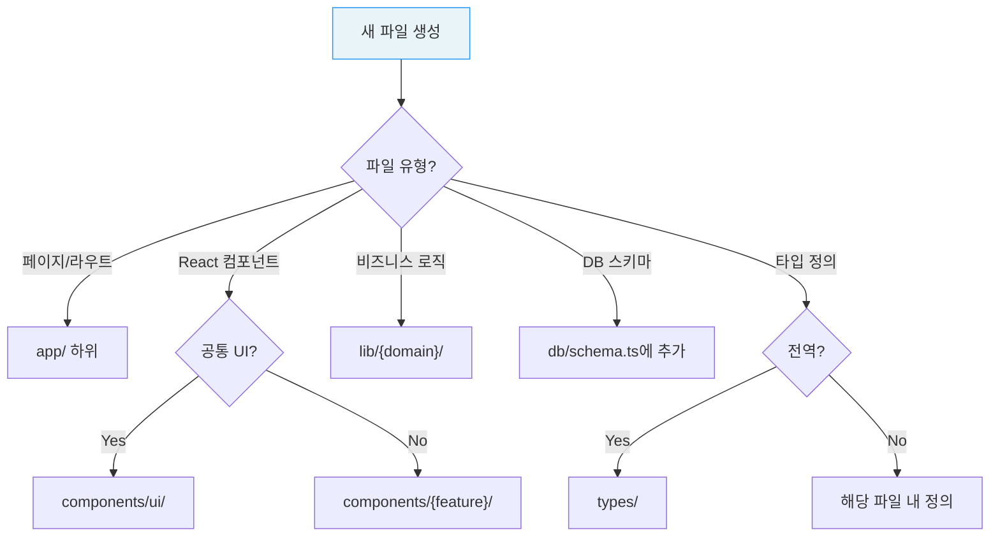

# Coding Conventions

| 항목 | 값 |
|------|-----|
| **버전** | 1.0.0 |
| **상태** | `완료` |
| **최종 수정일** | 2026-02-12 |
| **관련 문서** | [DIRECTORY.md](../architecture/DIRECTORY.md) · [SETUP.md](./SETUP.md) · [GIT-WORKFLOW.md](./GIT-WORKFLOW.md) · [DESIGN-SYSTEM.md](./DESIGN-SYSTEM.md) |

이 문서는 Daily English 프로젝트의 코딩 규칙, 네이밍 컨벤션, 아키텍처 패턴을 정의한다. 코드 일관성과 유지보수성을 보장하기 위해 모든 기여자가 준수해야 한다.

---

## 목차

1. [TypeScript 규칙](#1-typescript-규칙)
2. [React / Next.js 패턴](#2-react--nextjs-패턴)
3. [네이밍 컨벤션](#3-네이밍-컨벤션)
4. [파일 배치 규칙](#4-파일-배치-규칙)
5. [데이터베이스 컨벤션](#5-데이터베이스-컨벤션)
6. [API Route 컨벤션](#6-api-route-컨벤션)
7. [스타일링 규칙](#7-스타일링-규칙)
8. [에러 처리 원칙](#8-에러-처리-원칙)
9. [코드 품질 원칙](#9-코드-품질-원칙)

---

## 1. TypeScript 규칙

### 1.1 Strict Mode 필수

`tsconfig.json`에서 `strict: true`가 활성화되어 있다. 모든 코드는 Strict mode를 준수한다.

```json
{
  "compilerOptions": {
    "strict": true,
    "target": "ES2017",
    "module": "esnext",
    "moduleResolution": "bundler"
  }
}
```

### 1.2 타입 안전성

| 규칙 | 상세 |
|------|------|
| `any` 사용 금지 | `unknown` 또는 Zod 스키마로 대체 |
| 명시적 반환 타입 | 퍼블릭 함수에는 반환 타입을 명시 |
| Non-null Assertion | `!` 최소화, 타입 가드 또는 optional chaining 사용 |
| Type vs Interface | 객체 형태는 `interface`, 유니온/인터섹션은 `type` 사용 |

```typescript
// 권장
interface UserProfile {
  id: string;
  xp: number;
  level: number;
}

type MoodType = "happy" | "neutral" | "sad" | "excited" | "tired" | "anxious";

// 금지
function getUser(id: any): any { ... }
```

### 1.3 Path Alias

`@/*` 경로 별칭을 사용한다. 상대 경로(`../../`)는 지양한다.

```typescript
// 권장
import { db } from "@/db";
import { users } from "@/db/schema";
import { cn } from "@/lib/utils";

// 지양
import { db } from "../../db";
```

---

## 2. React / Next.js 패턴

### 2.1 Server Component 우선

App Router의 기본 원칙에 따라 Server Component를 기본으로 사용한다.

| 컴포넌트 유형 | 사용 조건 | 예시 |
|--------------|----------|------|
| Server Component | 기본 — 서버에서 렌더링 | 레이아웃, 정적 페이지 |
| Client Component | `useState`, `useEffect`, 브라우저 API 필요 시 | 폼 입력, 인터랙션 |

```typescript
// Client Component — 상태 관리 필요 시에만 선언
"use client";

import { useState } from "react";

export function DiaryEditor() {
  const [text, setText] = useState("");
  // ...
}
```

### 2.2 컴포넌트 구조

```typescript
// 1. "use client" 선언 (필요 시)
"use client";

// 2. 외부 의존성 import
import { useState } from "react";
import { Button } from "@/components/ui/button";

// 3. 내부 모듈 import
import { cn } from "@/lib/utils";

// 4. 타입 정의 (Props)
interface DiaryEditorProps {
  onSubmit: (text: string) => void;
  isLoading?: boolean;
}

// 5. 컴포넌트 구현
export function DiaryEditor({ onSubmit, isLoading = false }: DiaryEditorProps) {
  // hooks
  // handlers
  // render
}
```

### 2.3 상태 관리

- **전역 상태**: NextAuth `SessionProvider`만 사용
- **로컬 상태**: React Hooks (`useState`, `useEffect`, `useCallback`)
- **서버 상태**: 페이지 컴포넌트에서 직접 `fetch` 또는 Drizzle 쿼리 호출
- **별도 상태 관리 라이브러리**: 미사용 (Redux, Zustand 등 불필요)

### 2.4 비동기 패턴

```typescript
// Server Component에서 데이터 fetch
async function HistoryPage() {
  const session = await auth();
  const entries = await db.select().from(messages).where(...);
  return <HistoryList entries={entries} />;
}

// Client Component에서 API 호출
"use client";
function Component() {
  const [data, setData] = useState(null);

  useEffect(() => {
    fetch("/api/streak")
      .then(res => res.json())
      .then(setData);
  }, []);
}
```

---

## 3. 네이밍 컨벤션

### 3.1 파일명

| 유형 | 규칙 | 예시 |
|------|------|------|
| React 컴포넌트 | kebab-case | `diary-editor.tsx`, `correction-card.tsx` |
| API Route | `route.ts` (Next.js 규칙) | `app/api/chat/route.ts` |
| 라이브러리 | kebab-case | `xp-service.ts`, `streak-manager.ts` |
| 타입 정의 | kebab-case | `next-auth.d.ts` |
| 디자인 토큰 | kebab-case | `colors.ts`, `typography.ts` |

### 3.2 코드 네이밍

| 유형 | 규칙 | 예시 |
|------|------|------|
| 컴포넌트 | PascalCase | `DiaryEditor`, `CorrectionCard` |
| 함수 | camelCase | `getUsageStatus`, `grantDiaryXp` |
| 변수/상수 | camelCase | `currentStreak`, `dailyLimit` |
| 전역 상수 | SCREAMING_SNAKE_CASE | `FREE_DAILY_LIMIT` |
| 타입/인터페이스 | PascalCase | `CorrectionResponse`, `UserProfile` |
| Enum 값 | snake_case (DB) / camelCase (TS) | `diary_submit`, `weakness_overcome` |
| DB 테이블 | snake_case (복수형) | `user_profiles`, `daily_xp_tracking` |
| DB 컬럼 | camelCase | `createdAt`, `xpLevel`, `streakFreezeCount` |

### 3.3 변수명 원칙

- **명시적이고 서술적인 이름** 사용: `remainingUsage` > `rem`
- **약어 지양**: `mistakePattern` > `mp`
- **Boolean**: `is-`, `has-`, `can-` 접두사: `isPremium`, `canUse`, `wroteToday`

---

## 4. 파일 배치 규칙

### 4.1 디렉토리별 책임

```
app/              페이지 + API Route Handler (Server-only)
components/       React 컴포넌트 (기능별 하위 디렉토리)
  ui/             Shadcn UI 프리미티브 (공통)
  {feature}/      기능별 컴포넌트 (chat/, diary/, calendar/ 등)
lib/              비즈니스 로직 & 유틸리티 (UI 독립)
  ai/             AI 파이프라인 (LangGraph, 스키마, 검증)
  gamification/   게이미피케이션 로직 (XP, 보물상자)
  {domain}/       도메인별 로직 (streak/, subscription/, payment/)
db/               Drizzle 스키마 + 연결
hooks/            커스텀 React Hooks
types/            전역 TypeScript 타입
```

### 4.2 배치 결정 트리



### 4.3 금지 사항

- `pages/` 디렉토리 생성 금지 (App Router 전용)
- `components/ui/`에 비즈니스 로직 포함 금지
- `app/api/` Route Handler에 UI 관련 코드 포함 금지

> 전체 디렉토리 구조는 [@docs/architecture/DIRECTORY.md](../architecture/DIRECTORY.md) 참조.

---

## 5. 데이터베이스 컨벤션

### 5.1 Drizzle ORM 사용 규칙

| 규칙 | 상세 |
|------|------|
| 스키마 단일 파일 | 모든 테이블 정의는 `db/schema.ts`에 집중 |
| 쿼리 헬퍼 분리 | 복잡한 쿼리는 `lib/db/` 하위에 분리 |
| Raw SQL 지양 | Drizzle Query Builder 사용 |
| 마이그레이션 필수 | 스키마 변경 시 `db:generate` → `db:migrate` |

### 5.2 테이블 정의 패턴

```typescript
// db/schema.ts
import { pgTable, uuid, text, integer, timestamp } from "drizzle-orm/pg-core";

export const userProfiles = pgTable("user_profiles", {
  id: uuid("id").defaultRandom().primaryKey(),
  userId: text("userId").notNull().unique(),
  xp: integer("xp").default(0).notNull(),
  xpLevel: integer("xpLevel").default(1).notNull(),
  createdAt: timestamp("createdAt").defaultNow().notNull(),
  updatedAt: timestamp("updatedAt").defaultNow().notNull(),
});
```

### 5.3 JSONB 필드 규칙

- JSONB 필드 사용 시 TypeScript 타입을 반드시 정의
- Zod 스키마로 런타임 검증 권장
- 예: `recurringMistakes`, `learningPreferences`, `earnedTitles`

---

## 6. API Route 컨벤션

### 6.1 Route Handler 구조

```typescript
// app/api/{endpoint}/route.ts
import { auth } from "@/lib/auth";
import { NextResponse } from "next/server";

export async function GET() {
  // 1. 인증 확인
  const session = await auth();
  const userId = session?.user?.id;

  if (!userId) {
    return NextResponse.json({ error: "Unauthorized" }, { status: 401 });
  }

  // 2. 비즈니스 로직
  const data = await fetchData(userId);

  // 3. 응답 반환
  return NextResponse.json(data);
}
```

### 6.2 에러 응답 형식

```typescript
// 일관된 에러 응답 형식
return NextResponse.json(
  { error: "Error message", code: "ERROR_CODE" },
  { status: 400 }
);
```

### 6.3 인증 패턴

```typescript
// Required 인증 — 비로그인 시 401
const session = await auth();
if (!session?.user?.id) {
  return NextResponse.json({ error: "Unauthorized" }, { status: 401 });
}

// Optional 인증 — 비로그인 시 폴백
const session = await auth();
const userId = session?.user?.id || "default-user";
const isAuthenticated = !!session?.user?.id;
```

---

## 7. 스타일링 규칙

### 7.1 Tailwind CSS 우선

| 규칙 | 상세 |
|------|------|
| Utility-first | Tailwind 클래스 사용, inline style 지양 |
| `cn()` 유틸리티 | 조건부 클래스 결합 시 `cn()` 사용 (`clsx` + `tailwind-merge`) |
| Design System 토큰 | `ds-*` 프리픽스의 커스텀 색상 사용 (예: `text-ds-text-primary`) |
| Shadcn 변수 | Shadcn UI는 CSS 변수 기반 (예: `bg-background`, `text-foreground`) |

```typescript
import { cn } from "@/lib/utils";

function Component({ isActive }: { isActive: boolean }) {
  return (
    <div className={cn(
      "rounded-lg p-4 transition-colors",
      isActive ? "bg-ds-accent-primary text-ds-text-inverse" : "bg-ds-bg-card"
    )}>
      Content
    </div>
  );
}
```

### 7.2 반응형 디자인

| Breakpoint | 기준 | 용도 |
|-----------|------|------|
| `xs` | 475px | 소형 모바일 |
| `sm` | 640px | 모바일/태블릿 경계 |
| `md` | 768px | 태블릿 |
| `lg` | 1024px | 데스크톱 |

```typescript
// 모바일 우선 (Mobile-first)
<div className="text-sm sm:text-base lg:text-lg" />
```

> 디자인 시스템 상세는 [@docs/guides/DESIGN-SYSTEM.md](./DESIGN-SYSTEM.md) 참조.

---

## 8. 에러 처리 원칙

### 8.1 핵심 원칙

> AI 교정 결과는 가능한 한 항상 반환한다. 부가 기능(XP, 스트릭, 오답 저장)은 실패해도 핵심 기능을 차단하지 않는다.

| 단계 | 실패 시 동작 |
|------|------------|
| 인증 | 폴백 (`"default-user"`) — 교정 진행 |
| 사용량 확인 | 429 반환 — 요청 차단 |
| LangGraph (AI) | 500 반환 — 전체 실패 |
| 후처리 (XP, 스트릭) | 로그 기록 — 교정 결과는 정상 반환 |

### 8.2 로깅 전략

- **개발 환경**: `console.error` + `.dev.log` 파일
- **프로덕션**: Vercel Runtime Logs
- **Try-Catch 범위**: 후처리 작업은 개별 try-catch로 격리

```typescript
// 후처리 에러 격리 패턴
try {
  await recordDiaryEntry(userId);
} catch (e) {
  console.error("[streak] Failed to update streak:", e);
  // 교정 결과 반환은 차단하지 않음
}
```

---

## 9. 코드 품질 원칙

### 9.1 핵심 원칙

| 원칙 | 설명 |
|------|------|
| DRY | 반복 코드 제거 — 공통 유틸리티로 추출 |
| SOLID | 단일 책임 원칙 준수 — 파일당 하나의 관심사 |
| Functional | 클래스보다 순수 함수 선호, 불변성(Immutability) 우선 |
| Explicit > Clever | 명시적이고 읽기 쉬운 코드 > 짧고 영리한 코드 |

### 9.2 ESLint 설정

```json
{
  "extends": ["eslint-config-next"]
}
```

- `next lint` 명령으로 검사
- 빌드 시 린트 에러가 있으면 빌드 실패 (`ignoreDuringBuilds: false`)

### 9.3 Import 순서

1. React / Next.js 코어
2. 외부 라이브러리 (`@langchain`, `drizzle-orm`, `zod` 등)
3. 내부 모듈 (`@/lib/`, `@/db/`, `@/components/`)
4. 타입 import (`import type { ... }`)
5. 스타일 (필요 시)

```typescript
import { useState, useEffect } from "react";
import { z } from "zod";
import { db } from "@/db";
import { users } from "@/db/schema";
import { cn } from "@/lib/utils";
import type { UserProfile } from "@/types";
```
