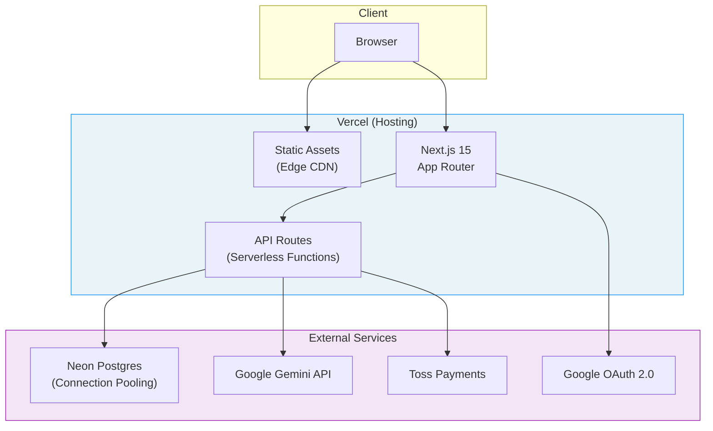
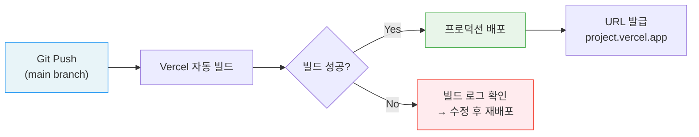
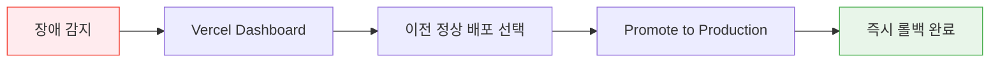

# Deployment Guide

| 항목 | 값 |
|------|-----|
| **버전** | 1.0.0 |
| **상태** | `완료` |
| **최종 수정일** | 2026-02-12 |
| **관련 문서** | [SETUP.md](./SETUP.md) · [OVERVIEW.md](../architecture/OVERVIEW.md) · [API-SPEC.md](../architecture/API-SPEC.md) |

이 문서는 Daily English를 프로덕션 환경에 배포하는 절차를 기술한다.

---

## 목차

1. [배포 아키텍처](#1-배포-아키텍처)
2. [Vercel 배포](#2-vercel-배포)
3. [Neon 데이터베이스](#3-neon-데이터베이스)
4. [환경 변수 설정](#4-환경-변수-설정)
5. [도메인 및 DNS](#5-도메인-및-dns)
6. [배포 전 체크리스트](#6-배포-전-체크리스트)
7. [운영 모니터링](#7-운영-모니터링)
8. [롤백 절차](#8-롤백-절차)

---

## 1. 배포 아키텍처

```
┌──────────────────────────────────────────────────────────┐
│                     Production Stack                      │
│                                                          │
│  ┌──────────────┐  ┌──────────────┐  ┌──────────────┐   │
│  │   Vercel      │  │   Neon       │  │  Google      │   │
│  │   (Hosting)   │  │   (Postgres) │  │  Cloud       │   │
│  │              │  │              │  │              │   │
│  │  Next.js 15  │  │  Serverless  │  │  Gemini API  │   │
│  │  Edge/Node   │  │  Connection  │  │  OAuth 2.0   │   │
│  │  Functions   │  │  Pooling     │  │              │   │
│  └──────┬───────┘  └──────┬───────┘  └──────┬───────┘   │
│         │                 │                  │           │
│         └────────┬────────┴──────────────────┘           │
│                  │                                       │
│  ┌──────────────┴──────────────┐                        │
│  │   Toss Payments (결제)       │                        │
│  └─────────────────────────────┘                        │
└──────────────────────────────────────────────────────────┘
```



| 서비스 | 역할 | 프로덕션 Tier |
|--------|------|-------------|
| **Vercel** | Next.js 호스팅 + Serverless Functions | Hobby / Pro |
| **Neon** | PostgreSQL 데이터베이스 | Free / Launch |
| **Google Cloud** | Gemini API + OAuth | Pay-as-you-go |
| **Toss Payments** | 결제 처리 | 프로덕션 키 |

---

## 2. Vercel 배포

### 2.1 초기 설정

1. [Vercel Dashboard](https://vercel.com)에서 GitHub 저장소 연결
2. Framework Preset: `Next.js` (자동 감지)
3. Root Directory: `/` (기본값)
4. Build Command: `next build` (기본값)
5. Output Directory: `.next` (기본값)

### 2.2 빌드 설정

`next.config.mjs`에 다음 설정이 적용되어 있다:

```javascript
const nextConfig = {
  typescript: {
    ignoreBuildErrors: false,   // 타입 에러 시 빌드 실패
  },
  eslint: {
    ignoreDuringBuilds: false,  // Lint 에러 시 빌드 실패
  },
};
```

### 2.3 API Route 제한

| 설정 | 값 | 비고 |
|------|-----|------|
| `maxDuration` | 60초 | `/api/chat` Route에 설정 |
| Runtime | Node.js | Edge Runtime 미사용 |
| Memory | 1024 MB | Hobby plan 기본값 |

> `POST /api/chat`은 LangGraph + Gemini 호출로 최대 60초가 소요될 수 있다.

### 2.4 배포 흐름



| 브랜치 | 배포 유형 | URL |
|--------|----------|-----|
| `main` | Production | `<project>.vercel.app` |
| 기타 브랜치 | Preview | `<project>-<branch>-<hash>.vercel.app` |

---

## 3. Neon 데이터베이스

### 3.1 프로덕션 설정

1. [Neon Console](https://console.neon.tech)에서 프로덕션 프로젝트 생성
2. Region: `ap-northeast-1` (서울/도쿄) 권장 — Vercel 배포 리전과 근접
3. 데이터베이스명: `daily_english` (또는 기본 `neondb`)

### 3.2 Connection Pooling

Neon의 Serverless 드라이버(`@neondatabase/serverless`)를 사용하므로, HTTP 기반 연결이 자동으로 풀링된다. 별도의 `pgBouncer` 설정은 불필요하다.

```
# CONNECTION STRING 형식
postgresql://<user>:<password>@<host>.neon.tech/<database>?sslmode=require
```

### 3.3 프로덕션 마이그레이션

```bash
# 로컬에서 마이그레이션 파일 생성
npm run db:generate

# 프로덕션 DB에 마이그레이션 적용
# DATABASE_URL을 프로덕션 연결 문자열로 설정 후 실행
DATABASE_URL="<production-url>" npm run db:migrate
```

> **주의**: 프로덕션 마이그레이션은 `db:push` 대신 반드시 `db:generate` → `db:migrate` 순서를 따를 것. `db:push`는 데이터 손실 위험이 있다.

### 3.4 Branching (선택)

Neon은 데이터베이스 브랜치를 지원한다. Preview 배포에 별도 DB 브랜치를 연결할 수 있다.

| 환경 | DB 브랜치 | 용도 |
|------|----------|------|
| Production | `main` | 실 서비스 데이터 |
| Preview | `dev` 또는 자동 생성 | PR 단위 테스트용 |

---

## 4. 환경 변수 설정

### Vercel Environment Variables

Vercel Dashboard > Project Settings > Environment Variables에서 설정한다.

| 변수 | Production | Preview | Development |
|------|-----------|---------|-------------|
| `GOOGLE_GENERATIVE_AI_API_KEY` | O | O | — |
| `GOOGLE_API_KEY` | O | O | — |
| `DATABASE_URL` | O (프로덕션 DB) | O (Preview DB) | — |
| `AUTH_SECRET` | O | O | — |
| `GOOGLE_CLIENT_ID` | O | O | — |
| `GOOGLE_CLIENT_SECRET` | O | O | — |
| `TOSS_SECRET_KEY` | O (라이브 키) | O (테스트 키) | — |

> Development 환경은 로컬 `.env.local` 사용. Vercel 환경 변수 불필요.

### 환경별 OAuth Redirect URI

| 환경 | Redirect URI |
|------|-------------|
| Production | `https://<custom-domain>/api/auth/callback/google` |
| Preview | `https://<project>-*.vercel.app/api/auth/callback/google` |
| Local | `http://localhost:3000/api/auth/callback/google` |

Google Cloud Console에서 위 URI를 모두 등록해야 한다.

---

## 5. 도메인 및 DNS

### 5.1 Vercel 도메인 연결

1. Vercel Dashboard > Project Settings > Domains
2. 커스텀 도메인 추가 (예: `daily-english.app`)
3. DNS 레코드 설정:

| 타입 | 호스트 | 값 |
|------|--------|-----|
| CNAME | `www` | `cname.vercel-dns.com` |
| A | `@` | `76.76.21.21` |

### 5.2 SSL 인증서

Vercel이 Let's Encrypt SSL 인증서를 자동으로 발급한다. 별도 설정 불필요.

---

## 6. 배포 전 체크리스트

### 빌드 검증

- [ ] `npm run build` 로컬 빌드 성공
- [ ] `npm run lint` 린트 통과
- [ ] TypeScript 타입 에러 없음

### 환경 변수

- [ ] Vercel에 모든 필수 환경 변수 설정
- [ ] 프로덕션 `DATABASE_URL`이 프로덕션 Neon 프로젝트를 가리킴
- [ ] 프로덕션 `TOSS_SECRET_KEY`가 라이브 키 (테스트 키 아님)
- [ ] `AUTH_SECRET`이 설정됨

### 데이터베이스

- [ ] 프로덕션 DB에 최신 마이그레이션 적용
- [ ] 시드 데이터 확인 (필요 시)

### 외부 서비스

- [ ] Google Cloud Console에 프로덕션 도메인의 OAuth Redirect URI 등록
- [ ] Gemini API 할당량 확인
- [ ] 토스페이먼츠 프로덕션 키 활성화

---

## 7. 운영 모니터링

### 7.1 Vercel 내장 모니터링

| 항목 | 위치 |
|------|------|
| 빌드 로그 | Vercel Dashboard > Deployments |
| 함수 로그 | Vercel Dashboard > Logs (Runtime Logs) |
| 분석 | Vercel Dashboard > Analytics (Pro plan) |
| 에러 추적 | Vercel Dashboard > Logs > Error |

### 7.2 Neon 데이터베이스 모니터링

| 항목 | 위치 |
|------|------|
| 쿼리 성능 | Neon Console > Monitoring |
| 연결 수 | Neon Console > Branches > Connection Count |
| 스토리지 | Neon Console > Usage |

### 7.3 핵심 지표

| 지표 | 임계값 | 조치 |
|------|--------|------|
| API 응답 시간 (`/api/chat`) | > 30초 | Gemini API 상태 확인 |
| DB 연결 실패율 | > 1% | Neon Console 확인 |
| 429 에러 비율 | 모니터링 | 무료 사용자 사용량 패턴 분석 |
| 빌드 실패 | 즉시 | 빌드 로그 확인 후 핫픽스 |

> 별도 APM(Application Performance Monitoring) 설정은 [@docs/guides/SIGNOZ-MONITORING.md](./SIGNOZ-MONITORING.md) 참조.

---

## 8. 롤백 절차

### 8.1 Vercel Instant Rollback

Vercel은 이전 배포로 즉시 롤백을 지원한다.

```
Vercel Dashboard > Deployments > 이전 배포 선택 > "Promote to Production"
```



### 8.2 데이터베이스 롤백

Neon은 Point-in-Time Recovery를 지원한다:

1. Neon Console > Branches
2. 특정 시점의 브랜치 생성
3. 복구된 브랜치로 `DATABASE_URL` 변경

> **주의**: DB 롤백은 데이터 손실을 수반할 수 있으므로 신중하게 진행할 것.

### 8.3 롤백 판단 기준

| 증상 | 조치 |
|------|------|
| UI 깨짐 / 빌드 문제 | Vercel Instant Rollback |
| API 500 에러 급증 | 함수 로그 확인 → 코드 롤백 또는 핫픽스 |
| DB 마이그레이션 실패 | 수동 SQL로 복구 또는 Neon PITR |
| 외부 서비스 장애 (Gemini) | 대기 — 서비스 복구 모니터링 |
