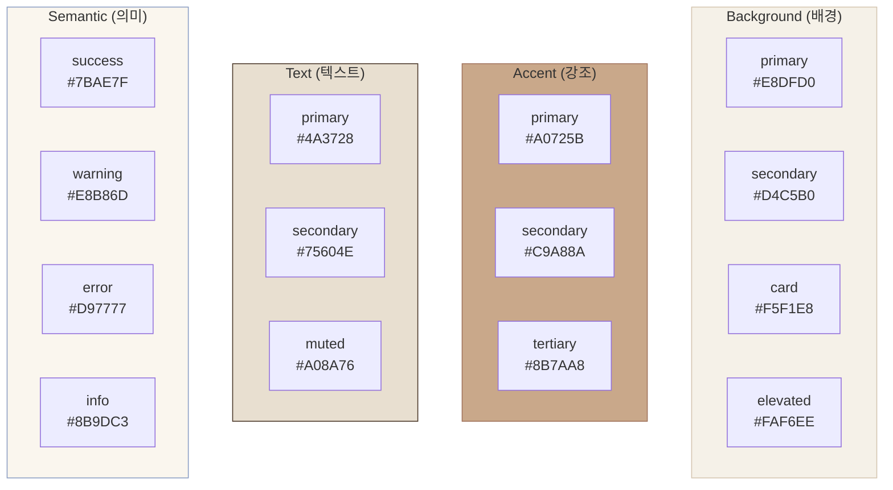

# Design System Reference

| 항목 | 값 |
|------|-----|
| **버전** | 1.0.0 |
| **상태** | `완료` |
| **최종 수정일** | 2026-02-12 |
| **소스 경로** | `lib/design-system/` |
| **관련 문서** | [UI-DESIGN.md](../architecture/UI-DESIGN.md) · [CONVENTIONS.md](./CONVENTIONS.md) |

이 문서는 Daily English의 디자인 시스템(Design System)을 정의한다. 색상, 타이포그래피, 간격, 그림자 등의 디자인 토큰(Design Token)과 사용 지침을 포함한다.

---

## 목차

1. [디자인 컨셉](#1-디자인-컨셉)
2. [색상 시스템](#2-색상-시스템-colorts)
3. [타이포그래피](#3-타이포그래피-typographyts)
4. [간격 및 레이아웃](#4-간격-및-레이아웃-tokensts)
5. [그림자 및 효과](#5-그림자-및-효과)
6. [반응형 브레이크포인트](#6-반응형-브레이크포인트)
7. [Shadcn UI 통합](#7-shadcn-ui-통합)
8. [사용 가이드](#8-사용-가이드)

---

## 1. 디자인 컨셉

Daily English의 디자인은 **빈티지 일기장(Vintage Diary)** 컨셉을 기반으로 한다.

| 키워드 | 설명 |
|--------|------|
| **따뜻한 (Warm)** | 베이지/브라운 톤의 아날로그적 배경 |
| **친근한 (Friendly)** | 둥근 모서리, 부드러운 그림자 |
| **노트북 스타일 (Notebook)** | 노트북 줄, 구멍 장식, 종이 질감 |
| **게이미피케이션** | 레벨 뱃지, XP 프로그레스 바, 보물상자 |

### 소스 파일 구조

```
lib/design-system/
├── colors.ts         # 색상 팔레트
├── typography.ts     # 폰트 패밀리, 사이즈, 웨이트
└── tokens.ts         # 간격, 라운딩, 그림자, 트랜지션
```

> Tailwind CSS와의 통합은 `tailwind.config.ts`에서 `ds-*` 프리픽스로 노출된다.

---

## 2. 색상 시스템 (`colors.ts`)

### 2.1 Background Colors — 배경

빈티지 베이지/브라운 톤의 배경 체계.

| 토큰 | Hex | Tailwind 클래스 | 용도 |
|------|-----|----------------|------|
| `background.primary` | `#E8DFD0` | `bg-ds-bg-primary` | 메인 배경 (빈티지 베이지) |
| `background.secondary` | `#D4C5B0` | `bg-ds-bg-secondary` | 서브 배경 (더 어두운 베이지) |
| `background.card` | `#F5F1E8` | `bg-ds-bg-card` | 카드 배경 (오래된 종이색) |
| `background.elevated` | `#FAF6EE` | `bg-ds-bg-elevated` | 살짝 들린 배경 |

### 2.2 Accent Colors — 강조

```
┌─────────────────────────────────────────────┐
│ primary    #A0725B  ██████  메인 강조 (브라운)  │
│ secondary  #C9A88A  ██████  보조 강조           │
│ tertiary   #8B7AA8  ██████  3차 강조 (라벤더)   │
│ hover      #8B5E47  ██████  Hover 상태          │
└─────────────────────────────────────────────┘
```

| 토큰 | Hex | Tailwind 클래스 | 용도 |
|------|-----|----------------|------|
| `accent.primary` | `#A0725B` | `bg-ds-accent-primary` | CTA 버튼, 주요 강조 |
| `accent.secondary` | `#C9A88A` | `bg-ds-accent-secondary` | 보조 강조, 선택 상태 |
| `accent.tertiary` | `#8B7AA8` | `bg-ds-accent-tertiary` | 3차 강조, 특수 UI |
| `accent.hover` | `#8B5E47` | `hover:bg-ds-accent-hover` | Primary accent의 hover |

### 2.3 Pastel Colors — 장식

마스킹 테이프, 뱃지, 배경 장식에 사용하는 빈티지 파스텔 톤.

| 토큰 | Hex | Tailwind 클래스 | 용도 |
|------|-----|----------------|------|
| `pastel.mint` | `#C8D6C0` | `bg-ds-pastel-mint` | 성공/완료 관련 장식 |
| `pastel.coral` | `#E8C4B8` | `bg-ds-pastel-coral` | 따뜻한 하이라이트 |
| `pastel.yellow` | `#F0DCAE` | `bg-ds-pastel-yellow` | 경고/주의 관련 장식 |
| `pastel.lavender` | `#D8CDE0` | `bg-ds-pastel-lavender` | 특별 아이템 관련 장식 |
| `pastel.pink` | `#E8C8CF` | `bg-ds-pastel-pink` | 감정 관련 장식 |
| `pastel.peach` | `#F0DAC8` | `bg-ds-pastel-peach` | 부드러운 배경 장식 |

### 2.4 Text Colors — 텍스트

| 토큰 | Hex | Tailwind 클래스 | 용도 |
|------|-----|----------------|------|
| `text.primary` | `#4A3728` | `text-ds-text-primary` | 메인 텍스트 (다크 브라운) |
| `text.secondary` | `#75604E` | `text-ds-text-secondary` | 보조 텍스트 (미디엄 브라운) |
| `text.muted` | `#A08A76` | `text-ds-text-muted` | 비활성 텍스트 (라이트 브라운) |
| `text.inverse` | `#FFFFFF` | `text-ds-text-inverse` | 역전 텍스트 (어두운 배경용) |

### 2.5 Semantic Colors — 의미론적

| 토큰 | Hex | Tailwind 클래스 | 용도 |
|------|-----|----------------|------|
| `semantic.success` | `#7BAE7F` | `text-ds-semantic-success` | 성공 (교정 완료) |
| `semantic.warning` | `#E8B86D` | `text-ds-semantic-warning` | 경고 (사용량 주의) |
| `semantic.error` | `#D97777` | `text-ds-semantic-error` | 에러 (실패) |
| `semantic.info` | `#8B9DC3` | `text-ds-semantic-info` | 정보 (팁) |

### 2.6 Diary Status Colors — 일기 상태

| 토큰 | Hex | Tailwind 클래스 | 용도 |
|------|-----|----------------|------|
| `diary.pending` | `#FFE8A3` | `bg-ds-diary-pending` | 작성 중 |
| `diary.corrected` | `#B8E6D5` | `bg-ds-diary-corrected` | 교정 완료 |
| `diary.saved` | `#D4C5F9` | `bg-ds-diary-saved` | 저장됨 |

### 2.7 색상 구성 시각화



---

## 3. 타이포그래피 (`typography.ts`)

### 3.1 Font Family

| 토큰 | 폰트 스택 | Tailwind 클래스 | 용도 |
|------|----------|----------------|------|
| `handwriting` | Caveat, Nanum Pen Script, cursive | `font-handwriting` | 타이틀/헤딩 (손글씨 스타일) |
| `sans` | Inter, Pretendard, system-ui, sans-serif | `font-sans` | 본문 텍스트 |
| `rounded` | Pretendard, Apple SD Gothic Neo | `font-rounded` | 한글 강조 텍스트 |
| `mono` | JetBrains Mono, Fira Code, monospace | `font-mono` | 코드 블록 |

### 3.2 Font Size Scale

| Tailwind | rem | px | 용도 |
|----------|-----|----|------|
| `text-xs` | 0.75rem | 12px | Caption, 메타 정보 |
| `text-sm` | 0.875rem | 14px | Label, 보조 텍스트 |
| `text-base` | 1rem | 16px | 본문 텍스트 |
| `text-lg` | 1.125rem | 18px | 강조 본문 |
| `text-xl` | 1.25rem | 20px | h4 |
| `text-2xl` | 1.5rem | 24px | h3 |
| `text-3xl` | 1.875rem | 30px | h2 |
| `text-4xl` | 2.25rem | 36px | h1 |

### 3.3 Typography Presets

사전 정의된 타이포그래피 프리셋:

| 프리셋 | Font Family | Size | Weight | Line Height |
|--------|------------|------|--------|-------------|
| `h1` | handwriting | 4xl (36px) | bold | tight (1.25) |
| `h2` | handwriting | 3xl (30px) | bold | tight (1.25) |
| `h3` | sans | 2xl (24px) | semibold | snug (1.375) |
| `h4` | sans | xl (20px) | semibold | snug (1.375) |
| `body` | sans | base (16px) | normal | normal (1.5) |
| `bodyLarge` | sans | lg (18px) | normal | relaxed (1.625) |
| `bodySmall` | sans | sm (14px) | normal | normal (1.5) |
| `caption` | sans | xs (12px) | normal | tight (1.25) |
| `label` | sans | sm (14px) | medium | tight (1.25) |

### 3.4 Font Weight

| Tailwind | 값 | 용도 |
|----------|-----|------|
| `font-light` | 300 | 특수 장식 텍스트 |
| `font-normal` | 400 | 본문 |
| `font-medium` | 500 | Label, 강조 |
| `font-semibold` | 600 | 소제목 |
| `font-bold` | 700 | 제목, CTA |
| `font-extrabold` | 800 | 특수 강조 |

---

## 4. 간격 및 레이아웃 (`tokens.ts`)

### 4.1 Spacing Scale

4px 기준 등비 스케일:

| Tailwind | 값 | px | 용도 |
|----------|-----|----|------|
| `p-0` | 0 | 0px | — |
| `p-1` | 1 | 4px | 아이콘 내부 간격 |
| `p-2` | 2 | 8px | 좁은 간격 |
| `p-3` | 3 | 12px | 기본 내부 간격 |
| `p-4` | 4 | 16px | 카드 패딩 |
| `p-6` | 6 | 24px | 섹션 간격 |
| `p-8` | 8 | 32px | 큰 섹션 간격 |
| `p-12` | 12 | 48px | 페이지 마진 |

### 4.2 Border Radius

| 토큰 | 값 | Tailwind | 용도 |
|------|-----|---------|------|
| `none` | 0px | `rounded-none` | 직각 요소 |
| `sm` | 8px | `rounded-sm` | 버튼, 태그 |
| `md` | 12px | `rounded-md` | 카드, 입력 필드 |
| `lg` | 16px | `rounded-lg` | 메인 카드 |
| `xl` | 20px | `rounded-xl` | 큰 요소 |
| `2xl` | 24px | `rounded-2xl` | 특별한 요소 |
| `full` | 9999px | `rounded-full` | 원형 (아바타, 날짜 버튼) |

---

## 5. 그림자 및 효과

### 5.1 Box Shadow

모든 그림자는 따뜻한 브라운 톤(`rgba(61, 46, 31, ...)`)을 사용한다.

| 토큰 | Tailwind | 용도 |
|------|---------|------|
| `none` | `shadow-none` | 그림자 없음 |
| `sm` | `shadow-sm` | 미세한 그림자 |
| `DEFAULT` | `shadow` | 기본 그림자 |
| `md` | `shadow-md` | 중간 그림자 |
| `lg` | `shadow-lg` | 큰 그림자 |
| `card` | `shadow-card` | 카드 전용 그림자 |
| `elevated` | `shadow-elevated` | 들린 요소 (모달 등) |
| `floating` | `shadow-floating` | 떠 있는 요소 (드롭다운) |

### 5.2 Transition

| 토큰 | Duration | 용도 |
|------|---------|------|
| `fast` | 150ms | 호버, 포커스 |
| `base` | 200ms | 일반 전환 |
| `slow` | 300ms | 모달, 패널 |
| `slower` | 500ms | 페이지 전환 |

### 5.3 Z-Index

| 토큰 | 값 | 용도 |
|------|-----|------|
| `base` | 0 | 기본 |
| `dropdown` | 1000 | 드롭다운 메뉴 |
| `sticky` | 1100 | 고정 헤더 |
| `fixed` | 1200 | 고정 요소 |
| `overlay` | 1300 | 오버레이 배경 |
| `modal` | 1400 | 모달 |
| `popover` | 1500 | 팝오버 |
| `tooltip` | 1600 | 툴팁 |

---

## 6. 반응형 브레이크포인트

| Tailwind | 값 | 용도 |
|----------|-----|------|
| `xs` | 475px | 소형 모바일 (커스텀) |
| `sm` | 640px | 모바일/태블릿 경계 |
| `md` | 768px | 태블릿 |
| `lg` | 1024px | 데스크톱 |
| `xl` | 1280px | 대형 데스크톱 |
| `2xl` | 1536px | 초대형 화면 |

### 모바일 vs 데스크톱 차이

| 요소 | 모바일 (< 640px) | 데스크톱 (>= 640px) |
|------|----------------|-------------------|
| LevelBadge | `Lv.X`만 표시 | 전체 (타이틀 + 프로그레스) |
| DiaryEditor | 노트북 줄 숨김, 전체 너비 | 노트북 줄 표시, 최대 너비 제한 |
| 터치 타겟 | 최소 44pt (HIG 기준) | 기본 |
| 키보드 단축키 | 미지원 | `Cmd/Ctrl + Enter` 제출 |

---

## 7. Shadcn UI 통합

### 7.1 설정

```json
// components.json
{
  "style": "new-york",
  "rsc": true,
  "tailwind": {
    "baseColor": "slate",
    "cssVariables": true
  }
}
```

### 7.2 Shadcn CSS 변수 색상

Shadcn UI 컴포넌트는 CSS 변수 기반 색상을 사용한다. 이는 Design System의 `ds-*` 색상과 공존한다.

| Shadcn 변수 | Tailwind 클래스 | 용도 |
|-------------|----------------|------|
| `--background` | `bg-background` | Shadcn 기본 배경 |
| `--foreground` | `text-foreground` | Shadcn 기본 텍스트 |
| `--primary` | `bg-primary` | Shadcn 주요 색상 |
| `--muted` | `bg-muted` | Shadcn 비활성 배경 |
| `--border` | `border-border` | Shadcn 테두리 |

### 7.3 두 체계의 공존

| 영역 | 색상 체계 | 예시 |
|------|----------|------|
| Shadcn UI 프리미티브 | CSS 변수 (`bg-background`) | Button, Dialog, Toast |
| 커스텀 UI | Design System (`bg-ds-bg-card`) | DiaryEditor, CorrectionCard |
| 혼합 사용 | 두 체계 모두 사용 가능 | 일반적인 페이지 레이아웃 |

### 7.4 Shadcn 컴포넌트 추가

```bash
npx shadcn@latest add <component-name>
```

설치된 컴포넌트 목록:

| 컴포넌트 | 파일 | 주요 사용처 |
|----------|------|-----------|
| `Button` | `components/ui/button.tsx` | 제출, 네비게이션 |
| `Card` | `components/ui/card.tsx` | CorrectionCard |
| `Badge` | `components/ui/badge.tsx` | 대안 표현, 스트릭 |
| `Dialog` | `components/ui/dialog.tsx` | 모달 |
| `Toast` | `components/ui/toast.tsx` | XP 알림 |
| `Progress` | `components/ui/progress.tsx` | 레벨 프로그레스 바 |
| `Textarea` | `components/ui/textarea.tsx` | 일기 입력 |
| `Skeleton` | `components/ui/skeleton.tsx` | 로딩 |

---

## 8. 사용 가이드

### 8.1 색상 사용 예시

```tsx
// Design System 색상 사용
<div className="bg-ds-bg-card text-ds-text-primary rounded-lg shadow-card">
  <h2 className="text-ds-accent-primary font-bold">교정 결과</h2>
  <p className="text-ds-text-secondary">잘 쓰셨어요!</p>
</div>

// Semantic 색상 사용
<span className="text-ds-semantic-success">교정 완료</span>
<span className="text-ds-semantic-error">에러 발생</span>
<span className="text-ds-semantic-warning">사용량 주의</span>

// 일기 상태 색상
<div className="bg-ds-diary-corrected rounded-full px-2 py-1">완료</div>
```

### 8.2 타이포그래피 사용 예시

```tsx
// 손글씨 스타일 헤딩
<h1 className="font-handwriting text-4xl font-bold text-ds-text-primary">
  Daily English
</h1>

// 본문 텍스트
<p className="font-sans text-base text-ds-text-primary leading-normal">
  오늘의 일기를 영어로 써보세요.
</p>

// Caption
<span className="text-xs text-ds-text-muted">2026-02-12</span>
```

### 8.3 조건부 스타일링

```tsx
import { cn } from "@/lib/utils";

function StatusBadge({ status }: { status: "pending" | "corrected" | "saved" }) {
  return (
    <span className={cn(
      "rounded-full px-3 py-1 text-sm font-medium",
      status === "pending" && "bg-ds-diary-pending text-ds-text-primary",
      status === "corrected" && "bg-ds-diary-corrected text-ds-text-primary",
      status === "saved" && "bg-ds-diary-saved text-ds-text-primary",
    )}>
      {status}
    </span>
  );
}
```

> UI 컴포넌트 상세는 [@docs/architecture/UI-DESIGN.md](../architecture/UI-DESIGN.md) 참조.
