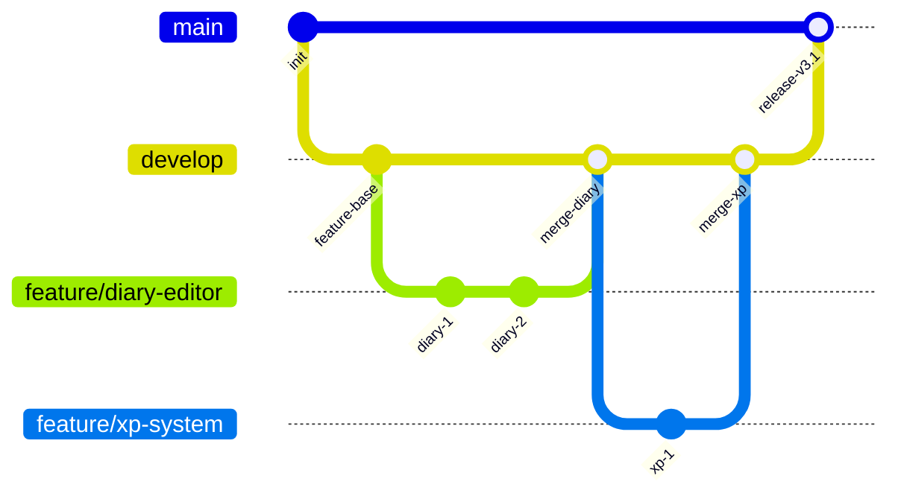
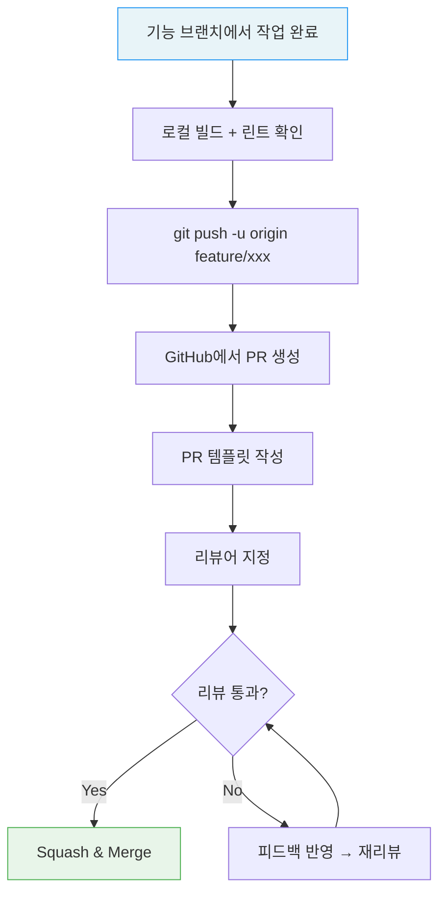
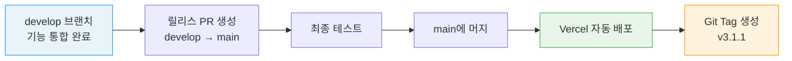
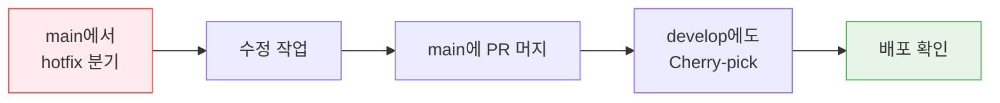

# Git Workflow Guide

| 항목 | 값 |
|------|-----|
| **버전** | 1.0.0 |
| **상태** | `완료` |
| **최종 수정일** | 2026-02-12 |
| **관련 문서** | [CONVENTIONS.md](./CONVENTIONS.md) · [DEPLOYMENT.md](./DEPLOYMENT.md) |

이 문서는 Daily English 프로젝트의 Git 브랜치 전략, 커밋 컨벤션, PR(Pull Request) 워크플로우를 정의한다.

---

## 목차

1. [브랜치 전략](#1-브랜치-전략)
2. [커밋 컨벤션](#2-커밋-컨벤션)
3. [Pull Request 워크플로우](#3-pull-request-워크플로우)
4. [코드 리뷰 체크리스트](#4-코드-리뷰-체크리스트)
5. [릴리스 절차](#5-릴리스-절차)

---

## 1. 브랜치 전략

### 1.1 브랜치 구조



### 1.2 브랜치 역할

| 브랜치 | 역할 | 보호 규칙 |
|--------|------|----------|
| `main` | 프로덕션 배포 브랜치 | PR 머지만 허용, 직접 Push 금지 |
| `develop` | 통합 개발 브랜치 | PR 머지 권장 |
| `feature/*` | 기능 개발 | develop에서 분기 → develop으로 머지 |
| `fix/*` | 버그 수정 | develop에서 분기 → develop으로 머지 |
| `hotfix/*` | 긴급 수정 | main에서 분기 → main + develop 머지 |
| `docs/*` | 문서 작업 | develop에서 분기 → develop으로 머지 |

### 1.3 브랜치 네이밍

```
{type}/{description}
```

| 타입 | 설명 | 예시 |
|------|------|------|
| `feature` | 새 기능 개발 | `feature/treasure-chest-ui` |
| `fix` | 버그 수정 | `fix/streak-reset-kst` |
| `hotfix` | 긴급 프로덕션 수정 | `hotfix/payment-confirm-500` |
| `docs` | 문서 작업 | `docs/api-spec-update` |
| `refactor` | 리팩토링 | `refactor/xp-service-cleanup` |

### 1.4 브랜치 생성 및 머지

```bash
# 기능 브랜치 생성
git checkout develop
git pull origin develop
git checkout -b feature/my-feature

# 작업 완료 후 Push
git push -u origin feature/my-feature

# PR 생성 → 리뷰 → develop에 머지
```

---

## 2. 커밋 컨벤션

### 2.1 커밋 메시지 형식

[Conventional Commits](https://www.conventionalcommits.org/) 규칙을 따른다.

```
<type>(<scope>): <subject>

[optional body]

[optional footer]
```

### 2.2 Type 목록

| Type | 설명 | 예시 |
|------|------|------|
| `feat` | 새 기능 추가 | `feat(chat): add mood selection to diary editor` |
| `fix` | 버그 수정 | `fix(streak): correct KST timezone calculation` |
| `refactor` | 리팩토링 (기능 변경 없음) | `refactor(xp): extract daily tracking logic` |
| `docs` | 문서 수정 | `docs: update API-SPEC for vocabulary endpoints` |
| `style` | 코드 포맷팅 (세미콜론, 공백 등) | `style: apply prettier formatting` |
| `test` | 테스트 추가/수정 | `test(xp): add TTR calculation tests` |
| `chore` | 빌드/도구 설정 변경 | `chore: update drizzle-kit to v0.30` |
| `perf` | 성능 개선 | `perf(calendar): optimize monthly query` |

### 2.3 Scope (선택)

| Scope | 해당 영역 |
|-------|----------|
| `chat` | 일기 교정 (채팅 핵심 흐름) |
| `ai` | AI 시스템 (LangGraph, 프롬프트) |
| `xp` | XP/레벨 시스템 |
| `streak` | 스트릭 시스템 |
| `vocab` | 표현노트 |
| `payment` | 결제/구독 |
| `auth` | 인증 |
| `ui` | UI 컴포넌트 |
| `db` | 데이터베이스/마이그레이션 |
| `treasure` | 보물상자 시스템 |

### 2.4 커밋 메시지 예시

```bash
# 기능 추가
feat(treasure): implement daily chest open with premium check

# 버그 수정
fix(streak): handle freeze consumption when gap is exactly 2 days

# 리팩토링
refactor(ai): split generate_response into smaller functions

# 문서
docs: add deployment guide for Vercel + Neon setup

# DB 마이그레이션
chore(db): add monthly_challenges table migration
```

### 2.5 커밋 원칙

- **Atomic Commit**: 하나의 커밋은 하나의 논리적 변경만 포함
- **의미 있는 단위**: "WIP" 커밋 지양 — 작업 완료 후 커밋
- **영어 사용**: 커밋 메시지는 영어로 작성 (Subject는 명령형)
- **50/72 규칙**: Subject 50자 이내, Body 72자 줄바꿈

---

## 3. Pull Request 워크플로우

### 3.1 PR 생성 절차



### 3.2 PR 제목 형식

커밋 컨벤션과 동일한 형식을 사용한다:

```
feat(chat): add mood selection to diary editor
fix(streak): correct KST timezone calculation
```

### 3.3 PR 본문 템플릿

```markdown
## 변경 사항
- 무엇을 변경했는지 (What)

## 변경 이유
- 왜 변경했는지 (Why)

## 테스트 방법
- [ ] 로컬에서 `npm run build` 성공
- [ ] 로컬에서 `npm run lint` 통과
- [ ] 해당 기능 수동 테스트 완료
- [ ] (해당 시) 마이그레이션 적용 확인

## 스크린샷 (UI 변경 시)
```

### 3.4 머지 전략

| 전략 | 사용 상황 |
|------|----------|
| **Squash & Merge** | 기본 — feature/fix 브랜치 → develop |
| **Merge Commit** | develop → main (릴리스 머지) |
| **Rebase** | 사용 안 함 (히스토리 충돌 방지) |

### 3.5 머지 전 체크리스트

- [ ] `npm run build` 성공
- [ ] `npm run lint` 통과
- [ ] 리뷰어 1명 이상 승인
- [ ] 충돌(Conflict) 해결 완료
- [ ] (DB 변경 시) 마이그레이션 파일 포함

---

## 4. 코드 리뷰 체크리스트

### 4.1 리뷰어 관점

| 항목 | 확인 사항 |
|------|----------|
| **기능** | 요구사항대로 동작하는가? |
| **타입 안전성** | `any` 사용이 없는가? Strict mode 준수? |
| **에러 처리** | 예외 상황이 적절히 처리되는가? |
| **보안** | SQL Injection, XSS 등 취약점이 없는가? |
| **성능** | 불필요한 리렌더링, N+1 쿼리가 없는가? |
| **네이밍** | 변수/함수명이 명확하고 일관적인가? |
| **파일 배치** | 올바른 디렉토리에 위치하는가? |

### 4.2 리뷰 라벨

| 라벨 | 의미 |
|------|------|
| `LGTM` | Looks Good To Me — 머지 가능 |
| `nit` | Nitpick — 사소한 제안 (머지 차단 안 함) |
| `question` | 질문 — 설명 필요 |
| `blocker` | 차단 — 수정 필수 |

---

## 5. 릴리스 절차

### 5.1 릴리스 흐름



### 5.2 버전 관리

[Semantic Versioning](https://semver.org/) (SemVer) 규칙:

```
MAJOR.MINOR.PATCH
```

| 구분 | 변경 기준 | 예시 |
|------|----------|------|
| MAJOR | 호환성 깨지는 변경 | 3.0.0 → 4.0.0 |
| MINOR | 기능 추가 (하위 호환) | 3.1.0 → 3.2.0 |
| PATCH | 버그 수정 | 3.1.0 → 3.1.1 |

### 5.3 Git Tag

```bash
# 릴리스 태그 생성
git tag -a v3.1.1 -m "Release v3.1.1: hotfix for streak timezone"
git push origin v3.1.1
```

### 5.4 Hotfix 절차



```bash
# Hotfix 브랜치 생성
git checkout main
git checkout -b hotfix/critical-fix

# 수정 후 main에 PR → 머지
# develop에도 반영
git checkout develop
git cherry-pick <hotfix-commit-hash>
```
