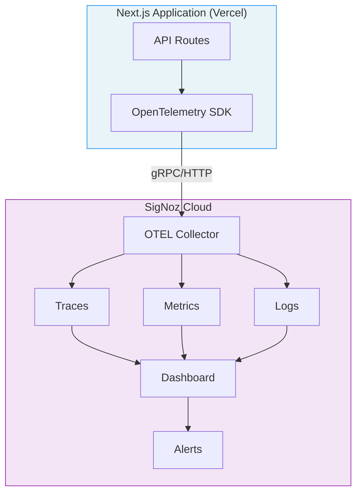
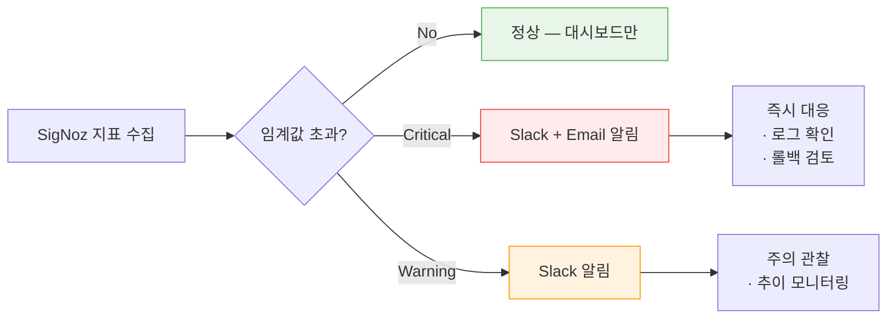

# SigNoz Monitoring Guide

| 항목 | 값 |
|------|-----|
| **버전** | 1.0.0 |
| **상태** | `보류` |
| **최종 수정일** | 2026-02-12 |
| **관련 문서** | [DEPLOYMENT.md](./DEPLOYMENT.md) · [OVERVIEW.md](../architecture/OVERVIEW.md) · [API-SPEC.md](../architecture/API-SPEC.md) |

이 문서는 Daily English에 SigNoz APM(Application Performance Monitoring)을 도입하기 위한 설계와 구현 가이드를 기술한다.

> **상태: 보류** — 현재 SigNoz 연동은 미구현 상태이며, 향후 도입을 위한 설계 문서로 작성되었다.

---

## 목차

1. [도입 배경](#1-도입-배경)
2. [아키텍처 개요](#2-아키텍처-개요)
3. [핵심 모니터링 지표](#3-핵심-모니터링-지표)
4. [구현 계획](#4-구현-계획)
5. [대시보드 설계](#5-대시보드-설계)
6. [알림 정책](#6-알림-정책)

---

## 1. 도입 배경

### 현재 모니터링 상태

| 영역 | 현재 상태 | 한계 |
|------|----------|------|
| 서버 로그 | Vercel Runtime Logs | 구조화 미흡, 장기 보존 불가 |
| 에러 추적 | `console.error` + `.dev.log` | 프로덕션 에러 추적 부재 |
| 성능 분석 | 없음 | API 응답 시간 추적 불가 |
| DB 모니터링 | Neon Console 기본 제공 | 쿼리 수준 분석 불가 |

### SigNoz 도입 목표

| 목표 | 설명 |
|------|------|
| API 성능 추적 | 엔드포인트별 응답 시간, 에러율 추적 |
| AI 파이프라인 분석 | LangGraph 실행 시간, Gemini API 지연 분석 |
| 사용자 경험 지표 | 일기 교정 완료까지의 End-to-End 시간 |
| 이상 탐지 | 에러율 급증, 응답 시간 이상 시 알림 |

---

## 2. 아키텍처 개요

### SigNoz 연동 아키텍처



### 기술 스택

| 구성 요소 | 기술 | 역할 |
|-----------|------|------|
| **Instrumentation** | OpenTelemetry SDK (Node.js) | 자동/수동 계측 |
| **Exporter** | OTLP Exporter | SigNoz로 데이터 전송 |
| **Backend** | SigNoz Cloud | Trace/Metric/Log 저장 및 분석 |

---

## 3. 핵심 모니터링 지표

### 3.1 API 성능 지표

| 지표 | 대상 | 목표값 |
|------|------|--------|
| P50 응답 시간 | `POST /api/chat` | < 10초 |
| P95 응답 시간 | `POST /api/chat` | < 30초 |
| P99 응답 시간 | `POST /api/chat` | < 50초 |
| P50 응답 시간 | 기타 GET API | < 500ms |
| 에러율 | 전체 API | < 1% |
| 429 비율 | `POST /api/chat` | 모니터링 (제한 정책 평가) |

### 3.2 AI 파이프라인 지표

| 지표 | 측정 구간 | 목표값 |
|------|----------|--------|
| LangGraph 실행 시간 | `graph.invoke()` 전체 | < 20초 |
| Gemini API 지연 | `model.invoke()` 호출 | < 15초 |
| JSON 파싱 성공률 | AI 응답 → JSON 변환 | > 99% |
| Zod 검증 성공률 | 스키마 검증 통과 | > 95% |

### 3.3 비즈니스 지표

| 지표 | 설명 | 추적 방법 |
|------|------|----------|
| 일일 활성 사용자 (DAU) | 일기 교정 요청한 고유 사용자 | Custom Metric |
| 일일 교정 수 | `/api/chat` 성공 요청 수 | Request Count |
| 무료/Premium 비율 | 구독 상태별 API 사용 비율 | Custom Attribute |
| 표현노트 저장률 | 교정 후 표현 저장 비율 | Custom Metric |

### 3.4 Trace 구조

하나의 일기 교정 요청에 대한 예상 Trace 구조:

```
[POST /api/chat] ──────────────────────────────────── 전체 span
 ├─ [auth] ─────────────────── 인증 확인 (~50ms)
 ├─ [usage-check] ──────────── 사용량 확인 (~100ms)
 ├─ [langgraph] ────────────── LangGraph 실행 (~15s)
 │   ├─ [build-context] ────── 컨텍스트 구성 (~200ms)
 │   ├─ [gemini-api] ────────── Gemini 호출 (~10s)
 │   ├─ [json-parse] ────────── JSON 파싱 (~10ms)
 │   ├─ [zod-validate] ──────── Zod 검증 (~5ms)
 │   └─ [update-memory] ────── 메모리 업데이트 (~100ms)
 ├─ [save-messages] ─────────── 메시지 저장 (~100ms)
 ├─ [update-streak] ─────────── 스트릭 업데이트 (~100ms)
 ├─ [grant-xp] ──────────────── XP 부여 (~150ms)
 └─ [save-mistake] ──────────── 오답 저장 (~100ms)
```

---

## 4. 구현 계획

### 4.1 Phase 1 — 기본 계측

| 항목 | 설명 | 우선순위 |
|------|------|---------|
| OpenTelemetry SDK 설치 | `@opentelemetry/sdk-node` + 자동 계측 | 높음 |
| OTLP Exporter 설정 | SigNoz Cloud 엔드포인트 연결 | 높음 |
| API Route 자동 계측 | HTTP 요청/응답 자동 추적 | 높음 |
| DB 쿼리 계측 | Drizzle/Neon 쿼리 추적 | 중간 |

### 4.2 Phase 2 — 수동 계측

| 항목 | 설명 | 우선순위 |
|------|------|---------|
| LangGraph Span | `graph.invoke()` 커스텀 Span | 높음 |
| Gemini API Span | 모델 호출 시간 측정 | 높음 |
| 비즈니스 Metric | DAU, 교정 수, 구독 비율 | 중간 |
| 구조화된 로그 | JSON 형식 로그 + Trace 연결 | 중간 |

### 4.3 Phase 3 — 대시보드 및 알림

| 항목 | 설명 | 우선순위 |
|------|------|---------|
| 대시보드 구축 | API 성능, AI 파이프라인, 비즈니스 지표 | 중간 |
| 알림 정책 | 에러율, 응답 시간 임계값 | 중간 |
| SLO 설정 | 핵심 API의 SLO 정의 | 낮음 |

### 4.4 필요 환경 변수

```bash
# SigNoz Cloud
SIGNOZ_INGESTION_KEY=         # SigNoz 수집 키
SIGNOZ_ENDPOINT=              # OTLP 엔드포인트 (예: ingest.signoz.cloud:443)
```

### 4.5 예상 패키지

```json
{
  "@opentelemetry/sdk-node": "^0.52.0",
  "@opentelemetry/auto-instrumentations-node": "^0.49.0",
  "@opentelemetry/exporter-trace-otlp-grpc": "^0.52.0",
  "@opentelemetry/exporter-metrics-otlp-grpc": "^0.52.0"
}
```

---

## 5. 대시보드 설계

### 5.1 API Performance Dashboard

| 패널 | 시각화 | 데이터 소스 |
|------|--------|-----------|
| API 응답 시간 (P50/P95/P99) | 시계열 그래프 | HTTP Span Duration |
| 엔드포인트별 요청 수 | 막대 그래프 | HTTP Request Count |
| 에러율 | 시계열 그래프 | HTTP Status >= 400 |
| 상태 코드 분포 | 파이 차트 | HTTP Status Code |

### 5.2 AI Pipeline Dashboard

| 패널 | 시각화 | 데이터 소스 |
|------|--------|-----------|
| LangGraph 실행 시간 | 히스토그램 | Custom Span |
| Gemini API 지연 | 시계열 그래프 | Custom Span |
| JSON 파싱 성공률 | 게이지 | Custom Metric |
| Zod 검증 실패 유형 | 테이블 | Custom Attribute |

### 5.3 Business Dashboard

| 패널 | 시각화 | 데이터 소스 |
|------|--------|-----------|
| 일일 교정 수 | 시계열 그래프 | Request Count |
| DAU | 일별 막대 그래프 | Custom Metric (unique userId) |
| Free vs Premium 사용량 | 누적 영역 | Custom Attribute |
| 429 (사용량 초과) 발생 빈도 | 시계열 그래프 | HTTP 429 Count |

---

## 6. 알림 정책

### 6.1 Critical 알림 (즉시 대응)

| 조건 | 임계값 | 채널 |
|------|--------|------|
| `/api/chat` 5xx 에러율 | > 5% (5분간) | Slack + Email |
| 전체 API 5xx 에러율 | > 10% (5분간) | Slack + Email |
| `/api/chat` P95 응답 시간 | > 50초 (5분간) | Slack |

### 6.2 Warning 알림 (주의 관찰)

| 조건 | 임계값 | 채널 |
|------|--------|------|
| `/api/chat` P50 응답 시간 | > 15초 (10분간) | Slack |
| Gemini API 에러율 | > 3% (10분간) | Slack |
| DB 쿼리 P95 | > 1초 (10분간) | Slack |
| 429 에러 급증 | 평소 대비 3배+ | Slack |

### 6.3 알림 흐름



---

> **참고**: 이 문서는 SigNoz 도입 전 사전 설계 문서이다. 실제 구현 시 SigNoz 버전과 Next.js 호환성에 따라 세부 사항이 변경될 수 있다. 배포 기본 모니터링은 [@docs/guides/DEPLOYMENT.md](./DEPLOYMENT.md#7-운영-모니터링) 참조.
