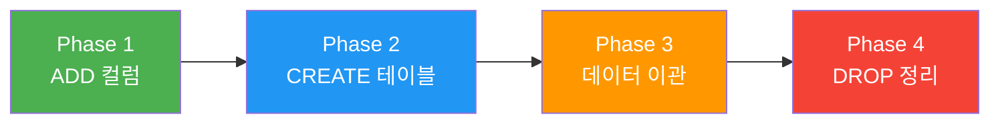
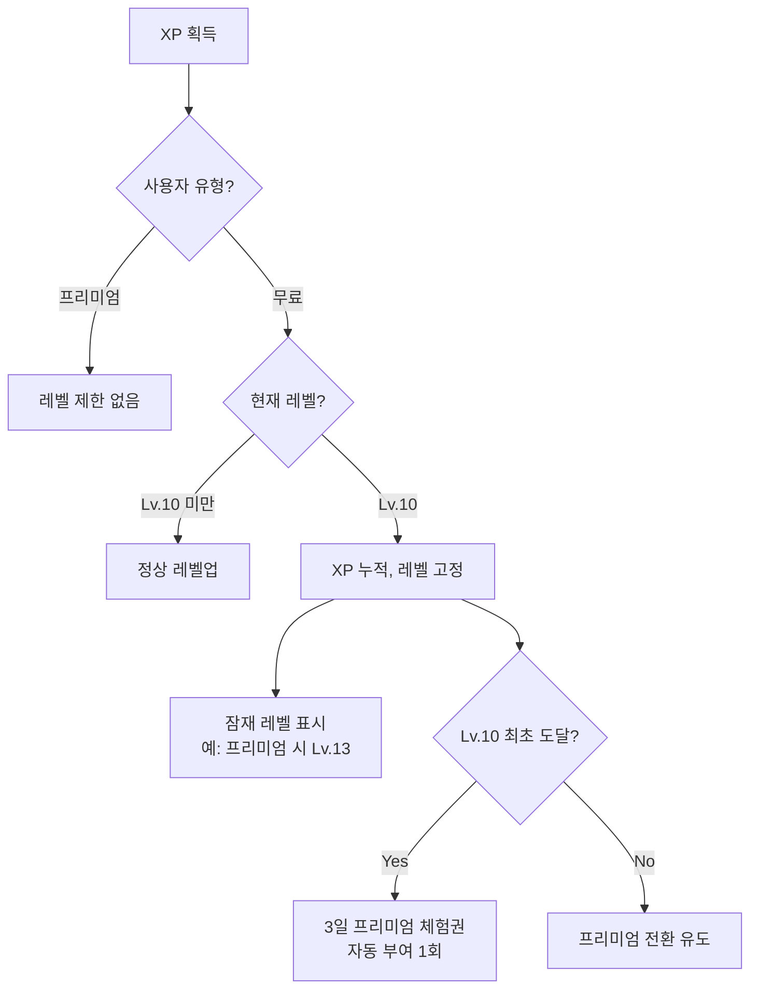

# Phase 1: Foundation — 기반 구축 및 XP/레벨 시스템

| 항목 | 값 |
|------|-----|
| **버전** | 1.0.0 |
| **상태** | `완료` |
| **최종 수정일** | 2026-02-12 |
| **배포 버전** | v3.0-alpha |
| **포함 스프린트** | Sprint 0 (Foundation & Cleanup) · Sprint 1 (XP & Level System) |
| **관련 문서** | [PHASE-2.md](./PHASE-2.md) · [OVERVIEW.md](../architecture/OVERVIEW.md) · [DATA-MODEL.md](../architecture/DATA-MODEL.md) · [AI-SYSTEM.md](../architecture/AI-SYSTEM.md) · [COMMON-SYSTEMS.md](../architecture/COMMON-SYSTEMS.md) · [CHAT-SEQUENCE.md](../architecture/CHAT-SEQUENCE.md) |
| **기준 문서** | [PRD v3.0](../../docs_old/PRD.md) · [execution-plan.md](../../docs_old/execution-plan.md) · [gamification-strategy.md](../../docs_old/gamification-strategy.md) |

---

## 목차

1. [Phase 목표](#1-phase-목표)
2. [범위 정의 (Scope)](#2-범위-정의-scope)
3. [Sprint 0 — Foundation & Cleanup](#3-sprint-0--foundation--cleanup)
4. [Sprint 1 — XP & Level System](#4-sprint-1--xp--level-system)
5. [데이터 모델 변경](#5-데이터-모델-변경)
6. [파일 영향 분석](#6-파일-영향-분석)
7. [완료 기준 (Definition of Done)](#7-완료-기준-definition-of-done)
8. [리스크 및 대응](#8-리스크-및-대응)
9. [배포 체크리스트](#9-배포-체크리스트)

---

## 1. Phase 목표

> **"게이미피케이션의 근간을 구축하고, 기술 부채를 정리한다."**

Phase 1은 두 가지 축으로 구성된다.

| 축 | 설명 | Sprint |
|----|------|--------|
| **정리 (Cleanup)** | deprecated 코드 제거, DB 마이그레이션, 정책 변경 적용 | Sprint 0 |
| **구축 (Build)** | XP/레벨 시스템 신규 개발, 적응형 프롬프트, 레벨업 UI | Sprint 1 |

### 사용자 체감 변화

```
Phase 1 배포 전                    Phase 1 배포 후 (v3.0-alpha)
┌─────────────────────┐           ┌─────────────────────────────────┐
│ 일기 → 교정 → 끝    │    →     │ 일기 → 교정 → XP 획득 → 레벨업  │
│ 챌린지 모드 존재     │           │ 챌린지 모드 제거                 │
│ 수동 설명 수준 선택  │           │ 레벨 기반 자동 적응              │
│ ₩9,900/월           │           │ ₩6,900/월                       │
│ 보상 없음            │           │ XP/레벨/칭호/토스트/프로그레스 바 │
└─────────────────────┘           └─────────────────────────────────┘
```

---

## 2. 범위 정의 (Scope)

### In-Scope

| 카테고리 | 항목 |
|----------|------|
| DB 마이그레이션 | 4-Phase 스키마 마이그레이션 (ADD → CREATE → 데이터 이관 → DROP) |
| 코드 정리 | 체크포인트/요약/챌린지 모드 deprecated 코드 삭제 |
| 정책 변경 | 구독 가격 ₩9,900 → ₩6,900, 입력 검증 5종 |
| XP 시스템 | XP 상수, 레벨 계산, XP Service, 하루 상한 |
| 레벨 시스템 | 30레벨 구조, 6단계 칭호, 무료 Lv.10 상한 |
| 적응형 프롬프트 | 레벨 기반 AI 설명 깊이 자동 조절 |
| 스트릭 마일스톤 | 7/14/30/60/100/180/365일 XP 보상 |
| UI | 레벨 뱃지, 레벨업 모달, XP 토스트, Lv.10 체험권 |
| 분량 기반 보상 | 50단어+/100단어+ XP 보너스 (TTR 검증) |
| 영감 힌트 | Opt-in 패턴으로 영감 카드 제공 |

### Out-of-Scope (후속 Phase에서 처리)

| 항목 | 담당 Phase |
|------|-----------|
| Streak Freeze / Comeback Bonus | [Phase 2](./PHASE-2.md) |
| 보물상자 (Variable Reward) | [Phase 2](./PHASE-2.md) |
| 무료 교정 3→1 축소 **실적용** | [Phase 2](./PHASE-2.md) (코드 준비만 Phase 1) |
| 주간/월간 퀘스트 | [Phase 3](./PHASE-3.md) |
| AI Pen Pal | [Phase 3](./PHASE-3.md) |
| IAP 결제 | [Phase 4](./PHASE-4.md) |

---

## 3. Sprint 0 — Foundation & Cleanup

### 3.1 개요

| 항목 | 값 |
|------|-----|
| **목표** | DB 스키마 마이그레이션, deprecated 코드 제거, 정책 변경 적용 |
| **사용자 체감** | 최소 (내부 정리 중심). 가격 변경, 챌린지 모드 제거, 영감 힌트 UX 변경만 체감 |
| **상태** | `완료` |

### 3.2 태스크 목록

| # | 태스크 | 유형 | 상세 | 상태 |
|---|--------|------|------|------|
| 0-1 | DB 마이그레이션 Phase 1 (ADD) | Backend | `user_profiles`에 xp, xp_level, title 등 8개 컬럼 추가. `chats`에 mood, word_count 등 추가. `diary_streaks`에 previous_streak 등 추가 | `완료` |
| 0-2 | DB 마이그레이션 Phase 2 (CREATE) | Backend | 7개 신규 테이블: xp_history, treasure_chest_log, weekly_quests, user_quest_progress, monthly_challenges, user_challenge_progress, iap_purchases | `완료` |
| 0-3 | DB 데이터 마이그레이션 Phase 3 | Backend | user_profiles.level → learning_preferences 이관, user_mistakes.mistake_type 매핑 | `완료` |
| 0-4 | DB 마이그레이션 Phase 4 (DROP) | Backend | checkpoints 테이블 삭제, chats.summary/user_profiles.level 컬럼 삭제 | `완료` |
| 0-5 | Deprecated 코드 제거 | Backend | checkpointer.ts, summarizer.ts, level-selector.tsx 삭제 | `완료` |
| 0-6 | AI 파이프라인 정리 | Backend | graph.ts에서 체크포인트/요약 의존성 제거, detailed/concise 분기 제거 | `완료` |
| 0-7 | 입력 검증 추가 | Frontend | 5종 검증 (빈 텍스트, 최소 20자, 최소 5단어, 반복 문자 5회, 반복 단어 50%) | `완료` |
| 0-8 | 분량 기반 XP 보상 | Backend | 50단어+ → +10 XP, 100단어+ → +20 XP | `완료` |
| 0-9 | 챌린지 모드 제거 | Full-stack | missions.ts, daily-mission.tsx, mode-selector.tsx 삭제. 오늘의 주제 섹션 제거 | `완료` |
| 0-10 | 구독 가격 변경 | Full-stack | ₩9,900 → ₩6,900 (toss.ts + pricing 페이지) | `완료` |
| 0-11 | Opt-in 영감 힌트 UX | Frontend | "뭘 쓸지 모르겠어요" 버튼 + 영감 카드 셔플 + 닫기 | `완료` |

### 3.3 DB 마이그레이션 순서

> **⚠️ 4-Phase 순서 엄수. 각 Phase 후 롤백 지점 설정 필수.**



| Phase | 작업 | 영향 테이블 | 롤백 가능 여부 |
|-------|------|------------|---------------|
| Phase 1 (ADD) | 기존 테이블에 컬럼 추가 | user_profiles, chats, diary_streaks, daily_usage, messages, user_mistakes | O (ALTER DROP) |
| Phase 2 (CREATE) | 7개 신규 테이블 생성 | xp_history, treasure_chest_log 등 | O (DROP TABLE) |
| Phase 3 (DATA) | 데이터 이관 및 매핑 | user_profiles, user_mistakes | △ (백업 필수) |
| Phase 4 (DROP) | 테이블/컬럼 삭제 | checkpoints, chats.summary 등 | X (비가역) |

### 3.4 삭제 대상 파일

| 파일 | 사유 |
|------|------|
| `lib/ai/checkpointer.ts` | 3단계 메모리 → 프로필 메모리로 간소화 |
| `lib/ai/summarizer.ts` | 대화 요약 기능 제거 |
| `components/profile/level-selector.tsx` | 수동 레벨 선택 → 자동 적응으로 전환 |
| `lib/missions.ts` | 챌린지 모드 제거 |
| `components/diary/daily-mission.tsx` | 챌린지 모드 제거 |
| `components/diary/mode-selector.tsx` | 챌린지 모드 제거 |

### 3.5 입력 검증 규칙

| 규칙 | 조건 | 실패 시 메시지 |
|------|------|---------------|
| 빈 텍스트 금지 | `text.trim().length === 0` | 버튼 비활성화 (무메시지) |
| 최소 글자 수 | 공백 제외 20자 이상 | "조금 더 써볼까요? 최소 20자 이상 입력해주세요." |
| 최소 단어 수 | 공백 기준 5단어 이상 | "문장을 조금 더 만들어보세요! 최소 5단어 이상 필요해요." |
| 반복 문자 감지 | 동일 문자 5회 이상 연속 | "의미 있는 영어 문장을 써주세요." |
| 반복 단어 감지 | 동일 단어 비율 50% 이상 | "다양한 단어로 일기를 써보세요!" |

> **구현 위치**: `components/diary/diary-editor.tsx` — 클라이언트 사이드 실시간 검증

---

## 4. Sprint 1 — XP & Level System

### 4.1 개요

| 항목 | 값 |
|------|-----|
| **목표** | 모든 게이미피케이션의 근간. XP 획득 → 레벨업 → 적응형 설명 |
| **선행 조건** | Sprint 0 완료 |
| **Feature ID** | F3 (XP & 레벨) |

### 4.2 XP 보상 체계

| 행동 | XP | 하루 상한 | 조건 | 설명 |
|------|-----|----------|------|------|
| 일기 제출 | +30 | 3회/일 | — | 기본 보상 |
| 30단어 이상 | +5 | 3회/일 | TTR ≥ 0.4 | 분량 보상 1단계 |
| 60단어 이상 | +10 | 3회/일 | TTR ≥ 0.4 | 분량 보상 2단계 |
| 100단어 이상 | +20 | 3회/일 | TTR ≥ 0.4 | 분량 보상 3단계 |
| 약점 극복 | +20 | 1회/일 | 최근 TOP 오답 미발생 | 개선 보상 |
| 표현노트 저장 | +5 | 5회/일 | — | 표현 활용 유도 |
| 스트릭 7일 | +100 | 1회 | — | 주간 마일스톤 |
| 스트릭 14일 | +150 | 1회 | — | 2주 마일스톤 |
| 스트릭 30일 | +500 | 1회 | 칭호 부여 | 월간 마일스톤 |
| 스트릭 60일 | +800 | 1회 | — | 2개월 마일스톤 |
| 스트릭 100일 | +1,500 | 1회 | 칭호 부여 | "Century Writer" |
| 스트릭 180일 | +2,000 | 1회 | — | 6개월 마일스톤 |
| 스트릭 365일 | +5,000 | 1회 | 칭호 부여 | "Year-Round Writer" |

> **TTR (Type-Token Ratio)**: 고유 단어 수 / 전체 단어 수. 0.4 미만이면 분량 보너스 미부여 (어뷰징 방지).
> 구현: `lib/validation/ttr.ts`

### 4.3 레벨 시스템

**레벨 공식**: `required_xp = floor(80 × N^1.7)` (로그 곡선, 초반 빠른 레벨업)

```
XP
│
│                                          ★ Lv.30 (32,586 XP)
│                                     ╱
│                                ╱
│                           ╱
│                     ╱
│               ╱
│         ╱                  ← 무료 상한 Lv.10 (4,009 XP)
│    ╱ ·····················
│ ╱
└────────────────────────────────── Level
  1   5   10   15   20   25   30
```

| 레벨 구간 | 칭호 | 누적 XP | 무료 (55 XP/일) | 프리미엄 (150 XP/일) |
|-----------|------|---------|-----------------|---------------------|
| 1–5 | Diary Beginner | 80 – 1,234 | 1–22일 | 1–8일 |
| 6–10 | Daily Writer | 1,682 – 4,009 | 31–73일 | 11–27일 |
| 11–15 | Story Teller | 4,726 – 8,459 | — | 32–56일 |
| 16–20 | Word Crafter | 9,296 – 14,594 | — | 62–97일 |
| 21–25 | English Native | 15,965 – 22,627 | — | 106–151일 |
| 26–30 | Master Author | 24,228 – 32,586 | — | 161–217일 |

### 4.4 무료 Lv.10 상한 정책



### 4.5 레벨 기반 적응형 프롬프트

> 구현: `lib/ai/graph.ts` — 사용자 프로필의 `xp_level` 조회 후 프롬프트 분기

| 레벨 구간 | 한국어 비율 | 설명 특성 |
|-----------|------------|----------|
| Lv.1–10 (Beginner) | 70–90% | 간단한 어휘, 단계별 분석, 충분한 예시, 격려 톤 |
| Lv.11–20 (Intermediate) | 50–70% | 핵심 교정 포인트 위주, 적절한 영어 사용 |
| Lv.21+ (Advanced) | 30–50% | 핵심만 간결하게, 영어 중심 설명 |

> **참조**: [AI-SYSTEM.md §적응형 프롬프트](../architecture/AI-SYSTEM.md)

### 4.6 태스크 목록

| # | 태스크 | 유형 | 상세 |
|---|--------|------|------|
| 1-1 | XP 상수 & 레벨 계산 | Backend | `lib/gamification/xp-constants.ts`: XP 보상 테이블, 레벨 공식, 칭호 매핑 |
| 1-2 | XP Service | Backend | `lib/gamification/xp-service.ts`: `grantXp()` — XP 부여 + 하루 상한 + xp_history INSERT + 레벨업 판정 + 부스터 2x 체크. 트랜잭션 원자성 |
| 1-3 | 교정 Flow XP 연동 | Backend | `app/api/chat/route.ts`: 교정 횟수 체크 → diary_submit XP → 분량 보너스 → 약점 극복 판정 |
| 1-4 | 표현노트 XP 연동 | Backend | `app/api/vocabulary/route.ts`: POST 성공 시 expression_save +5 XP |
| 1-5 | 스트릭 마일스톤 XP | Backend | `lib/streak/streak-manager.ts`: 7/14/30/60/100/180/365일 마일스톤 |
| 1-6 | 레벨 기반 적응형 프롬프트 | AI | `lib/ai/graph.ts`: xp_level 조회 → 프롬프트 분기 |
| 1-7 | 무료 Lv.10 상한 | Backend | xp-service: 무료 Lv.10 초과 시 XP 누적, 레벨 고정. 프리미엄 전환 시 즉시 반영 |
| 1-8 | XP API | Backend | `GET /api/user/xp`: XP, 레벨, 칭호, 프로그레스, 부스터 상태 |
| 1-9 | 헤더 레벨 UI | Frontend | 레벨 뱃지 + 칭호 + 프로그레스 바 |
| 1-10 | 레벨업 연출 | Frontend | 축하 모달: 새 칭호 + XP 획득 애니메이션 |
| 1-11 | XP 토스트 | Frontend | 교정 후 "+30 XP" 토스트. 부스터 시 "+60 XP (2x)" |
| 1-12 | Lv.10 특별 보상 | Full-stack | 3일 프리미엄 체험권 자동 부여 + 잠재 레벨 표시 + 체험 종료 후 전환 유도 |

---

## 5. 데이터 모델 변경

> **상세 스키마 정의**: [DATA-MODEL.md](../architecture/DATA-MODEL.md) · [01-TABLE-DEFINITIONS.md](../architecture/db-schema/01-TABLE-DEFINITIONS.md)

### 5.1 기존 테이블 컬럼 추가 (Sprint 0 Phase 1: ADD)

| 테이블 | 추가 컬럼 | 타입 | 설명 |
|--------|----------|------|------|
| `user_profiles` | xp | integer | 누적 XP |
| | xp_level | integer | 현재 레벨 (1–30) |
| | title | varchar | 현재 칭호 |
| | equipped_title | varchar | 장착 칭호 |
| | earned_titles | jsonb | 획득한 칭호 목록 |
| | streak_freeze_count | integer | 보유 Freeze 수 |
| | xp_booster_expires_at | timestamp | XP 부스터 만료일 |
| | chest_key_count | integer | 보물상자 열쇠 수 |
| `chats` | mood | varchar | 기분 (6종) |
| | word_count | integer | 단어 수 |
| | challenge_word_used | boolean | (예약: Phase 3) |
| `diary_streaks` | previous_streak | integer | 리셋 전 스트릭 |
| | streak_freeze_used_at | date | Freeze 사용일 |
| | comeback_started_at | date | 복귀 시작일 |
| | comeback_days | integer | 복귀 연속 일수 |
| `daily_usage` | bonus_count | integer | 추가 교정 횟수 |
| `messages` | role enum | 'penpal' 추가 | AI Pen Pal 메시지용 |
| `user_mistakes` | sub_type | varchar | 오답 세부 분류 |

### 5.2 신규 테이블 (Sprint 0 Phase 2: CREATE)

| 테이블 | 도메인 | 용도 |
|--------|--------|------|
| `xp_history` | Gamification | XP 획득/차감 이력 |
| `treasure_chest_log` | Gamification | 보물상자 보상 이력 |
| `weekly_quests` | Gamification | 주간 퀘스트 정의 |
| `user_quest_progress` | Gamification | 퀘스트 진행률 |
| `monthly_challenges` | Gamification | 월간 챌린지 정의 |
| `user_challenge_progress` | Gamification | 챌린지 진행률 |
| `iap_purchases` | Billing | 인앱 구매 이력 |

> **주의**: Phase 1에서 테이블을 생성하지만, 실제 데이터 적재는 Phase 2–4에서 진행.

---

## 6. 파일 영향 분석

### 6.1 삭제 파일

```
lib/ai/checkpointer.ts          — 체크포인트 메모리 (deprecated)
lib/ai/summarizer.ts             — 대화 요약 (deprecated)
components/profile/level-selector.tsx — 수동 레벨 선택 (deprecated)
lib/missions.ts                  — 챌린지 미션 정의
components/diary/daily-mission.tsx — 챌린지 UI
components/diary/mode-selector.tsx — 모드 전환 UI
```

### 6.2 수정 파일

```
db/schema.ts                     — 스키마 전면 수정
lib/ai/graph.ts                  — 체크포인트/요약 제거 + 적응형 프롬프트
components/diary/diary-editor.tsx — 입력 검증 5종 + 영감 힌트 Opt-in
lib/payment/toss.ts              — 가격 ₩9,900 → ₩6,900
app/pricing/page.tsx             — 가격 표시 변경
app/api/chat/route.ts            — XP 연동, 분량 보상, 약점 극복
app/api/vocabulary/route.ts      — 표현노트 XP 연동
lib/streak/streak-manager.ts     — 스트릭 마일스톤 XP
```

### 6.3 신규 파일

```
lib/gamification/xp-constants.ts — XP 보상/레벨 상수
lib/gamification/xp-service.ts   — XP 부여 비즈니스 로직
lib/xp/daily-tracking.ts         — 일일 XP 상한 추적
lib/xp/weakness-overcome.ts      — 약점 극복 판정
lib/xp/level-rewards.ts          — 레벨 보상 (Lv.10 체험권 등)
lib/validation/ttr.ts            — TTR 계산 + 분량 보너스
app/api/user/xp/route.ts         — XP 조회 API
components/gamification/level-badge.tsx  — 레벨 뱃지
components/gamification/levelup-modal.tsx — 레벨업 모달
components/gamification/xp-toast.tsx     — XP 토스트
components/gamification/level-cap-modal.tsx — Lv.10 상한 안내
components/gamification/trial-granted-modal.tsx — 체험권 안내
```

---

## 7. 완료 기준 (Definition of Done)

### Sprint 0

- [x] `drizzle-kit generate` + `drizzle-kit migrate` 성공
- [x] 기존 기능 (교정, 스트릭, 캘린더, 표현노트, 기록 조회) 정상 동작
- [x] deprecated 코드 삭제 후 `npm run build` 에러 없음
- [x] 입력 검증 규칙 5종 동작
- [x] 가격 ₩6,900 반영
- [x] 챌린지 모드 제거 완료
- [x] Opt-in 영감 힌트 UX 구현

### Sprint 1

- [ ] 일기 제출 → XP 획득 → xp_history 기록
- [ ] 레벨업 정상 동작 (Lv.1 → Lv.30)
- [ ] 무료 Lv.10 상한 동작
- [ ] 레벨 기반 AI 설명 깊이 변화 확인
- [ ] 헤더 레벨/칭호/진행바 표시
- [ ] 레벨업 축하 모달 동작
- [ ] Lv.10 도달 시 3일 체험권 자동 부여

---

## 8. 리스크 및 대응

| # | 리스크 | 영향 범위 | 대응 방안 |
|---|--------|----------|----------|
| R1 | LangGraph 체크포인트 제거 시 기존 대화 호환성 | Sprint 0 | 기존 데이터는 orphan 처리. 새 일기부터 새 파이프라인 적용 |
| R2 | DB 마이그레이션 실패 | Sprint 0 | 4-Phase 순서 엄수. 각 Phase 후 롤백 지점 설정 |
| R3 | XP 어뷰징 (반복 제출) | Sprint 1 | TTR ≥ 0.4 검증 + 하루 상한 3회 + 반복 단어 50% 차단 |
| R4 | 레벨 공식 밸런싱 오류 | Sprint 1 | 초기 PRD 공식 적용 후 2주 단위 데이터 기반 튜닝 |

---

## 9. 배포 체크리스트

### v3.0-alpha 배포 전

```
[ ] DB 마이그레이션 4-Phase 완료 (Production)
[ ] 환경 변수 확인 (GOOGLE_GENERATIVE_AI_API_KEY, DATABASE_URL, AUTH_SECRET 등)
[ ] npm run build — 에러 없음
[ ] 기존 기능 회귀 테스트 (교정, 스트릭, 캘린더, 표현노트, 기록 조회)
[ ] XP/레벨 기능 E2E 테스트
[ ] 레벨업 모달/XP 토스트 시각 검증
[ ] 가격 페이지 ₩6,900 표시 확인
[ ] 입력 검증 5종 동작 확인
[ ] Vercel 배포 후 Production 동작 확인
```

### 다음 Phase 연결

Phase 1 배포 후 [Phase 2: Engagement](./PHASE-2.md)로 진행. Phase 2에서는 Streak Freeze, Comeback Bonus, 보물상자(Variable Reward)를 구현하며, **무료 교정 3→1 축소를 실적용**한다.
