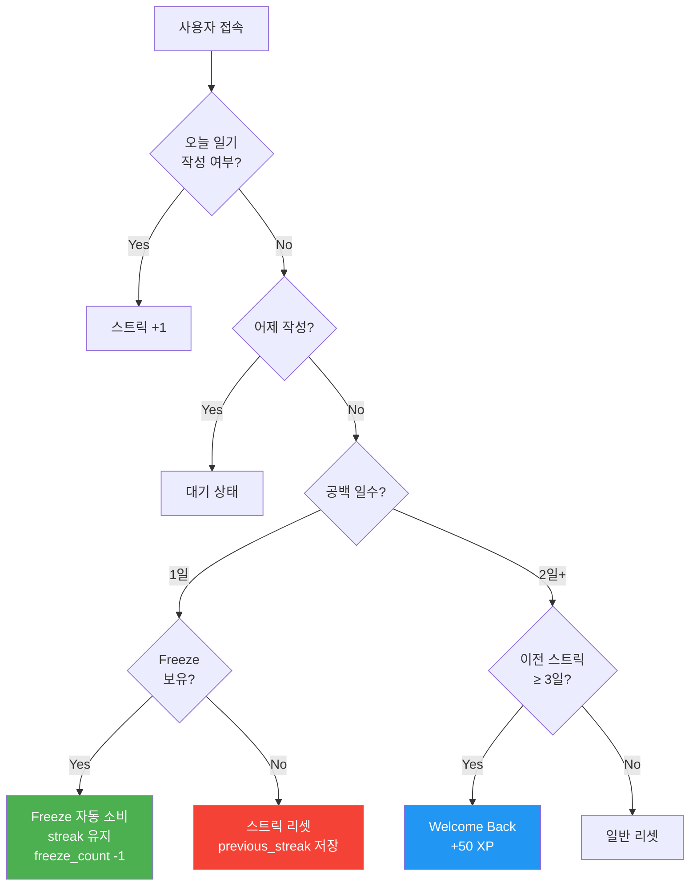
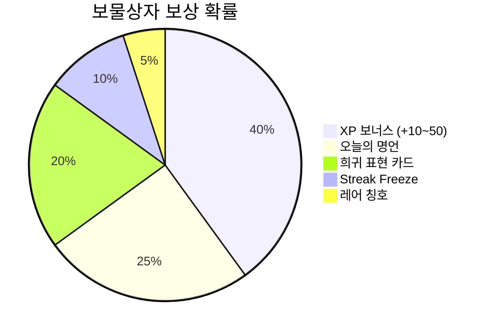
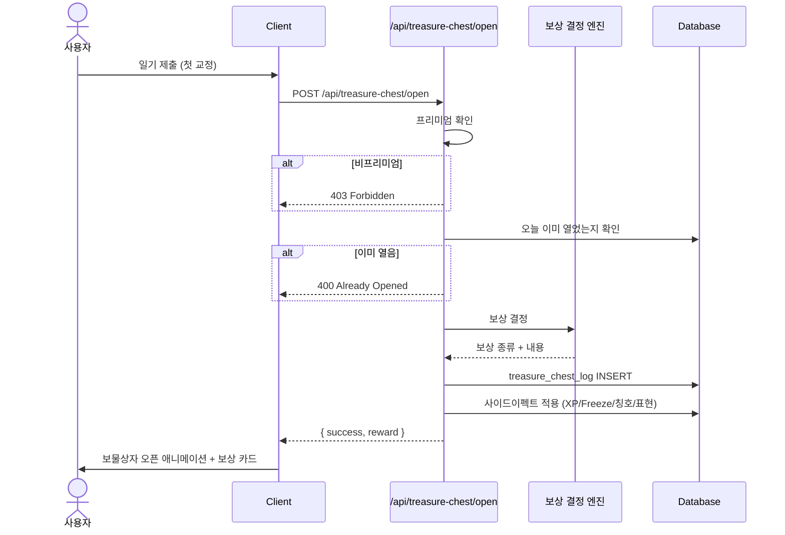
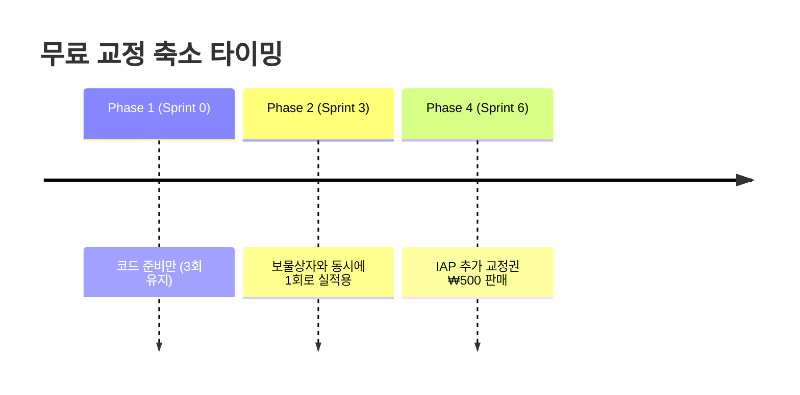

# Phase 2: Engagement — 이탈 방지 및 Variable Reward

| 항목 | 값 |
|------|-----|
| **버전** | 1.0.0 |
| **상태** | `대기` |
| **최종 수정일** | 2026-02-12 |
| **배포 버전** | v3.0-beta |
| **포함 스프린트** | Sprint 2 (Streak Freeze & Comeback) · Sprint 3 (Treasure Chest) |
| **선행 조건** | [Phase 1](./PHASE-1.md) 완료 (XP/레벨 시스템 필수) |
| **관련 문서** | [PHASE-1.md](./PHASE-1.md) · [PHASE-3.md](./PHASE-3.md) · [COMMON-SYSTEMS.md](../architecture/COMMON-SYSTEMS.md) · [API-SPEC.md](../architecture/API-SPEC.md) · [DATA-MODEL.md](../architecture/DATA-MODEL.md) |
| **기준 문서** | [gamification-strategy.md](../../docs_old/gamification-strategy.md) · [execution-plan.md](../../docs_old/execution-plan.md) |

---

## 목차

1. [Phase 목표](#1-phase-목표)
2. [범위 정의 (Scope)](#2-범위-정의-scope)
3. [Sprint 2 — Streak Freeze & Comeback Bonus](#3-sprint-2--streak-freeze--comeback-bonus)
4. [Sprint 3 — Treasure Chest (Variable Reward)](#4-sprint-3--treasure-chest-variable-reward)
5. [무료 교정 3→1 축소 전략](#5-무료-교정-31-축소-전략)
6. [데이터 모델 활용](#6-데이터-모델-활용)
7. [파일 영향 분석](#7-파일-영향-분석)
8. [완료 기준 (Definition of Done)](#8-완료-기준-definition-of-done)
9. [리스크 및 대응](#9-리스크-및-대응)
10. [배포 체크리스트](#10-배포-체크리스트)

---

## 1. Phase 목표

> **"스트릭이 끊기는 순간의 이탈을 방지하고, '오늘은 뭐가 나올까?' 기대감을 만든다."**

Phase 2는 Hook Model의 **Variable Reward** 계층을 완성한다.

| 축 | 설명 | 심리학적 근거 | Sprint |
|----|------|-------------|--------|
| **이탈 방지** | Streak Freeze + Comeback Bonus | 손실 회피(Loss Aversion) + 심리적 복귀 비용 절감 | Sprint 2 |
| **기대감 생성** | 보물상자 (5종 랜덤 보상) | 가변 비율 보상(Variable Ratio Reinforcement) | Sprint 3 |

### 사용자 체감 변화

```
Phase 1 (v3.0-alpha)                    Phase 2 (v3.0-beta)
┌───────────────────────────┐           ┌──────────────────────────────────────────┐
│ XP/레벨은 있지만...       │    →     │ Streak Freeze로 스트릭 보호               │
│ 스트릭 끊기면 복구 불가   │           │ Comeback Bonus로 복귀 보상                │
│ 매번 동일한 교정 결과만   │           │ 매일 첫 일기 → 보물상자 랜덤 보상        │
│ 무료 교정 3회/일          │           │ 무료 교정 1회/일 (보물상자와 동시 적용)   │
└───────────────────────────┘           └──────────────────────────────────────────┘
```

---

## 2. 범위 정의 (Scope)

### In-Scope

| 카테고리 | 항목 |
|----------|------|
| Streak Freeze | Freeze 자동 소비, 보유 한도 2개, 획득 (보물상자 10%), 보유 UI |
| Comeback Bonus | Welcome Back 50 XP, Comeback Kid 칭호 +100 XP, 7일 연속 시 스트릭 50% 복구 |
| 보물상자 | 5종 보상 결정 엔진, Open/Key API, 교정 Flow 연동, 무료 티저 |
| 무료 교정 축소 | 3회/일 → 1회/일 실적용 |
| UI | Freeze 아이콘, Welcome Back 카드, 보물상자 애니메이션, 보상 카드, 보상 이력 |

### Out-of-Scope

| 항목 | 담당 Phase |
|------|-----------|
| Freeze 유료 구매 (IAP) | [Phase 4](./PHASE-4.md) |
| 주간/월간 퀘스트 | [Phase 3](./PHASE-3.md) |
| AI Pen Pal | [Phase 3](./PHASE-3.md) |
| 보물상자 열쇠 유료 구매 (IAP) | [Phase 4](./PHASE-4.md) |

---

## 3. Sprint 2 — Streak Freeze & Comeback Bonus

### 3.1 개요

| 항목 | 값 |
|------|-----|
| **목표** | 기존 스트릭에 보호막과 복귀 보너스를 추가하여 이탈 방지 |
| **선행** | Phase 1 Sprint 0 + Sprint 1 (XP 부여 시스템) |
| **Feature ID** | F4 |

### 3.2 Streak Freeze 메커니즘



| 항목 | 규칙 |
|------|------|
| **보유 한도** | 최대 2개 |
| **획득 경로** | 보물상자에서 랜덤 획득 (10%) — Sprint 3에서 활성화 |
| **소비 방식** | 자동 (공백 1일 감지 시 시스템이 자동 차감) |
| **소비 조건** | gap == 1일 (정확히 어제 하루만 빠진 경우) |
| **표시 위치** | 헤더 불꽃 아이콘 옆 방패 아이콘 + 보유 수 (0/1/2) |

> **구현 위치**: `lib/streak/streak-manager.ts`
> **참조**: [COMMON-SYSTEMS.md §스트릭 시스템](../architecture/COMMON-SYSTEMS.md)

### 3.3 Comeback Bonus 메커니즘

> **핵심**: "끊겨서 의미 없어졌다" → "다시 시작하면 보상이 있다"로 프레이밍 전환

| 조건 | 보상 | 설명 |
|------|------|------|
| 3일+ 미접속 후 복귀 + 일기 작성 | "Welcome Back" 카드 + 50 XP | 단, 이전 스트릭 3일 이상일 때만 |
| 스트릭 리셋 후 3일 연속 작성 | "Comeback Kid" 칭호 + 100 XP | 재기 동기 부여 |
| 스트릭 리셋 후 7일 연속 작성 | 이전 스트릭의 50% 복구 | previous_streak × 0.5 복원 |

### 3.4 Streak API 확장

> **엔드포인트**: `GET /api/streak` — 기존 응답에 아래 필드 추가

```json
{
  "currentStreak": 7,
  "longestStreak": 14,
  "lastWrittenAt": "2026-02-12",
  "totalEntries": 42,
  "wroteToday": true,
  "freezeCount": 1,
  "freezeUsedToday": false,
  "comebackStatus": {
    "isComeback": false,
    "comebackDays": 0,
    "previousStreak": 0
  },
  "welcomeBackBonus": false,
  "isGuest": false
}
```

> **참조**: [API-SPEC.md §GET /api/streak](../architecture/API-SPEC.md)

### 3.5 태스크 목록

| # | 태스크 | 유형 | 상세 |
|---|--------|------|------|
| 2-1 | Streak Manager 리팩토링 | Backend | `lib/streak/streak-manager.ts` 전면 수정: Freeze 자동 소비, Comeback 자격 판정, previous_streak 저장, comeback_days 추적 |
| 2-2 | Freeze 소비 로직 | Backend | gap==1 + freeze_count>0 → Freeze 자동 소비, streak 유지 |
| 2-3 | Comeback Bonus 로직 | Backend | 3일+ 미접속 복귀 → Welcome Back 50 XP. 리셋 후 3일 연속 → Comeback Kid 칭호 +100 XP. 7일 연속 → previous_streak × 0.5 복구 |
| 2-4 | Streak API 확장 | Backend | `GET /api/streak`: freeze_count, comeback 상태 포함 |
| 2-5 | Freeze 보유 UI | Frontend | 헤더 불꽃 옆 방패 아이콘 + 보유 수 (0/1/2) |
| 2-6 | Freeze 사용 알림 | Frontend | "보호막이 사용되었어요! 남은 보호막: N개" 토스트 |
| 2-7 | Welcome Back 카드 | Frontend | 복귀 시 "Welcome Back" 카드 + 50 XP 연출 |
| 2-8 | Comeback Kid 연출 | Frontend | 리셋 후 3일 연속 시 "Comeback Kid" 칭호 획득 모달 |

---

## 4. Sprint 3 — Treasure Chest (Variable Reward)

### 4.1 개요

| 항목 | 값 |
|------|-----|
| **목표** | 매일 첫 일기 시 랜덤 보상으로 "오늘은 뭐가 나올까?" 기대감 생성. **프리미엄 핵심 가치** |
| **선행** | Sprint 1 (XP), Sprint 2 (Streak Freeze — 보상 풀에 Freeze 포함) |
| **Feature ID** | F5 |

### 4.2 보상 결정 엔진

> **구현 위치**: `lib/gamification/treasure-chest.ts`



| 보상 | 확률 | 내용 | 사이드이펙트 |
|------|------|------|-------------|
| XP 보너스 | 40% | +10~50 XP 랜덤 | `xp_history` INSERT + `user_profiles.xp` 갱신 |
| 오늘의 명언 | 25% | 유명 영어 명언 + 해석 카드 | 표시만 (공유 가능) |
| 희귀 표현 카드 | 20% | 원어민 표현 1개 (AI 생성) | `vocabulary` 자동 추가 |
| Streak Freeze | 10% | Freeze 1회 획득 | `user_profiles.streak_freeze_count` +1 (상한 2 초과 시 XP 대체) |
| 레어 칭호 | 5% | 한정 칭호 (Night Owl, Weekend Warrior 등) | `user_profiles.earned_titles` 추가 |

### 4.3 보물상자 열기 Flow



### 4.4 보물상자 열쇠 시스템

- **열쇠 경로**: `POST /api/treasure-chest/open-with-key`
- **소비**: `chest_key_count` 1개 차감
- **획득 경로**: Phase 4 IAP에서 유료 구매 (5개 ₩2,500)
- **효과**: 일일 무료 1회 외 추가 보물상자 오픈 가능

### 4.5 무료 사용자 티저

> **전략**: 교정 결과 하단에 흐릿한 보물상자 + "프리미엄에서 열어보세요" CTA

```
┌─────────────────────────────────┐
│        교정 결과 영역            │
│  (원문, 교정문, 설명, 대안 3종)  │
├─────────────────────────────────┤
│   ┌───────────────────────┐     │
│   │  🎁  (블러 처리)      │     │
│   │  오늘의 보물상자       │     │
│   │  프리미엄에서 열어보세요│     │
│   │  [프리미엄 시작하기]   │     │
│   └───────────────────────┘     │
└─────────────────────────────────┘
```

### 4.6 보물상자 API 명세

| Method | Path | Auth | 설명 |
|--------|------|------|------|
| POST | `/api/treasure-chest/open` | Required (Premium) | 일일 무료 보물상자 열기 |
| POST | `/api/treasure-chest/open-with-key` | Required | 열쇠로 보물상자 열기 |
| GET | `/api/treasure-chest/history` | Required | 최근 20개 보상 이력 |

> **상세 명세**: [API-SPEC.md §보물상자](../architecture/API-SPEC.md)

### 4.7 태스크 목록

| # | 태스크 | 유형 | 상세 |
|---|--------|------|------|
| 3-1 | 보상 결정 엔진 | Backend | `lib/gamification/treasure-chest.ts`: 확률 기반 보상 결정 (서버). Freeze 상한 초과 시 XP 대체 |
| 3-2 | 보물상자 Open API | Backend | `POST /api/treasure-chest/open`: 프리미엄 확인 → 당일 확인 → 보상 결정 → INSERT → 사이드이펙트 |
| 3-3 | 보물상자 열쇠 API | Backend | `POST /api/treasure-chest/open-with-key`: chest_key_count 차감 + 보상 결정 |
| 3-4 | 보물상자 이력 API | Backend | `GET /api/treasure-chest/history`: 최근 20개 보상 목록 |
| 3-5 | 교정 Flow 연동 | Backend | `app/api/chat/route.ts`: 프리미엄 + 당일 첫 교정 시 보물상자 자동 트리거 |
| 3-6 | 오픈 애니메이션 | Frontend | 상자 흔들림 → 열림 → 보상 카드 등장. 등급별 테두리 (일반/레어/에픽) |
| 3-7 | 보상 카드 컴포넌트 | Frontend | 5종 보상 각각의 카드 UI |
| 3-8 | 보상 이력 UI | Frontend | 최근 보상 목록 (날짜별) |
| 3-9 | 무료 사용자 티저 | Frontend | 교정 결과 하단 블러 보물상자 + 프리미엄 CTA |
| 3-10 | **무료 교정 3→1 적용** | Backend | `lib/subscription/check-usage.ts`: 무료 교정 1회/일로 변경 |

---

## 5. 무료 교정 3→1 축소 전략

> **핵심 원칙**: 게이미피케이션 없이 무료 횟수만 줄이면 이탈 위험. 반드시 보물상자(Sprint 3)와 동시 배포.



### 근거

| 항목 | 설명 |
|------|------|
| **자연스러운 사용 패턴** | 일기 앱의 사용 패턴은 "하루 1회"가 대부분 |
| **가치 체험** | 1회로도 서비스 핵심 가치(AI 교정)를 충분히 체험 |
| **결제 트리거** | 2회 이상 쓰고 싶은 순간이 "프리미엄 전환"의 첫 번째 트리거 |
| **동시 배포 이유** | 보물상자의 Variable Reward가 프리미엄의 핵심 가치로 자리잡은 시점에 축소. "재미 요소에 과금" 전략 |

### 구현 위치

- `lib/subscription/check-usage.ts` — 무료 사용자 일일 한도 상수 변경 (3 → 1)

---

## 6. 데이터 모델 활용

> Phase 1에서 생성한 테이블/컬럼을 Phase 2에서 최초 활용한다.

### 6.1 Sprint 2에서 활용하는 컬럼

| 테이블 | 컬럼 | 용도 |
|--------|------|------|
| `user_profiles` | streak_freeze_count | Freeze 보유 수 관리 |
| `diary_streaks` | previous_streak | 리셋 전 스트릭 값 저장 |
| | streak_freeze_used_at | Freeze 사용일 기록 |
| | comeback_started_at | 복귀 시작일 기록 |
| | comeback_days | 복귀 연속 일수 추적 |

### 6.2 Sprint 3에서 활용하는 테이블

| 테이블 | 용도 |
|--------|------|
| `treasure_chest_log` | 보상 이력 기록 (reward_type, reward_data, opened_at) |
| `user_profiles.chest_key_count` | 열쇠 보유 수 관리 |

> **상세 스키마**: [DATA-MODEL.md](../architecture/DATA-MODEL.md) · [01-TABLE-DEFINITIONS.md](../architecture/db-schema/01-TABLE-DEFINITIONS.md)

---

## 7. 파일 영향 분석

### 7.1 수정 파일

```
lib/streak/streak-manager.ts          — 전면 리팩토링 (Freeze, Comeback)
app/api/streak/route.ts               — 응답에 freeze/comeback 상태 포함
app/api/chat/route.ts                 — 보물상자 트리거 연동
lib/subscription/check-usage.ts       — 무료 교정 3→1
```

### 7.2 신규 파일

```
# Sprint 2
(streak-manager.ts 리팩토링이 주요 작업, 신규 파일 최소)

# Sprint 3
lib/gamification/treasure-chest.ts              — 보상 결정 엔진
app/api/treasure-chest/open/route.ts            — 보물상자 오픈 API
app/api/treasure-chest/open-with-key/route.ts   — 열쇠 오픈 API
app/api/treasure-chest/history/route.ts         — 이력 조회 API
components/gamification/chest-animation.tsx      — 오픈 애니메이션
components/gamification/reward-card.tsx          — 보상 카드
components/gamification/chest-teaser.tsx         — 무료 사용자 티저
```

---

## 8. 완료 기준 (Definition of Done)

### Sprint 2

- [ ] Freeze 자동 소비 → 스트릭 유지 동작
- [ ] Freeze 0개 + 공백 → 스트릭 리셋 + previous_streak 저장
- [ ] Welcome Back 50 XP 동작 (이전 스트릭 3일 이상 조건)
- [ ] Comeback Kid 칭호 + 100 XP 동작
- [ ] 7일 연속 → previous_streak 50% 복구
- [ ] 방패 아이콘 + 보유 수 표시

### Sprint 3

- [ ] 프리미엄 첫 일기 → 보물상자 자동 오픈
- [ ] 5종 보상 정상 지급 (XP, 명언, 희귀 표현, Freeze, 레어 칭호)
- [ ] Freeze 상한(2) 초과 시 XP 대체
- [ ] 오픈 애니메이션 동작 (등급별 테두리)
- [ ] 무료 사용자: 블러 티저 + 프리미엄 CTA
- [ ] 최근 20개 이력 조회
- [ ] **무료 교정 1회/일 적용**

---

## 9. 리스크 및 대응

| # | 리스크 | 영향 범위 | 대응 방안 |
|---|--------|----------|----------|
| R1 | 무료 교정 1회 축소 시 이탈 | Sprint 3 | 게이미피케이션(보물상자) 도입과 동시 적용. 단독 축소 금지 |
| R2 | 보물상자 확률 밸런싱 | Sprint 3 | 초기 PRD 확률 적용 후 데이터 기반 2주 단위 튜닝 |
| R3 | Freeze 어뷰징 (무한 축적) | Sprint 2 | 보유 한도 2개로 상한 고정. 초과 시 XP 대체 |
| R4 | Comeback Bonus 반복 악용 | Sprint 2 | Welcome Back은 이전 스트릭 3일 이상 조건 필수 |

---

## 10. 배포 체크리스트

### v3.0-beta 배포 전

```
[ ] Streak Freeze 자동 소비 로직 테스트 (gap=1일 + freeze>0)
[ ] Comeback Bonus 시나리오 테스트 (3일 미접속 → 복귀 → 3일/7일 연속)
[ ] 보물상자 5종 보상 확률 분포 검증 (1,000회 시뮬레이션)
[ ] Freeze 상한 초과 시 XP 대체 동작 확인
[ ] 보물상자 오픈 애니메이션 시각 검증 (모바일/데스크톱)
[ ] 무료 사용자 블러 티저 UI 확인
[ ] 무료 교정 1회/일 전환 확인
[ ] 기존 기능 회귀 테스트 (교정, XP, 레벨, 스트릭, 캘린더)
[ ] npm run build — 에러 없음
[ ] Vercel 배포 후 Production 동작 확인
```

### 다음 Phase 연결

Phase 2 배포 후 [Phase 3: Killer Feature](./PHASE-3.md)로 진행. Phase 3에서는 주간/월간 퀘스트, AI Pen Pal, 사후 발견형 보상(Writing Analysis)을 구현하여 **게임성을 완성하고 킬러 피처를 투입**한다.
