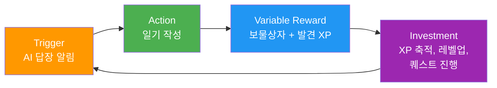
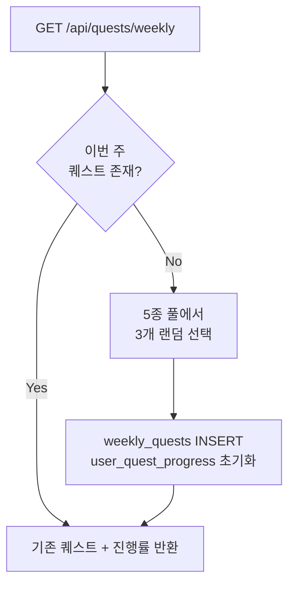
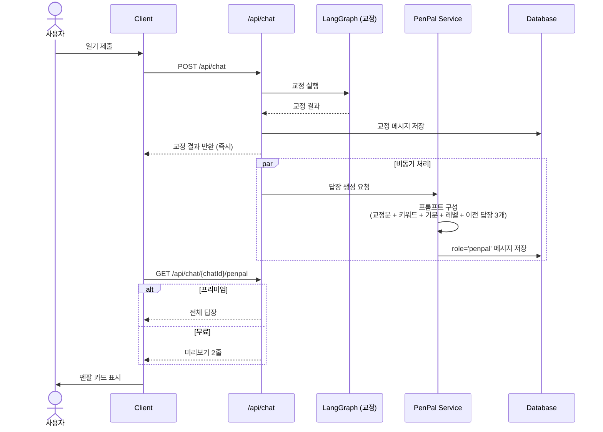
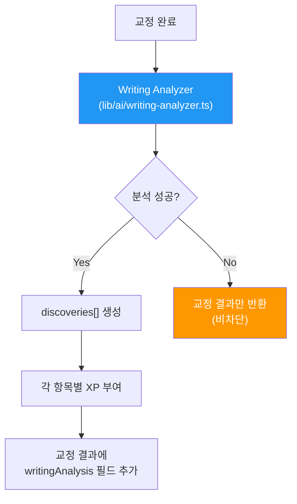
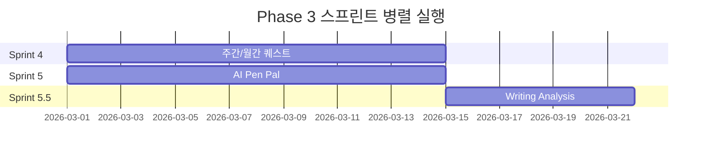

# Phase 3: Killer Feature — 게임성 완성 및 AI Pen Pal

| 항목 | 값 |
|------|-----|
| **버전** | 1.0.0 |
| **상태** | `대기` |
| **최종 수정일** | 2026-02-12 |
| **배포 버전** | v3.0-rc |
| **포함 스프린트** | Sprint 4 (Weekly & Monthly Quests) · Sprint 5 (AI Pen Pal) · Sprint 5.5 (Writing Analysis) |
| **선행 조건** | [Phase 1](./PHASE-1.md) 완료 (XP 시스템) · [Phase 2](./PHASE-2.md) 완료 (Streak Freeze, 보물상자) |
| **관련 문서** | [PHASE-2.md](./PHASE-2.md) · [PHASE-4.md](./PHASE-4.md) · [AI-SYSTEM.md](../architecture/AI-SYSTEM.md) · [API-SPEC.md](../architecture/API-SPEC.md) · [CHAT-SEQUENCE.md](../architecture/CHAT-SEQUENCE.md) · [DATA-MODEL.md](../architecture/DATA-MODEL.md) |
| **기준 문서** | [gamification-strategy.md](../../docs_old/gamification-strategy.md) · [execution-plan.md](../../docs_old/execution-plan.md) |

---

## 목차

1. [Phase 목표](#1-phase-목표)
2. [범위 정의 (Scope)](#2-범위-정의-scope)
3. [Sprint 4 — Weekly & Monthly Quests](#3-sprint-4--weekly--monthly-quests)
4. [Sprint 5 — AI Pen Pal](#4-sprint-5--ai-pen-pal)
5. [Sprint 5.5 — Writing Analysis & Discovery Rewards](#5-sprint-55--writing-analysis--discovery-rewards)
6. [병렬 실행 가능 구간](#6-병렬-실행-가능-구간)
7. [데이터 모델 활용](#7-데이터-모델-활용)
8. [파일 영향 분석](#8-파일-영향-분석)
9. [완료 기준 (Definition of Done)](#9-완료-기준-definition-of-done)
10. [리스크 및 대응](#10-리스크-및-대응)
11. [배포 체크리스트](#11-배포-체크리스트)

---

## 1. Phase 목표

> **"'교정 도구'를 '교환 일기'로 전환하고, 장기 리텐션 메커니즘을 완성한다."**

Phase 3은 세 가지 독립적 기능으로 구성된다.

| 축 | 설명 | 핵심 가치 | Sprint |
|----|------|----------|--------|
| **게임성 완성** | 주간/월간 퀘스트로 "매일 일기" 외 부가 목표 | 목표 다양화 → 신선함 유지 | Sprint 4 |
| **킬러 피처** | AI Pen Pal — 교정 후 AI가 영어 답장 | "교정 도구" → "교환 일기" 전환 | Sprint 5 |
| **발견 보상** | Writing Analysis — 잘 쓴 점을 AI가 발견하여 보상 | "발견의 기쁨" 제공 | Sprint 5.5 |

### 사용자 체감 변화

```
Phase 2 (v3.0-beta)                     Phase 3 (v3.0-rc)
┌─────────────────────────────┐         ┌──────────────────────────────────────────────┐
│ 일기 → 교정 → 보물상자 → 끝│   →    │ 일기 → 교정 → 보물상자 → AI 답장 도착!      │
│ 매일 같은 루틴              │         │ 주간 퀘스트 3개 + 월간 챌린지                 │
│ "뭘 쓰지?" 고민             │         │ "AI 친구가 물어본 질문에 답해야지"            │
│ 교정 결과만 확인            │         │ "오늘 자연스러운 표현을 썼다!" 발견 XP       │
└─────────────────────────────┘         └──────────────────────────────────────────────┘
```

### 핵심 전환 — Hook Model 완성



---

## 2. 범위 정의 (Scope)

### In-Scope

| 카테고리 | 항목 |
|----------|------|
| 주간 퀘스트 | 5종 풀에서 3개 자동 선택 (lazy generation), 진행률 추적, 2/3 완료 시 보너스 |
| 월간 챌린지 | 테마 표현 10개 체크리스트, 3단계 보상 (5/8/10개) |
| AI Pen Pal | 교정 후 AI 답장 생성, 레벨별 난이도, 무료 2줄 미리보기, 프리미엄 전체 답장 |
| Writing Analysis | 교정 후 작성 분석 (좋은 표현/시제/복문 등 발견), 발견 XP 부여 |
| UI | 퀘스트 카드, 월간 챌린지 UI, 펜팔 카드, 작성 분석 카드 |

### Out-of-Scope

| 항목 | 담당 Phase |
|------|-----------|
| Freeze / 열쇠 / 부스터 유료 구매 (IAP) | [Phase 4](./PHASE-4.md) |
| 프리미엄 게이팅 전수 검증 | [Phase 4](./PHASE-4.md) |
| A/B 테스트 / 코호트 분석 | [Phase 4](./PHASE-4.md) |

---

## 3. Sprint 4 — Weekly & Monthly Quests

### 3.1 개요

| 항목 | 값 |
|------|-----|
| **목표** | 주간/월간 미니 목표로 "매일 일기" 외 부가 동기 부여 |
| **선행** | Phase 1 Sprint 1 (XP 시스템) |
| **Feature ID** | F6 |

### 3.2 주간 퀘스트 시스템

#### 생성 전략 — Lazy Generation

> Cron 의존성 제거. 사용자가 조회할 때 해당 주 퀘스트가 없으면 자동 생성.



#### 퀘스트 풀 (5종)

| 유형 | 예시 | 보상 | 추적 이벤트 |
|------|------|------|------------|
| 빈도 퀘스트 | "이번 주 5일 이상 일기 쓰기" | +150 XP | diary_submit |
| 챌린지 퀘스트 | "챌린지 단어 3개 이상 사용하기" | +100 XP | challenge_word_used |
| 표현 퀘스트 | "표현노트에 5개 이상 저장하기" | +80 XP | expression_save |
| 길이 퀘스트 | "50단어 이상 일기 2회 쓰기" | +120 XP | word_count_bonus |
| 완벽 퀘스트 | "오답 0개 일기 1회 달성하기" | +200 XP | perfect_diary |

#### 주간 보너스

- **조건**: 동일 주 3개 퀘스트 중 **2개 이상 완료**
- **보상**: weekly_bonus +100 XP
- **갱신**: 매주 월요일 00:00 KST

#### Free vs Premium

| 항목 | Free | Premium |
|------|------|---------|
| 활성 퀘스트 | 1개 (나머지 자물쇠) | 3개 전체 |
| 주간 보너스 | X | O (2/3 완료 시) |
| 월간 챌린지 | X | O |

### 3.3 월간 챌린지

| 항목 | 설명 |
|------|------|
| **구조** | 이번 달 테마 + 10개 표현 체크리스트 |
| **예시** | "2월 챌린지: 감정 표현 마스터" — grateful, frustrated, relieved, ... |
| **감지** | 일기에서 표현 사용 감지 → `used_expressions` 업데이트 |
| **보상** | 5/10 사용 → +200 XP, 8/10 → +400 XP, 10/10 → +600 XP + 특별 배지 |
| **제한** | **Premium only** |

### 3.4 태스크 목록

| # | 태스크 | 유형 | 상세 |
|---|--------|------|------|
| 4-1 | 주간 퀘스트 생성 | Backend | `lib/gamification/quest-scheduler.ts`: lazy generation — 5종 풀에서 3개 선택 → weekly_quests INSERT |
| 4-2 | 퀘스트 진행률 추적 | Backend | `lib/gamification/quest-tracker.ts`: 이벤트 시 current_count 갱신, target_count 도달 → completed + XP 부여 |
| 4-3 | 주간 보너스 판정 | Backend | 동일 주 3개 중 2개+ 완료 시 weekly_bonus +100 XP |
| 4-4 | 월간 챌린지 데이터 | Backend | monthly_challenges 시드 데이터 관리, 표현 사용 감지 |
| 4-5 | 퀘스트 API | Backend | `GET /api/quests/weekly`, `GET /api/quests/monthly` |
| 4-6 | 이벤트 통합 | Backend | chat route, vocabulary route에서 quest-tracker 호출 |
| 4-7 | 퀘스트 목록 UI | Frontend | 활성 퀘스트 카드 (설명 + 진행 바 + XP 보상). 무료: 자물쇠 |
| 4-8 | 퀘스트 완료 연출 | Frontend | XP 획득 애니메이션 + 체크마크 |
| 4-9 | 주간 보너스 연출 | Frontend | "주간 보너스 +100 XP" 배너 |
| 4-10 | 월간 챌린지 UI | Frontend | 테마 + 10개 표현 체크리스트 |

---

## 4. Sprint 5 — AI Pen Pal

### 4.1 개요

| 항목 | 값 |
|------|-----|
| **목표** | 교정 이후 AI 친구가 영어 답장을 보내는 킬러 피처. "교정 도구" → "교환 일기" 전환 |
| **선행** | Sprint 0 (messages role 'penpal'), Sprint 1 (레벨 기반 난이도) |
| **Feature ID** | F7 |

### 4.2 컨셉

> **"일기를 쓰면, AI가 답장을 보낸다."**

```
사용자 일기                         AI Pen Pal 답장
┌──────────────────────────┐       ┌──────────────────────────────────────┐
│ Today I ate ramen for    │       │ Oh, I love ramen too! 🍜            │
│ lunch. It was so hot but │  →   │ There's nothing better than hot      │
│ delicious.               │       │ soup on a cold day. Do you have a   │
│                          │       │ favorite topping?                    │
└──────────────────────────┘       └──────────────────────────────────────┘
        ↓ 교정                              ↓ 답장
 교정 결과 표시                     "편지 봉투" 카드로 표시
```

### 4.3 기존 방식 vs AI Pen Pal

| 기존 일기 앱 | Daily English + AI Pen Pal |
|-------------|---------------------------|
| 쓰기 → 교정 → **끝** | 쓰기 → 교정 → **답장 읽기** → **답장에 답하기(다음 일기)** |
| 일방향 | **쌍방향 루프** |
| "오늘 뭘 쓰지?" 고민 | "어제 AI가 물어본 질문에 답해야지" |
| 학습 도구 느낌 | **친구와 대화하는 느낌** |

### 4.4 답장 생성 규칙

| 항목 | 규칙 |
|------|------|
| 생성 시점 | 교정 결과 반환 직후, 비동기 생성 (교정 차단 불가) |
| AI 모델 | Gemini 2.0 Flash (비용 효율) |
| 길이 | 사용자 일기의 50–80% 길이 |
| 난이도 | 레벨별: Lv.1–10 간단한 문장, Lv.11+ 다양한 표현 |
| 한국어 비율 | 레벨에 따라 0–30% (핵심 어휘만 괄호 안 병기) |
| 톤 | 친근한 친구. 격식 없이, 이모티콘 적절히 사용 |
| 내용 구조 | 공감(1문장) + 자기 이야기/의견(1–2문장) + 질문(1문장) |
| 맥락 기억 | 이전 penpal 메시지 최근 3개를 프롬프트에 포함 |
| 타임아웃 | 15초 (교정 60초와 별도) |
| 실패 처리 | 답장 생성 실패 시 교정은 정상 반환 (비차단 원칙) |

### 4.5 답장 생성 시퀀스



### 4.6 과금 설계

| 플랜 | 답장 접근 | UI |
|------|----------|-----|
| **무료** | 미리보기 2줄만 | 첫 2줄 + 나머지 블러 + "전체 답장은 프리미엄에서" CTA |
| **프리미엄** | 전체 답장 | 전체 답장 표시 + 답장 내 표현 탭 → 표현노트 저장 |

> **과금 트리거 심리**: 사용자는 이미 일기를 쓰고 교정을 받은 상태. "AI 친구의 답장"이 흐릿하게 보이는 상황. Sunk Cost + 즉각적 보상 기대 → 전환.

### 4.7 태스크 목록

| # | 태스크 | 유형 | 상세 |
|---|--------|------|------|
| 5-1 | Pen Pal 프롬프트 설계 | AI | 시스템 프롬프트: 친근한 친구 톤. 공감 + 이야기 + 질문 구조 |
| 5-2 | Pen Pal 생성 Service | Backend | `lib/ai/penpal.ts`: 교정 결과 + 원문 + 이전 답장 3개 + 레벨 → Gemini API |
| 5-3 | 교정 Flow 연동 | Backend | `app/api/chat/route.ts`: 교정 완료 후 비동기 Pen Pal 생성. 실패 시 교정 정상 반환 |
| 5-4 | 맥락 기억 | Backend | 이전 penpal 메시지 최근 3개 프롬프트 포함. learning_preferences 반영 |
| 5-5 | Pen Pal API | Backend | `GET /api/chat/[chatId]/penpal`: 답장 조회. 무료: 2줄 미리보기 |
| 5-6 | 답장 UI (프리미엄) | Frontend | 교정 결과 하단 "편지 봉투" 카드, 전체 답장 표시 |
| 5-7 | 답장 미리보기 (무료) | Frontend | 첫 2줄 + 나머지 블러 + 프리미엄 CTA |
| 5-8 | 답장 내 표현 저장 | Frontend | 프리미엄: 답장에서 모르는 표현 탭 → 뜻 확인 + 표현노트 저장 |
| 5-9 | 기록 상세 연동 | Frontend | `app/history/[id]/page.tsx`: 일기 + 교정 + AI 답장 "교환 일기" 형태 |

---

## 5. Sprint 5.5 — Writing Analysis & Discovery Rewards

### 5.1 개요

| 항목 | 값 |
|------|-----|
| **목표** | 사용자가 자연스럽게 쓴 일기에서 좋은 점을 AI가 발견하여 보상. "미션 달성"이 아닌 "발견의 기쁨" |
| **선행** | Phase 1 Sprint 1 (XP 시스템) |
| **핵심 원칙** | **비차단** — 분석 실패 시 교정은 정상 동작 |

### 5.2 발견 패턴 및 XP

| 발견 항목 | XP | 설명 |
|----------|-----|------|
| 새로운 표현 사용 | +5~15 | 표현노트에 없던 고급 어휘 |
| 다양한 시제 사용 | +10 | 과거/현재/미래/완료 등 |
| 복문 구조 사용 | +15 | 접속사, 관계절 등 |
| 자연스러운 연결어 | +10 | however, therefore, meanwhile 등 |
| 관용 표현 사용 | +10 | idiom, phrasal verb 등 |

### 5.3 분석 Flow



### 5.4 UI 표시

```
┌──────────────────────────────────────┐
│ ✨ 오늘의 작성 분석                   │
│                                      │
│ 🎯 새로운 표현 발견! +15 XP          │
│    "even though" — 양보절을 잘 썼어요 │
│                                      │
│ 📚 다양한 시제 사용! +10 XP          │
│    과거/현재/미래 3가지 시제를 사용    │
│                                      │
│ 🔗 자연스러운 연결어! +10 XP          │
│    "however"를 사용하여 문장 연결     │
│                                      │
│ 총 발견 XP: +35 XP                   │
└──────────────────────────────────────┘
```

> 각 발견 항목이 **순차적으로 나타나는 연출** (0.3초 간격)

### 5.5 태스크 목록

| # | 태스크 | 유형 | 상세 |
|---|--------|------|------|
| 5.5-1 | 작성 분석 Service | Backend | `lib/ai/writing-analyzer.ts`: 교정 결과 분석, 좋은 점 발견 |
| 5.5-2 | 발견 기반 XP 부여 | Backend | 발견 항목별 XP 부여 (XP Service 연동) |
| 5.5-3 | 분석 결과 구조 설계 | Backend | 교정 결과에 `writingAnalysis` 필드 추가. discoveries[] 배열 |
| 5.5-4 | 작성 분석 카드 UI | Frontend | "오늘의 작성 분석" 카드 (발견 항목 + 획득 XP) |
| 5.5-5 | 발견 애니메이션 | Frontend | 순차 등장 연출 (0.3초 간격) |
| 5.5-6 | 분석 실패 처리 | Backend | 분석 실패 시 교정 정상 동작 (비차단) |

---

## 6. 병렬 실행 가능 구간

> Sprint 의존성 분석 결과, 아래 병렬 실행이 가능하다.



| 구간 | 병렬 가능 여부 | 근거 |
|------|---------------|------|
| Sprint 4 ↔ Sprint 5 | **O** (병렬 가능) | 상호 독립적. 퀘스트와 Pen Pal은 서로 의존하지 않음 |
| Sprint 5 → Sprint 5.5 | **X** (순차 필수) | Writing Analysis는 교정 Flow 수정에 의존, Sprint 5와 동일 파일 수정 |

---

## 7. 데이터 모델 활용

> Phase 1에서 생성한 테이블을 Phase 3에서 활용한다.

### 7.1 Sprint 4 — 퀘스트 테이블

| 테이블 | 용도 |
|--------|------|
| `weekly_quests` | 주간 퀘스트 정의 (quest_type, target_count, reward_xp, week_start) |
| `user_quest_progress` | 진행률 추적 (current_count, is_completed, completed_at) |
| `monthly_challenges` | 월간 챌린지 정의 (theme, expressions[], month) |
| `user_challenge_progress` | 챌린지 진행률 (used_expressions[], reward_tier) |

### 7.2 Sprint 5 — Pen Pal 메시지

| 테이블 | 컬럼 | 용도 |
|--------|------|------|
| `messages` | role = 'penpal' | AI Pen Pal 답장 저장 (Phase 1 Sprint 0에서 enum 추가 완료) |

> **상세 스키마**: [DATA-MODEL.md](../architecture/DATA-MODEL.md) · [01-TABLE-DEFINITIONS.md](../architecture/db-schema/01-TABLE-DEFINITIONS.md)

---

## 8. 파일 영향 분석

### 8.1 수정 파일

```
app/api/chat/route.ts                — Pen Pal 비동기 생성 + Writing Analysis 통합
app/api/vocabulary/route.ts          — quest-tracker 호출 (표현 퀘스트)
app/history/[id]/page.tsx            — "교환 일기" 뷰 (일기 + 교정 + AI 답장)
lib/ai/graph.ts                      — writingAnalysis 필드 추가
```

### 8.2 신규 파일

```
# Sprint 4
lib/gamification/quest-scheduler.ts        — 퀘스트 생성/조회 (lazy)
lib/gamification/quest-tracker.ts          — 진행률 추적
app/api/quests/weekly/route.ts             — 주간 퀘스트 API
app/api/quests/monthly/route.ts            — 월간 챌린지 API
components/gamification/quest-card.tsx      — 퀘스트 카드
components/gamification/quest-list.tsx      — 퀘스트 목록
components/gamification/monthly-challenge.tsx — 월간 챌린지 UI

# Sprint 5
lib/ai/penpal.ts                           — Pen Pal 생성 서비스
app/api/chat/[chatId]/penpal/route.ts      — Pen Pal 조회 API
components/penpal/penpal-card.tsx           — 답장 카드
components/penpal/penpal-teaser.tsx         — 무료 미리보기

# Sprint 5.5
lib/ai/writing-analyzer.ts                 — 작성 분석 서비스
components/diary/writing-analysis.tsx       — 작성 분석 카드
```

---

## 9. 완료 기준 (Definition of Done)

### Sprint 4 — Weekly & Monthly Quests

- [ ] 매주 퀘스트 3개 자동 생성 (lazy generation)
- [ ] 교정/표현노트 저장 시 퀘스트 진행률 자동 갱신
- [ ] 무료: 1개만 활성, 프리미엄: 3개 + 월간
- [ ] 주간 보너스 (2/3 완료 → +100 XP)
- [ ] 퀘스트 UI + 진행 바 + 완료 연출

### Sprint 5 — AI Pen Pal

- [ ] 교정 후 AI 답장 자동 생성 (비동기, 15초 타임아웃)
- [ ] 공감 + 이야기 + 질문 구조
- [ ] 레벨 기반 영어 난이도
- [ ] 이전 답장 3개 맥락 기억
- [ ] 무료: 2줄 미리보기 + 블러
- [ ] 프리미엄: 전체 답장 + 표현 탭 저장
- [ ] 기록 상세에서 교환 일기 표시

### Sprint 5.5 — Writing Analysis

- [ ] 교정 후 작성 분석 자동 실행
- [ ] 5가지 이상 발견 패턴 구현
- [ ] 발견 항목별 XP 부여
- [ ] 작성 분석 카드 UI 표시
- [ ] 분석 실패 시 교정 정상 동작 (비차단 원칙)

---

## 10. 리스크 및 대응

| # | 리스크 | 영향 범위 | 대응 방안 |
|---|--------|----------|----------|
| R1 | Gemini API 비용 증가 (Pen Pal 추가 호출) | Sprint 5 | Pen Pal은 별도 호출. gemini-2.0-flash 사용으로 비용 최소화. 일일 호출량 모니터링 |
| R2 | Pen Pal 답장 품질 불균일 | Sprint 5 | 프롬프트 구조 강제 (공감+이야기+질문), 길이 제한 (원문의 50–80%), 답장 후 검증 |
| R3 | 주간 퀘스트 스케줄러 인프라 | Sprint 4 | Cron 대신 lazy generation (첫 조회 시 생성) 패턴으로 인프라 의존성 제거 |
| R4 | Writing Analysis 오탐 | Sprint 5.5 | 초기 보수적 패턴만 적용 (확실한 발견만 XP 부여), 데이터 기반 패턴 확장 |
| R5 | Pen Pal 생성 실패 | Sprint 5 | 비차단 원칙: 실패 시 교정 결과만 반환, 에러 로깅, 사용자 비노출 |

---

## 11. 배포 체크리스트

### v3.0-rc 배포 전

```
[ ] 주간 퀘스트 lazy generation 동작 확인
[ ] 퀘스트 진행률 자동 갱신 (교정, 표현노트, 분량, 완벽 일기)
[ ] 무료/프리미엄 퀘스트 개수 차등 확인
[ ] AI Pen Pal 답장 생성 + 15초 타임아웃 동작
[ ] Pen Pal 비동기 실행 — 교정 응답 지연 없음 확인
[ ] 무료 사용자 답장 2줄 미리보기 + 블러
[ ] 프리미엄 사용자 전체 답장 + 표현 저장
[ ] Writing Analysis 발견 패턴 5종 동작
[ ] 분석 실패 시 교정 정상 반환 (비차단 원칙)
[ ] 기존 기능 회귀 테스트 (교정, XP, 레벨, 스트릭, Freeze, 보물상자)
[ ] npm run build — 에러 없음
[ ] Vercel 배포 후 Production 동작 확인
```

### 다음 Phase 연결

Phase 3 배포 후 [Phase 4: Optimization & Monetization](./PHASE-4.md)으로 진행. Phase 4에서는 5종 IAP 소모품 결제, 프리미엄 게이팅 전수 검증, 전체 통합 및 폴리시를 수행하여 **v3.0 정식 출시**한다.
