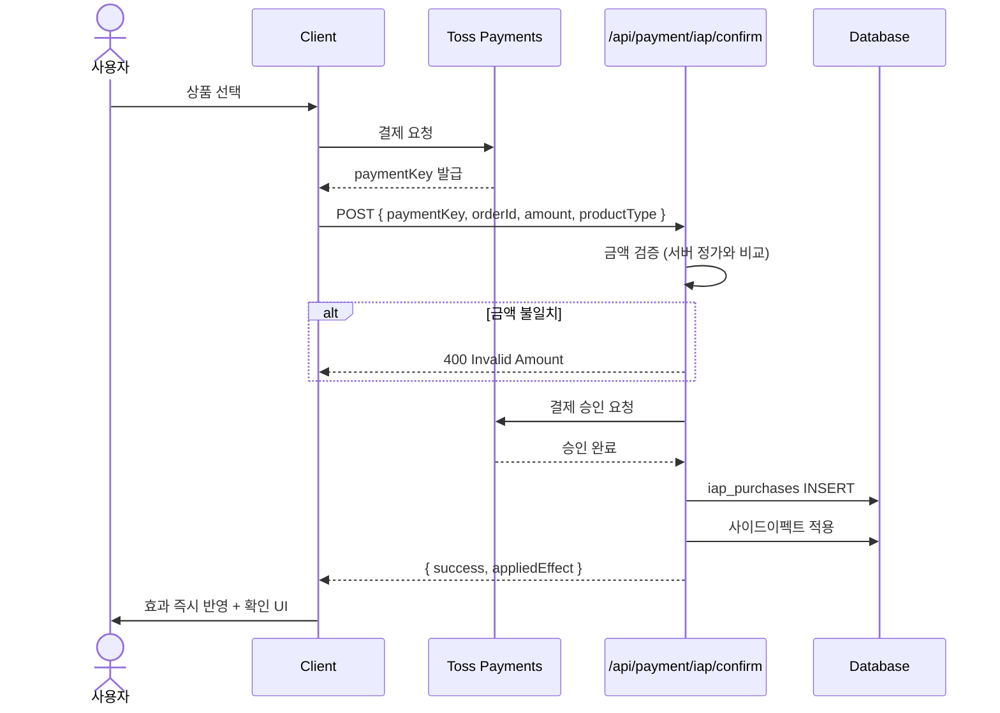
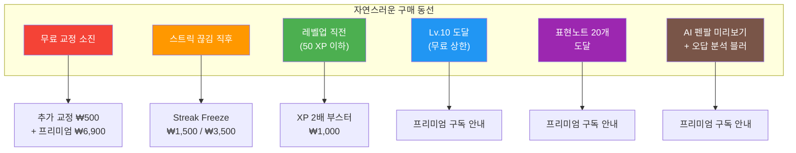
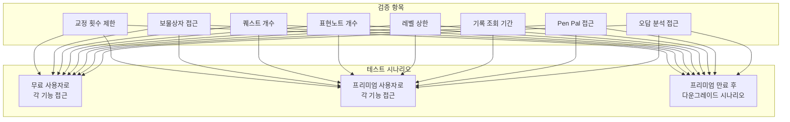
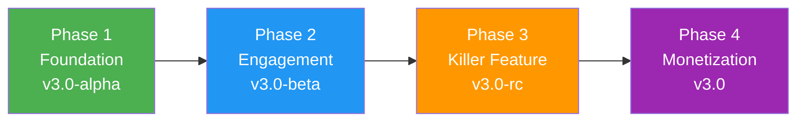

# Phase 4: Optimization & Monetization — 수익화 및 통합 폴리시

| 항목 | 값 |
|------|-----|
| **버전** | 1.0.0 |
| **상태** | `대기` |
| **최종 수정일** | 2026-02-12 |
| **배포 버전** | v3.0 (정식 출시) |
| **포함 스프린트** | Sprint 6 (IAP & Monetization) · Sprint 7 (Integration & Polish) |
| **선행 조건** | [Phase 1](./PHASE-1.md) · [Phase 2](./PHASE-2.md) · [Phase 3](./PHASE-3.md) 모두 완료 |
| **관련 문서** | [PHASE-3.md](./PHASE-3.md) · [API-SPEC.md](../architecture/API-SPEC.md) · [COMMON-SYSTEMS.md](../architecture/COMMON-SYSTEMS.md) · [DATA-MODEL.md](../architecture/DATA-MODEL.md) · [UI-DESIGN.md](../architecture/UI-DESIGN.md) |
| **기준 문서** | [PRD v3.0](../../docs_old/PRD.md) · [execution-plan.md](../../docs_old/execution-plan.md) · [gamification-strategy.md](../../docs_old/gamification-strategy.md) |

---

## 목차

1. [Phase 목표](#1-phase-목표)
2. [범위 정의 (Scope)](#2-범위-정의-scope)
3. [Sprint 6 — IAP & Monetization](#3-sprint-6--iap--monetization)
4. [Sprint 7 — Integration & Polish](#4-sprint-7--integration--polish)
5. [프리미엄 게이팅 전수 검증](#5-프리미엄-게이팅-전수-검증)
6. [데이터 모델 활용](#6-데이터-모델-활용)
7. [파일 영향 분석](#7-파일-영향-분석)
8. [완료 기준 (Definition of Done)](#8-완료-기준-definition-of-done)
9. [리스크 및 대응](#9-리스크-및-대응)
10. [배포 체크리스트](#10-배포-체크리스트)
11. [v3.0 전체 Phase 요약](#11-v30-전체-phase-요약)

---

## 1. Phase 목표

> **"수익화 엔진을 가동하고, 전체 기능을 통합 검증하여 v3.0을 정식 출시한다."**

Phase 4는 프로젝트의 최종 단계로, 두 가지 축으로 구성된다.

| 축 | 설명 | Sprint |
|----|------|--------|
| **수익화 (Monetize)** | 5종 IAP 소모품 결제 + 6개 과금 트리거 배치 | Sprint 6 |
| **통합 (Integrate)** | 프리미엄 게이팅 전수 검증, 비차단 원칙 검증, 엣지 케이스 처리, 전체 폴리시 | Sprint 7 |

### 사용자 체감 변화

```
Phase 3 (v3.0-rc)                       Phase 4 (v3.0 정식)
┌────────────────────────────────┐      ┌─────────────────────────────────────────────┐
│ 게이미피케이션 완성             │  →  │ IAP 상점 (Freeze, 부스터, 열쇠, 교정권)      │
│ 과금 동선 없음                 │      │ 6개 시점에 자연스러운 구매 동선               │
│ 일부 기능 게이팅 불완전        │      │ 13개 기능 Free/Pro 게이팅 완전 적용          │
│ 엣지 케이스 미처리             │      │ 전체 통합 테스트 + 비차단 원칙 검증          │
└────────────────────────────────┘      └─────────────────────────────────────────────┘
```

---

## 2. 범위 정의 (Scope)

### In-Scope

| 카테고리 | 항목 |
|----------|------|
| IAP 상품 | 5종 소모품 정의, 결제 API, 사이드이펙트 처리 |
| 과금 동선 | 6개 트리거 시점 모달/배너 배치 |
| 프리미엄 게이팅 | 13개 기능 전수 확인 (PRD 인증 정책 테이블 기준) |
| 비차단 원칙 | XP/스트릭/퀘스트/보물상자/Pen Pal 장애 시 교정 정상 동작 |
| 오답 분류 | 3-category + sub_type 체계 + Pro 게이팅 |
| 무료 제한 | 기록 7일, 표현노트 20개 |
| 전체 폴리시 | 프로필 통합, 캘린더 업데이트, 에러 처리, 게스트 모드, API 타임아웃 |
| 가격 페이지 | Free vs Premium 비교표 + IAP 상품 목록 |

### Out-of-Scope (v3.0 이후)

| 항목 | 시기 |
|------|------|
| A/B 테스트 (가격, 무료 횟수, 보상 확률) | v3.1+ |
| 코호트 분석 기반 최적화 | v3.1+ |
| Push Notification (앱 전환 시) | v3.2+ |
| B2B 단체 구독 | v4.0+ |

---

## 3. Sprint 6 — IAP & Monetization

### 3.1 개요

| 항목 | 값 |
|------|-----|
| **목표** | 5종 IAP 소모품 결제 + 6개 과금 트리거 시점에 자연스러운 구매 동선 배치 |
| **선행** | Sprint 1–5 (IAP 상품에 해당하는 모든 기능 존재) |
| **Feature ID** | F12 확장 |

### 3.2 IAP 상품 정의

| 상품 | product_type | 가격 | 효과 | 심리적 트리거 |
|------|-------------|------|------|--------------|
| Streak Freeze x1 | `streak_freeze_1` | ₩1,500 | 하루 빠져도 스트릭 유지 | "30일 스트릭을 ₩1,500에 지킬 수 있다면?" — 손실 회피 |
| Streak Freeze x3 | `streak_freeze_3` | ₩3,500 | 3회분 묶음 (16% 할인) | 번들 할인 효과 |
| XP 2배 부스터 (24h) | `xp_booster_24h` | ₩1,000 | 24시간 모든 XP 2배 | 레벨업 직전의 조급함 |
| 보물상자 열쇠 x5 | `chest_key_5` | ₩2,500 | 보물상자 5회 추가 오픈 | 수집욕 (희귀 표현, 레어 칭호) |
| 추가 교정 1회 | `extra_correction` | ₩500 | 당일 교정 1회 추가 | "오늘 한 번만 더" |

> **핵심 수익 아이템**: Streak Freeze. Duolingo 사례에서 IAP 매출의 30% 이상을 차지하는 것으로 알려져 있다.

### 3.3 IAP 결제 Flow



### 3.4 사이드이펙트 처리

| product_type | 사이드이펙트 함수 | DB 변경 |
|-------------|-----------------|---------|
| `streak_freeze_1` | `applyStreakFreeze(userId, 1)` | `user_profiles.streak_freeze_count` +1 |
| `streak_freeze_3` | `applyStreakFreeze(userId, 3)` | `user_profiles.streak_freeze_count` +3 |
| `xp_booster_24h` | `applyXpBooster(userId)` | `user_profiles.xp_booster_expires_at` = now + 24h |
| `chest_key_5` | `applyChestKeys(userId, 5)` | `user_profiles.chest_key_count` +5 |
| `extra_correction` | `applyExtraCorrection(userId)` | `daily_usage.bonus_count` +1 |

> **구현 위치**: `lib/payment/iap-effects.ts`

### 3.5 과금 트리거 동선 — 6개 시점



| # | 시점 | 트리거 | 제시 상품 | 구현 위치 |
|---|------|--------|----------|----------|
| 1 | 무료 교정 소진 | "오늘의 교정을 다 썼어요" 모달 | 추가 교정 ₩500 (원버튼) + 프리미엄 ₩6,900 (하단) | `components/payment/iap-modal.tsx` |
| 2 | 스트릭 끊김 직후 | "스트릭이 리셋됐어요" 배너 | Streak Freeze ₩1,500 / ₩3,500 묶음 | `components/payment/trigger-banner.tsx` |
| 3 | 레벨업 직전 | "레벨 N까지 50 XP 남았어요!" | XP 2배 부스터 ₩1,000 | `components/payment/trigger-banner.tsx` |
| 4 | Lv.10 도달 | "더 높은 레벨에 도전하세요" | 프리미엄 구독 | `components/gamification/level-cap-modal.tsx` |
| 5 | 표현노트 20개 | "표현노트가 가득 찼어요" | 프리미엄 구독 | `components/payment/upgrade-modal.tsx` |
| 6 | 펜팔/오답 블러 | 흐릿한 콘텐츠 + CTA | 프리미엄 구독 | `components/penpal/penpal-teaser.tsx` 등 |

### 3.6 태스크 목록

| # | 태스크 | 유형 | 상세 |
|---|--------|------|------|
| 6-1 | IAP 상품 정의 | Backend | `lib/payment/iap-products.ts`: 5종 상품 정의 (product_type, 정가, 효과). 서버 금액 검증 상수 |
| 6-2 | IAP 결제 API | Backend | `POST /api/payment/iap/confirm`: Toss 승인 → 금액 검증 → iap_purchases INSERT → 사이드이펙트 |
| 6-3 | 사이드이펙트 처리 | Backend | `lib/payment/iap-effects.ts`: 상품별 적용 함수 4종 |
| 6-4 | 교정 소진 모달 | Frontend | "오늘의 교정을 다 썼어요" + 추가 교정 ₩500 원버튼 + 프리미엄 하단 |
| 6-5 | Streak 위기 배너 | Frontend | 스트릭 리셋 직후 Freeze 구매 배너 |
| 6-6 | XP 부스터 배너 | Frontend | 레벨업 직전 "XP 2배 부스터 ₩1,000" |
| 6-7 | 보물상자 열쇠 구매 | Frontend | 보물상자 이력 화면에서 "열쇠 5개 ₩2,500" 구매 버튼 |
| 6-8 | 프리미엄 안내 통합 | Frontend | 6개 트리거 시점 → 프리미엄 안내 모달 통합 |
| 6-9 | 가격 페이지 업데이트 | Frontend | Free vs Premium 비교표 + IAP 상품 목록 |

---

## 4. Sprint 7 — Integration & Polish

### 4.1 개요

| 항목 | 값 |
|------|-----|
| **목표** | 전체 기능 통합, 프리미엄 게이팅 일관성, 성능 최적화, 엣지 케이스 처리 |
| **선행** | Sprint 0–6 전체 |

### 4.2 태스크 목록

| # | 태스크 | 유형 | 상세 |
|---|--------|------|------|
| 7-1 | 프리미엄 게이팅 검증 | QA | PRD "인증 정책" 테이블 대비 13개 기능 전수 확인 |
| 7-2 | 비차단 원칙 검증 | QA | XP/스트릭/퀘스트/보물상자/Pen Pal 장애 시 교정 정상 동작 확인 |
| 7-3 | 오답 분류 업데이트 | Backend | AI 프롬프트: 3-category + sub_type 체계. mistakes.ts: 새 분류 저장/조회 |
| 7-4 | 오답 분석 Pro 게이팅 | Full-stack | 무료: "이 실수 N번" 티저 + 인사이트 블러. 프리미엄: 전체 인사이트 |
| 7-5 | 기록 조회 7일 제한 | Backend | `GET /api/history`: 무료 최근 7일만 반환 + 7일 초과 안내 |
| 7-6 | 표현노트 20개 제한 | Backend | `POST /api/vocabulary`: 무료 사용자 20개 초과 시 거부 + 안내 |
| 7-7 | 프로필 페이지 통합 | Frontend | XP/레벨/칭호 + Freeze 보유 + 열쇠 보유 + 구독 상태 + 학습 목표 한 화면 |
| 7-8 | 캘린더 뷰 업데이트 | Frontend | chats 테이블 새 컬럼 (mood, word_count) 반영 |
| 7-9 | 에러 처리 통합 | Backend | 모든 gamification API try-catch + 비차단 fallback + 한국어 메시지 |
| 7-10 | 게스트 모드 정리 | Full-stack | 비인증 사용자: 교정 1회 (기록 미저장), XP/스트릭/퀘스트/보물상자/Pen Pal 불가 |
| 7-11 | API 타임아웃 정리 | Backend | 교정 60초, Pen Pal 15초, AI 보강 5초 |

---

## 5. 프리미엄 게이팅 전수 검증

> Sprint 7-1의 핵심 작업. PRD v3.0 인증 정책 테이블 기준으로 전수 확인.

### 5.1 Free vs Premium 기능 비교

| # | 기능 | Free | Premium |
|---|------|------|---------|
| 1 | 일일 교정 | 1회/일 | 무제한 |
| 2 | 보물상자 | X (블러 티저) | 매일 1회 |
| 3 | 주간 퀘스트 | 1개만 활성 | 3개 전체 |
| 4 | 월간 챌린지 | X | O |
| 5 | 표현노트 | 최대 20개 | 무제한 |
| 6 | 레벨 시스템 | Lv.10 상한 | 상한 없음 |
| 7 | Streak Freeze | 보물상자에서만 (Premium 시) | 월 2개 자동 지급 |
| 8 | AI Pen Pal 답장 | 2줄 미리보기 | 전체 답장 |
| 9 | 오답 분석 | "N번 틀림" 티저 | 전체 인사이트 |
| 10 | 기록 조회 | 최근 7일 | 전체 |
| 11 | 적응형 교정 | O (Lv.10까지) | O (전체 레벨) |
| 12 | 답장 내 표현 저장 | X | O |
| 13 | 작성 분석 | O | O |

### 5.2 검증 매트릭스



### 5.3 비차단 원칙 검증 항목

> **원칙**: 부가 기능(XP, 스트릭, 퀘스트, 보물상자, Pen Pal, Writing Analysis)에 장애가 발생해도 **교정 기능은 반드시 정상 동작**해야 한다.

| # | 장애 시나리오 | 기대 동작 |
|---|-------------|----------|
| 1 | XP Service 오류 | 교정 정상 반환, XP 미부여 (로깅) |
| 2 | Streak Manager 오류 | 교정 정상 반환, 스트릭 미갱신 (로깅) |
| 3 | Quest Tracker 오류 | 교정 정상 반환, 퀘스트 미갱신 (로깅) |
| 4 | Treasure Chest 오류 | 교정 정상 반환, 보물상자 미오픈 (로깅) |
| 5 | Pen Pal 생성 실패 | 교정 정상 반환, 답장 미생성 (로깅) |
| 6 | Writing Analyzer 오류 | 교정 정상 반환, 분석 미표시 (로깅) |

---

## 6. 데이터 모델 활용

### 6.1 Sprint 6 — IAP 테이블

| 테이블 | 용도 |
|--------|------|
| `iap_purchases` | IAP 구매 이력 (product_type, payment_key, amount, created_at) |
| `daily_usage.bonus_count` | 추가 교정 횟수 관리 |

### 6.2 Sprint 7 — 기존 테이블 제약 적용

| 테이블 | 변경 | 설명 |
|--------|------|------|
| `messages` (history API) | 쿼리 수정 | 무료 사용자: `WHERE created_at >= now() - 7 days` |
| `vocabulary` (POST API) | 카운트 검증 | 무료 사용자: `COUNT(*) < 20` 확인 |
| `user_mistakes` | 프롬프트 수정 | 3-category + sub_type 분류 체계 |

> **상세 스키마**: [DATA-MODEL.md](../architecture/DATA-MODEL.md) · [01-TABLE-DEFINITIONS.md](../architecture/db-schema/01-TABLE-DEFINITIONS.md)

---

## 7. 파일 영향 분석

### 7.1 수정 파일

```
# Sprint 6
app/pricing/page.tsx                 — Free vs Premium 비교표 + IAP 목록

# Sprint 7
app/api/history/route.ts             — 무료 7일 제한
app/api/vocabulary/route.ts          — 무료 20개 제한
lib/db/mistakes.ts                   — 3-category + sub_type
lib/ai/graph.ts                      — 오답 분류 프롬프트 업데이트
app/api/chat/route.ts                — 비차단 원칙 try-catch 강화
components/calendar/calendar-view.tsx — mood, word_count 반영
```

### 7.2 신규 파일

```
# Sprint 6
lib/payment/iap-products.ts             — IAP 상품 정의 + 정가 상수
lib/payment/iap-effects.ts              — 사이드이펙트 처리 함수
app/api/payment/iap/confirm/route.ts    — IAP 결제 승인 API
components/payment/iap-modal.tsx         — IAP 구매 모달
components/payment/trigger-banner.tsx    — 과금 트리거 배너
```

---

## 8. 완료 기준 (Definition of Done)

### Sprint 6 — IAP & Monetization

- [ ] 5종 IAP 결제 → Toss 승인 → 효과 즉시 적용
- [ ] 서버 금액 검증 동작 (정가 불일치 시 거부)
- [ ] 6개 과금 트리거 시점에 자연스러운 구매 동선
- [ ] iap_purchases 트랜잭션 기록
- [ ] 가격 페이지 업데이트 (비교표 + IAP)

### Sprint 7 — Integration & Polish

- [ ] 인증 정책 테이블 전수 확인 통과 (13개 기능)
- [ ] 비차단 원칙 검증 통과 (6개 시나리오)
- [ ] 오답 3-category + sub_type 체계 동작
- [ ] 무료 기록 7일 제한 동작
- [ ] 무료 표현노트 20개 제한 동작
- [ ] 프로필 전체 인벤토리 표시 (XP/레벨/칭호/Freeze/열쇠/구독)
- [ ] 게스트 모드 접근 제어 (교정만 가능, 나머지 차단)
- [ ] API 타임아웃 정리 (교정 60초, Pen Pal 15초, AI 보강 5초)
- [ ] `npm run build` 에러 없음

---

## 9. 리스크 및 대응

| # | 리스크 | 영향 범위 | 대응 방안 |
|---|--------|----------|----------|
| R1 | IAP 결제 검증 보안 | Sprint 6 | 서버 금액 검증 필수. product_type별 정가와 불일치 시 거부. 결제 로그 전수 기록 |
| R2 | 프리미엄 만료 후 다운그레이드 | Sprint 7 | 만료 시 Free 정책 자동 적용. 기존 저장 데이터(표현노트 21개+)는 유지하되 추가 저장 차단 |
| R3 | 과금 트리거 과도 노출 | Sprint 6 | 동일 세션 내 동일 트리거 1회만 표시. 사용자 경험 우선 |
| R4 | 비차단 원칙 위반 | Sprint 7 | 모든 gamification 호출을 try-catch로 감싸고, catch에서 로깅만 수행. 교정 결과 반환 차단 금지 |

---

## 10. 배포 체크리스트

### v3.0 정식 출시 전

```
# IAP & 결제
[ ] 5종 IAP 상품 Toss 결제 E2E 테스트
[ ] 서버 금액 검증 (정가 불일치 → 거부)
[ ] 사이드이펙트 적용 확인 (Freeze/부스터/열쇠/교정권)
[ ] 과금 트리거 6개 시점 동작 확인

# 프리미엄 게이팅
[ ] Free/Premium 13개 기능 전수 테스트
[ ] 프리미엄 만료 → Free 다운그레이드 시나리오
[ ] 게스트 모드 접근 제어

# 비차단 원칙
[ ] XP Service 오류 시 교정 정상 반환
[ ] Streak Manager 오류 시 교정 정상 반환
[ ] Quest Tracker 오류 시 교정 정상 반환
[ ] Treasure Chest 오류 시 교정 정상 반환
[ ] Pen Pal 생성 실패 시 교정 정상 반환
[ ] Writing Analyzer 오류 시 교정 정상 반환

# 통합
[ ] 전체 기능 회귀 테스트
[ ] API 타임아웃 설정 확인
[ ] npm run build — 에러 없음
[ ] Vercel 배포 후 Production 동작 확인
```

---

## 11. v3.0 전체 Phase 요약

### 4-Phase 로드맵 전체 구조



### Phase × Sprint × Feature 매핑

| Phase | Sprint | 배포 | 핵심 Feature | 상태 |
|-------|--------|------|-------------|------|
| **Phase 1** | Sprint 0 | v3.0-alpha | DB 마이그레이션, 코드 정리, 정책 변경, 입력 검증 | `완료` |
| | Sprint 1 | | XP & 레벨 시스템, 적응형 프롬프트, 레벨업 UI | `진행중` |
| **Phase 2** | Sprint 2 | v3.0-beta | Streak Freeze, Comeback Bonus | `대기` |
| | Sprint 3 | | 보물상자, 무료 교정 3→1 | `대기` |
| **Phase 3** | Sprint 4 | v3.0-rc | 주간/월간 퀘스트 | `대기` |
| | Sprint 5 | | AI Pen Pal | `대기` |
| | Sprint 5.5 | | Writing Analysis | `대기` |
| **Phase 4** | Sprint 6 | v3.0 | IAP 5종 결제, 과금 동선 | `대기` |
| | Sprint 7 | | 통합 폴리시, 게이팅 검증 | `대기` |

### Feature → Sprint 역매핑

| Feature | Sprint | Phase |
|---------|--------|-------|
| F1: 일기 & AI 교정 | Sprint 0 (입력 검증, 분량 보상) | Phase 1 |
| F3: XP & 레벨 | Sprint 1 | Phase 1 |
| F4: 스트릭 & 위기 구제 | Sprint 2 | Phase 2 |
| F5: 보물상자 | Sprint 3 | Phase 2 |
| F6: 주간/월간 퀘스트 | Sprint 4 | Phase 3 |
| F7: AI Pen Pal | Sprint 5 | Phase 3 |
| F8: 표현노트 (20개 제한) | Sprint 7 | Phase 4 |
| F9: 오답 분석 (Pro 게이팅) | Sprint 7 | Phase 4 |
| F10: 캘린더 (새 컬럼) | Sprint 7 | Phase 4 |
| F11: 기록 조회 (7일 제한) | Sprint 7 | Phase 4 |
| F12: 프리미엄 & IAP | Sprint 0 (가격) + Sprint 6 (IAP) | Phase 1 + 4 |
| F13: 프로필 | Sprint 1 (XP) + Sprint 7 (통합) | Phase 1 + 4 |

### 예상 지표 목표 (전략 적용 후)

| 지표 | 현재 예상 | v3.0 목표 |
|------|----------|----------|
| D1 Retention | ~40% | 60%+ |
| D7 Retention | ~15% | 35%+ |
| D30 Retention | ~5% | 20%+ |
| Free → Premium 전환율 | ~1–2% | 5–8% |
| ARPPU | ₩9,900 | ₩12,000+ |
| 일일 작성 비율 (DAU/MAU) | ~10% | 25%+ |
