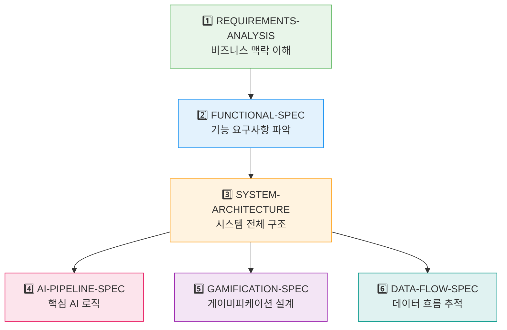

# 기술 명세 문서 인덱스 (Technical Specification Index)

| 항목 | 값 |
|------|-----|
| **버전** | 1.0.0 |
| **상태** | `완료` |
| **최종 수정일** | 2026-02-12 |
| **대상 독자** | 개발자, 테크니컬 PM, 아키텍트 |

---

## 문서 구조

```
docs/spec/
├── INDEX.md .......................... 본 문서 (탐색 가이드)
├── project/
│   ├── REQUIREMENTS-ANALYSIS.md ..... 요구사항 분석
│   └── FUNCTIONAL-SPEC.md ........... 기능 명세서
└── system/
    ├── SYSTEM-ARCHITECTURE.md ....... 시스템 아키텍처 총괄
    ├── AI-PIPELINE-SPEC.md .......... AI 파이프라인 명세
    ├── GAMIFICATION-SPEC.md ......... 게이미피케이션 시스템 명세
    └── DATA-FLOW-SPEC.md ............ 데이터 흐름 명세
```

---

## 문서 매트릭스

| 문서 | 범위 | 핵심 질문 | 관련 문서 |
|------|------|----------|----------|
| [REQUIREMENTS-ANALYSIS](./project/REQUIREMENTS-ANALYSIS.md) | 비즈니스/사용자 | "무엇을 만드는가?" | FUNCTIONAL-SPEC |
| [FUNCTIONAL-SPEC](./project/FUNCTIONAL-SPEC.md) | 기능/동작 | "어떻게 동작하는가?" | REQUIREMENTS-ANALYSIS, API-SPEC |
| [SYSTEM-ARCHITECTURE](./system/SYSTEM-ARCHITECTURE.md) | 시스템 설계 | "어떻게 구성되는가?" | DATA-FLOW-SPEC, AI-PIPELINE-SPEC |
| [AI-PIPELINE-SPEC](./system/AI-PIPELINE-SPEC.md) | AI 처리 | "AI가 어떻게 교정하는가?" | SYSTEM-ARCHITECTURE, GAMIFICATION-SPEC |
| [GAMIFICATION-SPEC](./system/GAMIFICATION-SPEC.md) | 게이미피케이션 | "사용자를 어떻게 유지하는가?" | DATA-FLOW-SPEC, FUNCTIONAL-SPEC |
| [DATA-FLOW-SPEC](./system/DATA-FLOW-SPEC.md) | 데이터 흐름 | "데이터는 어떻게 흐르는가?" | SYSTEM-ARCHITECTURE, AI-PIPELINE-SPEC |

---

## 읽기 순서 가이드



### 역할별 권장 문서

| 역할 | 필수 | 권장 |
|------|------|------|
| **PM / 기획자** | REQUIREMENTS-ANALYSIS, FUNCTIONAL-SPEC | GAMIFICATION-SPEC |
| **백엔드 개발자** | SYSTEM-ARCHITECTURE, AI-PIPELINE-SPEC, DATA-FLOW-SPEC | FUNCTIONAL-SPEC |
| **프론트엔드 개발자** | FUNCTIONAL-SPEC, DATA-FLOW-SPEC | GAMIFICATION-SPEC |
| **AI/ML 엔지니어** | AI-PIPELINE-SPEC | SYSTEM-ARCHITECTURE, GAMIFICATION-SPEC |
| **QA 엔지니어** | FUNCTIONAL-SPEC, REQUIREMENTS-ANALYSIS | DATA-FLOW-SPEC |

---

## 관련 문서 (Architecture 계층)

본 명세 문서와 함께 참조할 아키텍처 문서:

| 문서 | 경로 | 관계 |
|------|------|------|
| 시스템 개요 | [@docs/architecture/OVERVIEW.md](../architecture/OVERVIEW.md) | 아키텍처 상위 수준 |
| API 명세 | [@docs/architecture/API-SPEC.md](../architecture/API-SPEC.md) | 엔드포인트 상세 |
| AI 시스템 | [@docs/architecture/AI-SYSTEM.md](../architecture/AI-SYSTEM.md) | LangGraph 구현 |
| 데이터 모델 | [@docs/architecture/DATA-MODEL.md](../architecture/DATA-MODEL.md) | DB 스키마 설계 |
| 공통 시스템 | [@docs/architecture/COMMON-SYSTEMS.md](../architecture/COMMON-SYSTEMS.md) | 횡단 관심사 |
| 채팅 시퀀스 | [@docs/architecture/CHAT-SEQUENCE.md](../architecture/CHAT-SEQUENCE.md) | 교정 플로우 상세 |
| UI 설계 | [@docs/architecture/UI-DESIGN.md](../architecture/UI-DESIGN.md) | 컴포넌트 구조 |

---

## 문서 상태 범례

| 상태 | 의미 |
|------|------|
| `완료` | 작성 완료, 리뷰 통과 |
| `진행중` | 작성 중, 변경 가능 |
| `보류` | 의사결정 대기 |
| `레거시` | 더 이상 유효하지 않음 |
