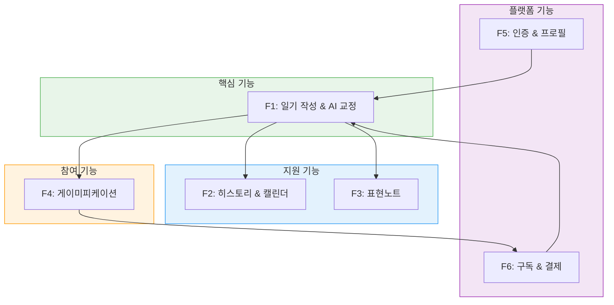
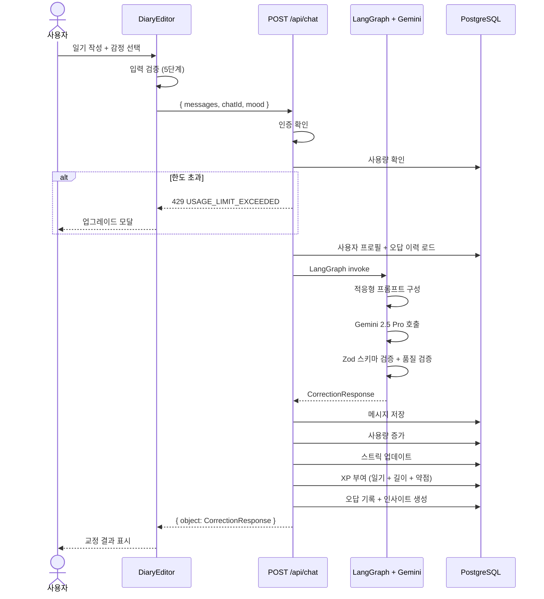
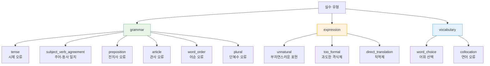
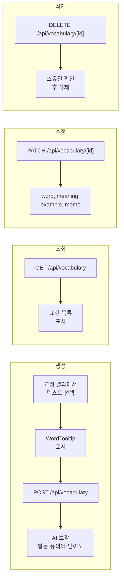
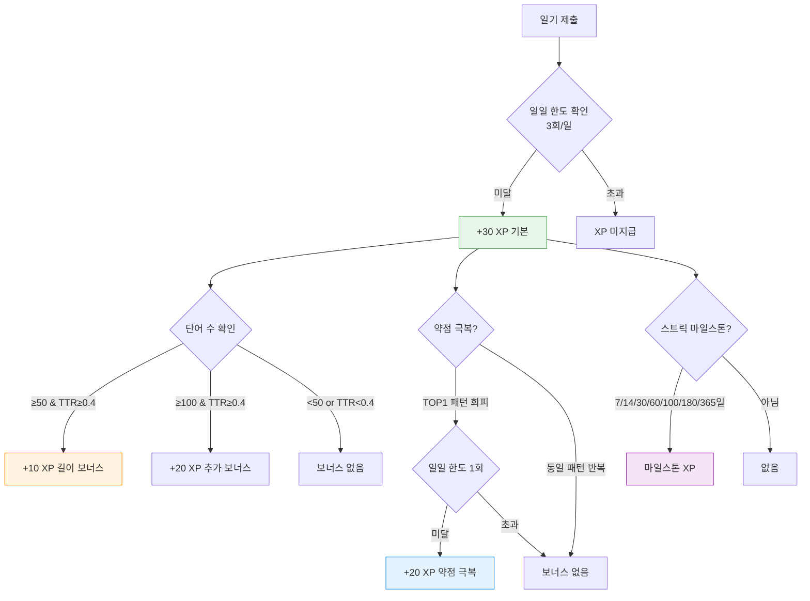
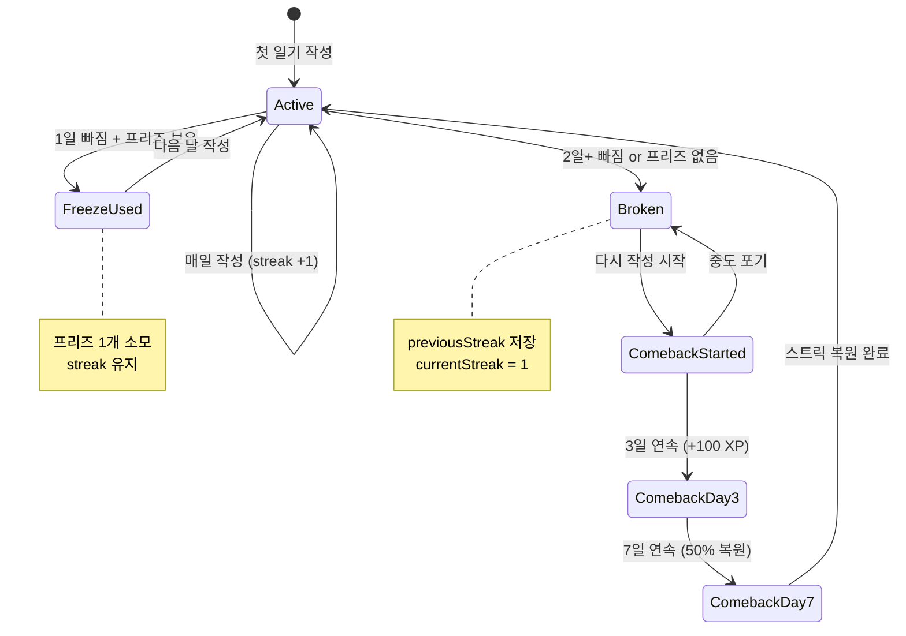
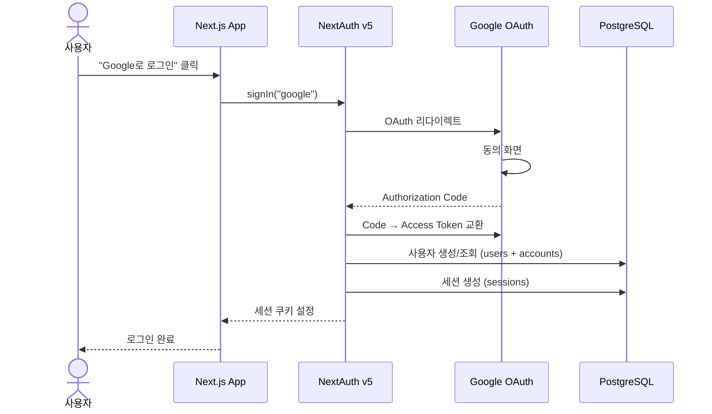
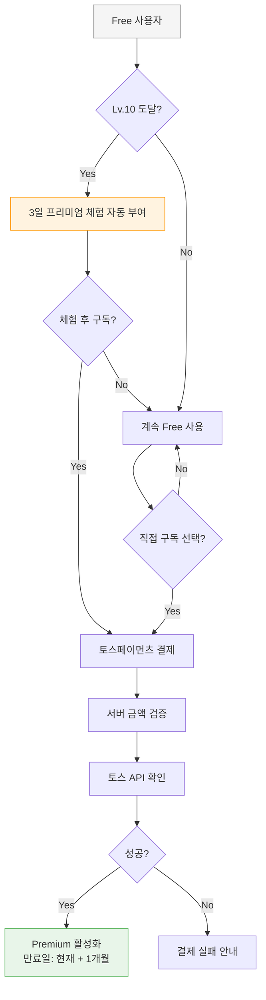

# 기능 명세서 (Functional Specification)

| 항목 | 값 |
|------|-----|
| **버전** | 1.0.0 |
| **상태** | `완료` |
| **최종 수정일** | 2026-02-12 |
| **관련 문서** | [REQUIREMENTS-ANALYSIS.md](./REQUIREMENTS-ANALYSIS.md) · [API-SPEC.md](../../architecture/API-SPEC.md) · [UI-DESIGN.md](../../architecture/UI-DESIGN.md) |

---

## 목차

1. [기능 개요](#1-기능-개요)
2. [F1: 일기 작성 및 AI 교정](#2-f1-일기-작성-및-ai-교정)
3. [F2: 히스토리 및 캘린더](#3-f2-히스토리-및-캘린더)
4. [F3: 표현노트](#4-f3-표현노트)
5. [F4: 게이미피케이션](#5-f4-게이미피케이션)
6. [F5: 인증 및 사용자 관리](#6-f5-인증-및-사용자-관리)
7. [F6: 구독 및 결제](#7-f6-구독-및-결제)
8. [에러 처리 정책](#8-에러-처리-정책)

---

## 1. 기능 개요

### 1.1 기능 도메인 맵



### 1.2 기능별 상태 요약

| 기능 | 엔드포인트 수 | 테이블 수 | 컴포넌트 수 | 상태 |
|------|-------------|----------|------------|------|
| F1: 일기/교정 | 1 | 4 | 5 | ✅ 완료 |
| F2: 히스토리 | 3 | 2 | 4 | ✅ 완료 |
| F3: 표현노트 | 4 | 1 | 3 | ✅ 완료 |
| F4: 게이미피케이션 | 5 | 8 | 4 | ✅ 완료 |
| F5: 인증 | 2 | 4 | 1 | ✅ 완료 |
| F6: 구독/결제 | 2 | 3 | 2 | ✅ 완료 |

---

## 2. F1: 일기 작성 및 AI 교정

### 2.1 기능 흐름



### 2.2 입력 검증 규칙

| 순서 | 규칙 | 조건 | 에러 메시지 |
|------|------|------|-----------|
| 1 | 빈 텍스트 | `text.trim() === ""` | "일기를 작성해주세요" |
| 2 | 최소 길이 | 공백 제외 < 20자 | "조금 더 길게 작성해볼까요? (최소 20자)" |
| 3 | 최소 단어 | 단어 수 < 5 | "최소 5단어 이상 작성해주세요" |
| 4 | 반복 문자 | 동일 문자 5회 이상 연속 | "반복 문자를 줄여주세요" |
| 5 | 중복 단어 | 전체 대비 ≥50% 동일 단어 | "다양한 단어를 사용해주세요" |

추가로 TTR (Type-Token Ratio) 경고 표시:
- TTR < 0.4 → 길이 보너스 미달 소프트 경고 (제출 가능)

### 2.3 AI 교정 응답 스키마

```typescript
interface CorrectionResponse {
  originalText: string;           // 원문
  correctedText: string;          // 교정문
  koreanExplanation: string;      // 한국어 설명
  alternatives: Alternative[];    // 대안 표현 3개
  mistakeType: string | null;     // "grammar:tense" 형식
  mistakePattern: string | null;  // "tense-confusion" 형식
  insight?: string;               // 반복 실수 인사이트 (3회 이상)
  keywords?: string[];            // 핵심 키워드 (1-3개)
  xpMessages?: string[];          // XP 획득 메시지
  cappedByDailyLimit?: boolean;   // 일일 상한 도달 여부
}

interface Alternative {
  type: "Casual" | "Expressive" | "Simple";
  text: string;
}
```

### 2.4 실수 유형 분류



### 2.5 수용 기준 (Acceptance Criteria)

- [ ] 일기 제출 시 15초 내 교정 응답 수신
- [ ] 교정 결과에 `correctedText`, `koreanExplanation`, `alternatives` (3개) 포함
- [ ] 대안 표현이 Casual, Expressive, Simple 3가지 타입 모두 포함
- [ ] 입력 검증 실패 시 제출 버튼 비활성화 + 인라인 에러 메시지
- [ ] 한도 초과 시 429 응답 + 업그레이드 모달 표시
- [ ] 비로그인 사용자도 교정 가능 ("default-user" 폴백)
- [ ] Cmd/Ctrl + Enter 단축키로 제출 가능

---

## 3. F2: 히스토리 및 캘린더

### 3.1 히스토리 목록

| 항목 | 사양 |
|------|------|
| **엔드포인트** | `GET /api/history` |
| **페이지네이션** | 최근 50개 채팅, 채팅당 최대 10개 메시지 |
| **정렬** | 최신순 (createdAt DESC) |
| **비로그인** | `isGuest: true`, 빈 배열 반환 |
| **소유권** | session.user.id 기준 필터링 |

### 3.2 히스토리 상세

| 항목 | 사양 |
|------|------|
| **엔드포인트** | `GET /api/history/[id]` |
| **응답** | 원문, 교정문, 한국어 설명, 대안 표현, 실수 유형, 인사이트 |
| **소유권 검증** | 타 사용자 접근 시 404 반환 |

### 3.3 캘린더

| 항목 | 사양 |
|------|------|
| **엔드포인트** | `GET /api/calendar/[year]/[month]` |
| **데이터** | 날짜별 chatId, mood, keywords, wordCount, preview |
| **시간대** | KST (UTC+9) 기준 |
| **표시 규칙** | 날짜당 마지막 일기만 표시 |

### 3.4 캘린더 날짜 항목 구조

```json
{
  "2026-02-12": {
    "chatId": "uuid",
    "mood": "happy",
    "keywords": ["work", "coffee"],
    "wordCount": 85,
    "preview": "Today I went to..."
  }
}
```

### 3.5 수용 기준

- [ ] 히스토리 목록에서 최근 50개 교정 기록 확인 가능
- [ ] 캘린더에서 작성일에 감정 이모지 표시
- [ ] 캘린더 날짜 클릭 시 해당 일기 미리보기 표시
- [ ] 타 사용자의 일기 접근 시 404 반환
- [ ] 비로그인 시 히스토리 비어있음 표시

---

## 4. F3: 표현노트

### 4.1 CRUD 작업



### 4.2 표현 데이터 모델

| 필드 | 타입 | 필수 | 설명 |
|------|------|------|------|
| `word` | string | ✅ | 저장할 단어/표현 |
| `meaning` | string | ✅ | 한국어 의미 |
| `example` | string | ✅ | 예문 |
| `memo` | string | - | 사용자 메모 |
| `sourceType` | "diary" | ✅ | 출처 유형 |
| `sourceId` | string | - | 출처 채팅 ID |
| `context` | string | - | AI 보강용 원문 컨텍스트 |
| `pronunciation` | string | - | AI 보강: IPA 발음 |
| `partOfSpeech` | string | - | AI 보강: 품사 |
| `synonyms` | string[] | - | AI 보강: 유의어 |
| `difficulty` | enum | - | AI 보강: beginner/intermediate/advanced |

### 4.3 AI 표현 보강

- **모델**: Gemini 2.0 Flash Lite (경량 모델)
- **트리거**: `context` 필드 포함 시 자동 실행
- **보강 항목**: pronunciation, partOfSpeech, synonyms, difficulty
- **실패 시**: 보강 없이 저장 (`enrichmentFailed: true`)
- **XP**: 표현 저장당 +5 XP (일일 5회 상한)

### 4.4 수용 기준

- [ ] 교정 결과 텍스트를 드래그하여 표현 저장 가능
- [ ] 저장 시 AI가 발음, 유의어, 난이도를 자동 추가
- [ ] 표현노트 페이지에서 전체 목록 조회 가능
- [ ] 표현 수정(word, meaning, example, memo) 가능
- [ ] 표현 삭제 가능 (소유권 확인)
- [ ] 표현 저장 시 +5 XP 획득 (일일 5회까지)

---

## 5. F4: 게이미피케이션

### 5.1 XP 시스템

#### 5.1.1 XP 획득 구조



#### 5.1.2 XP 보상표

| 액션 | XP | 일일 상한 | 조건 |
|------|-----|---------|------|
| 일기 제출 | +30 | 3회 | - |
| 50단어 이상 | +10 | 3회 (일기와 동일) | TTR ≥ 0.4 |
| 100단어 이상 | +20 | 3회 (일기와 동일) | TTR ≥ 0.4 (누적) |
| 약점 극복 | +20 | 1회 | TOP1 패턴 ≠ 현재 패턴 |
| 표현 저장 | +5 | 5회 | - |
| 스트릭 7일 | +100 | 1회 | 최초 달성 |
| 스트릭 14일 | +200 | 1회 | 최초 달성 |
| 스트릭 30일 | +500 | 1회 | 최초 달성 |
| 스트릭 60일 | +1,000 | 1회 | 최초 달성 |
| 스트릭 100일 | +2,000 | 1회 | 최초 달성 |
| 스트릭 180일 | +3,500 | 1회 | 최초 달성 |
| 스트릭 365일 | +5,000 | 1회 | 최초 달성 |
| 주간 퀘스트 | +80~100 | 3회/주 | 퀘스트 완료 |
| 월간 챌린지 15개 | +200 | 1회/월 | 15 표현 사용 |
| 월간 챌린지 20개 | +400 | 1회/월 | 20 표현 사용 |
| 월간 챌린지 25개 | +600 | 1회/월 | 25 표현 사용 |
| 보물상자 | +25 | 1회/일 | Premium |
| Welcome Back | +50 | 1회 | 3일+ 공백 후 복귀 |
| Comeback Kid | +100 | 1회 | 복귀 후 3일 연속 |

#### 5.1.3 레벨 시스템

| 레벨 | 필요 XP | 누적 XP | 칭호 | 티어 |
|------|---------|---------|------|------|
| 1 | 0 | 0 | Diary Beginner | 🌱 Beginner |
| 2 | 80 | 80 | Diary Beginner | 🌱 Beginner |
| 5 | 476 | 908 | Diary Beginner | 🌱 Beginner |
| 6 | 624 | 1,532 | Daily Writer | ✏️ Writer |
| 10 | 1,303 | 4,009 | Daily Writer | ✏️ Writer |
| 11 | 1,499 | 5,508 | Story Teller | 📖 Teller |
| 15 | 2,339 | 11,856 | Story Teller | 📖 Teller |
| 16 | 2,587 | 14,443 | Word Crafter | 🛠️ Crafter |
| 20 | 3,685 | 24,747 | Word Crafter | 🛠️ Crafter |
| 21 | 3,985 | 28,732 | English Native | 🌍 Native |
| 25 | 5,341 | 44,154 | English Native | 🌍 Native |
| 26 | 5,694 | 49,848 | Master Author | 👑 Master |
| 30 | 7,308 | 70,614 | Master Author | 👑 Master |

**레벨 공식**: `requiredXp = floor(80 × level^1.7)`

**Free 사용자 레벨 캡**: Lv.10 (XP 계속 적립, 레벨만 고정)

### 5.2 스트릭 시스템



#### 스트릭 주요 규칙

| 상황 | 동작 | XP |
|------|------|-----|
| 오늘 이미 작성 | 스트릭 변동 없음 | - |
| 어제 작성 → 오늘 작성 | streak += 1 | 마일스톤 도달 시 보너스 |
| 2일 공백 + 프리즈 보유 | 프리즈 소모, streak 유지 | - |
| 2일+ 공백, 프리즈 없음 | streak = 1, previousStreak 저장 | - |
| 3일+ 공백 후 복귀 (previousStreak ≥ 3) | Welcome Back 보너스 | +50 XP |
| 복귀 후 3일 연속 | Comeback Kid | +100 XP |
| 복귀 후 7일 연속 | 50% 스트릭 복원 | - |

### 5.3 보물상자

| 보상 유형 | 확률 | 내용 |
|----------|------|------|
| XP 보너스 | 40% | 10-50 XP 랜덤 |
| 영어 명언 | 25% | 유명 인사 명언 + 한국어 번역 |
| 표현 | 20% | 관용 표현 자동 추가 (표현노트) |
| 스트릭 프리즈 | 10% | +1 프리즈 (최대 2개, 2개 시 XP로 대체) |
| 희귀 칭호 | 5% | 8개 중 랜덤 (Night Owl, Grammar Guru 등) |

### 5.4 수용 기준

- [ ] 일기 제출 시 XP 획득 메시지가 토스트로 표시됨
- [ ] 레벨업 시 모달로 새 칭호 안내
- [ ] 스트릭이 헤더에 실시간 반영
- [ ] Free 사용자 Lv.10 도달 시 레벨 캡 모달 + 3일 체험 제공
- [ ] 보물상자 보상이 정확한 확률로 분배됨
- [ ] 일일 XP 상한 초과 시 XP 미지급 + 상한 도달 메시지

---

## 6. F5: 인증 및 사용자 관리

### 6.1 인증 흐름



### 6.2 인증 규칙

| API | Auth | 비로그인 시 동작 |
|-----|------|----------------|
| `POST /api/chat` | Optional | `"default-user"` 폴백 |
| `GET /api/history` | Required | 401 반환 |
| `GET /api/history/[id]` | Required | 401 반환 |
| `GET /api/calendar` | Optional | `"default-user"` 폴백 |
| `GET/POST/PATCH/DELETE /api/vocabulary` | Required | 401 반환 |
| `GET /api/streak` | Optional | `"default-user"` 폴백 |
| `GET /api/usage` | Optional | `"default-user"` 폴백 |
| `GET /api/user/xp` | Optional | `"default-user"` 폴백 |
| `GET/POST /api/user/profile` | Optional | `"default-user"` 폴백 |
| `POST /api/treasure-chest/*` | Required | 401 반환 |
| `POST /api/payment/confirm` | Required | 401 반환 |

### 6.3 사용자 프로필

| 필드 | 타입 | 기본값 | 설명 |
|------|------|--------|------|
| `explanationStyle` | enum | "detailed" | 교정 설명 스타일 |
| `learningGoal` | string | null | 학습 목표 (자유 텍스트) |

### 6.4 수용 기준

- [ ] Google OAuth 로그인/로그아웃 동작
- [ ] 비로그인 사용자도 교정 체험 가능 (데이터 비영구)
- [ ] 프로필에서 설명 스타일 변경 시 다음 교정부터 반영
- [ ] 세션 만료 시 자동 재인증

---

## 7. F6: 구독 및 결제

### 7.1 구독 구조



### 7.2 요금제 비교

| 기능 | Free | Premium (₩6,900/월) |
|------|------|---------------------|
| 일일 교정 | 3회 | 무제한 |
| 레벨 상한 | Lv.10 | Lv.30 |
| XP 부스터 | 구매만 | 보물상자 획득 |
| 보물상자 | X | 일일 1회 |
| 스트릭 프리즈 | 구매만 | 보물상자 획득 가능 |
| 주간 퀘스트 | O | O |
| 월간 챌린지 | O | O |
| 히스토리/캘린더 | O | O |
| 표현노트 | O | O |

### 7.3 IAP 상품

| 상품 | 가격 | 효과 |
|------|------|------|
| 추가 교정 1회 | ₩500 | 일일 한도 외 1회 추가 |
| 스트릭 프리즈 | ₩1,000 | +1 프리즈 (최대 2개) |
| XP 부스터 24시간 | ₩1,500 | XP 2배 (24시간) |
| 보물상자 열쇠 | ₩800 | 보물상자 1회 추가 열기 |

### 7.4 결제 흐름

| 단계 | 내용 | 검증 |
|------|------|------|
| 1 | 클라이언트에서 토스 결제 위젯 호출 | - |
| 2 | 사용자 결제 완료 → paymentKey 수신 | - |
| 3 | `POST /api/payment/confirm` 호출 | 서버 측 금액 검증 |
| 4 | 토스페이먼츠 API 확인 | 토스 측 결제 상태 확인 |
| 5 | 구독 생성/갱신 | endDate = 현재 + 1개월 |
| 6 | 성공/실패 페이지 리다이렉트 | - |

### 7.5 수용 기준

- [ ] Free → Premium 구독 결제 성공 시 즉시 기능 해제
- [ ] 만료된 구독은 자동으로 Free로 전환
- [ ] Lv.10 도달 시 3일 체험 (1회 한정)
- [ ] 결제 금액이 서버에서 검증됨 (₩6,900 고정)
- [ ] IAP 구매 시 즉시 효과 적용

---

## 8. 에러 처리 정책

### 8.1 에러 분류

| 분류 | HTTP | 처리 방식 | 사용자 영향 |
|------|------|----------|-----------|
| **Critical** | 500 | 에러 응답 반환 | 교정 실패 안내 |
| **Business** | 400, 401, 429 | 명확한 에러 코드 반환 | 안내 메시지/모달 표시 |
| **Graceful** | 200 (부분 실패) | 핵심 응답 유지, 부가 기능 스킵 | 사용자 인지 불가 |

### 8.2 Graceful Degradation 원칙

> **핵심 AI 교정 응답은 반드시 반환한다. 부가 기능 실패가 교정 응답을 차단하지 않는다.**

| 실패 가능 항목 | 실패 시 동작 | 사용자 영향 |
|--------------|------------|-----------|
| XP 부여 실패 | 로그만 기록 | XP 미반영 (다음 교정 시 정상화) |
| 스트릭 업데이트 실패 | 로그만 기록 | 스트릭 미반영 |
| 오답 기록 실패 | 로그만 기록 | 인사이트 미생성 |
| 표현 AI 보강 실패 | 보강 없이 저장 | `enrichmentFailed: true` |
| 레벨업 알림 실패 | 로그만 기록 | 모달 미표시 |

### 8.3 수용 기준

- [ ] AI 응답 Zod 검증 실패 시 fallback 파싱으로 복구 시도
- [ ] XP/스트릭/오답 기록 실패가 교정 응답에 영향 없음
- [ ] 429 에러에 `USAGE_LIMIT_EXCEEDED` 코드 포함
- [ ] 401 에러 시 로그인 유도
