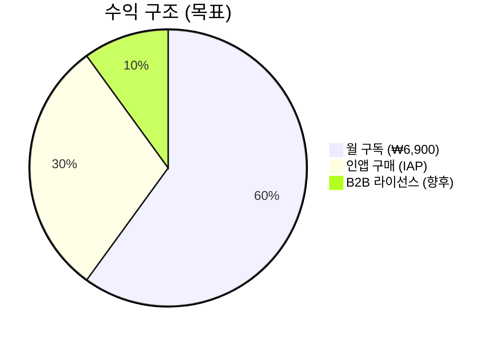
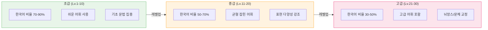
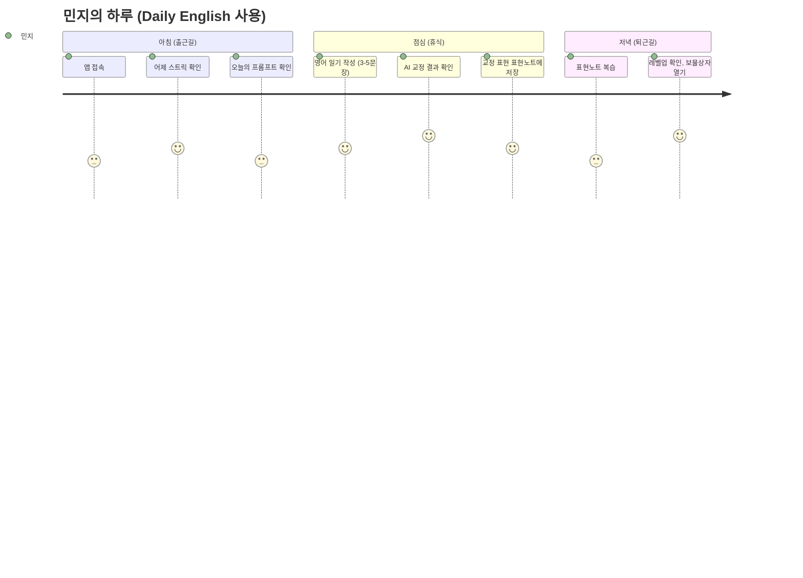
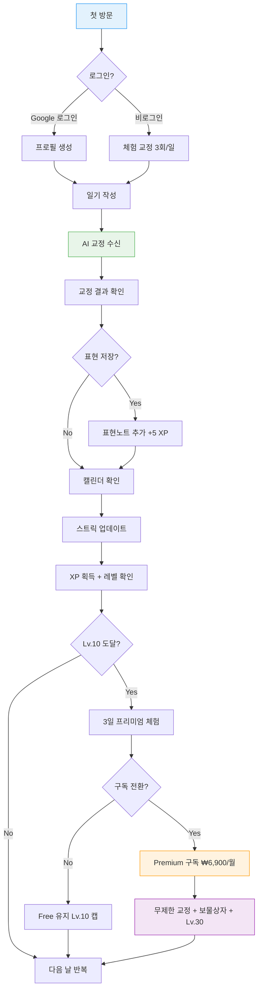
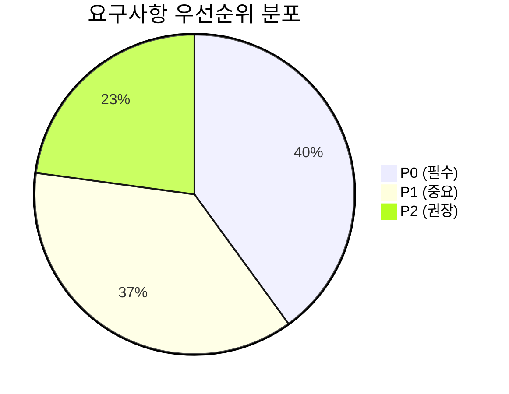

# 요구사항 분석서 (Requirements Analysis)

| 항목 | 값 |
|------|-----|
| **버전** | 1.0.0 |
| **상태** | `완료` |
| **최종 수정일** | 2026-02-12 |
| **관련 문서** | [FUNCTIONAL-SPEC.md](./FUNCTIONAL-SPEC.md) · [OVERVIEW.md](../../architecture/OVERVIEW.md) · [COMMON-SYSTEMS.md](../../architecture/COMMON-SYSTEMS.md) |

---

## 목차

1. [프로젝트 개요](#1-프로젝트-개요)
2. [사용자 페르소나](#2-사용자-페르소나)
3. [사용자 여정 지도](#3-사용자-여정-지도)
4. [기능 요구사항](#4-기능-요구사항)
5. [비기능 요구사항](#5-비기능-요구사항)
6. [제약 조건](#6-제약-조건)
7. [요구사항 추적 매트릭스](#7-요구사항-추적-매트릭스)

---

## 1. 프로젝트 개요

### 1.1 비전

> **매일 영어 일기를 쓰며, AI 교정을 통해 자연스러운 영작 실력을 키우는 한국인 대상 에듀테크 서비스**

### 1.2 문제 정의

| 문제 | 현재 상태 | 목표 상태 |
|------|----------|----------|
| 영작 피드백 부재 | 원어민 첨삭 비용 高, 접근성 低 | AI가 즉시 교정 + 한국어 설명 제공 |
| 학습 동기 유지 어려움 | 일기 앱은 있으나 학습 요소 부재 | 게이미피케이션으로 지속적 동기 부여 |
| 반복 실수 인지 불가 | 자신의 약점 패턴을 모름 | 오답 패턴 추적 + 인사이트 제공 |
| 학습 진도 가시성 부재 | 얼마나 성장했는지 확인 불가 | XP/레벨/스트릭으로 성장 시각화 |

### 1.3 비즈니스 모델



| 구분 | Free | Premium (₩6,900/월) |
|------|------|---------------------|
| 일일 교정 횟수 | 3회 | 무제한 |
| 레벨 상한 | Lv.10 | Lv.30 |
| 보물상자 | X | 일일 1회 |
| 주간 퀘스트 | O | O |
| 월간 챌린지 | O | O |
| 스트릭 프리즈 | 구매만 | 보물상자 획득 가능 |

---

## 2. 사용자 페르소나

### Persona 1: 민지 (직장인, 28세)

| 항목 | 내용 |
|------|------|
| **직업** | IT 기업 마케터 |
| **영어 수준** | 중급 (TOEIC 750, 영작은 어색) |
| **목표** | 해외 팀과 이메일/슬랙 소통 능력 향상 |
| **행동 패턴** | 출퇴근 지하철에서 10분 학습, 주 5일 |
| **통점(Pain Point)** | 문법은 아는데 자연스러운 표현이 안 됨 |
| **기대** | "내가 쓴 문장이 원어민 눈에 어떻게 보이는지 알고 싶다" |
| **프리미엄 전환 가능성** | 높음 (Lv.10 도달 후 성장 욕구) |

### Persona 2: 수현 (대학생, 22세)

| 항목 | 내용 |
|------|------|
| **직업** | 영문학과 3학년 |
| **영어 수준** | 중상급 (에세이 작성 가능, 구어체 약함) |
| **목표** | 교환학생 준비, 자연스러운 영어 일상 표현 습득 |
| **행동 패턴** | 저녁 취침 전 일기 작성, 매일 |
| **통점(Pain Point)** | 한국어 직역체에서 벗어나고 싶음 |
| **기대** | "같은 실수를 반복하지 않도록 알려줬으면 좋겠다" |
| **프리미엄 전환 가능성** | 중간 (가격 민감, 무료 범위 내 활용) |

### Persona 3: 재호 (고등학생, 17세)

| 항목 | 내용 |
|------|------|
| **직업** | 고등학교 2학년 |
| **영어 수준** | 초급 (기본 문법 학습 중) |
| **목표** | 수능 영어 + 실용 영어 병행 |
| **행동 패턴** | 주 2-3회, 짧은 일기 (3-5문장) |
| **통점(Pain Point)** | 시제, 전치사 등 기초 문법 실수가 잦음 |
| **기대** | "한국어로 쉽게 설명해주면 좋겠다" |
| **프리미엄 전환 가능성** | 낮음 (부모 결제 필요) |

### 사용자 수준별 시스템 적응



---

## 3. 사용자 여정 지도

### 3.1 핵심 사용자 흐름



### 3.2 전체 사용자 여정



---

## 4. 기능 요구사항

### 4.1 요구사항 분류 체계

```
FR: Functional Requirement (기능 요구사항)
├── FR-CORE: 핵심 기능 (AI 교정)
├── FR-HIST: 히스토리/캘린더
├── FR-VOCAB: 표현노트
├── FR-GAME: 게이미피케이션
├── FR-AUTH: 인증/프로필
└── FR-PAY: 구독/결제
```

### 4.2 핵심 기능 (FR-CORE)

| ID | 요구사항 | 우선순위 | 상태 |
|----|---------|---------|------|
| FR-CORE-01 | 사용자가 영어 일기를 작성하여 제출할 수 있다 | P0 | ✅ |
| FR-CORE-02 | AI가 문법, 어휘, 표현을 교정하여 반환한다 | P0 | ✅ |
| FR-CORE-03 | 교정 결과에 한국어 설명을 포함한다 | P0 | ✅ |
| FR-CORE-04 | 3가지 대안 표현(Casual, Expressive, Simple)을 제시한다 | P0 | ✅ |
| FR-CORE-05 | 실수 유형을 분류한다 (grammar, expression, vocabulary) | P1 | ✅ |
| FR-CORE-06 | 반복 실수 패턴을 감지하고 인사이트를 제공한다 | P1 | ✅ |
| FR-CORE-07 | 사용자 수준에 맞춘 적응형 교정을 제공한다 | P1 | ✅ |
| FR-CORE-08 | 일기 제출 시 감정(mood)을 선택할 수 있다 | P2 | ✅ |
| FR-CORE-09 | 글쓰기 영감 프롬프트(Inspiration)를 제공한다 | P2 | ✅ |

### 4.3 히스토리/캘린더 (FR-HIST)

| ID | 요구사항 | 우선순위 | 상태 |
|----|---------|---------|------|
| FR-HIST-01 | 과거 교정 히스토리를 목록으로 조회한다 | P0 | ✅ |
| FR-HIST-02 | 개별 교정 상세 내용을 확인한다 | P0 | ✅ |
| FR-HIST-03 | 월별 캘린더에서 작성일을 시각적으로 확인한다 | P1 | ✅ |
| FR-HIST-04 | 캘린더에서 해당 일의 감정, 키워드, 미리보기를 표시한다 | P2 | ✅ |

### 4.4 표현노트 (FR-VOCAB)

| ID | 요구사항 | 우선순위 | 상태 |
|----|---------|---------|------|
| FR-VOCAB-01 | 교정 결과에서 표현을 선택하여 저장한다 | P0 | ✅ |
| FR-VOCAB-02 | 저장된 표현 목록을 조회한다 | P0 | ✅ |
| FR-VOCAB-03 | AI가 발음, 유의어, 난이도를 자동 보강한다 | P1 | ✅ |
| FR-VOCAB-04 | 표현을 수정/삭제한다 | P1 | ✅ |
| FR-VOCAB-05 | 메모를 추가하여 개인화한다 | P2 | ✅ |

### 4.5 게이미피케이션 (FR-GAME)

| ID | 요구사항 | 우선순위 | 상태 |
|----|---------|---------|------|
| FR-GAME-01 | 일기 제출 시 XP를 획득한다 (+30 기본) | P0 | ✅ |
| FR-GAME-02 | XP에 따른 30단계 레벨 시스템을 운영한다 | P0 | ✅ |
| FR-GAME-03 | 연속 작성일(스트릭)을 추적한다 | P0 | ✅ |
| FR-GAME-04 | 스트릭 프리즈로 연속 기록을 보호한다 (최대 2개) | P1 | ✅ |
| FR-GAME-05 | 스트릭 마일스톤(7/14/30/60/100/180/365일)에 보너스 XP를 지급한다 | P1 | ✅ |
| FR-GAME-06 | 글 길이 보너스: 50단어 이상 +10 XP, 100단어 이상 +20 XP | P1 | ✅ |
| FR-GAME-07 | 약점 극복 보너스: TOP1 실수 패턴 회피 시 +20 XP | P1 | ✅ |
| FR-GAME-08 | 프리미엄 사용자에게 일일 보물상자를 제공한다 | P1 | ✅ |
| FR-GAME-09 | 주간 퀘스트 3개를 매주 월요일 생성한다 | P2 | ✅ |
| FR-GAME-10 | 월간 챌린지(10개 표현 사용)를 매월 1일 생성한다 | P2 | ✅ |
| FR-GAME-11 | 레벨업 시 칭호를 부여한다 (6단계) | P2 | ✅ |
| FR-GAME-12 | 일일 XP 획득 상한을 적용한다 (일기 3회, 표현 5회, 약점 1회) | P1 | ✅ |

### 4.6 인증/프로필 (FR-AUTH)

| ID | 요구사항 | 우선순위 | 상태 |
|----|---------|---------|------|
| FR-AUTH-01 | Google OAuth로 로그인한다 | P0 | ✅ |
| FR-AUTH-02 | 비로그인 상태에서 체험 사용이 가능하다 | P0 | ✅ |
| FR-AUTH-03 | 사용자 프로필(설명 스타일, 학습 목표)을 설정한다 | P2 | ✅ |

### 4.7 구독/결제 (FR-PAY)

| ID | 요구사항 | 우선순위 | 상태 |
|----|---------|---------|------|
| FR-PAY-01 | Free 사용자는 일일 3회 교정으로 제한한다 | P0 | ✅ |
| FR-PAY-02 | 토스페이먼츠로 월 구독 결제한다 (₩6,900/월) | P0 | ✅ |
| FR-PAY-03 | Premium 사용자는 무제한 교정 + Lv.30 해제 | P0 | ✅ |
| FR-PAY-04 | Lv.10 도달 시 3일 프리미엄 체험을 제공한다 | P1 | ✅ |
| FR-PAY-05 | IAP로 추가 교정, 프리즈, XP 부스터, 열쇠를 구매한다 | P1 | ✅ |

---

## 5. 비기능 요구사항

### 5.1 성능 (NFR-PERF)

| ID | 요구사항 | 목표값 | 근거 |
|----|---------|--------|------|
| NFR-PERF-01 | AI 교정 응답 시간 | ≤ 15초 (P95) | Vercel 60초 제한, 사용자 인내 임계 |
| NFR-PERF-02 | API 응답 시간 (비 AI) | ≤ 500ms (P95) | 체감 즉시 응답 기준 |
| NFR-PERF-03 | 페이지 초기 로드 | ≤ 3초 (LCP) | Core Web Vitals 기준 |
| NFR-PERF-04 | 동시 사용자 | 100명 (Vercel Hobby) | Serverless 자동 확장 |

### 5.2 보안 (NFR-SEC)

| ID | 요구사항 | 구현 방식 |
|----|---------|----------|
| NFR-SEC-01 | 인증 토큰 보호 | NextAuth 세션 (HttpOnly Cookie) |
| NFR-SEC-02 | API 권한 검증 | 요청별 session.user.id 확인 |
| NFR-SEC-03 | 데이터 소유권 | 타 사용자 데이터 접근 시 404 반환 |
| NFR-SEC-04 | 결제 무결성 | 서버 측 금액 검증 + 토스 API 확인 |
| NFR-SEC-05 | 환경 변수 보호 | .env 파일 gitignore, Vercel 환경 변수 |

### 5.3 확장성 (NFR-SCALE)

| ID | 요구사항 | 설계 |
|----|---------|------|
| NFR-SCALE-01 | Serverless 아키텍처 | Vercel Functions (자동 확장) |
| NFR-SCALE-02 | DB 연결 풀링 | Neon Serverless Driver (웹소켓) |
| NFR-SCALE-03 | 상태 비저장 API | 세션 외 서버 상태 없음 |

### 5.4 가용성 (NFR-AVAIL)

| ID | 요구사항 | 목표값 |
|----|---------|--------|
| NFR-AVAIL-01 | 서비스 가동률 | 99.5% (Vercel SLA 기준) |
| NFR-AVAIL-02 | 데이터 백업 | Neon PITR (Point-in-Time Recovery) |
| NFR-AVAIL-03 | 배포 롤백 | Vercel Instant Rollback |

### 5.5 사용성 (NFR-UX)

| ID | 요구사항 | 기준 |
|----|---------|------|
| NFR-UX-01 | 모바일 우선 반응형 | 320px ~ 1440px 대응 |
| NFR-UX-02 | 터치 타겟 최소 크기 | 44×44pt (HIG 기준) |
| NFR-UX-03 | 한국어 UI | 모든 안내 문구 한국어 |
| NFR-UX-04 | 입력 검증 피드백 | 실시간 인라인 에러 메시지 |

---

## 6. 제약 조건

### 6.1 기술 제약

| 제약 | 영향 | 대응 |
|------|------|------|
| Vercel Hobby Function 60초 제한 | AI 교정 응답 시간 제약 | `maxDuration = 60`, 프롬프트 최적화 |
| Neon Free Tier 연결 수 | 동시 연결 제한 | Serverless Driver (WebSocket) 사용 |
| Gemini API Rate Limit | 초당 요청 제한 | 429 에러 핸들링, 사용량 제한으로 간접 제어 |
| NextAuth Beta (v5) | API 변경 가능성 | 공식 릴리스 시 마이그레이션 필요 |

### 6.2 비즈니스 제약

| 제약 | 내용 |
|------|------|
| 타겟 시장 | 한국인 영어 학습자 (한국어 설명 필수) |
| 결제 수단 | 토스페이먼츠 (한국 PG사) |
| 통화 | KRW (₩6,900/월) |
| 시간대 | KST (UTC+9) 기준 일일 리셋 |

### 6.3 규제 제약

| 제약 | 대응 |
|------|------|
| 개인정보보호법 | Google OAuth 최소 정보 수집 (이름, 이메일, 프로필 사진) |
| 결제 관련 법규 | 토스페이먼츠 PCI-DSS 준수 위임 |
| 미성년자 보호 | 학부모 결제 필요 (앱 내 별도 제한 없음) |

---

## 7. 요구사항 추적 매트릭스 (RTM)

### 7.1 기능 → 엔드포인트 매핑

| 요구사항 | API 엔드포인트 | DB 테이블 | UI 컴포넌트 |
|---------|---------------|----------|------------|
| FR-CORE-01~09 | `POST /api/chat` | chats, messages, userMistakes | DiaryEditor, CorrectionCard |
| FR-HIST-01~02 | `GET /api/history`, `GET /api/history/[id]` | chats, messages | HistoryPage, HistoryDetail |
| FR-HIST-03~04 | `GET /api/calendar/[year]/[month]` | chats | CalendarView, CalendarDay |
| FR-VOCAB-01~05 | `GET/POST/PATCH/DELETE /api/vocabulary` | vocabulary | SelectableText, WordTooltip |
| FR-GAME-01~02 | `GET /api/user/xp` | userProfiles, xpHistory, dailyXpTracking | LevelBadge, LevelupModal |
| FR-GAME-03~05 | `GET /api/streak` | diaryStreaks, xpHistory | StreakCounter |
| FR-GAME-08 | `POST /api/treasure-chest/*` | treasureChestLog, userProfiles | (TreasureChest UI) |
| FR-GAME-09 | (DB scheduled) | weeklyQuests, userQuestProgress | (Quest UI) |
| FR-GAME-10 | (DB scheduled) | monthlyChallenges, userChallengeProgress | (Challenge UI) |
| FR-AUTH-01~03 | `GET/POST /api/auth/*`, `/api/user/profile` | users, accounts, sessions, userProfiles | LoginButton |
| FR-PAY-01 | `GET /api/usage` | dailyUsage, subscriptions | UsageCounter |
| FR-PAY-02~05 | `POST /api/payment/confirm` | subscriptions, iapPurchases | UpgradeModal |

### 7.2 우선순위 요약



| 우선순위 | 설명 | 수량 |
|---------|------|------|
| **P0** | MVP 필수 기능, 서비스 운영에 필수 | 14개 |
| **P1** | 사용자 경험 및 리텐션에 중요 | 13개 |
| **P2** | 사용자 만족도 향상, 차별화 요소 | 8개 |
