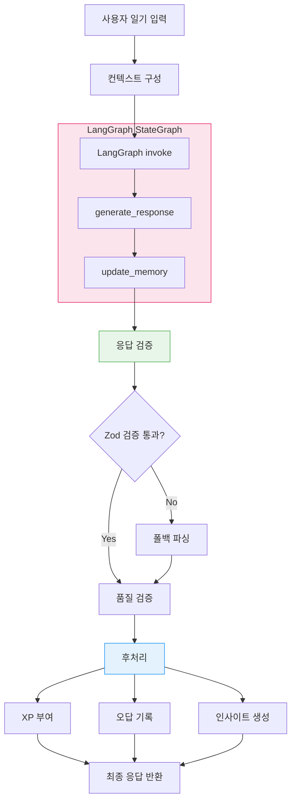
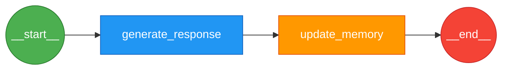
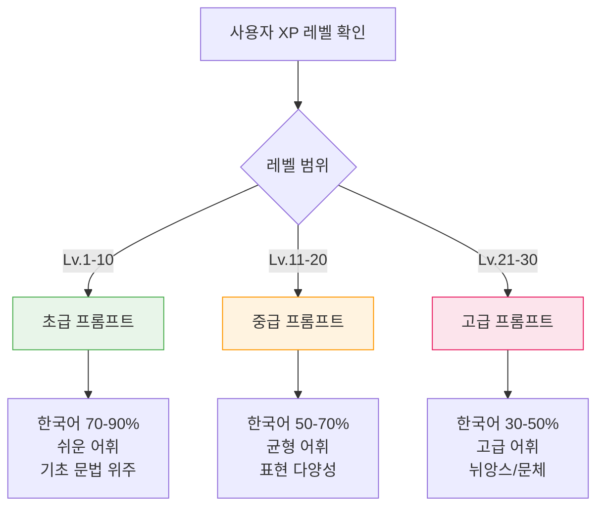
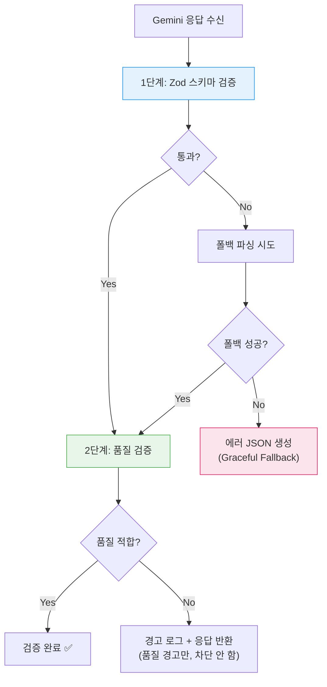
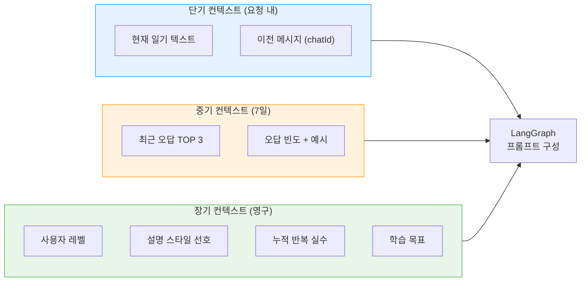
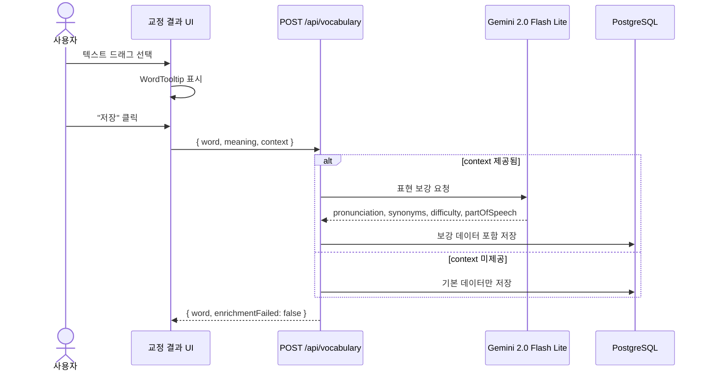
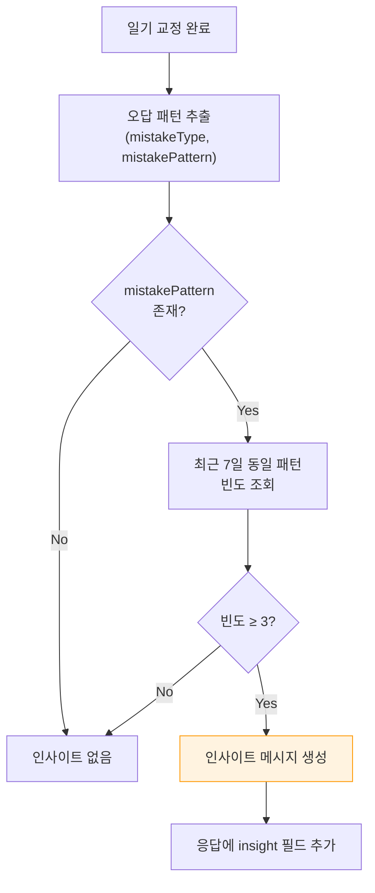
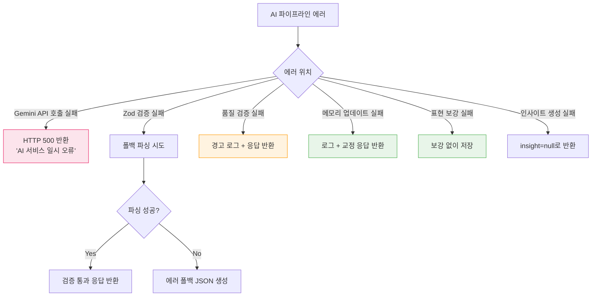

# AI 파이프라인 명세 (AI Pipeline Specification)

| 항목 | 값 |
|------|-----|
| **버전** | 1.0.0 |
| **상태** | `완료` |
| **최종 수정일** | 2026-02-12 |
| **관련 문서** | [AI-SYSTEM.md](../../architecture/AI-SYSTEM.md) · [CHAT-SEQUENCE.md](../../architecture/CHAT-SEQUENCE.md) · [SYSTEM-ARCHITECTURE.md](./SYSTEM-ARCHITECTURE.md) |

---

## 목차

1. [파이프라인 개요](#1-파이프라인-개요)
2. [LangGraph 상태 머신](#2-langgraph-상태-머신)
3. [적응형 프롬프트 시스템](#3-적응형-프롬프트-시스템)
4. [응답 검증 파이프라인](#4-응답-검증-파이프라인)
5. [메모리 시스템](#5-메모리-시스템)
6. [표현 보강 파이프라인](#6-표현-보강-파이프라인)
7. [오답 인사이트 생성](#7-오답-인사이트-생성)
8. [에러 처리 및 폴백](#8-에러-처리-및-폴백)

---

## 1. 파이프라인 개요

### 1.1 전체 AI 처리 흐름



### 1.2 모델 할당

| 파이프라인 | 모델 | Temperature | 용도 |
|-----------|------|-------------|------|
| 일기 교정 | Gemini 2.5 Pro | 0.9 | 다양한 대안 표현 생성 |
| 표현 보강 | Gemini 2.0 Flash Lite | 0.3 | 정확한 사전 정보 |
| 인사이트 | 규칙 기반 (LLM 미사용) | - | 패턴 매칭 + 템플릿 |

---

## 2. LangGraph 상태 머신

### 2.1 상태 정의

```typescript
interface ConversationState {
  messages: BaseMessage[];        // 대화 히스토리 (reducer: accumulate)
  summary: string;                // 요약 (replace)
  userProfile: object | null;     // 사용자 프로필
  messageCount: number;           // 메시지 수
  chatId: string;                 // 채팅 세션 ID
  userId: string;                 // 사용자 ID
  correctionResult: object | null; // 교정 결과
  diaryContext: object | null;    // 일기 맥락
}
```

### 2.2 그래프 구조



### 2.3 노드 상세

#### Node 1: `generate_response`

| 단계 | 처리 | 소스 |
|------|------|------|
| 1 | 사용자 프로필 로드 (XP 레벨, 설명 스타일) | `lib/ai/user-profile.ts` |
| 2 | 최근 7일 TOP 3 오답 패턴 로드 | `lib/db/mistakes.ts` |
| 3 | 적응형 시스템 프롬프트 구성 | 레벨 기반 템플릿 |
| 4 | Gemini 2.5 Pro 호출 (structuredOutput) | `@ai-sdk/google` |
| 5 | Zod 스키마 검증 | `lib/ai/schema.ts` |
| 6 | 품질 검증 (레벨 적합성) | `lib/ai/response-validator.ts` |
| 7 | 상태에 correctionResult 저장 | LangGraph state update |

#### Node 2: `update_memory`

| 단계 | 처리 | 소스 |
|------|------|------|
| 1 | 실수 패턴 추출 (mistakeType, mistakePattern) | correctionResult |
| 2 | UserProfileManager에 반복 실수 기록 | `lib/ai/user-profile.ts` |
| 3 | 최근 5개 예시 유지, 빈도 카운트 증가 | JSONB upsert |

---

## 3. 적응형 프롬프트 시스템

### 3.1 레벨별 프롬프트 적응



### 3.2 프롬프트 구성 요소

| 구성 요소 | 내용 | 동적 여부 |
|----------|------|----------|
| **역할 정의** | "한국인 학습자를 위한 영어 일기 교정 선생님" | 고정 |
| **교정 원칙** | 일기는 과거 시제, 자연스러운 표현 우선 | 고정 |
| **출력 형식** | CorrectionResponse JSON 스키마 강제 | 고정 |
| **실수 유형 분류** | 18개 패턴 (grammar:6, expression:3, vocabulary:2) | 고정 |
| **한국어 비율** | 레벨에 따라 30-90% 조정 | 🔄 동적 |
| **어휘 수준** | 레벨에 따라 조정 | 🔄 동적 |
| **설명 스타일** | detailed / concise (프로필 설정) | 🔄 동적 |
| **반복 실수 컨텍스트** | TOP 3 패턴 + 예시 | 🔄 동적 |

### 3.3 설명 스타일 프로필

| 스타일 | 한국어 비율 | 설명 길이 | 어휘 복잡도 | 대상 |
|--------|-----------|----------|-----------|------|
| **detailed** | 70-100% | 150-600자 | 0-40 (쉬움) | 초급 ~ 중급 |
| **concise** | 40-70% | 60-300자 | 30-70 (균형) | 중급 ~ 고급 |

### 3.4 컨텍스트 주입 형식

```
[사용자 프로필]
- 레벨: Lv.7 (Daily Writer)
- 설명 스타일: detailed
- 학습 목표: 비즈니스 영어 실력 향상

[반복 실수 패턴 (최근 7일)]
1. tense-confusion (5회): "I eat lunch yesterday", "She go to school"
2. preposition-usage (3회): "I arrived to the airport"
3. direct-translation (2회): "I meet my friend" → "I met up with my friend"

[교정 시 유의사항]
- 위 반복 패턴이 발견되면 특별히 강조하여 설명하십시오
- 한국어 설명 비율을 70-90%로 유지하십시오
```

---

## 4. 응답 검증 파이프라인

### 4.1 이중 검증 구조



### 4.2 Zod 스키마 검증 규칙

| 필드 | 검증 규칙 | 필수 |
|------|----------|------|
| `originalText` | string, 비어있지 않음 | ✅ |
| `correctedText` | string, 비어있지 않음 | ✅ |
| `koreanExplanation` | string, 비어있지 않음 | ✅ |
| `alternatives` | 배열, 정확히 3개, 각각 type + text | ✅ |
| `alternatives[].type` | "Casual" \| "Expressive" \| "Simple" | ✅ |
| `mistakeType` | string \| null, "category:subcategory" 형식 | ✅ |
| `mistakePattern` | string \| null, kebab-case | ✅ |
| `insight` | string \| undefined | - |
| `keywords` | string[] \| undefined, 1-3개 | - |
| `xpMessages` | string[] \| undefined | - |
| `cappedByDailyLimit` | boolean \| undefined | - |

### 4.3 품질 검증 메트릭

| 메트릭 | 계산 방식 | detailed 범위 | concise 범위 |
|--------|----------|-------------|-------------|
| **어휘 복잡도** | 평균 단어 길이 × 0.6 + 고유 단어 비율 × 0.4 (0-100) | 0-40 | 30-70 |
| **설명 길이** | koreanExplanation 문자 수 | 150-600자 | 60-300자 |
| **한국어 비율** | 한글 문자 / 전체 문자 (0-1) | 0.7-1.0 | 0.4-0.7 |
| **대안 완전성** | Casual + Expressive + Simple 모두 존재 | 3/3 | 3/3 |

---

## 5. 메모리 시스템

### 5.1 Fact Memory (사실 기억)

사용자의 학습 이력을 장기 기억으로 관리한다.



### 5.2 UserProfileManager 동작

| 메서드 | 입력 | 출력 | DB 작업 |
|--------|------|------|--------|
| `getProfile()` | userId | UserProfile | SELECT or INSERT (upsert) |
| `addRecurringMistake()` | pattern, example | void | UPDATE (JSONB append) |
| `getRecurringMistakesSummary()` | - | 포맷된 문자열 | SELECT (top 5 by frequency) |
| `updatePreferences()` | preferences | void | UPDATE (JSONB merge) |

### 5.3 반복 실수 관리 규칙

| 규칙 | 값 |
|------|-----|
| 패턴당 최대 예시 수 | 5개 (FIFO) |
| 프롬프트 주입 패턴 수 | TOP 3 (빈도순) |
| 인사이트 발생 임계값 | 3회 이상 |
| 조회 기간 | 최근 7일 |
| 저장 위치 | `userProfiles.recurringMistakes` (JSONB) |
| 상세 기록 | `userMistakes` 테이블 (정규화) |

---

## 6. 표현 보강 파이프라인

### 6.1 보강 흐름



### 6.2 보강 항목

| 항목 | 타입 | 예시 | 생성 모델 |
|------|------|------|----------|
| `pronunciation` | IPA 문자열 | /ˈɡreɪtfəl/ | Gemini 2.0 Flash Lite |
| `partOfSpeech` | 품사 | adjective | Gemini 2.0 Flash Lite |
| `synonyms` | string[] | ["thankful", "appreciative"] | Gemini 2.0 Flash Lite |
| `difficulty` | enum | beginner/intermediate/advanced | Gemini 2.0 Flash Lite |

### 6.3 보강 실패 처리

| 시나리오 | 처리 | 응답 |
|---------|------|------|
| AI 호출 타임아웃 | 보강 없이 저장 | `enrichmentFailed: true` |
| AI 응답 파싱 실패 | 보강 없이 저장 | `enrichmentFailed: true` |
| context 미제공 | 보강 스킵 | `enrichmentFailed: false` |

---

## 7. 오답 인사이트 생성

### 7.1 인사이트 발생 조건



### 7.2 인사이트 메시지 템플릿

| 패턴 | 한국어 인사이트 메시지 |
|------|---------------------|
| `tense-confusion` | "📝 시제를 자주 혼동하고 있어요 ({count}회). 일기는 과거의 일을 쓰는 것이니 과거 시제(ate, went, saw)를 기억해주세요!" |
| `subject-verb-agreement` | "📝 주어와 동사의 일치가 자주 틀려요 ({count}회). He/She/It 다음에는 동사에 -s를 붙여주세요!" |
| `preposition-usage` | "📝 전치사 사용에서 실수가 반복되고 있어요 ({count}회). arrive at/in, go to, interested in 같은 표현을 연습해보세요!" |
| `article-usage` | "📝 관사(a/an/the) 사용이 자주 틀려요 ({count}회). 처음 언급할 때 a/an, 이미 아는 것일 때 the를 쓴다는 것을 기억해주세요!" |
| `word-order` | "📝 어순이 자주 뒤바뀌어요 ({count}회). 영어는 '주어 + 동사 + 목적어' 순서가 기본이에요!" |
| `direct-translation` | "📝 한국어 직역이 자주 보여요 ({count}회). 한국어 문장을 그대로 번역하기보다 영어식 표현을 익혀보세요!" |

### 7.3 인사이트 데이터 구조

```json
{
  "insight": "📝 시제를 자주 혼동하고 있어요 (5회). 일기는 과거의 일을 쓰는 것이니 과거 시제(ate, went, saw)를 기억해주세요!",
  "mistakeType": "grammar:tense",
  "mistakePattern": "tense-confusion"
}
```

---

## 8. 에러 처리 및 폴백

### 8.1 에러 분류 및 복구



### 8.2 폴백 JSON 구조

Gemini 응답 파싱이 완전히 실패한 경우, 사용자에게 유의미한 응답을 제공:

```json
{
  "originalText": "<사용자 입력 텍스트>",
  "correctedText": "<사용자 입력 텍스트>",
  "koreanExplanation": "죄송합니다. AI가 교정을 생성하는 데 문제가 발생했습니다. 다시 시도해주세요.",
  "alternatives": [
    { "type": "Casual", "text": "" },
    { "type": "Expressive", "text": "" },
    { "type": "Simple", "text": "" }
  ],
  "mistakeType": null,
  "mistakePattern": null
}
```

### 8.3 에러 격리 원칙

| 우선순위 | 실패 영역 | 영향 | 복구 방식 |
|---------|----------|------|----------|
| **Critical** | Gemini API 호출 | 교정 불가 | 500 반환 |
| **High** | Zod 검증 실패 | 구조 깨짐 | 폴백 파싱 |
| **Medium** | 품질 검증 실패 | 부적합 응답 | 경고 로그 + 반환 |
| **Low** | XP/스트릭/오답 | 부가 기능 누락 | 로그 + 무시 |
| **Low** | 표현 보강 | 보강 데이터 없음 | 기본 저장 |

> **원칙**: 사용자에게 AI 교정 결과를 반환하는 것이 최우선이다. 부가 기능의 실패가 핵심 기능을 차단해서는 안 된다.
