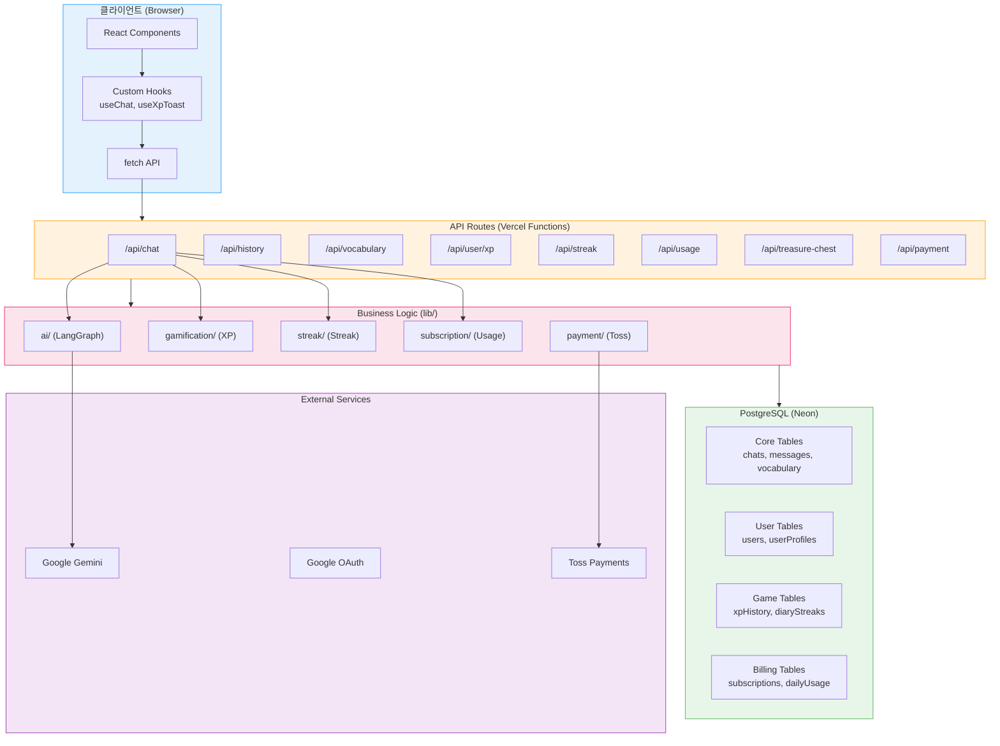
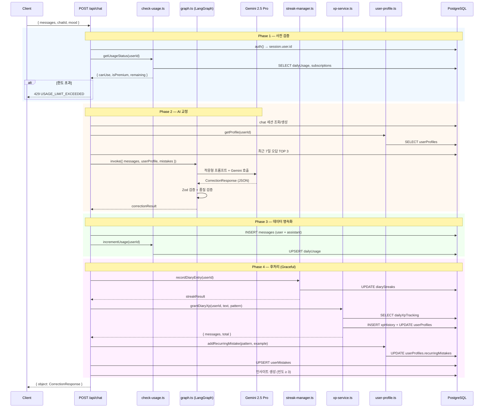
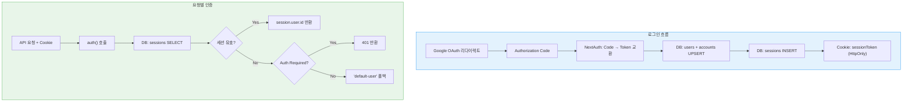
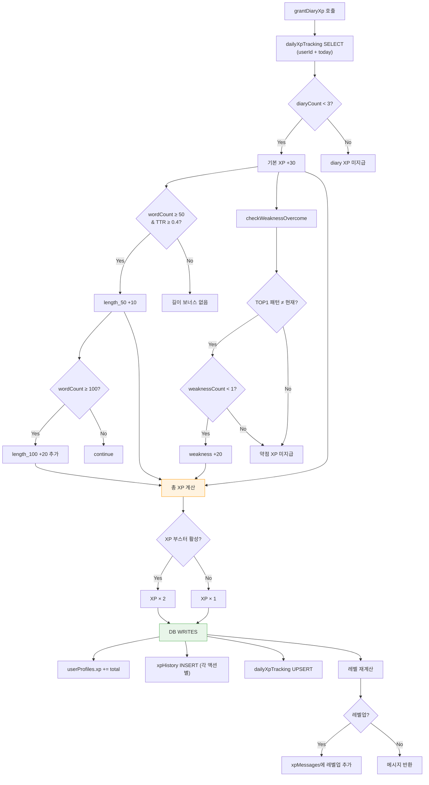
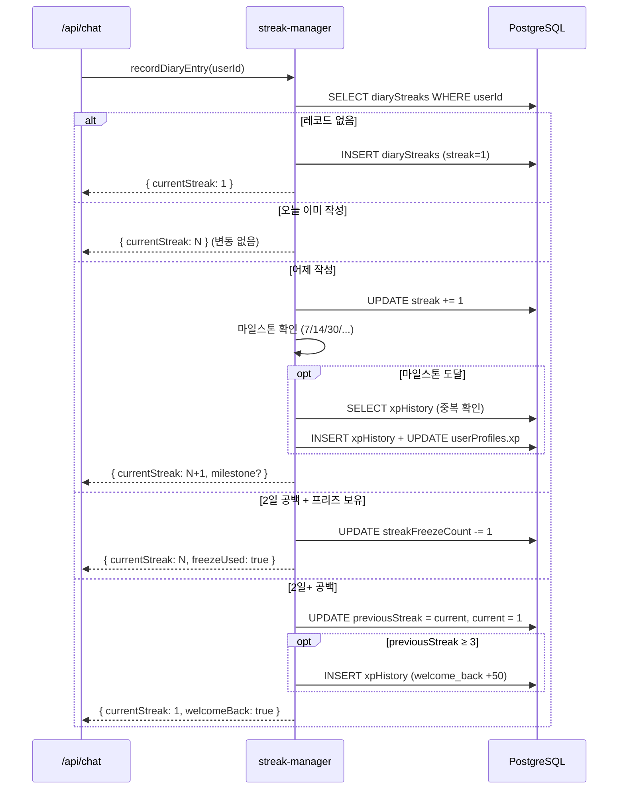
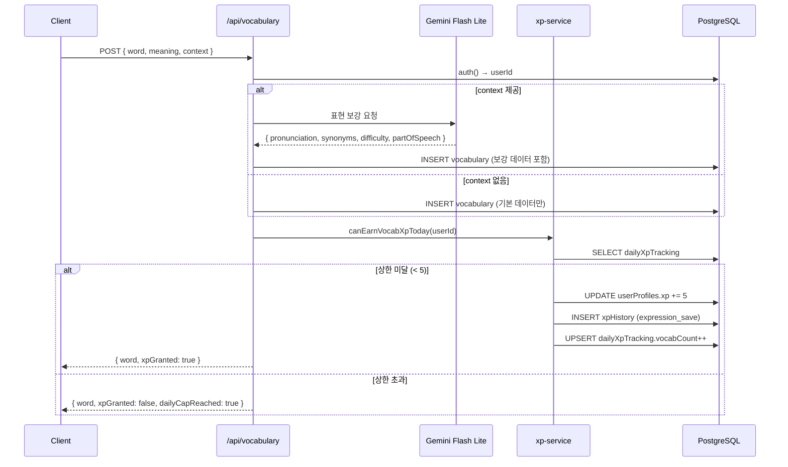
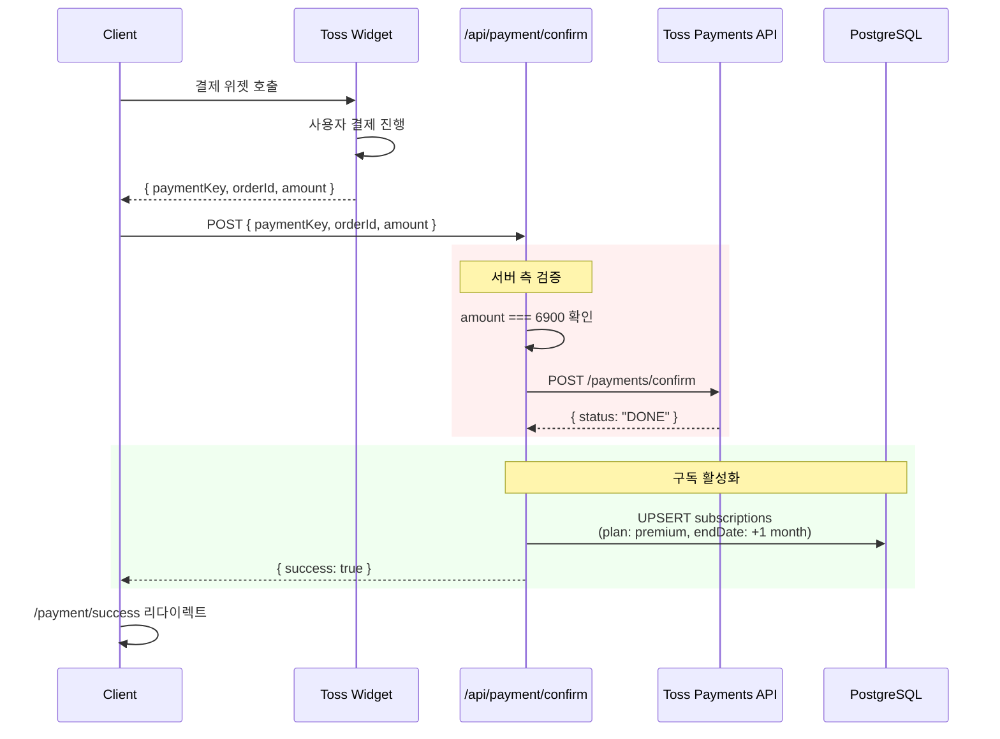
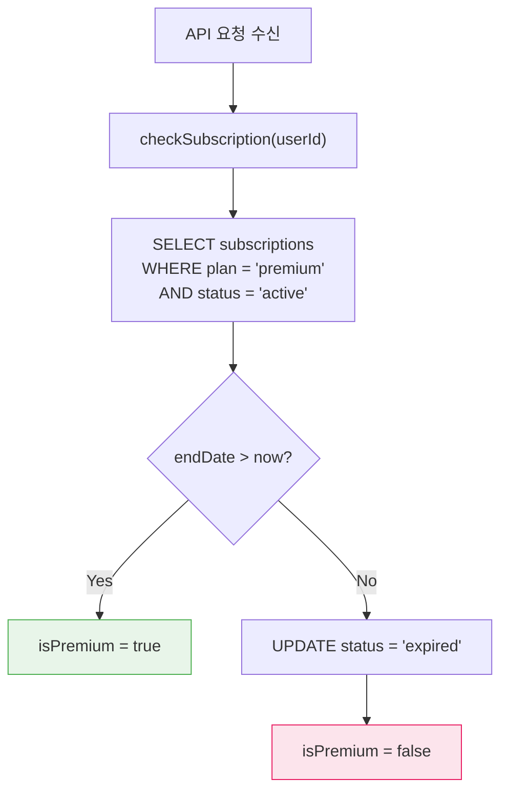
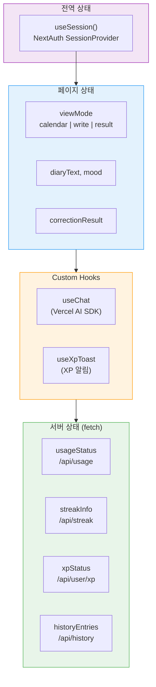
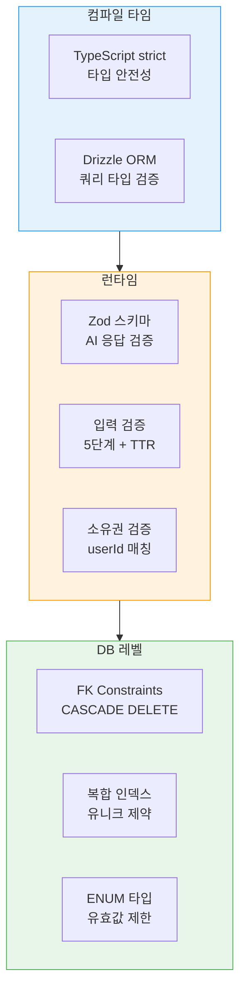

# 데이터 흐름 명세 (Data Flow Specification)

| 항목 | 값 |
|------|-----|
| **버전** | 1.0.0 |
| **상태** | `완료` |
| **최종 수정일** | 2026-02-12 |
| **관련 문서** | [SYSTEM-ARCHITECTURE.md](./SYSTEM-ARCHITECTURE.md) · [DATA-MODEL.md](../../architecture/DATA-MODEL.md) · [API-SPEC.md](../../architecture/API-SPEC.md) |

---

## 목차

1. [데이터 흐름 개요](#1-데이터-흐름-개요)
2. [핵심 플로우: 일기 교정](#2-핵심-플로우-일기-교정)
3. [인증 데이터 흐름](#3-인증-데이터-흐름)
4. [게이미피케이션 데이터 흐름](#4-게이미피케이션-데이터-흐름)
5. [표현노트 데이터 흐름](#5-표현노트-데이터-흐름)
6. [결제 데이터 흐름](#6-결제-데이터-흐름)
7. [클라이언트 상태 관리](#7-클라이언트-상태-관리)
8. [데이터 무결성 보장](#8-데이터-무결성-보장)

---

## 1. 데이터 흐름 개요

### 1.1 전체 데이터 흐름 맵



### 1.2 데이터 흐름 방향 원칙

| 원칙 | 설명 |
|------|------|
| **단방향 흐름** | Client → API → Logic → DB (쓰기) / DB → Logic → API → Client (읽기) |
| **서버 권위** | 모든 비즈니스 로직은 서버에서 실행, 클라이언트는 결과만 표시 |
| **DB 단일 원천** | PostgreSQL이 유일한 데이터 원천 (클라이언트 캐시 없음) |
| **Stateless API** | 각 요청은 독립적, 서버 측 인메모리 상태 없음 |

---

## 2. 핵심 플로우: 일기 교정

### 2.1 전체 시퀀스



### 2.2 Phase별 데이터 읽기/쓰기

| Phase | 읽기 (SELECT) | 쓰기 (INSERT/UPDATE) | 실패 시 |
|-------|-------------|---------------------|--------|
| 1. 사전 검증 | dailyUsage, subscriptions | - | 429 반환 |
| 2. AI 교정 | userProfiles, userMistakes, chats, messages | - | 500 반환 |
| 3. 영속화 | - | messages(×2), dailyUsage | 500 반환 |
| 4. 후처리 | diaryStreaks, dailyXpTracking, xpHistory | diaryStreaks, xpHistory, userProfiles, userMistakes | 로그만 (Graceful) |

### 2.3 데이터 변환 파이프라인

```
사용자 입력                    DB 저장                     클라이언트 표시
─────────────────────────────────────────────────────────────────────────
"Today I eat food"     →     messages.content        →     originalText
        │                         │                            │
   [Gemini 교정]             messages.content(asst)  →     correctedText
        │                         │
   [Zod 검증]              userMistakes.pattern      →     mistakeType
        │                         │
   [품질 검증]             userProfiles.xp            →     xpMessages[]
        │                         │
   [후처리]                 diaryStreaks.current       →     streakCount
```

---

## 3. 인증 데이터 흐름

### 3.1 세션 기반 인증 흐름



### 3.2 사용자 데이터 생성 순서

```
1. users 생성          ← NextAuth 최초 로그인
2. accounts 생성       ← Google OAuth 연결
3. sessions 생성       ← 세션 시작
4. userProfiles 생성   ← 첫 AI 교정 요청 시 (lazy)
5. diaryStreaks 생성   ← 첫 스트릭 조회 시 (lazy)
```

---

## 4. 게이미피케이션 데이터 흐름

### 4.1 XP 부여 데이터 흐름



### 4.2 XP 관련 테이블 쓰기 순서

| 순서 | 테이블 | 작업 | 데이터 |
|------|--------|------|--------|
| 1 | `dailyXpTracking` | SELECT | 일일 카운트 확인 |
| 2 | `userMistakes` | SELECT | TOP1 패턴 (7일) |
| 3 | `userProfiles` | UPDATE | xp += amount, xpLevel 재계산 |
| 4 | `xpHistory` | INSERT | 액션별 개별 기록 |
| 5 | `dailyXpTracking` | UPSERT | diaryCount++, weaknessCount++ |

### 4.3 스트릭 데이터 흐름



---

## 5. 표현노트 데이터 흐름

### 5.1 저장 흐름



### 5.2 CRUD 테이블 접근

| 작업 | 엔드포인트 | DB 읽기 | DB 쓰기 |
|------|-----------|--------|--------|
| 목록 조회 | `GET /api/vocabulary` | vocabulary (userId) | - |
| 저장 | `POST /api/vocabulary` | dailyXpTracking | vocabulary, xpHistory, dailyXpTracking, userProfiles |
| 수정 | `PATCH /api/vocabulary/[id]` | vocabulary (소유권) | vocabulary |
| 삭제 | `DELETE /api/vocabulary/[id]` | vocabulary (소유권) | vocabulary (DELETE) |

---

## 6. 결제 데이터 흐름

### 6.1 구독 결제 흐름



### 6.2 구독 만료 처리



### 6.3 결제 관련 테이블

| 테이블 | 시점 | 작업 |
|--------|------|------|
| `subscriptions` | 결제 성공 | UPSERT (plan=premium, endDate=+1mo) |
| `subscriptions` | 만료 확인 | UPDATE (status=expired) |
| `dailyUsage` | 매 교정 | SELECT (canUse 확인), UPSERT (count++) |
| `iapPurchases` | IAP 구매 | INSERT (상품 기록) |

---

## 7. 클라이언트 상태 관리

### 7.1 상태 관리 전략



### 7.2 상태 갱신 타이밍

| 상태 | 초기 로드 | 갱신 트리거 | 소스 |
|------|----------|-----------|------|
| `session` | 앱 시작 | 로그인/로그아웃 | NextAuth |
| `usageStatus` | 페이지 마운트 | 교정 완료 후 | `GET /api/usage` |
| `streakInfo` | 페이지 마운트 | 교정 완료 후 | `GET /api/streak` |
| `xpStatus` | 페이지 마운트 | 교정/표현 저장 후 | `GET /api/user/xp` |
| `correctionResult` | - | 교정 응답 수신 시 | `POST /api/chat` 응답 |
| `viewMode` | "calendar" | 사용자 액션 | useState |

### 7.3 교정 완료 후 갱신 순서

```
POST /api/chat 응답 수신
    │
    ├─ 1. correctionResult 상태 업데이트
    ├─ 2. viewMode → "result"
    ├─ 3. XP 토스트 메시지 표시 (500ms 간격)
    ├─ 4. fetch /api/usage → usageStatus 갱신
    ├─ 5. fetch /api/streak → streakInfo 갱신
    └─ 6. fetch /api/user/xp → xpStatus 갱신 (레벨업 확인)
```

### 7.4 데이터 미캐싱 전략

| 결정 | 근거 |
|------|------|
| 클라이언트 캐시 없음 | 실시간 정확성 우선 (XP, 스트릭, 사용량) |
| SWR/React Query 미사용 | 상태 단순성 유지, 복잡도 최소화 |
| 매 액션 후 재조회 | 서버 상태와 동기화 보장 |
| 낙관적 업데이트 없음 | 데이터 불일치 방지 |

---

## 8. 데이터 무결성 보장

### 8.1 무결성 전략



### 8.2 트랜잭션 범위

| 작업 | 트랜잭션 범위 | 실패 시 |
|------|-------------|--------|
| 메시지 저장 (user + assistant) | 단일 트랜잭션 | 500 반환 |
| XP 부여 (profile + history + tracking) | 개별 쿼리 | 로그만 (Graceful) |
| 스트릭 업데이트 | 단일 쿼리 | 로그만 (Graceful) |
| 구독 활성화 | 단일 쿼리 | 결제 실패 처리 |
| 보물상자 열기 (reward + log + side-effect) | 개별 쿼리 | 부분 적용 가능 |

### 8.3 데이터 일관성 복구

| 불일치 시나리오 | 발생 조건 | 자동 복구 |
|---------------|----------|----------|
| XP 미반영 | 후처리 실패 | 다음 교정 시 정상 적립 |
| 스트릭 미갱신 | 후처리 실패 | 다음 교정 시 정상 갱신 |
| 오답 미기록 | 후처리 실패 | 다음 교정 시 새로 기록 |
| 구독 만료 미처리 | 타이밍 이슈 | 다음 API 호출 시 자동 만료 |
| 사용량 카운트 오차 | UPSERT 경합 | KST 자정 리셋으로 해소 |

### 8.4 데이터 삭제 정책

| 삭제 트리거 | 영향 테이블 | CASCADE 동작 |
|-----------|-----------|-------------|
| 사용자 삭제 | accounts, sessions | CASCADE |
| 채팅 삭제 | messages | CASCADE |
| 표현 삭제 | vocabulary (단일 행) | 직접 DELETE |

> **참고**: 현재 사용자 계정 삭제 기능은 미구현. 향후 GDPR/개인정보보호법 대응 시 구현 필요.

### 8.5 시간대 일관성

| 데이터 | 저장 형식 | 표시 형식 | 일일 리셋 |
|--------|----------|----------|----------|
| `createdAt` (메시지, 채팅) | UTC (ISO 8601) | KST 변환 표시 | - |
| `lastWrittenAt` (스트릭) | KST 날짜 (`YYYY-MM-DD`) | 그대로 표시 | KST 00:00 |
| `date` (dailyUsage, dailyXpTracking) | KST 날짜 | - | KST 00:00 |
| `endDate` (subscriptions) | UTC | KST 변환 비교 | - |

**KST 변환 규칙**: `new Date().toLocaleDateString('ko-KR', { timeZone: 'Asia/Seoul' })`
