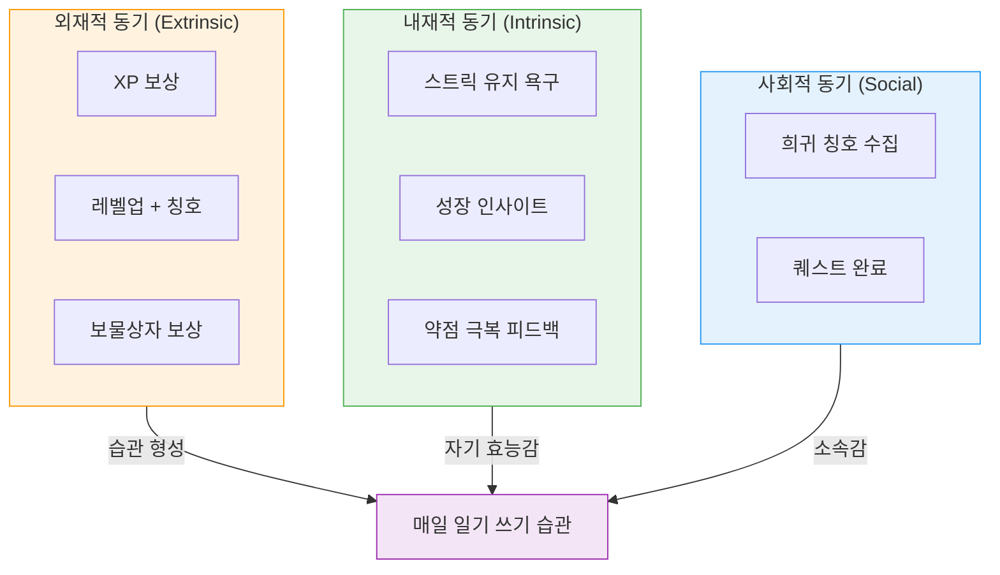
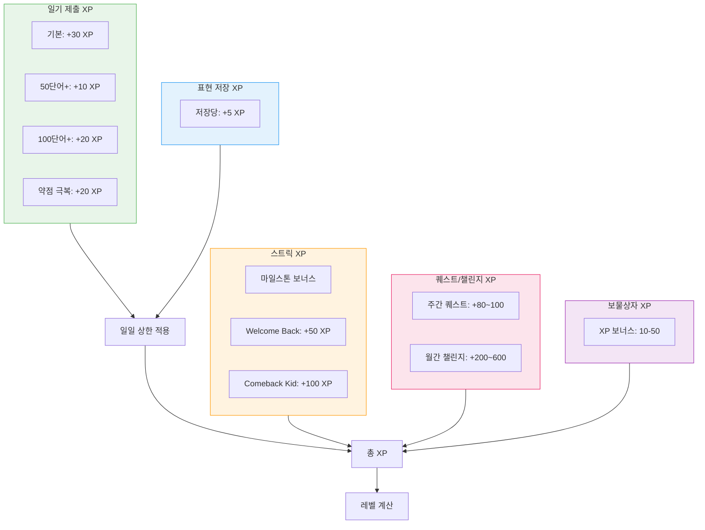
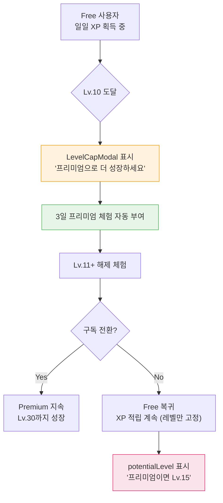
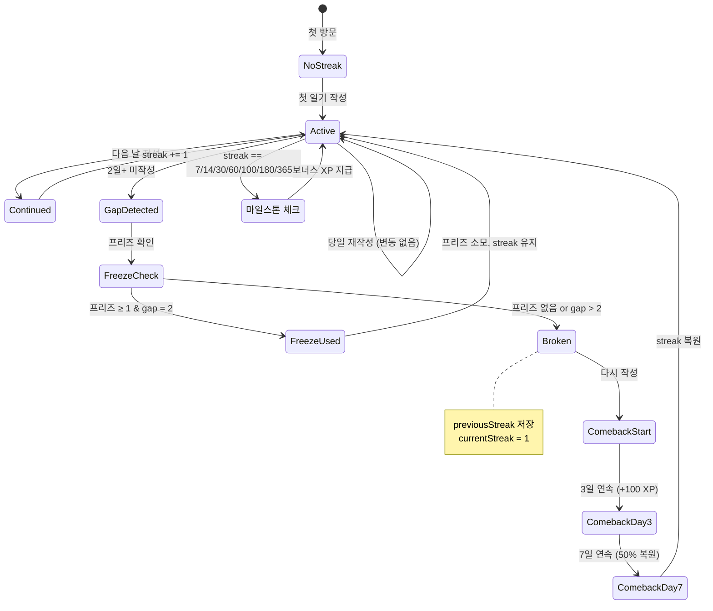
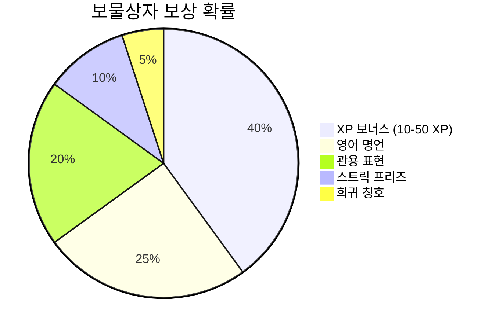
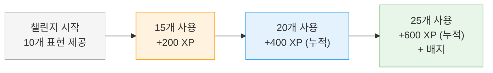
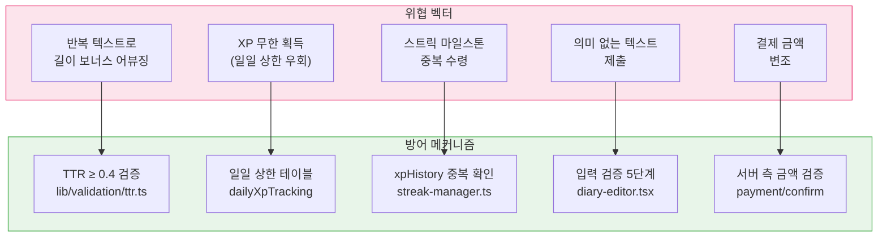
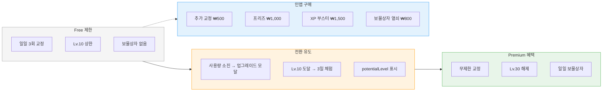

# 게이미피케이션 시스템 명세 (Gamification System Specification)

| 항목 | 값 |
|------|-----|
| **버전** | 1.0.0 |
| **상태** | `완료` |
| **최종 수정일** | 2026-02-12 |
| **관련 문서** | [COMMON-SYSTEMS.md](../../architecture/COMMON-SYSTEMS.md) · [DATA-FLOW-SPEC.md](./DATA-FLOW-SPEC.md) · [FUNCTIONAL-SPEC.md](../project/FUNCTIONAL-SPEC.md) |

---

## 목차

1. [설계 철학](#1-설계-철학)
2. [XP 시스템](#2-xp-시스템)
3. [레벨 시스템](#3-레벨-시스템)
4. [스트릭 시스템](#4-스트릭-시스템)
5. [보물상자 시스템](#5-보물상자-시스템)
6. [퀘스트 시스템](#6-퀘스트-시스템)
7. [월간 챌린지 시스템](#7-월간-챌린지-시스템)
8. [안티 게이밍 설계](#8-안티-게이밍-설계)
9. [수익화 연동](#9-수익화-연동)

---

## 1. 설계 철학

### 1.1 동기 부여 프레임워크



### 1.2 핵심 설계 원칙

| 원칙 | 적용 |
|------|------|
| **Variable Ratio Reinforcement** | 보물상자의 확률적 보상으로 기대감 유지 |
| **Loss Aversion** | 스트릭 손실 두려움으로 매일 작성 유도 |
| **Progress Visualization** | XP 바, 레벨 뱃지, 스트릭 카운터 |
| **Meaningful Choice** | 표현 저장, 프리즈 사용 등 전략적 선택 |
| **Anti-Inflation** | 일일 상한으로 XP 가치 유지 |

---

## 2. XP 시스템

### 2.1 XP 획득 구조



### 2.2 XP 보상 전체표

| 카테고리 | 액션 | XP | 일일 상한 | 트리거 조건 |
|---------|------|-----|---------|-----------|
| **일기** | diary_submit | +30 | 3회/일 | 교정 완료 |
| **일기** | length_50 | +10 | 3회 (일기 연동) | 50단어+ & TTR≥0.4 |
| **일기** | length_100 | +20 | 3회 (일기 연동) | 100단어+ & TTR≥0.4 |
| **일기** | weakness_overcome | +20 | 1회/일 | TOP1 실수 ≠ 현재 |
| **표현** | expression_save | +5 | 5회/일 | 표현노트 저장 |
| **스트릭** | streak_7d | +100 | 1회/계정 | 7일 연속 |
| **스트릭** | streak_14d | +200 | 1회/계정 | 14일 연속 |
| **스트릭** | streak_30d | +500 | 1회/계정 | 30일 연속 |
| **스트릭** | streak_60d | +1,000 | 1회/계정 | 60일 연속 |
| **스트릭** | streak_100d | +2,000 | 1회/계정 | 100일 연속 |
| **스트릭** | streak_180d | +3,500 | 1회/계정 | 180일 연속 |
| **스트릭** | streak_365d | +5,000 | 1회/계정 | 365일 연속 |
| **스트릭** | welcome_back | +50 | 1회 | 3일+ 공백 복귀 (prev≥3) |
| **스트릭** | comeback_kid | +100 | 1회 | 복귀 후 3일 연속 |
| **퀘스트** | weekly_quest | +80~100 | 3회/주 | 퀘스트 완료 |
| **챌린지** | monthly_15 | +200 | 1회/월 | 15개 표현 사용 |
| **챌린지** | monthly_20 | +400 | 1회/월 | 20개 표현 사용 |
| **챌린지** | monthly_25 | +600 | 1회/월 | 25개 표현 사용 |
| **보물상자** | treasure_chest | +25 (평균) | 1회/일 | Premium 전용 |

### 2.3 XP 부스터

| 항목 | 값 |
|------|-----|
| 배율 | 2x |
| 기본 지속 | 24시간 |
| 획득 방법 | IAP 구매, 보물상자 (향후) |
| 적용 범위 | 모든 XP 획득 |
| DB 필드 | `userProfiles.xpBoosterExpiresAt` |

### 2.4 grantDiaryXp 반환 구조

```typescript
interface DiaryXpResult {
  diary: { granted: boolean; xp: number };
  volume: { granted: boolean; xp: number; wordCount: number; ttr: number };
  weakness: { granted: boolean; xp: number; pattern: string | null };
  messages: string[];   // UI 표시용 메시지 배열
  total: number;        // 총 획득 XP
}
```

---

## 3. 레벨 시스템

### 3.1 레벨 진행 곡선

```
XP Required = floor(80 × level^1.7)

Level  Required    Cumulative   Title              Tier
─────────────────────────────────────────────────────────
  1        0            0       Diary Beginner     🌱
  2       80           80       Diary Beginner     🌱
  3      175          255       Diary Beginner     🌱
  4      289          544       Diary Beginner     🌱
  5      420          964       Diary Beginner     🌱
  6      568        1,532       Daily Writer       ✏️
  7      732        2,264       Daily Writer       ✏️
  8      912        3,176       Daily Writer       ✏️
  9    1,107        4,283       Daily Writer       ✏️
 10    1,318        5,601       Daily Writer       ✏️  ← FREE CAP
─────────────────────────────────────────────────────────
 11    1,544        7,145       Story Teller       📖
 15    2,812       16,413       Story Teller       📖
 16    3,136       19,549       Word Crafter       🛠️
 20    4,891       36,440       Word Crafter       🛠️
 21    5,350       41,790       English Native     🌍
 25    7,885       66,940       English Native     🌍
 26    8,523       75,463       Master Author      👑
 30   12,143      116,006       Master Author      👑
```

### 3.2 티어별 도달 시뮬레이션

| 티어 | 레벨 | Free 도달 | Premium 도달 | 계산 근거 |
|------|------|----------|-------------|----------|
| 🌱 Beginner | 1-5 | ~2주 | ~1주 | 일일 ~65 XP (Free) |
| ✏️ Writer | 6-10 | ~2개월 | ~1개월 | 일일 ~65 XP / ~130 XP |
| 📖 Teller | 11-15 | ❌ (Lv.10 캡) | ~2.5개월 | Premium only |
| 🛠️ Crafter | 16-20 | ❌ | ~4개월 | Premium only |
| 🌍 Native | 21-25 | ❌ | ~5.5개월 | Premium only |
| 👑 Master | 26-30 | ❌ | ~7.2개월 | Premium only |

### 3.3 Free → Premium 전환 유도



### 3.4 레벨업 이벤트

| 이벤트 | 트리거 | UI 반응 | 데이터 |
|--------|--------|--------|--------|
| 일반 레벨업 | XP ≥ 다음 레벨 필요량 | LevelupModal 표시 | 새 레벨, 새 칭호 |
| 티어 변경 | 레벨이 티어 경계 통과 | LevelupModal + 칭호 | 새 티어 칭호 |
| Lv.10 도달 (Free) | Free 사용자 Lv.10 | LevelCapModal + TrialModal | 3일 체험 |
| Lv.10 캡 (Free) | Free + XP 초과 | LevelCapModal | potentialLevel |

---

## 4. 스트릭 시스템

### 4.1 상태 전이 다이어그램



### 4.2 스트릭 데이터 모델

```typescript
interface StreakInfo {
  currentStreak: number;          // 현재 연속일
  longestStreak: number;          // 최장 기록
  lastWrittenAt: string;          // 마지막 작성일 (KST)
  totalEntries: number;           // 총 일기 수
  wroteToday: boolean;            // 오늘 작성 여부
  freezeCount: number;            // 보유 프리즈 (0-2)
  freezeUsedToday: boolean;       // 오늘 프리즈 사용 여부
  comebackStatus: {
    isComeback: boolean;          // 복귀 모드 여부
    comebackDays: number;         // 복귀 후 연속일
    previousStreak: number;       // 끊기기 전 스트릭
  };
  welcomeBackBonus: boolean;      // Welcome Back 보너스 지급 여부
}
```

### 4.3 프리즈 메커니즘

| 규칙 | 값 |
|------|-----|
| 최대 보유 | 2개 |
| 소모 조건 | 2일 공백 + 프리즈 ≥ 1 |
| 획득 방법 | IAP 구매 (₩1,000), 보물상자 (10%) |
| 소모 시점 | 다음 일기 작성 시 자동 소모 |
| DB 필드 | `userProfiles.streakFreezeCount` |

### 4.4 복귀 (Comeback) 메커니즘

| 마일스톤 | 보상 | 조건 |
|---------|------|------|
| 복귀 시작 | Welcome Back +50 XP | gap ≥ 3일 & previousStreak ≥ 3 |
| 복귀 3일차 | Comeback Kid +100 XP | 복귀 후 3일 연속 |
| 복귀 7일차 | 50% 스트릭 복원 | 복귀 후 7일 연속 |

**복원 예시**: 이전 스트릭 20일 → 끊김 → 7일 연속 복귀 → 10일 복원 (20 × 0.5)

### 4.5 시간대 처리

| 항목 | 값 |
|------|-----|
| 기준 시간대 | KST (UTC+9) |
| 일일 리셋 | KST 00:00 |
| "오늘" 판정 | KST 날짜 기준 |
| "어제" 판정 | KST 날짜 - 1 |

---

## 5. 보물상자 시스템

### 5.1 보상 확률 분포



### 5.2 보상 상세

| 보상 | 확률 | 내용 | 사이드 이펙트 |
|------|------|------|-------------|
| **xp_bonus** | 40% | 10-50 XP 랜덤 | `grantXp()` 호출 |
| **quote** | 25% | 유명 인사 명언 + 한국어 번역 | 표시만 |
| **rare_expression** | 20% | 관용 표현 + 의미 + 난이도 | `vocabulary`에 자동 추가 |
| **streak_freeze** | 10% | 프리즈 +1 | `streakFreezeCount` 증가 |
| **rare_title** | 5% | 8개 중 랜덤 칭호 | `earnedTitles`에 추가 |

### 5.3 확률 조정 규칙

| 조건 | 조정 |
|------|------|
| 프리즈 2개 보유 시 | streak_freeze(10%) → xp_bonus로 전환 (xp_bonus = 50%) |

### 5.4 열기 방식

| 방식 | 조건 | API |
|------|------|-----|
| 일일 무료 | Premium 구독 + 당일 미열기 | `POST /api/treasure-chest/open` |
| 열쇠 사용 | 열쇠 1개 이상 보유 | `POST /api/treasure-chest/open-with-key` |

### 5.5 희귀 칭호 풀

| 칭호 | 확률 (전체) | 설명 |
|------|-----------|------|
| Night Owl | 0.625% | 밤 시간대 작성자 |
| Weekend Warrior | 0.625% | 주말 작성자 |
| Morning Person | 0.625% | 아침 작성자 |
| Consistency King | 0.625% | 꾸준한 작성자 |
| Word Wizard | 0.625% | 다양한 어휘 사용자 |
| Grammar Guru | 0.625% | 문법 마스터 |
| Expression Expert | 0.625% | 표현 달인 |
| Diary Devotee | 0.625% | 일기 헌신자 |

---

## 6. 퀘스트 시스템

### 6.1 주간 퀘스트

| 항목 | 값 |
|------|-----|
| 생성 주기 | 매주 월요일 |
| 퀘스트 수 | 3개/주 |
| XP 보상 | 80-100 XP/퀘스트 |
| 만료 | 해당 주 일요일 |

### 6.2 퀘스트 유형

| 유형 | 설명 | 예시 | 추적 방식 |
|------|------|------|----------|
| `frequency` | 빈도 기반 | "이번 주 일기 5편 작성" | diary_submit 카운트 |
| `challenge` | 도전 과제 | "100단어 이상 일기 3편" | length 조건 + 카운트 |
| `expression` | 표현 활용 | "표현노트에 10개 저장" | expression_save 카운트 |
| `length` | 길이 도전 | "총 500단어 작성" | 누적 wordCount |
| `perfect` | 정확도 | "오류 없는 일기 2편" | mistakeType === null |

### 6.3 데이터 모델

```typescript
// weeklyQuests 테이블
interface WeeklyQuest {
  id: string;
  weekStart: string;        // 주 시작일 (월요일)
  slot: 1 | 2 | 3;         // 슬롯 번호
  questType: QuestType;
  description: string;      // 한국어 퀘스트 설명
  targetCount: number;      // 목표 수
  xpReward: number;         // 완료 시 XP
}

// userQuestProgress 테이블
interface UserQuestProgress {
  id: string;
  userId: string;
  questId: string;
  currentCount: number;     // 현재 진행
  completed: boolean;
  completedAt: string | null;
}
```

---

## 7. 월간 챌린지 시스템

### 7.1 챌린지 구조

| 항목 | 값 |
|------|-----|
| 생성 주기 | 매월 1일 |
| 표현 수 | 10개/월 |
| 테마 | 월별 주제 (여행, 음식, 감정 등) |
| 기간 | 1일 ~ 말일 |

### 7.2 보상 단계



### 7.3 데이터 모델

```typescript
// monthlyChallenges 테이블
interface MonthlyChallenge {
  id: string;
  year: number;
  month: number;
  theme: string;              // 테마명
  expressions: string[];      // 10개 표현 목록
  xpReward: number;           // 최대 XP
  badgeName: string;          // 완료 배지명
}

// userChallengeProgress 테이블
interface UserChallengeProgress {
  id: string;
  userId: string;
  challengeId: string;
  usedExpressions: string[];  // 사용한 표현 목록
  completed: boolean;
  completedAt: string | null;
}
```

---

## 8. 안티 게이밍 설계

### 8.1 위협 모델 및 방어



### 8.2 TTR (Type-Token Ratio) 검증

| 항목 | 값 |
|------|-----|
| **공식** | `uniqueWords / totalWords` |
| **최소 임계값** | 0.4 (40% 고유 단어) |
| **적용 대상** | 길이 보너스 (length_50, length_100) |
| **미달 시** | 길이 보너스 미지급 (기본 XP는 지급) |
| **구현** | `lib/validation/ttr.ts` |

**예시**:
- "I love my family and friends" → TTR = 6/6 = 1.0 ✅
- "happy happy happy happy happy" → TTR = 1/5 = 0.2 ❌

### 8.3 일일 상한 매트릭스

| 액션 | 일일 상한 | DB 추적 | 초과 시 |
|------|---------|---------|--------|
| diary_submit | 3회 | `dailyXpTracking.diaryCount` | XP 미지급 |
| expression_save | 5회 | `dailyXpTracking.vocabCount` | XP 미지급 |
| weakness_overcome | 1회 | `dailyXpTracking.weaknessOvercomeCount` | XP 미지급 |
| treasure_chest | 1회/일 | `treasureChestLog` 날짜 확인 | 열기 불가 |
| weekly_quest | 3회/주 | `userQuestProgress.completed` | 퀘스트 없음 |

### 8.4 경제 시뮬레이션 (일일 최대 XP)

| 구분 | Free | Premium |
|------|------|---------|
| 일기 기본 (3×30) | 90 | 90 |
| 길이 보너스 (3×30) | 90 | 90 |
| 약점 극복 (1×20) | 20 | 20 |
| 표현 저장 (5×5) | 25 | 25 |
| 보물상자 (1×25 avg) | 0 | 25 |
| **일일 최대** | **225** | **250** |

> **Lv.30 도달 예상**: Premium 기준 약 7.2개월 (250 XP/일 × 215일 ≈ 53,750 XP → 약 Lv.28)

---

## 9. 수익화 연동

### 9.1 게이미피케이션 ↔ 수익화 접점



### 9.2 전환 퍼널 설계

| 단계 | 트리거 | 사용자 액션 | 전환율 예상 |
|------|--------|-----------|-----------|
| 인지 | 일일 3회 소진 | 업그레이드 모달 확인 | - |
| 관심 | Lv.10 도달 | 레벨 캡 모달 확인 | - |
| 체험 | 자동 3일 체험 | Lv.11+ 및 보물상자 체험 | - |
| 전환 | 체험 만료 | 구독 결제 | 목표 5-10% |
| 유지 | 매일 사용 | 스트릭 + 퀘스트 + 레벨링 | 목표 70% (월) |
