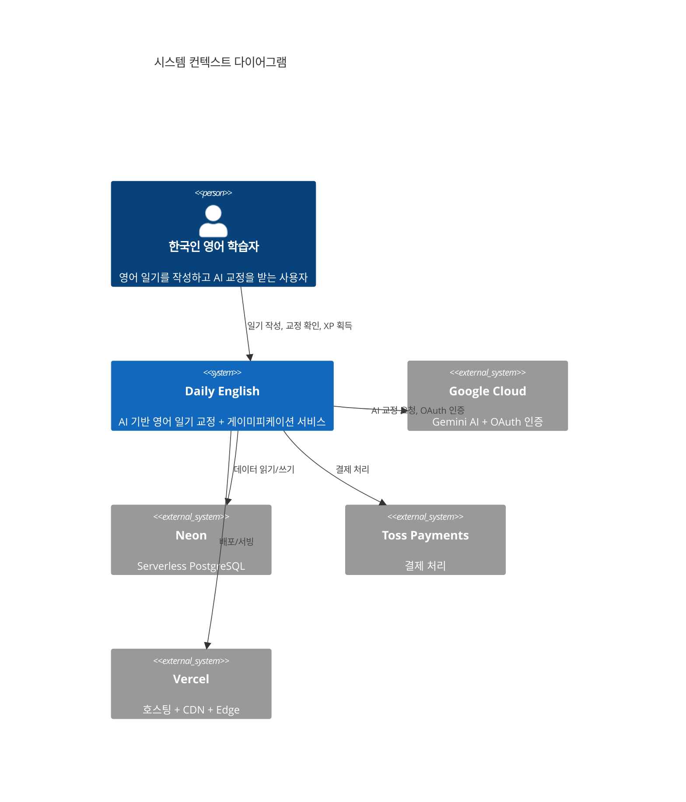
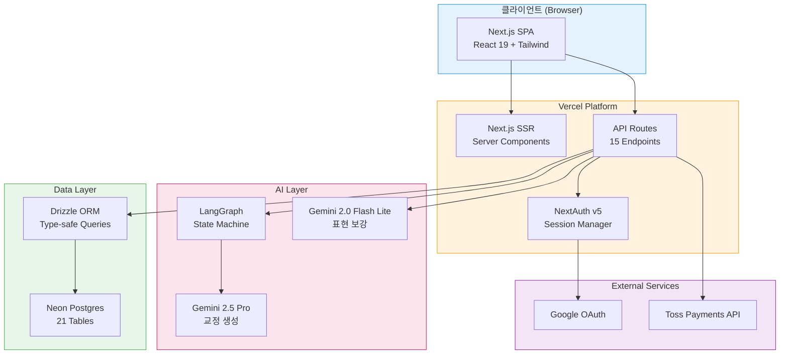
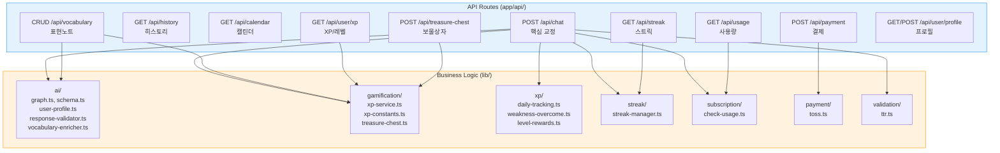
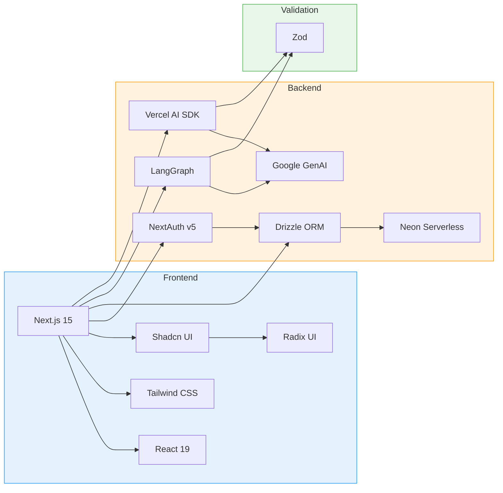
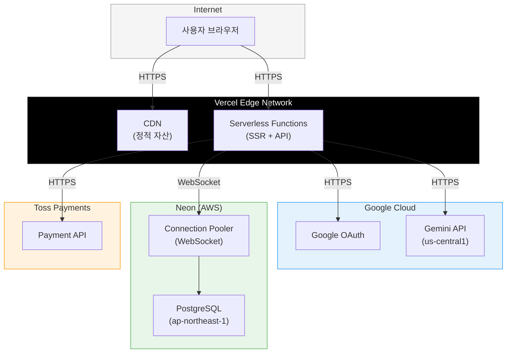
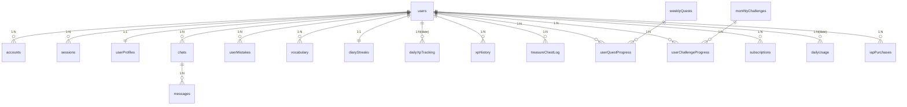
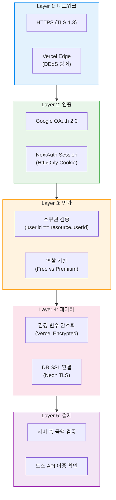

# 시스템 아키텍처 명세 (System Architecture Specification)

| 항목 | 값 |
|------|-----|
| **버전** | 1.0.0 |
| **상태** | `완료` |
| **최종 수정일** | 2026-02-12 |
| **관련 문서** | [OVERVIEW.md](../../architecture/OVERVIEW.md) · [DATA-FLOW-SPEC.md](./DATA-FLOW-SPEC.md) · [AI-PIPELINE-SPEC.md](./AI-PIPELINE-SPEC.md) |

---

## 목차

1. [시스템 개요](#1-시스템-개요)
2. [C4 모델 아키텍처](#2-c4-모델-아키텍처)
3. [기술 스택](#3-기술-스택)
4. [배포 아키텍처](#4-배포-아키텍처)
5. [데이터 아키텍처](#5-데이터-아키텍처)
6. [보안 아키텍처](#6-보안-아키텍처)
7. [성능 설계](#7-성능-설계)
8. [설계 결정 기록](#8-설계-결정-기록-adr)

---

## 1. 시스템 개요

### 1.1 시스템 컨텍스트

Daily English는 한국인 영어 학습자를 위한 AI 기반 일기 교정 SaaS이다. 사용자가 영어 일기를 작성하면 Google Gemini가 교정하고, 게이미피케이션이 학습 지속성을 유지한다.

```
┌───────────────────────────────────────────────────┐
│                   Daily English                    │
│                                                     │
│  ┌─────────┐   ┌──────────┐   ┌─────────────────┐ │
│  │ Next.js  │──▶│ API      │──▶│ Google Gemini   │ │
│  │ Frontend │   │ Routes   │   │ 2.5 Pro         │ │
│  └─────────┘   └──────────┘   └─────────────────┘ │
│                      │                               │
│                      ▼                               │
│              ┌──────────────┐                        │
│              │ Neon Postgres │                        │
│              │ (21 Tables)   │                        │
│              └──────────────┘                        │
│                      │                               │
│              ┌──────────────┐                        │
│              │ Toss Payments │                        │
│              └──────────────┘                        │
└───────────────────────────────────────────────────┘
```

### 1.2 핵심 설계 원칙

| 원칙 | 적용 |
|------|------|
| **Server-First** | Next.js App Router의 Server Component 우선 사용 |
| **Graceful Degradation** | 부가 기능 실패가 핵심 AI 교정을 차단하지 않음 |
| **Stateless API** | 세션 외 서버 측 상태 없음, Serverless 호환 |
| **Single Source of Truth** | PostgreSQL이 모든 비즈니스 상태의 유일한 원천 |
| **Type Safety** | TypeScript strict + Zod 런타임 검증 이중 안전망 |

---

## 2. C4 모델 아키텍처

### 2.1 Level 1: System Context



### 2.2 Level 2: Container Diagram



### 2.3 Level 3: Component Diagram (API Layer)



---

## 3. 기술 스택

### 3.1 기술 스택 매트릭스

| 계층 | 기술 | 버전 | 선택 이유 |
|------|------|------|----------|
| **Framework** | Next.js | 15.1.0 | App Router + React 19 + Vercel 최적화 |
| **Language** | TypeScript | 5.7.0 | Strict mode, 타입 안전성 |
| **Runtime** | React | 19.0.0 | Server Components, Streaming |
| **AI Model** | Google Gemini 2.5 Pro | Latest | 한국어 이해도, 비용 효율 |
| **AI Orchestration** | LangGraph | 1.0.7 | State machine 기반 워크플로우 |
| **AI SDK** | Vercel AI SDK | 4.0.0 | 구조화된 응답 생성 |
| **Database** | Neon Postgres | Serverless | WebSocket 기반, Edge 호환 |
| **ORM** | Drizzle | 0.36.0 | Type-safe, 경량, SQL-like API |
| **Auth** | NextAuth v5 | beta.30 | Google OAuth, Drizzle 어댑터 |
| **UI** | Shadcn UI + Radix | Latest | 접근성, 커스터마이징 |
| **Styling** | Tailwind CSS | 3.4.0 | Utility-first, 디자인 시스템 통합 |
| **Validation** | Zod | 3.24.0 | 런타임 스키마 검증 |
| **Payment** | Toss Payments | API v1 | 한국 PG, REST API |
| **Hosting** | Vercel | Edge | Serverless, CDN, 자동 확장 |

### 3.2 의존성 관계



---

## 4. 배포 아키텍처

### 4.1 인프라 구성



### 4.2 환경 구성

| 환경 | 브랜치 | URL | DB |
|------|--------|-----|-----|
| **Production** | `main` | dailyenglish.app | Neon main |
| **Preview** | PR 브랜치 | *.vercel.app | Neon dev |
| **Development** | `develop` | localhost:3000 | Neon dev |

### 4.3 환경 변수

| 변수 | 용도 | 필수 |
|------|------|------|
| `GOOGLE_GENERATIVE_AI_API_KEY` | Gemini API (Vercel AI SDK) | ✅ |
| `GOOGLE_API_KEY` | Gemini API (LangChain) | ✅ |
| `DATABASE_URL` | Neon PostgreSQL 연결 | ✅ |
| `AUTH_SECRET` | NextAuth 세션 암호화 | ✅ |
| `GOOGLE_CLIENT_ID` | Google OAuth 클라이언트 | ✅ |
| `GOOGLE_CLIENT_SECRET` | Google OAuth 시크릿 | ✅ |
| `TOSS_SECRET_KEY` | 토스페이먼츠 시크릿 | ⚠️ 결제 시 필수 |

### 4.4 Vercel Function 제약

| 제약 | 값 | 영향 |
|------|-----|------|
| 최대 실행 시간 | 60초 (Hobby) | `POST /api/chat`에 `maxDuration = 60` 설정 |
| 메모리 | 1024MB | AI 응답 파싱에 충분 |
| 페이로드 크기 | 4.5MB | 일기 텍스트 충분 |
| Cold Start | ~500ms | Serverless 특성 |

---

## 5. 데이터 아키텍처

### 5.1 도메인별 테이블 구조



### 5.2 도메인 분류

| 도메인 | 테이블 | 용도 |
|--------|-------|------|
| **Auth** | users, accounts, sessions, verificationTokens | NextAuth v5 인증 |
| **Core** | chats, messages, userProfiles, userMistakes, vocabulary, learningStats | 핵심 비즈니스 |
| **Gamification** | diaryStreaks, dailyXpTracking, xpHistory, treasureChestLog, weeklyQuests, userQuestProgress, monthlyChallenges, userChallengeProgress | 게이미피케이션 |
| **Billing** | subscriptions, dailyUsage, iapPurchases | 구독/결제 |

### 5.3 핵심 인덱스 전략

| 테이블 | 인덱스 | 용도 |
|--------|--------|------|
| chats | `(userId, createdAt)` | 사용자별 최신 일기 조회 |
| messages | `(chatId)` | 채팅별 메시지 조회 |
| userMistakes | `(userId, mistakeType)` | 사용자별 실수 유형 집계 |
| dailyXpTracking | `(userId, date)` | 일일 XP 상한 확인 |
| xpHistory | `(userId, action)` | 마일스톤 중복 확인 |
| dailyUsage | `(userId, date)` | 일일 사용량 확인 |
| vocabulary | `(userId)` | 사용자별 표현 목록 |

### 5.4 JSONB 필드 스키마

#### `userProfiles.recurringMistakes`

```json
[
  {
    "pattern": "tense-confusion",
    "examples": ["I eat lunch yesterday", "She go to school"],
    "count": 5,
    "lastSeen": "2026-02-12"
  }
]
```

#### `userProfiles.earnedTitles`

```json
["Diary Beginner", "Daily Writer", "Night Owl"]
```

#### `userProfiles.learningPreferences`

```json
{
  "preferredExplanationStyle": "detailed",
  "focusAreas": ["grammar:tense"],
  "lv10_trial_claimed": true
}
```

---

## 6. 보안 아키텍처

### 6.1 보안 계층



### 6.2 인증/인가 매트릭스

| API | 인증 | 소유권 검증 | 구독 확인 |
|-----|------|-----------|----------|
| `POST /api/chat` | Optional | - | 사용량 체크 |
| `GET /api/history` | Required | - | - |
| `GET /api/history/[id]` | Required | ✅ chatId 소유 | - |
| `DELETE /api/vocabulary/[id]` | Required | ✅ vocab 소유 | - |
| `PATCH /api/vocabulary/[id]` | Required | ✅ vocab 소유 | - |
| `POST /api/treasure-chest/open` | Required | - | Premium 필수 |
| `POST /api/payment/confirm` | Required | - | 금액 검증 |

### 6.3 안티 게이밍 (Anti-Gaming) 방어

| 공격 벡터 | 방어 기제 | 구현 위치 |
|----------|----------|----------|
| XP 무한 획득 | 일일 상한 (3 diary, 5 vocab, 1 weakness) | `dailyXpTracking` 테이블 |
| 반복 텍스트로 길이 보너스 | TTR ≥ 0.4 검증 | `lib/validation/ttr.ts` |
| 중복 단어 스패밍 | 50% 중복 단어 차단 | `diary-editor.tsx` 입력 검증 |
| 스트릭 마일스톤 중복 수령 | `xpHistory`에서 중복 확인 | `streak-manager.ts` |
| 무료 사용 초과 | 서버 측 `dailyUsage` 확인 | `check-usage.ts` |
| 결제 금액 조작 | 서버 측 ₩6,900 고정 검증 | `payment/confirm/route.ts` |

---

## 7. 성능 설계

### 7.1 응답 시간 목표

| 엔드포인트 | P50 목표 | P95 목표 | 병목 |
|-----------|---------|---------|------|
| `POST /api/chat` | 5초 | 15초 | Gemini API 호출 |
| `GET /api/history` | 100ms | 300ms | DB 쿼리 |
| `GET /api/calendar` | 100ms | 300ms | DB 쿼리 |
| `GET /api/vocabulary` | 50ms | 200ms | DB 쿼리 |
| `GET /api/user/xp` | 50ms | 200ms | DB 쿼리 |
| `GET /api/streak` | 50ms | 200ms | DB 쿼리 |
| `GET /api/usage` | 50ms | 200ms | DB 쿼리 |

### 7.2 최적화 전략

| 전략 | 적용 대상 | 효과 |
|------|----------|------|
| **WebSocket DB 연결** | Neon Serverless Driver | Cold Start 연결 비용 제거 |
| **프롬프트 최적화** | LangGraph 시스템 프롬프트 | AI 응답 시간 단축 |
| **비동기 후처리** | XP, 스트릭, 오답 기록 | AI 응답 후 병렬 처리 |
| **복합 인덱스** | (userId, date), (userId, createdAt) | DB 쿼리 최적화 |
| **JSON 스트리밍** | Vercel AI SDK | 체감 응답 시간 단축 |

### 7.3 확장성 모델

```
                    요청
                     │
                     ▼
              ┌─────────────┐
              │ Vercel CDN   │ ← 정적 자산 캐싱
              └──────┬──────┘
                     │
              ┌──────▼──────┐
              │ Serverless   │ ← 자동 확장 (0 → N instances)
              │ Functions    │
              └──────┬──────┘
                     │
              ┌──────▼──────┐
              │ Neon Pooler  │ ← 연결 풀링 (WebSocket)
              │              │
              └──────┬──────┘
                     │
              ┌──────▼──────┐
              │ PostgreSQL   │ ← Autoscaling Compute
              └─────────────┘
```

---

## 8. 설계 결정 기록 (ADR)

### ADR-001: Next.js App Router 채택

| 항목 | 내용 |
|------|------|
| **상태** | 승인 |
| **맥락** | 풀스택 프레임워크 선정 필요 |
| **결정** | Next.js 15 App Router |
| **근거** | Server Components로 초기 로드 최적화, API Routes로 백엔드 통합, Vercel 네이티브 지원 |
| **대안 검토** | Remix (생태계 작음), Express + React (배포 복잡도), Nuxt (Vue 생태계) |

### ADR-002: Google Gemini 2.5 Pro 선택

| 항목 | 내용 |
|------|------|
| **상태** | 승인 |
| **맥락** | AI 일기 교정 모델 선정 |
| **결정** | Gemini 2.5 Pro (주 교정) + Gemini 2.0 Flash Lite (표현 보강) |
| **근거** | 한국어 이해도 우수, 비용 효율적, 구조화된 JSON 출력 안정적 |
| **대안 검토** | OpenAI GPT-4o (비용 高), Claude (한국어 약함 당시), Llama (자체 호스팅 부담) |

### ADR-003: Neon Serverless PostgreSQL 채택

| 항목 | 내용 |
|------|------|
| **상태** | 승인 |
| **맥락** | Serverless 환경에 적합한 DB 필요 |
| **결정** | Neon Serverless PostgreSQL |
| **근거** | WebSocket 기반 연결 (Serverless 호환), Drizzle ORM 네이티브 지원, PITR 백업, 서울 리전 |
| **대안 검토** | PlanetScale (MySQL), Supabase (Auth 중복), MongoDB Atlas (스키마 유연성 불필요) |

### ADR-004: LangGraph State Machine 도입

| 항목 | 내용 |
|------|------|
| **상태** | 승인 |
| **맥락** | AI 파이프라인 오케스트레이션 필요 |
| **결정** | LangGraph StateGraph (2-node) |
| **근거** | 명시적 상태 관리, 노드 간 데이터 전달, 확장 용이 (노드 추가), 에러 복구 명확 |
| **대안 검토** | 단순 함수 체이닝 (상태 관리 어려움), LangChain Chains (유연성 부족) |

### ADR-005: 게이미피케이션 일일 상한 도입

| 항목 | 내용 |
|------|------|
| **상태** | 승인 |
| **맥락** | XP 인플레이션 방지 필요 |
| **결정** | 일일 상한 (diary 3, vocab 5, weakness 1) + TTR 검증 |
| **근거** | 공정한 진도, 의미 있는 학습 유도, 7.2개월 Lv.30 도달 목표 |
| **트레이드오프** | 열정적 사용자 좌절 가능 → Premium 전환 유도로 해소 |

### ADR-006: Graceful Degradation 정책

| 항목 | 내용 |
|------|------|
| **상태** | 승인 |
| **맥락** | 부가 기능 실패 시 전체 요청 실패 방지 |
| **결정** | 핵심 AI 교정은 항상 반환, 부가 기능(XP, 스트릭, 오답)은 try-catch로 격리 |
| **근거** | 사용자 경험 보호, 부분 실패 허용, 로그 기반 사후 복구 |
| **영향** | XP/스트릭 불일치 가능 → 다음 요청 시 자연 복구 |
