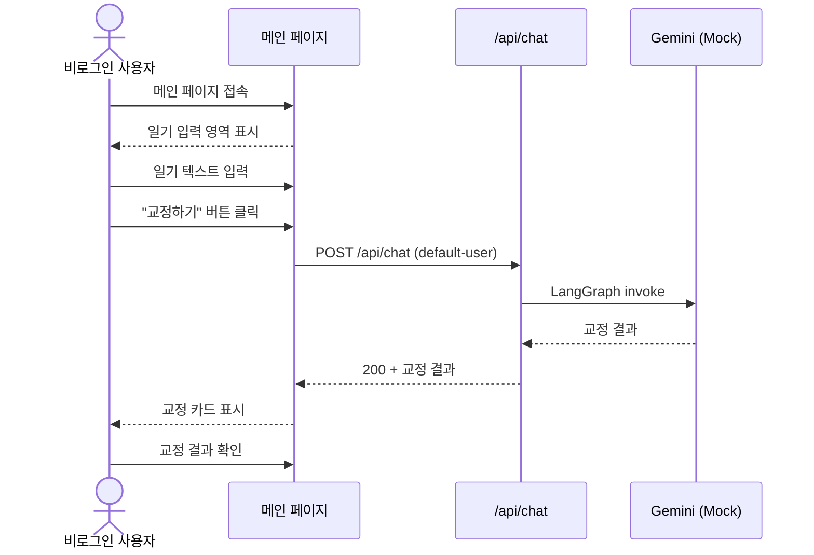
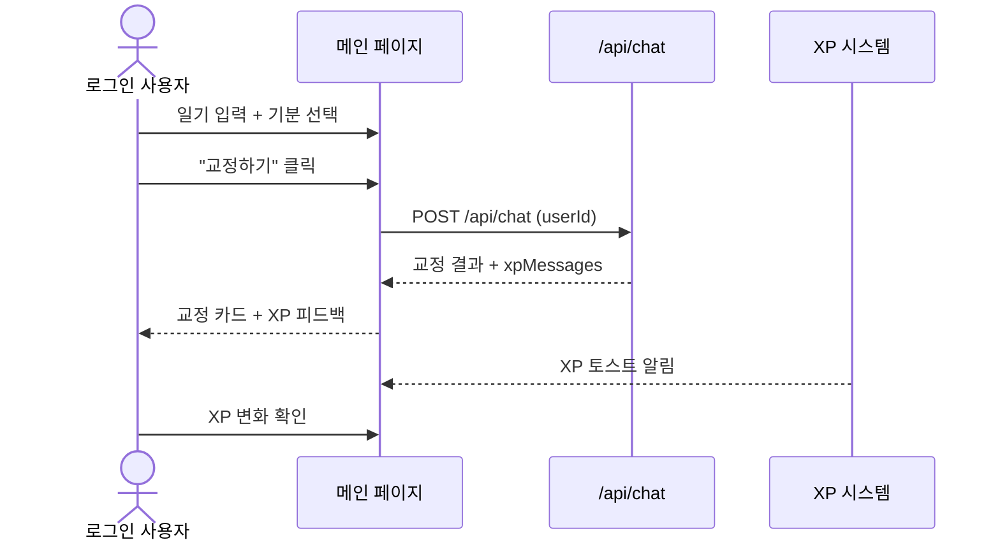
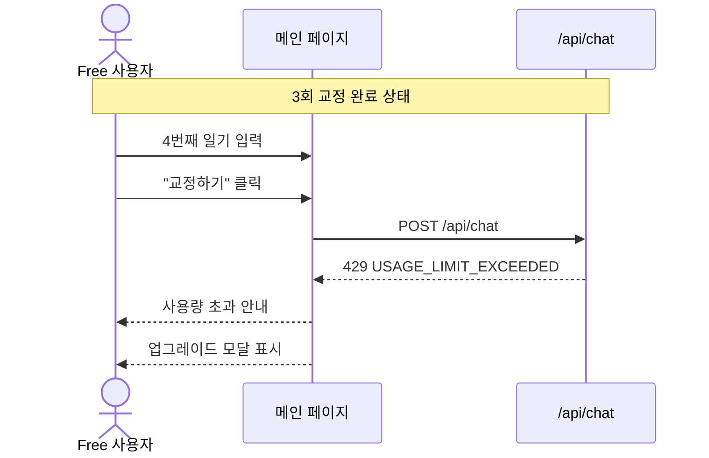
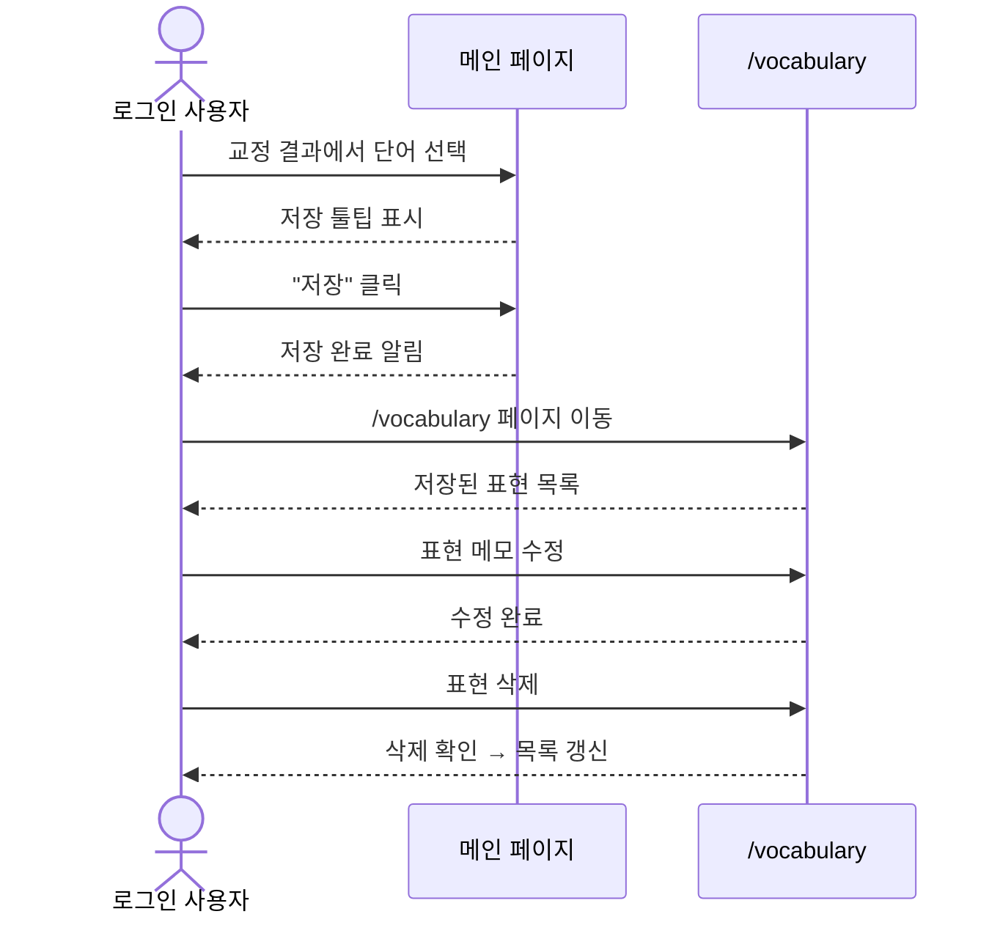
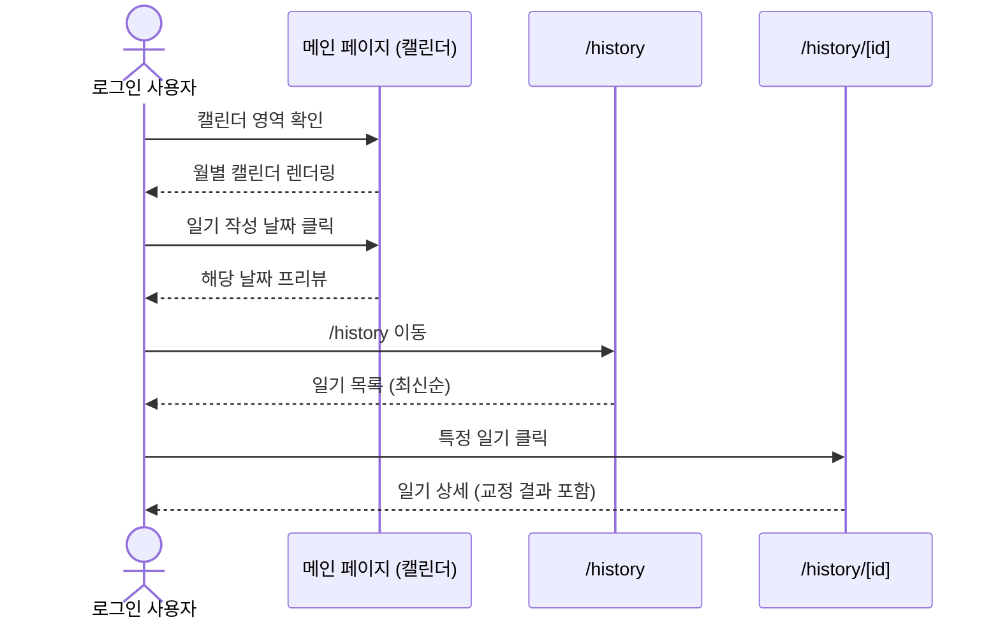
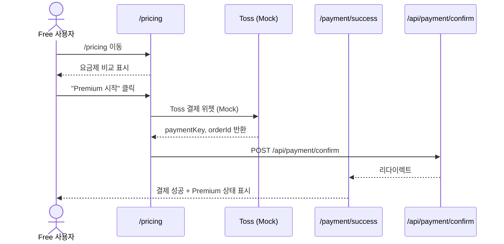

# E2E Tests Specification

| 항목 | 값 |
|------|-----|
| **버전** | 1.0.0 |
| **상태** | `완료` |
| **최종 수정일** | 2026-02-12 |
| **관련 문서** | [TESTING-STRATEGY.md](./TESTING-STRATEGY.md) · [UI-DESIGN.md](../architecture/UI-DESIGN.md) · [CHAT-SEQUENCE.md](../architecture/CHAT-SEQUENCE.md) · [FUNCTIONAL-SPEC.md](../spec/project/FUNCTIONAL-SPEC.md) |

---

## 목차

1. [개요](#1-개요)
2. [테스트 환경](#2-테스트-환경)
3. [인증 Fixture](#3-인증-fixture)
4. [S1 — 비로그인 일기 교정](#4-s1--비로그인-일기-교정)
5. [S2 — 로그인 일기 교정 + XP](#5-s2--로그인-일기-교정--xp)
6. [S3 — 사용량 초과 시나리오](#6-s3--사용량-초과-시나리오)
7. [S4 — 표현노트 CRUD](#7-s4--표현노트-crud)
8. [S5 — 캘린더 + 히스토리](#8-s5--캘린더--히스토리)
9. [S6 — 결제 흐름](#9-s6--결제-흐름)
10. [크로스 시나리오 매트릭스](#10-크로스-시나리오-매트릭스)
11. [페이지 객체 모델](#11-페이지-객체-모델)

---

## 1. 개요

### 목적

E2E 테스트는 **사용자 관점에서 크리티컬 패스(Critical Path)**를 검증한다. 단위/통합 테스트로 검증 불가한 다음 항목을 다룬다:

- 브라우저 렌더링 및 상호작용
- 페이지 간 네비게이션
- 클라이언트-서버 전체 왕복 (Round-trip)
- UI 상태 전이 (로딩 → 결과 → 에러)
- 반응형 레이아웃 기본 동작

### 범위

| 포함 | 제외 |
|------|------|
| 핵심 사용자 흐름 6개 시나리오 | 모든 UI 컴포넌트 개별 테스트 |
| 크리티컬 패스 (매출 영향 경로) | 관리자 기능 |
| 주요 에러 시나리오 | 브라우저 호환성 (Chromium만) |
| 한국어 UI 텍스트 검증 | 성능/부하 테스트 |

---

## 2. 테스트 환경

### 2.1 실행 구성

```
┌──────────────────────────────────────────┐
│              Playwright                   │
│  ┌──────────┐    ┌───────────────────┐   │
│  │ Chromium  │───▶│ Next.js Dev Server│   │
│  │ (headless)│    │ localhost:3000    │   │
│  └──────────┘    └───────┬───────────┘   │
│                          │               │
│                   ┌──────┴──────┐        │
│                   │   MSW       │        │
│                   │ (API Mock)  │        │
│                   └─────────────┘        │
└──────────────────────────────────────────┘
```

### 2.2 외부 API Mock 전략

| API | Mock 방법 | 이유 |
|-----|-----------|------|
| Gemini (LLM) | MSW 인터셉트 또는 환경 변수 제어 | 비용/비결정성 방지 |
| Toss Payments | MSW 인터셉트 | 결제 API 실제 호출 불가 |
| Google OAuth | Playwright `storageState` 주입 | 실제 OAuth 불가 |

### 2.3 테스트 데이터 전략

```
1. 각 시나리오 시작 전 → 테스트 DB 시드 또는 API Mock으로 초기 상태 설정
2. 시나리오 실행
3. 각 시나리오 종료 후 → 상태 정리 (독립성 보장)
```

---

## 3. 인증 Fixture

### 3.1 인증 상태 관리

```typescript
// e2e/fixtures/auth.ts
import { test as base, expect } from '@playwright/test';

/** 인증된 사용자 Fixture */
export const test = base.extend<{ authenticatedPage: Page }>({
  authenticatedPage: async ({ browser }, use) => {
    const context = await browser.newContext({
      storageState: {
        cookies: [
          {
            name: 'next-auth.session-token',
            value: 'test-session-token',
            domain: 'localhost',
            path: '/',
            httpOnly: true,
            secure: false,
            sameSite: 'Lax',
            expires: Math.floor(Date.now() / 1000) + 86400,
          },
        ],
        origins: [],
      },
    });
    const page = await context.newPage();
    await use(page);
    await context.close();
  },
});

export { expect };
```

### 3.2 사용자 유형별 Fixture

| Fixture | 설명 | 사용 시나리오 |
|---------|------|-------------|
| `guestPage` | 비로그인 상태 | S1, S3 일부 |
| `authenticatedPage` | Free 로그인 사용자 | S2, S3, S4, S5 |
| `premiumPage` | Premium 로그인 사용자 | S6 |

---

## 4. S1 — 비로그인 일기 교정

### 4.1 시나리오 흐름



### 4.2 테스트 케이스

| 단계 | 액션 | 검증 |
|------|------|------|
| 1 | `/` 접속 | 일기 입력 `textarea` 렌더링 |
| 2 | 텍스트 입력: `"Today I eat delicious food with my friend."` | 입력값 반영 |
| 3 | "교정하기" 버튼 클릭 | 로딩 상태 표시 (스켈레톤 또는 스피너) |
| 4 | 응답 대기 | 로딩 → 교정 결과 카드 전환 |
| 5 | 교정 결과 확인 | `correctedText` 표시 (`"Today I ate..."`) |
| 6 | 한국어 설명 확인 | `koreanExplanation` 텍스트 존재 |
| 7 | 대안 표현 확인 | 3개 탭/영역 (Casual, Expressive, Simple) |
| 8 | 로그인 유도 확인 | 로그인 버튼 또는 배너 표시 |

### 4.3 Playwright 코드 스케치

```typescript
// e2e/diary-correction.spec.ts

import { test, expect } from '@playwright/test';

test.describe('S1: 비로그인 일기 교정', () => {
  test('일기를 입력하고 교정 결과를 확인한다', async ({ page }) => {
    // 1. 메인 페이지 접속
    await page.goto('/');

    // 2. 일기 입력
    const textarea = page.getByRole('textbox');
    await textarea.fill('Today I eat delicious food with my friend.');

    // 3. 교정 버튼 클릭
    await page.getByRole('button', { name: /교정/i }).click();

    // 4. 로딩 상태 확인
    await expect(page.getByTestId('loading-indicator')).toBeVisible();

    // 5. 교정 결과 대기 및 확인
    const correctionCard = page.getByTestId('correction-card');
    await expect(correctionCard).toBeVisible({ timeout: 15000 });

    // 6. 교정 텍스트 확인
    await expect(correctionCard).toContainText('ate');

    // 7. 한국어 설명 존재 확인
    await expect(page.getByTestId('korean-explanation')).toBeVisible();

    // 8. 대안 표현 3개 확인
    const alternatives = page.getByTestId('alternative-expression');
    await expect(alternatives).toHaveCount(3);
  });
});
```

---

## 5. S2 — 로그인 일기 교정 + XP

### 5.1 시나리오 흐름



### 5.2 테스트 케이스

| 단계 | 액션 | 검증 |
|------|------|------|
| 1 | 인증 상태로 `/` 접속 | 사용자 아바타/이름 표시 |
| 2 | 기분 선택 (Happy) | 선택 상태 표시 |
| 3 | 일기 입력 (50단어 이상) | 단어 수 카운터 반영 |
| 4 | "교정하기" 클릭 | 로딩 상태 |
| 5 | 교정 결과 확인 | 교정 카드 렌더링 |
| 6 | XP 토스트 알림 확인 | `"📝 일기 제출 +30 XP"` 표시 |
| 7 | 볼륨 보너스 확인 (50단어+) | `"📏 50단어 이상 +10 XP"` 표시 |
| 8 | 스트릭 카운터 갱신 | 스트릭 +1 반영 |
| 9 | 사용량 카운터 갱신 | `1/3` 표시 |

### 5.3 추가 검증 항목

| ID | 항목 | 검증 방법 |
|----|------|-----------|
| S2-A | 히스토리 저장 확인 | `/history` 페이지 이동 → 방금 작성한 일기 존재 |
| S2-B | 캘린더 반영 확인 | 캘린더 영역에서 오늘 날짜에 dot 표시 |
| S2-C | 기분 이모지 반영 | 교정 결과에 선택한 기분 반영 |

---

## 6. S3 — 사용량 초과 시나리오

### 6.1 시나리오 흐름



### 6.2 테스트 케이스

| 단계 | 액션 | 검증 |
|------|------|------|
| 1 | 사용량 3/3 상태로 접속 | 사용량 카운터 `3/3` 표시 |
| 2 | 일기 입력 | 입력 가능 (UI 차단 없음) |
| 3 | "교정하기" 클릭 | 429 에러 처리 |
| 4 | 사용량 초과 메시지 확인 | 안내 텍스트 표시 |
| 5 | 업그레이드 모달 확인 | Premium 안내 모달 또는 `/pricing` 링크 |
| 6 | 모달 닫기 | 다시 입력 가능 상태 |

### 6.3 추가 시나리오

| ID | 시나리오 | 검증 |
|----|----------|------|
| S3-A | 사용량 2/3에서 교정 → 3/3 전환 | 카운터 실시간 갱신 |
| S3-B | Premium 사용자 무제한 확인 | 4회 이상 교정 가능 |

---

## 7. S4 — 표현노트 CRUD

### 7.1 시나리오 흐름



### 7.2 테스트 케이스

| 단계 | 액션 | 검증 |
|------|------|------|
| **저장** | | |
| 1 | 교정 결과 텍스트에서 단어 드래그/클릭 | 툴팁 표시 |
| 2 | "표현 저장" 클릭 | 저장 성공 토스트 |
| 3 | XP 피드백 확인 | `"+5 XP"` 또는 유사 피드백 |
| **조회** | | |
| 4 | `/vocabulary` 이동 | 저장한 표현 목록 렌더링 |
| 5 | 목록 항목 확인 | 단어, 뜻, 발음, 예문 표시 |
| **수정** | | |
| 6 | 메모 편집 | 편집 UI 활성화 |
| 7 | 수정 사항 저장 | 갱신 확인 |
| **삭제** | | |
| 8 | 삭제 버튼 클릭 | 확인 다이얼로그 |
| 9 | 삭제 확인 | 목록에서 제거 |

---

## 8. S5 — 캘린더 + 히스토리

### 8.1 시나리오 흐름



### 8.2 테스트 케이스

| 단계 | 액션 | 검증 |
|------|------|------|
| **캘린더** | | |
| 1 | 메인 페이지 접속 | 현재 월 캘린더 렌더링 |
| 2 | 이전/다음 월 이동 | 월 변경 반영 |
| 3 | 일기 작성 날짜 확인 | 해당 날짜에 dot/색상 표시 |
| 4 | 날짜 클릭 | 프리뷰 패널 또는 상세 이동 |
| **히스토리** | | |
| 5 | `/history` 이동 | 일기 목록 렌더링 |
| 6 | 최신순 정렬 확인 | 첫 항목이 가장 최신 |
| 7 | 항목 클릭 | `/history/[id]` 이동 |
| **상세** | | |
| 8 | 일기 상세 확인 | 원본, 교정, 설명, 대안 표현 |
| 9 | 뒤로가기 | 히스토리 목록 복귀 |

---

## 9. S6 — 결제 흐름

### 9.1 시나리오 흐름



### 9.2 테스트 케이스

| 단계 | 액션 | 검증 |
|------|------|------|
| **Pricing 페이지** | | |
| 1 | `/pricing` 이동 | Free vs Premium 요금제 표시 |
| 2 | 현재 플랜 표시 | Free 사용자 → "현재 플랜" 표시 |
| 3 | Premium 기능 목록 확인 | 무제한 교정, Lv.30, 보물상자 등 |
| **결제 프로세스** | | |
| 4 | "Premium 시작" 클릭 | 결제 프로세스 시작 |
| 5 | 결제 완료 (Mock) | `/payment/success` 리다이렉트 |
| 6 | 성공 페이지 확인 | 결제 성공 메시지, Premium 배지 |
| **Premium 전환 검증** | | |
| 7 | 메인 페이지 복귀 | 사용량 "무제한" 표시 |
| 8 | 4회 이상 교정 가능 | 429 미발생 |

### 9.3 결제 실패 시나리오

| ID | 시나리오 | 검증 |
|----|----------|------|
| S6-A | 결제 취소 | `/payment/fail` 이동, 재시도 링크 |
| S6-B | 결제 API 실패 | 에러 메시지 표시, 고객센터 안내 |

---

## 10. 크로스 시나리오 매트릭스

### 시나리오 × 사용자 유형 검증

| 시나리오 | Guest | Free (인증) | Premium | 비고 |
|----------|:-----:|:-----------:|:-------:|------|
| S1. 일기 교정 | ● | ● | ● | Guest는 저장 없음 |
| S2. XP 확인 | — | ● | ● | Guest는 XP 미부여 |
| S3. 사용량 초과 | — | ● | — | Premium은 무제한 |
| S4. 표현노트 | — | ● | ● | Guest 접근 불가 |
| S5. 캘린더/히스토리 | — | ● | ● | Guest는 빈 결과 |
| S6. 결제 | — | ● | — | Premium은 이미 구독 |

> `●` = 테스트 대상, `—` = 해당 없음

### 시나리오별 예상 실행 시간

| 시나리오 | 예상 실행 시간 | 의존 API |
|----------|:--------------:|----------|
| S1 | ~30초 | /api/chat |
| S2 | ~45초 | /api/chat, /api/user/xp, /api/streak |
| S3 | ~30초 | /api/chat, /api/usage |
| S4 | ~40초 | /api/vocabulary |
| S5 | ~30초 | /api/calendar, /api/history |
| S6 | ~45초 | /api/payment/confirm |
| **합계** | **~4분** | — |

---

## 11. 페이지 객체 모델 (POM)

### 11.1 구조

```
e2e/
├── pages/
│   ├── MainPage.ts           ← 메인 (일기 작성 + 캘린더)
│   ├── HistoryPage.ts        ← 히스토리 목록
│   ├── HistoryDetailPage.ts  ← 일기 상세
│   ├── VocabularyPage.ts     ← 표현노트
│   ├── PricingPage.ts        ← 요금제
│   └── PaymentResultPage.ts  ← 결제 결과
├── fixtures/
│   └── auth.ts               ← 인증 Fixture
└── *.spec.ts                 ← 시나리오 파일
```

### 11.2 MainPage 예시

```typescript
// e2e/pages/MainPage.ts
import { type Page, type Locator, expect } from '@playwright/test';

export class MainPage {
  readonly page: Page;
  readonly diaryInput: Locator;
  readonly submitButton: Locator;
  readonly correctionCard: Locator;
  readonly loadingIndicator: Locator;
  readonly usageCounter: Locator;
  readonly streakCounter: Locator;
  readonly calendarArea: Locator;

  constructor(page: Page) {
    this.page = page;
    this.diaryInput = page.getByRole('textbox');
    this.submitButton = page.getByRole('button', { name: /교정/i });
    this.correctionCard = page.getByTestId('correction-card');
    this.loadingIndicator = page.getByTestId('loading-indicator');
    this.usageCounter = page.getByTestId('usage-counter');
    this.streakCounter = page.getByTestId('streak-counter');
    this.calendarArea = page.getByTestId('calendar-view');
  }

  async goto() {
    await this.page.goto('/');
  }

  async writeDiary(text: string) {
    await this.diaryInput.fill(text);
  }

  async submitDiary() {
    await this.submitButton.click();
  }

  async waitForCorrection() {
    await expect(this.correctionCard).toBeVisible({ timeout: 15000 });
  }

  async getCorrectedText(): Promise<string> {
    return this.correctionCard.getByTestId('corrected-text').innerText();
  }

  async getUsageText(): Promise<string> {
    return this.usageCounter.innerText();
  }
}
```

---

## 부록: 실행 명령

```bash
# 전체 E2E 실행
npx playwright test

# 특정 시나리오만
npx playwright test e2e/diary-correction.spec.ts

# 브라우저 표시 (디버깅)
npx playwright test --headed

# 디버그 모드 (Step-by-step)
npx playwright test --debug

# UI 모드 (인터랙티브)
npx playwright test --ui

# 특정 테스트 이름 필터
npx playwright test -g "비로그인 일기 교정"

# 리포트 확인
npx playwright show-report
```

### 실패 시 아티팩트

| 아티팩트 | 경로 | 생성 조건 |
|----------|------|-----------|
| 스크린샷 | `test-results/*/screenshot.png` | 실패 시 자동 |
| 트레이스 | `test-results/*/trace.zip` | 첫 재시도 시 |
| HTML 리포트 | `playwright-report/index.html` | 매 실행 |
