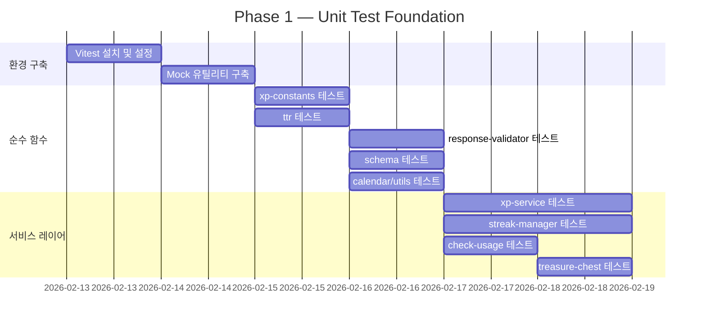

# Testing Strategy

| 항목 | 값 |
|------|-----|
| **버전** | 1.0.0 |
| **상태** | `완료` |
| **최종 수정일** | 2026-02-12 |
| **관련 문서** | [INDEX.md](./INDEX.md) · [TEST-ENVIRONMENT.md](./TEST-ENVIRONMENT.md) · [CONVENTIONS.md](../guides/CONVENTIONS.md) · [GIT-WORKFLOW.md](../guides/GIT-WORKFLOW.md) |

---

## 목차

1. [전략 개요](#1-전략-개요)
2. [테스트 도구 선정](#2-테스트-도구-선정)
3. [테스트 유형 정의](#3-테스트-유형-정의)
4. [커버리지 목표](#4-커버리지-목표)
5. [우선순위 기반 구현 로드맵](#5-우선순위-기반-구현-로드맵)
6. [Mock 전략](#6-mock-전략)
7. [CI/CD 통합](#7-cicd-통합)
8. [테스트 네이밍 컨벤션](#8-테스트-네이밍-컨벤션)
9. [Anti-Pattern 목록](#9-anti-pattern-목록)

---

## 1. 전략 개요

### 1.1 현재 상태

| 항목 | 상태 |
|------|------|
| 테스트 프레임워크 | 미설치 |
| 자동화 테스트 파일 | 0개 |
| CI/CD 파이프라인 | 미구성 |
| 코드 커버리지 | 0% |
| 수동 테스트 스크립트 | 1개 (`scripts/test-xp-grant.ts`) |

### 1.2 목표 상태

```
Phase 1 (Foundation)     → Vitest 설치 + 순수 함수 단위 테스트 (~150 케이스)
Phase 2 (Service Layer)  → 서비스 레이어 + API 통합 테스트 (~80 케이스)
Phase 3 (E2E)            → Playwright E2E 크리티컬 패스 (~10 시나리오)
Phase 4 (CI/CD)          → GitHub Actions 파이프라인 구축
```

### 1.3 핵심 원칙

| 원칙 | 설명 |
|------|------|
| **테스트 피라미드 준수** | Unit 70% → Integration 20% → E2E 10% 비율 유지 |
| **비즈니스 크리티컬 우선** | 매출 영향 기능(일기 교정, 결제, XP)부터 테스트 |
| **빠른 피드백 루프** | 단위 테스트 전체 10초 이내, PR 검증 2분 이내 |
| **결정론적(Deterministic) 테스트** | 시간/난수 의존 로직은 반드시 Mock 처리 |
| **격리(Isolation) 보장** | 테스트 간 상태 공유 금지, 각 테스트 독립 실행 보장 |

---

## 2. 테스트 도구 선정

### 2.1 도구 매트릭스

| 도구 | 용도 | 선정 사유 |
|------|------|-----------|
| **Vitest** | 단위 + 통합 테스트 | Vite 기반 빠른 실행, ESM 네이티브 지원, Jest 호환 API |
| **Playwright** | E2E 테스트 | Chromium/Firefox/WebKit 멀티 브라우저, Next.js 공식 권장 |
| **MSW (Mock Service Worker)** | API Mocking | 네트워크 레벨 인터셉트, Vitest/Playwright 모두 호환 |
| **@testing-library/react** | 컴포넌트 테스트 | 사용자 관점 테스트, 접근성 우선 선택자 |
| **c8 / istanbul** | 커버리지 리포트 | Vitest 내장, lcov/html 리포트 지원 |

### 2.2 도구 선정 근거: Vitest vs Jest

| 기준 | Vitest | Jest |
|------|--------|------|
| ESM 지원 | 네이티브 | 실험적 (transform 필요) |
| TypeScript | 내장 지원 | `ts-jest` 별도 설치 |
| 실행 속도 | Vite 기반 HMR, 매우 빠름 | 상대적으로 느림 |
| Next.js 호환 | `@vitejs/plugin-react` 사용 | `next/jest` 공식 지원 |
| API 호환성 | Jest 호환 (`describe`, `it`, `expect`) | — |
| Watch 모드 | Vite HMR 기반 즉시 반영 | 파일 감시 기반 |

> **결론**: ESM + TypeScript 프로젝트 특성상 Vitest 채택. Jest 호환 API로 학습 곡선 최소화.

### 2.3 패키지 설치 명세

```bash
# 단위 + 통합 테스트
npm install -D vitest @vitest/coverage-v8 @vitest/ui
npm install -D @testing-library/react @testing-library/jest-dom @testing-library/user-event
npm install -D jsdom msw

# E2E 테스트
npm install -D @playwright/test
npx playwright install chromium
```

---

## 3. 테스트 유형 정의

### 3.1 단위 테스트 (Unit Tests)

| 항목 | 내용 |
|------|------|
| **범위** | 순수 함수, 유틸리티, 상수, 스키마 검증 |
| **격리 수준** | 완전 격리 — 외부 의존성 전부 Mock |
| **실행 환경** | Node.js (Vitest) |
| **파일 위치** | `__tests__/unit/` 또는 소스 파일 옆 `*.test.ts` |
| **실행 시간 목표** | 전체 < 10초 |

**대상 모듈 (상세 → [UNIT-TESTS.md](./UNIT-TESTS.md))**:

```
lib/gamification/xp-constants.ts     ← 레벨 계산, 임계값, 타이틀
lib/validation/ttr.ts                ← TTR 계산, 단어 수, 유효성
lib/ai/response-validator.ts         ← 품질 메트릭, 한국어 비율
lib/ai/schema.ts                     ← Zod 스키마 검증
lib/calendar/utils.ts                ← 날짜, 히트맵, 월 탐색
lib/gamification/xp-service.ts       ← XP 부여 (DB Mock)
lib/streak/streak-manager.ts         ← 스트릭 관리 (날짜 Mock)
lib/gamification/treasure-chest.ts   ← 보물상자 (난수 Mock)
lib/subscription/check-usage.ts      ← 사용량 검증 (DB Mock)
```

### 3.2 통합 테스트 (Integration Tests)

| 항목 | 내용 |
|------|------|
| **범위** | API Route Handler, 서비스 간 협력, DB 연동 |
| **격리 수준** | 부분 격리 — 외부 API만 Mock, DB는 테스트 인스턴스 사용 |
| **실행 환경** | Node.js (Vitest) |
| **파일 위치** | `__tests__/integration/` |
| **실행 시간 목표** | 전체 < 60초 |

**대상 (상세 → [API-INTEGRATION-TESTS.md](./API-INTEGRATION-TESTS.md))**:

```
app/api/chat/route.ts                ← 일기 교정 전체 플로우
app/api/history/route.ts             ← 히스토리 조회
app/api/vocabulary/route.ts          ← 표현노트 CRUD
app/api/streak/route.ts              ← 스트릭 조회
app/api/usage/route.ts               ← 사용량 조회
app/api/treasure-chest/*/route.ts    ← 보물상자 열기
app/api/payment/confirm/route.ts     ← 결제 확인
```

### 3.3 E2E 테스트 (End-to-End Tests)

| 항목 | 내용 |
|------|------|
| **범위** | 사용자 시나리오 단위 전체 흐름 |
| **격리 수준** | 실제 브라우저 + 테스트 서버, 외부 API만 MSW Mock |
| **실행 환경** | Chromium (Playwright) |
| **파일 위치** | `e2e/` |
| **실행 시간 목표** | 전체 < 5분 |

**대상 시나리오 (상세 → [E2E-TESTS.md](./E2E-TESTS.md))**:

```
S1. 비로그인 사용자 일기 교정
S2. 로그인 사용자 일기 교정 + XP 확인
S3. 무료 사용자 일일 사용량 초과 시나리오
S4. 표현노트 저장 → 조회 → 삭제
S5. 캘린더 월별 조회 + 일기 상세 진입
S6. 결제 → Premium 전환 → 기능 잠금 해제
```

---

## 4. 커버리지 목표

### 4.1 전체 목표

| 메트릭 | 목표치 | 설명 |
|--------|--------|------|
| **Line Coverage** | ≥ 80% | 실행된 코드 라인 비율 |
| **Branch Coverage** | ≥ 75% | 조건 분기 커버리지 |
| **Function Coverage** | ≥ 85% | 호출된 함수 비율 |
| **Statement Coverage** | ≥ 80% | 실행된 구문 비율 |

### 4.2 모듈별 목표

| 모듈 그룹 | Line | Branch | 근거 |
|-----------|:----:|:------:|------|
| `lib/gamification/` | 90% | 85% | 매출 직결 (XP ↔ Premium 전환) |
| `lib/validation/` | 95% | 90% | 순수 함수, 완전 커버리지 가능 |
| `lib/ai/schema.ts` | 95% | 90% | 스키마 검증은 경계 케이스 커버 필수 |
| `lib/ai/response-validator.ts` | 90% | 85% | AI 품질 게이트 역할 |
| `lib/streak/` | 85% | 80% | 복잡한 상태 전이, 타임존 의존 |
| `lib/subscription/` | 85% | 80% | Freemium 게이트 로직 |
| `lib/calendar/` | 90% | 85% | 순수 함수 |
| `app/api/` | 75% | 70% | 오케스트레이션 레이어, 외부 의존 多 |
| `components/` | 60% | 50% | UI 컴포넌트, 시각적 검증은 E2E 위임 |

### 4.3 커버리지 임계값 설정 (vitest.config.ts)

```typescript
coverage: {
  provider: 'v8',
  reporter: ['text', 'lcov', 'html'],
  thresholds: {
    lines: 80,
    branches: 75,
    functions: 85,
    statements: 80,
  },
  include: ['lib/**/*.ts', 'app/api/**/*.ts'],
  exclude: [
    'lib/design-system/**',
    '**/*.d.ts',
    '**/types/**',
  ],
}
```

---

## 5. 우선순위 기반 구현 로드맵

### Phase 1: Foundation (단위 테스트 기반)



### Phase 2: Integration (API 테스트)

| 순서 | 대상 | 케이스 수 | 의존성 |
|------|------|:---------:|--------|
| 1 | `POST /api/chat` | 15~20 | LangGraph Mock, DB Mock |
| 2 | `GET /api/history` | 8~10 | DB Fixture |
| 3 | `POST/GET/DELETE /api/vocabulary` | 12~15 | AI Enricher Mock |
| 4 | `GET /api/usage` | 5~7 | Subscription Mock |
| 5 | `GET /api/streak` | 5~7 | Streak Mock |
| 6 | `POST /api/treasure-chest/*` | 8~10 | Premium Guard Mock |
| 7 | `POST /api/payment/confirm` | 5~7 | Toss API Mock |

### Phase 3: E2E (크리티컬 패스)

| 순서 | 시나리오 | 브라우저 | 우선도 |
|------|----------|----------|--------|
| 1 | 일기 작성 → 교정 결과 확인 | Chromium | P0 |
| 2 | 사용량 초과 → 업그레이드 모달 | Chromium | P0 |
| 3 | 표현노트 저장/조회/삭제 | Chromium | P1 |
| 4 | 캘린더 탐색 + 일기 상세 | Chromium | P1 |
| 5 | 결제 흐름 (Toss Mock) | Chromium | P1 |

### Phase 4: CI/CD

```
PR Open → Lint + Type Check → Unit Tests → Integration Tests
                                                    │
                                              ┌─────┴─────┐
                                              │ Coverage   │
                                              │ Report     │
                                              └─────┬─────┘
                                                    │
Merge to develop → E2E Tests → Deploy Preview
Merge to main    → Full Suite → Deploy Production
```

---

## 6. Mock 전략

### 6.1 Mock 대상 분류

| 의존성 유형 | Mock 방법 | 적용 테스트 |
|------------|-----------|------------|
| **DB (Drizzle)** | `vi.mock('db')` — 쿼리 결과 직접 반환 | 단위, 통합 |
| **LLM (Gemini)** | MSW 또는 `vi.mock('@langchain/google-genai')` | 통합 |
| **외부 API (Toss)** | MSW 네트워크 인터셉트 | 통합, E2E |
| **NextAuth** | `vi.mock('lib/auth')` — 세션 객체 주입 | 통합 |
| **시간 (Date)** | `vi.useFakeTimers()` — KST 고정 | 단위 (스트릭, 캘린더) |
| **난수 (Math.random)** | `vi.spyOn(Math, 'random')` — 결정론적 값 주입 | 단위 (보물상자) |
| **환경 변수** | `vi.stubEnv()` | 전체 |

### 6.2 Mock 계층 다이어그램

```
┌─────────────────────────────────────────────┐
│                  Test Code                   │
├─────────────────────────────────────────────┤
│  vi.mock('db')          → DB 쿼리 결과 제어  │
│  vi.mock('lib/auth')    → 인증 세션 제어     │
│  vi.useFakeTimers()     → 시간 제어          │
│  vi.spyOn(Math,'random')→ 난수 제어          │
├─────────────────────────────────────────────┤
│  MSW (setupServer)                           │
│  ├── Gemini API  → 고정 교정 결과 반환       │
│  ├── Toss API    → 결제 성공/실패 시뮬레이션  │
│  └── (확장 가능)                             │
├─────────────────────────────────────────────┤
│              Application Code                │
└─────────────────────────────────────────────┘
```

### 6.3 핵심 Mock 패턴

**DB Mock 패턴 (Drizzle)**:

```typescript
// __mocks__/db.ts
import { vi } from 'vitest';

export const db = {
  select: vi.fn().mockReturnThis(),
  from: vi.fn().mockReturnThis(),
  where: vi.fn().mockReturnThis(),
  insert: vi.fn().mockReturnThis(),
  values: vi.fn().mockReturnThis(),
  update: vi.fn().mockReturnThis(),
  set: vi.fn().mockReturnThis(),
  delete: vi.fn().mockReturnThis(),
  returning: vi.fn().mockResolvedValue([]),
};
```

**Auth Mock 패턴**:

```typescript
// __mocks__/auth.ts
import { vi } from 'vitest';

export const auth = vi.fn().mockResolvedValue({
  user: { id: 'test-user-id', email: 'test@example.com' },
});
```

**시간 Mock 패턴 (KST)**:

```typescript
// KST 2026-02-12 15:00:00 고정
beforeEach(() => {
  vi.useFakeTimers();
  vi.setSystemTime(new Date('2026-02-12T06:00:00Z')); // UTC → KST +9
});

afterEach(() => {
  vi.useRealTimers();
});
```

---

## 7. CI/CD 통합

### 7.1 GitHub Actions 워크플로우

```yaml
# .github/workflows/test.yml
name: Test Suite

on:
  pull_request:
    branches: [develop, main]
  push:
    branches: [develop]

jobs:
  unit-test:
    runs-on: ubuntu-latest
    steps:
      - uses: actions/checkout@v4
      - uses: actions/setup-node@v4
        with:
          node-version: '18'
          cache: 'npm'
      - run: npm ci
      - run: npx vitest run --coverage
      - uses: actions/upload-artifact@v4
        with:
          name: coverage-report
          path: coverage/

  integration-test:
    runs-on: ubuntu-latest
    needs: unit-test
    steps:
      - uses: actions/checkout@v4
      - uses: actions/setup-node@v4
        with:
          node-version: '18'
          cache: 'npm'
      - run: npm ci
      - run: npx vitest run --config vitest.integration.config.ts

  e2e-test:
    runs-on: ubuntu-latest
    needs: integration-test
    if: github.base_ref == 'main'
    steps:
      - uses: actions/checkout@v4
      - uses: actions/setup-node@v4
        with:
          node-version: '18'
          cache: 'npm'
      - run: npm ci
      - run: npx playwright install chromium
      - run: npx playwright test
```

### 7.2 PR 검증 게이트

| 게이트 | 조건 | 실패 시 동작 |
|--------|------|-------------|
| Lint | `next lint` 통과 | PR Merge 차단 |
| Type Check | `tsc --noEmit` 통과 | PR Merge 차단 |
| Unit Tests | 전체 통과 | PR Merge 차단 |
| Coverage | 임계값 이상 | Warning 표시 (차단은 선택) |
| Integration | 전체 통과 | PR Merge 차단 |
| E2E | 전체 통과 | main 브랜치 머지 시에만 필수 |

---

## 8. 테스트 네이밍 컨벤션

### 8.1 파일 네이밍

```
__tests__/
├── unit/
│   ├── lib/
│   │   ├── gamification/
│   │   │   ├── xp-constants.test.ts
│   │   │   ├── xp-service.test.ts
│   │   │   └── treasure-chest.test.ts
│   │   ├── validation/
│   │   │   └── ttr.test.ts
│   │   ├── ai/
│   │   │   ├── schema.test.ts
│   │   │   └── response-validator.test.ts
│   │   ├── streak/
│   │   │   └── streak-manager.test.ts
│   │   ├── subscription/
│   │   │   └── check-usage.test.ts
│   │   └── calendar/
│   │       └── utils.test.ts
│   └── helpers/
│       ├── db-mock.ts
│       ├── auth-mock.ts
│       └── fixtures.ts
├── integration/
│   ├── api/
│   │   ├── chat.test.ts
│   │   ├── history.test.ts
│   │   ├── vocabulary.test.ts
│   │   ├── streak.test.ts
│   │   ├── usage.test.ts
│   │   ├── treasure-chest.test.ts
│   │   └── payment.test.ts
│   └── helpers/
│       └── api-test-utils.ts
└── e2e/                              → 별도: /e2e/ 디렉토리
```

### 8.2 테스트 기술 네이밍 (describe / it)

```typescript
// 패턴: describe('모듈명') > describe('함수명') > it('should + 동작')
describe('xp-constants', () => {
  describe('calculateLevel', () => {
    it('should return level 1 for 0 XP', () => { ... });
    it('should return level 10 for free user at cap', () => { ... });
    it('should return level 30 for max XP', () => { ... });
  });
});
```

**규칙**:
- `describe` 블록: 모듈명 또는 함수명 (camelCase)
- `it` 블록: `should` + 동사 + 결과 (영어)
- 경계 조건: `boundary:` 접두어 (예: `it('boundary: should handle 0 XP')`)
- 에러 경로: `error:` 접두어 (예: `it('error: should throw on invalid input')`)

---

## 9. Anti-Pattern 목록

| Anti-Pattern | 문제점 | 올바른 접근 |
|-------------|--------|------------|
| **스냅샷 남용** | 변경 시 무의미한 업데이트 반복 | 핵심 필드만 개별 `expect` 검증 |
| **구현 세부 테스트** | 리팩토링 시 테스트 깨짐 | 공개 인터페이스(입출력)만 테스트 |
| **테스트 간 상태 공유** | 실행 순서 의존성 발생 | `beforeEach`에서 상태 초기화 |
| **DB 직접 연결** | 느림, 불안정, 격리 불가 | Mock 또는 테스트 전용 인스턴스 |
| **Sleep 기반 대기** | 느림, 불안정 | Polling 또는 `waitFor` 사용 |
| **너무 큰 테스트** | 디버깅 어려움, 원인 불명확 | 하나의 `it`에 하나의 검증 |
| **Magic Number** | 의도 불명확 | 상수화 또는 주석으로 의도 표기 |
| **전역 Mock 미해제** | 다른 테스트에 영향 | `afterEach`에서 `vi.restoreAllMocks()` |
