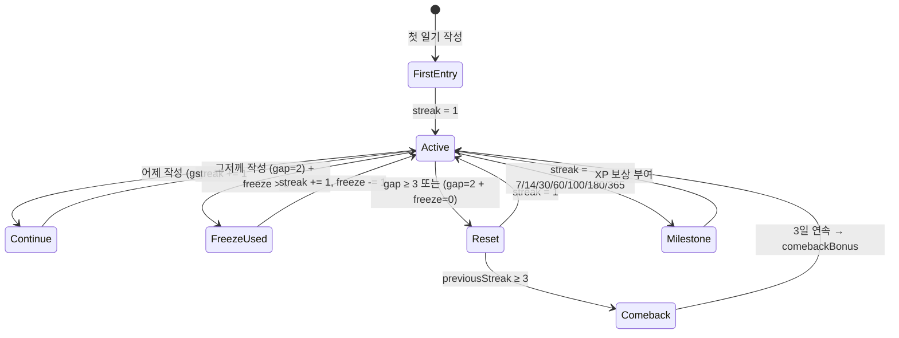

# Unit Tests Specification

| 항목 | 값 |
|------|-----|
| **버전** | 1.0.0 |
| **상태** | `완료` |
| **최종 수정일** | 2026-02-12 |
| **관련 문서** | [TESTING-STRATEGY.md](./TESTING-STRATEGY.md) · [TEST-ENVIRONMENT.md](./TEST-ENVIRONMENT.md) · [GAMIFICATION-SPEC.md](../spec/system/GAMIFICATION-SPEC.md) · [AI-PIPELINE-SPEC.md](../spec/system/AI-PIPELINE-SPEC.md) |

---

## 목차

1. [개요](#1-개요)
2. [xp-constants — 레벨/XP 계산](#2-xp-constants--레벨xp-계산)
3. [ttr — 텍스트 유효성 검증](#3-ttr--텍스트-유효성-검증)
4. [response-validator — AI 응답 품질 검증](#4-response-validator--ai-응답-품질-검증)
5. [schema — Zod 스키마 검증](#5-schema--zod-스키마-검증)
6. [calendar/utils — 날짜/캘린더 유틸](#6-calendarutils--날짜캘린더-유틸)
7. [xp-service — XP 부여 서비스](#7-xp-service--xp-부여-서비스)
8. [streak-manager — 스트릭 관리](#8-streak-manager--스트릭-관리)
9. [treasure-chest — 보물상자](#9-treasure-chest--보물상자)
10. [check-usage — 사용량 검증](#10-check-usage--사용량-검증)

---

## 1. 개요

### 대상 모듈 요약

| # | 모듈 | 경로 | 유형 | 예상 케이스 수 | 우선순위 |
|---|------|------|------|:--------------:|:--------:|
| 1 | xp-constants | `lib/gamification/xp-constants.ts` | 순수 함수 | 45~50 | P0 |
| 2 | ttr | `lib/validation/ttr.ts` | 순수 함수 | 20~25 | P0 |
| 3 | response-validator | `lib/ai/response-validator.ts` | 순수 함수 | 30~35 | P0 |
| 4 | schema | `lib/ai/schema.ts` | Zod 스키마 | 15~20 | P0 |
| 5 | calendar/utils | `lib/calendar/utils.ts` | 순수 함수 | 25~30 | P1 |
| 6 | xp-service | `lib/gamification/xp-service.ts` | 서비스 (DB) | 35~40 | P0 |
| 7 | streak-manager | `lib/streak/streak-manager.ts` | 서비스 (DB+시간) | 30~35 | P0 |
| 8 | treasure-chest | `lib/gamification/treasure-chest.ts` | 서비스 (DB+난수) | 20~25 | P1 |
| 9 | check-usage | `lib/subscription/check-usage.ts` | 서비스 (DB) | 15~20 | P1 |

**총 예상: 235~280 테스트 케이스**

### Mock 의존성 매핑

```
순수 함수 (Mock 불필요)          서비스 레이어 (Mock 필요)
├── xp-constants                 ├── xp-service       → DB, xp-constants
├── ttr                          ├── streak-manager   → DB, Date, xp-service
├── response-validator           ├── treasure-chest   → DB, Math.random, xp-service
├── schema (Zod)                 └── check-usage      → DB
└── calendar/utils → Date
```

---

## 2. xp-constants — 레벨/XP 계산

> **파일**: `lib/gamification/xp-constants.ts`
> **의존성**: 없음 (순수 함수 + 상수)
> **참조**: [GAMIFICATION-SPEC.md](../spec/system/GAMIFICATION-SPEC.md) §레벨 시스템

### 2.1 테스트 대상 함수

| 함수 | 입력 | 출력 | 설명 |
|------|------|------|------|
| `calculateLevel(xp, isPremium)` | number, boolean | number (1-30) | XP → 레벨 변환 |
| `calculatePotentialLevel(xp)` | number | number (1-30) | 캡 없는 레벨 |
| `getTitleForLevel(level)` | number | string | 레벨 → 칭호 |
| `checkLevelUp(prevXp, newXp, isPremium)` | number, number, boolean | object \| null | 레벨업 감지 |
| `getXpProgress(xp, level)` | number, number | object | 다음 레벨 진행도 |
| `getXpForNextLevel(level)` | number | number | 다음 레벨 필요 XP |

### 2.2 레벨 임계값 참조표

```
Lv.1:    0      Lv.6:  1,299   Lv.11: 4,173   Lv.16: 9,386
Lv.2:   80      Lv.7:  1,671   Lv.12: 4,954   Lv.17: 10,686
Lv.3:  260      Lv.8:  2,090   Lv.13: 5,800   Lv.18: 12,060
Lv.4:  517      Lv.9:  2,559   Lv.14: 6,714   Lv.19: 13,509
Lv.5:  843      Lv.10: 3,081   Lv.15: 7,699   Lv.20: 15,035

Free 사용자 캡: Lv.10 (XP 3,081 이상이어도 Lv.10 유지)
수식: floor(80 × N^1.7)
```

### 2.3 테스트 케이스 명세

#### `calculateLevel(xp, isPremium)`

| ID | 시나리오 | 입력 | 기대 결과 | 카테고리 |
|----|----------|------|-----------|----------|
| XC-01 | XP 0 → Lv.1 | `(0, false)` | `1` | 경계값 |
| XC-02 | XP 79 → Lv.1 (Lv.2 직전) | `(79, false)` | `1` | 경계값 |
| XC-03 | XP 80 → Lv.2 (정확히 임계값) | `(80, false)` | `2` | 경계값 |
| XC-04 | XP 81 → Lv.2 (임계값 + 1) | `(81, false)` | `2` | 경계값 |
| XC-05 | Free 사용자, XP 3081 → Lv.10 (캡) | `(3081, false)` | `10` | Free 캡 |
| XC-06 | Free 사용자, XP 5000 → Lv.10 (캡 초과) | `(5000, false)` | `10` | Free 캡 |
| XC-07 | Free 사용자, XP 50000 → Lv.10 (대량 XP) | `(50000, false)` | `10` | Free 캡 |
| XC-08 | Premium, XP 3081 → Lv.10 | `(3081, true)` | `10` | Premium |
| XC-09 | Premium, XP 4173 → Lv.11 (캡 해제) | `(4173, true)` | `11` | Premium |
| XC-10 | Premium, XP 5000 → Lv.12 | `(5000, true)` | `12` | Premium |
| XC-11 | Premium 최대 레벨 (Lv.30) | `(MAX_XP, true)` | `30` | 경계값 |
| XC-12 | 중간 레벨 (Lv.15) 정확 임계값 | `(7699, true)` | `15` | 정상 |
| XC-13 | 음수 XP 처리 | `(-1, false)` | `1` | 에러 |

#### `calculatePotentialLevel(xp)`

| ID | 시나리오 | 입력 | 기대 결과 | 카테고리 |
|----|----------|------|-----------|----------|
| XC-14 | Free 캡 XP에서 잠재 레벨 | `(5000)` | `12` | 핵심 |
| XC-15 | Lv.10 직전 XP | `(3080)` | `9` | 경계값 |
| XC-16 | 0 XP | `(0)` | `1` | 경계값 |

#### `getTitleForLevel(level)`

| ID | 시나리오 | 입력 | 기대 결과 | 카테고리 |
|----|----------|------|-----------|----------|
| XC-17 | Lv.1 (Beginner 티어) | `(1)` | `'Diary Beginner'` | 티어 1 |
| XC-18 | Lv.5 (Beginner 상단) | `(5)` | 해당 칭호 | 티어 1 |
| XC-19 | Lv.6 (Writer 티어) | `(6)` | 해당 칭호 | 티어 2 |
| XC-20 | Lv.11 (Storyteller 티어) | `(11)` | 해당 칭호 | 티어 3 |
| XC-21 | Lv.16 (Essayist 티어) | `(16)` | 해당 칭호 | 티어 4 |
| XC-22 | Lv.21 (Columnist 티어) | `(21)` | 해당 칭호 | 티어 5 |
| XC-23 | Lv.26 (Author 티어) | `(26)` | 해당 칭호 | 티어 6 |
| XC-24 | Lv.30 (최대) | `(30)` | 해당 칭호 | 경계값 |
| XC-25 | 모든 레벨 (1~30) 전수 검증 | `(1..30)` | 비어있지 않은 문자열 | 전수 |

#### `checkLevelUp(prevXp, newXp, isPremium)`

| ID | 시나리오 | 입력 | 기대 결과 | 카테고리 |
|----|----------|------|-----------|----------|
| XC-26 | 레벨업 발생 (Lv.1→2) | `(70, 90, false)` | `{ from: 1, to: 2, title: ... }` | 핵심 |
| XC-27 | 레벨업 없음 (같은 레벨 내) | `(80, 100, false)` | `null` | 핵심 |
| XC-28 | 다중 레벨업 (Lv.1→3) | `(0, 300, false)` | `{ from: 1, to: 3, ... }` | 에지 |
| XC-29 | Free 캡 경계 (Lv.9→10) | `(2559, 3081, false)` | `{ from: 9, to: 10, ... }` | Free 캡 |
| XC-30 | Free 캡 넘어 XP 증가 | `(3081, 5000, false)` | `null` (Lv.10→10) | Free 캡 |
| XC-31 | Premium Lv.10→11 | `(3081, 4173, true)` | `{ from: 10, to: 11, ... }` | Premium |

#### `getXpProgress(xp, level)` / `getXpForNextLevel(level)`

| ID | 시나리오 | 기대 결과 | 카테고리 |
|----|----------|-----------|----------|
| XC-32 | Lv.1 진행도 | `{ current: xp, required: 80, percentage: ... }` | 정상 |
| XC-33 | Lv.30 진행도 (최대) | `percentage: 100` 또는 특수 처리 | 경계값 |
| XC-34 | Lv.2 필요 XP | `260 - 80 = 180` | 정상 |

---

## 3. ttr — 텍스트 유효성 검증

> **파일**: `lib/validation/ttr.ts`
> **의존성**: `xp-constants.ts` (MIN_TTR_FOR_VOLUME_BONUS = 0.4)
> **참조**: [GAMIFICATION-SPEC.md](../spec/system/GAMIFICATION-SPEC.md) §안티-게이밍

### 3.1 테스트 대상 함수

| 함수 | 입력 | 출력 | 설명 |
|------|------|------|------|
| `calculateTTR(text)` | string | number (0~1) | 고유 단어 / 전체 단어 |
| `isValidForVolumeBonus(text)` | string | boolean | TTR ≥ 0.4 검증 |
| `getWordCount(text)` | string | number | 전체 단어 수 |
| `getUniqueWordCount(text)` | string | number | 고유 단어 수 |
| `getTTRValidationResult(text)` | string | object | 상세 검증 리포트 |

### 3.2 테스트 케이스 명세

#### `calculateTTR(text)`

| ID | 시나리오 | 입력 | 기대 결과 | 카테고리 |
|----|----------|------|-----------|----------|
| TTR-01 | 모든 단어 고유 | `"I ate delicious food today"` | `1.0` | 정상 |
| TTR-02 | 50% 반복 | `"hello hello world world"` | `0.5` | 정상 |
| TTR-03 | 모두 동일 단어 | `"the the the"` | `0.333...` | 경계값 |
| TTR-04 | 단일 단어 | `"hello"` | `1.0` | 경계값 |
| TTR-05 | 빈 문자열 | `""` | `0` 또는 `NaN` 처리 | 에러 |
| TTR-06 | 대소문자 무시 | `"Hello hello HELLO"` | `0.333...` | 정규화 |
| TTR-07 | 볼륨 보너스 경계 (0.4 정확) | 40% 고유 텍스트 | `0.4` | 경계값 |
| TTR-08 | 볼륨 보너스 미달 (0.39) | 39% 고유 텍스트 | `< 0.4` | 경계값 |
| TTR-09 | 긴 텍스트 (100단어 이상) | 장문 일기 샘플 | 유효 숫자 | 성능 |

#### `isValidForVolumeBonus(text)`

| ID | 시나리오 | 입력 | 기대 결과 | 카테고리 |
|----|----------|------|-----------|----------|
| TTR-10 | 유효 (TTR=0.8) | 고유도 높은 텍스트 | `true` | 정상 |
| TTR-11 | 무효 (TTR=0.2) — 스팸 반복 | `"a a a a a a a a a a"` | `false` | 안티-게이밍 |
| TTR-12 | 경계 (TTR=0.4 정확) | 40% 고유 텍스트 | `true` | 경계값 |
| TTR-13 | 경계 직전 (TTR=0.39) | 39% 고유 텍스트 | `false` | 경계값 |
| TTR-14 | 빈 문자열 | `""` | `false` | 에러 |

#### `getWordCount(text)` / `getUniqueWordCount(text)`

| ID | 시나리오 | 입력 | 기대 결과 | 카테고리 |
|----|----------|------|-----------|----------|
| TTR-15 | 일반 문장 | `"I ate food"` | `3`, `3` | 정상 |
| TTR-16 | 탭/개행 구분 | `"hello\tworld\nfoo"` | `3`, `3` | 토큰화 |
| TTR-17 | 다중 공백 | `"hello   world"` | `2`, `2` | 토큰화 |
| TTR-18 | 빈 문자열 | `""` | `0`, `0` | 경계값 |
| TTR-19 | 공백만 | `"   "` | `0`, `0` | 경계값 |
| TTR-20 | 구두점 포함 | `"hello, world!"` | 구현에 따라 상이 | 토큰화 |

---

## 4. response-validator — AI 응답 품질 검증

> **파일**: `lib/ai/response-validator.ts`
> **의존성**: 없음 (순수 함수)
> **참조**: [AI-PIPELINE-SPEC.md](../spec/system/AI-PIPELINE-SPEC.md) §응답 검증

### 4.1 테스트 대상 함수

| 함수 | 입력 | 출력 | 설명 |
|------|------|------|------|
| `calculateVocabularyComplexity(text)` | string | number (0-100) | 어휘 복잡도 점수 |
| `calculateKoreanRatio(text)` | string | number (0-1) | 한국어 문자 비율 |
| `validateResponseForLevel(response, level)` | object, string | object | 레벨 기준 품질 검증 |
| `formatValidationLog(result)` | object | string | 로그 포맷 |

### 4.2 테스트 케이스 명세

#### `calculateVocabularyComplexity(text)`

| ID | 시나리오 | 입력 | 기대 범위 | 카테고리 |
|----|----------|------|-----------|----------|
| RV-01 | 짧은 단순 단어 | `"I ate food"` | 0~30 | 기본 |
| RV-02 | 긴 복잡 단어 | `"Sophisticated philosophical contemplation"` | 60~100 | 고급 |
| RV-03 | 혼합 | `"I contemplated the simple truth"` | 30~60 | 중급 |
| RV-04 | 빈 문자열 | `""` | `0` | 에러 |
| RV-05 | 반복 단어 (다양성 낮음) | `"go go go go go"` | 0~20 | 안티 |
| RV-06 | 모두 고유 (다양성 높음) | 10개 서로 다른 긴 단어 | 70~100 | 고급 |

#### `calculateKoreanRatio(text)`

| ID | 시나리오 | 입력 | 기대 결과 | 카테고리 |
|----|----------|------|-----------|----------|
| RV-07 | 100% 한국어 | `"안녕하세요 반갑습니다"` | `~1.0` | 정상 |
| RV-08 | 100% 영어 | `"Hello World"` | `0.0` | 정상 |
| RV-09 | 50% 혼합 | `"안녕 Hello"` | `~0.5` | 정상 |
| RV-10 | 빈 문자열 | `""` | `0` | 에러 |
| RV-11 | 숫자/특수문자만 | `"123 !!!"` | `0` | 에지 |
| RV-12 | 70% 한국어 (Beginner 기준) | 한국어 70% + 영어 30% | `~0.7` | 레벨 검증 |
| RV-13 | 30% 한국어 (Advanced 기준) | 한국어 30% + 영어 70% | `~0.3` | 레벨 검증 |

#### `validateResponseForLevel(response, level)`

| ID | 시나리오 | 레벨 | 기대 결과 | 카테고리 |
|----|----------|------|-----------|----------|
| RV-14 | Beginner — 적절한 응답 | `'beginner'` | violations: 0 | 정상 |
| RV-15 | Beginner — 한국어 비율 부족 | `'beginner'` | violation 포함 | 위반 |
| RV-16 | Beginner — 설명 너무 짧음 | `'beginner'` | warning 포함 | 경고 |
| RV-17 | Advanced — 적절한 응답 | `'advanced'` | violations: 0 | 정상 |
| RV-18 | Advanced — 한국어 비율 과다 | `'advanced'` | violation 포함 | 위반 |
| RV-19 | 대안 표현 3종 완비 | 모든 레벨 | 검증 통과 | 정상 |
| RV-20 | 대안 표현 종류 누락 | 모든 레벨 | violation 포함 | 위반 |
| RV-21 | Intermediate — 중간 범위 | `'intermediate'` | violations: 0 | 정상 |

---

## 5. schema — Zod 스키마 검증

> **파일**: `lib/ai/schema.ts`
> **의존성**: `zod`
> **참조**: [AI-PIPELINE-SPEC.md](../spec/system/AI-PIPELINE-SPEC.md) §스키마

### 5.1 테스트 케이스 명세

#### `correctionSchema.parse(data)`

| ID | 시나리오 | 입력 특징 | 기대 결과 | 카테고리 |
|----|----------|-----------|-----------|----------|
| SC-01 | 완전한 유효 응답 | 모든 필드 정상 | parse 성공 | 정상 |
| SC-02 | 대안 표현 정확히 3개 | `alternatives.length === 3` | parse 성공 | 정상 |
| SC-03 | 대안 표현 2개 (부족) | `alternatives.length === 2` | parse 실패 | 위반 |
| SC-04 | 대안 표현 4개 (초과) | `alternatives.length === 4` | parse 실패 | 위반 |
| SC-05 | 잘못된 대안 타입 | `type: 'Formal'` (비허용) | parse 실패 | 위반 |
| SC-06 | 올바른 대안 타입 3종 | `Casual, Expressive, Simple` | parse 성공 | 정상 |
| SC-07 | `mistakeType` null 허용 | `mistakeType: null` | parse 성공 | Nullable |
| SC-08 | `mistakePattern` null 허용 | `mistakePattern: null` | parse 성공 | Nullable |
| SC-09 | `originalText` 누락 | 필수 필드 미포함 | parse 실패 | 필수 |
| SC-10 | `correctedText` 누락 | 필수 필드 미포함 | parse 실패 | 필수 |
| SC-11 | `koreanExplanation` 누락 | 필수 필드 미포함 | parse 실패 | 필수 |
| SC-12 | 잘못된 타입 (number → string) | `originalText: 123` | parse 실패 | 타입 |
| SC-13 | 선택 필드 미포함 | `insight, keywords` 없음 | parse 성공 | 선택 |
| SC-14 | 빈 문자열 필수 필드 | `originalText: ""` | 구현에 따라 | 에지 |
| SC-15 | `mood` 필드 null 허용 | `mood: null` | parse 성공 | Nullable |

---

## 6. calendar/utils — 날짜/캘린더 유틸

> **파일**: `lib/calendar/utils.ts`
> **의존성**: `Date` (시간 Mock 필요)

### 6.1 테스트 대상 함수

| 함수 | 설명 |
|------|------|
| `getMonthDays(year, month)` | 월의 총 일수, 시작 요일, 주 수 |
| `formatDateKST(date)` | Date → `YYYY-MM-DD` (KST) |
| `getTodayKST()` | 오늘 날짜 (KST) |
| `getHeatmapLevel(wordCount)` | 단어 수 → 히트맵 레벨 (0-4) |
| `getHeatmapColorClass(level)` | 레벨 → Tailwind 클래스 |
| `getPreviousMonth(year, month)` | 이전 월 |
| `getNextMonth(year, month)` | 다음 월 |
| `getMonthNameKorean(month)` / `getMonthNameEnglish(month)` | 월 이름 |

### 6.2 테스트 케이스 명세

#### `getMonthDays(year, month)`

| ID | 시나리오 | 입력 | 기대 결과 | 카테고리 |
|----|----------|------|-----------|----------|
| CU-01 | 2월 (평년) | `(2026, 2)` | `days: 28` | 정상 |
| CU-02 | 2월 (윤년) | `(2024, 2)` | `days: 29` | 윤년 |
| CU-03 | 1월 (31일) | `(2026, 1)` | `days: 31` | 정상 |
| CU-04 | 4월 (30일) | `(2026, 4)` | `days: 30` | 정상 |
| CU-05 | 시작 요일 정확성 | `(2026, 2)` | `startDay: 일요일(0)` | 정상 |

#### `formatDateKST(date)` / `getTodayKST()`

| ID | 시나리오 | 입력 (UTC) | 기대 결과 (KST) | 카테고리 |
|----|----------|------------|-----------------|----------|
| CU-06 | 같은 날 (UTC 오전) | `2026-02-12T06:00Z` | `'2026-02-12'` | 정상 |
| CU-07 | 날짜 변경 경계 (UTC 15:00 = KST 00:00) | `2026-02-12T15:00Z` | `'2026-02-13'` | **경계값** |
| CU-08 | 날짜 변경 직전 (UTC 14:59) | `2026-02-12T14:59Z` | `'2026-02-12'` | **경계값** |
| CU-09 | 오늘 KST (시간 고정) | Mock: KST 15:00 | `'2026-02-12'` | 시간 Mock |

#### `getHeatmapLevel(wordCount)`

| ID | 시나리오 | 입력 | 기대 결과 | 카테고리 |
|----|----------|------|-----------|----------|
| CU-10 | 0단어 | `0` | `0` | 경계값 |
| CU-11 | 1~30단어 | `15` | `1` | 구간 1 |
| CU-12 | 31~60단어 | `45` | `2` | 구간 2 |
| CU-13 | 61~100단어 | `80` | `3` | 구간 3 |
| CU-14 | 100단어 초과 | `150` | `4` | 구간 4 |
| CU-15 | 경계값 30 | `30` | `1` | 경계값 |
| CU-16 | 경계값 31 | `31` | `2` | 경계값 |
| CU-17 | 경계값 100 | `100` | `3` | 경계값 |
| CU-18 | 경계값 101 | `101` | `4` | 경계값 |

#### 월 탐색 함수

| ID | 시나리오 | 입력 | 기대 결과 | 카테고리 |
|----|----------|------|-----------|----------|
| CU-19 | 이전 월 (일반) | `(2026, 3)` | `{ year: 2026, month: 2 }` | 정상 |
| CU-20 | 이전 월 (1월 → 12월) | `(2026, 1)` | `{ year: 2025, month: 12 }` | **연도 전환** |
| CU-21 | 다음 월 (일반) | `(2026, 2)` | `{ year: 2026, month: 3 }` | 정상 |
| CU-22 | 다음 월 (12월 → 1월) | `(2025, 12)` | `{ year: 2026, month: 1 }` | **연도 전환** |
| CU-23 | 12개월 이름 전수 검증 | `1~12` | 한국어/영어 문자열 | 전수 |

---

## 7. xp-service — XP 부여 서비스

> **파일**: `lib/gamification/xp-service.ts`
> **의존성**: DB, xp-constants, daily-tracking, weakness-overcome, ttr
> **참조**: [GAMIFICATION-SPEC.md](../spec/system/GAMIFICATION-SPEC.md) §XP 시스템, [COMMON-SYSTEMS.md](../architecture/COMMON-SYSTEMS.md) §XP

### 7.1 Mock 설정

```
vi.mock('db')                          → DB 쿼리 결과 제어
vi.mock('lib/xp/daily-tracking')       → 일일 캡 결과 제어
vi.mock('lib/xp/weakness-overcome')    → 약점 극복 결과 제어
vi.mock('lib/validation/ttr')          → TTR 결과 제어
```

### 7.2 테스트 케이스 명세

#### `grantXp(userId, action, amount)`

| ID | 시나리오 | 설정 | 기대 결과 | 카테고리 |
|----|----------|------|-----------|----------|
| XS-01 | 기본 XP 부여 (Free) | Free user, Lv.5 | XP 증가, 레벨업 검사 | 핵심 |
| XS-02 | 부스터 활성 상태 (2x) | 부스터 미만료 | XP × 2 | 부스터 |
| XS-03 | 부스터 만료 상태 | 부스터 만료됨 | XP × 1 | 부스터 |
| XS-04 | 레벨업 발생 | XP가 임계값 초과 | `levelUp` 객체 반환, 칭호 갱신 | 핵심 |
| XS-05 | 레벨업 미발생 | XP가 같은 레벨 내 | `levelUp: null` | 핵심 |
| XS-06 | Free 레벨 캡 (Lv.10) | Free user, Lv.10 도달 | `cappedByDailyLimit: true` | Free 캡 |
| XS-07 | Premium 캡 해제 | Premium user, Lv.10 초과 | Lv.11+ 허용 | Premium |
| XS-08 | 프로필 미존재 시 자동 생성 | 신규 사용자 | 프로필 INSERT 후 XP 부여 | 에지 |
| XS-09 | XP 히스토리 기록 | 모든 XP 부여 | `xpHistory` INSERT 실행 | 부수효과 |

#### `grantDiaryXp(userId, text, chatId)`

| ID | 시나리오 | 설정 | 기대 결과 | 카테고리 |
|----|----------|------|-----------|----------|
| XS-10 | 기본 일기 XP (+30) | 정상 일기 | `diary_submit: +30` | 핵심 |
| XS-11 | 볼륨 보너스 50단어 (+10) | 50단어, TTR ≥ 0.4 | 총 +40 | 볼륨 |
| XS-12 | 볼륨 보너스 100단어 (+20) | 100단어, TTR ≥ 0.4 | 총 +50 | 볼륨 |
| XS-13 | TTR 미달 → 볼륨 보너스 거부 | 100단어, TTR < 0.4 | 총 +30 (볼륨 보너스 없음) | 안티게이밍 |
| XS-14 | 일일 캡 도달 (3회/일) | 이미 3회 제출 | XP 미부여 | 일일 캡 |
| XS-15 | 약점 극복 보너스 (+20) | TOP1 패턴 7일 미반복 | 총 +50 (30+20) | 약점 |
| XS-16 | 약점 극복 일일 1회 제한 | 이미 1회 약점 XP 획득 | 약점 보너스 미부여 | 일일 캡 |
| XS-17 | XP 메시지 생성 확인 | 다양한 보너스 조합 | `xpMessages` 배열 생성 | 부수효과 |

#### `getUserXpStatus(userId)` / `activateXpBooster(userId)`

| ID | 시나리오 | 기대 결과 | 카테고리 |
|----|----------|-----------|----------|
| XS-18 | XP 상태 조회 | `{ xp, level, title, progress, booster }` | 정상 |
| XS-19 | 부스터 활성화 | `boosterExpiresAt` 갱신 | 핵심 |
| XS-20 | Free 사용자 `potentialLevel` 포함 | `potentialLevel: 12` (현 Lv.10) | Premium 유도 |

---

## 8. streak-manager — 스트릭 관리

> **파일**: `lib/streak/streak-manager.ts`
> **의존성**: DB, Date (KST), xp-service
> **참조**: [COMMON-SYSTEMS.md](../architecture/COMMON-SYSTEMS.md) §스트릭

### 8.1 상태 전이 다이어그램



### 8.2 Mock 설정

```
vi.mock('db')
vi.useFakeTimers()                     → KST 시간 고정
vi.mock('lib/gamification/xp-service') → XP 부여 스파이
```

### 8.3 테스트 케이스 명세

#### `recordDiaryEntry(userId)`

| ID | 시나리오 | 시간 설정 | DB 설정 | 기대 결과 | 카테고리 |
|----|----------|-----------|---------|-----------|----------|
| SM-01 | 첫 일기 작성 | KST 오후 | 스트릭 없음 | 스트릭 생성, `streak: 1` | 핵심 |
| SM-02 | 연속 작성 (어제 작성) | KST 오후 | `lastWrittenAt: 어제` | `streak += 1` | 핵심 |
| SM-03 | 같은 날 중복 작성 | KST 오후 | `lastWrittenAt: 오늘` | 스트릭 변동 없음 | 에지 |
| SM-04 | 프리즈 사용 (2일 갭) | KST 오후 | `lastWrittenAt: 그저께, freezeCount: 1` | `streak += 1, freeze -= 1` | 프리즈 |
| SM-05 | 프리즈 없이 2일 갭 → 리셋 | KST 오후 | `lastWrittenAt: 그저께, freezeCount: 0` | `streak: 1` (리셋) | 리셋 |
| SM-06 | 3일 이상 갭 → 리셋 | KST 오후 | `lastWrittenAt: 5일 전` | `streak: 1` | 리셋 |
| SM-07 | 리셋 + Welcome Back 보너스 | KST 오후 | `previousStreak: 5, gap: 4` | `welcomeBackBonus: true, +50 XP` | 보너스 |
| SM-08 | 리셋 + Welcome Back 미해당 | KST 오후 | `previousStreak: 2, gap: 4` | `welcomeBackBonus: false` | 보너스 |
| SM-09 | 컴백 진행 (3일째) | KST 오후 | `comebackDays: 2` | 컴백 완료, +100 XP | 컴백 |
| SM-10 | 컴백 진행 (1~2일째) | KST 오후 | `comebackDays: 0~1` | `comebackDays += 1` | 컴백 |
| SM-11 | 마일스톤 7일 | KST 오후 | `streak → 7` | 마일스톤 XP 부여 (+100) | 마일스톤 |
| SM-12 | 마일스톤 14일 | KST 오후 | `streak → 14` | 마일스톤 XP 부여 (+200) | 마일스톤 |
| SM-13 | 마일스톤 30일 | KST 오후 | `streak → 30` | 마일스톤 XP 부여 (+500) | 마일스톤 |
| SM-14 | 마일스톤 중복 방지 | KST 오후 | 이미 7일 마일스톤 수령 | XP 미부여 | 중복 방지 |
| SM-15 | `longestStreak` 갱신 | KST 오후 | `current > longest` | `longestStreak` 업데이트 | 기록 갱신 |
| SM-16 | `totalEntries` 증가 | KST 오후 | 모든 작성 | `totalEntries += 1` | 부수효과 |

#### 타임존 경계 테스트

| ID | 시나리오 | UTC 시간 | KST 시간 | 기대 결과 |
|----|----------|----------|----------|-----------|
| SM-17 | KST 자정 직후 | `14:01Z (D-1)` | `23:01 (D-1)` → `00:01 (D)` | 새 날짜로 판정 |
| SM-18 | KST 자정 직전 | `14:59Z` | `23:59` | 같은 날짜 |
| SM-19 | UTC 자정 = KST 09:00 | `00:00Z` | `09:00 KST` | 같은 KST 날짜 |

---

## 9. treasure-chest — 보물상자

> **파일**: `lib/gamification/treasure-chest.ts`
> **의존성**: DB, Math.random, xp-service
> **참조**: [GAMIFICATION-SPEC.md](../spec/system/GAMIFICATION-SPEC.md) §보물상자

### 9.1 보상 확률표

| 보상 유형 | 확률 | 부수 효과 |
|-----------|:----:|-----------|
| XP 보너스 | 40% | `grantXp()` 호출 |
| 명언 (Quote) | 25% | 없음 (표시만) |
| 희귀 표현 | 20% | `vocabulary` INSERT |
| 프리즈 1개 | 10% | `freezeCount += 1` (최대 2) |
| 희귀 칭호 | 5% | `earnedTitles` 배열에 추가 |

> 프리즈 최대 보유 시 프리즈 슬롯 → XP 보너스로 대체 (합계 50%)

### 9.2 Mock 설정

```
vi.mock('db')
vi.spyOn(Math, 'random')              → 결정론적 확률 제어
vi.mock('lib/gamification/xp-service') → XP 부여 스파이
```

### 9.3 테스트 케이스 명세

#### `openTreasureChest(userId)`

| ID | 시나리오 | `Math.random` 값 | 기대 보상 | 카테고리 |
|----|----------|:-----------------:|-----------|----------|
| TC-01 | XP 보너스 (0~0.4) | `0.15` | XP 보상 | 확률 |
| TC-02 | 명언 (0.4~0.65) | `0.50` | Quote 반환 | 확률 |
| TC-03 | 희귀 표현 (0.65~0.85) | `0.75` | 표현 INSERT | 확률 |
| TC-04 | 프리즈 (0.85~0.95) | `0.90` | `freezeCount += 1` | 확률 |
| TC-05 | 희귀 칭호 (0.95~1.0) | `0.97` | `earnedTitles` 추가 | 확률 |

#### `canOpenDailyChest(userId)`

| ID | 시나리오 | 기대 결과 | 카테고리 |
|----|----------|-----------|----------|
| TC-06 | 오늘 미열기 | `true` | 정상 |
| TC-07 | 오늘 이미 열기 | `false` | 일일 제한 |
| TC-08 | Premium 아닌 사용자 | `false` (또는 403) | 접근 제한 |

#### 프리즈 조건부 확률

| ID | 시나리오 | 설정 | 기대 동작 | 카테고리 |
|----|----------|------|-----------|----------|
| TC-09 | 프리즈 풀 (2/2) | `freezeCount: 2` | 프리즈 슬롯 → XP로 대체 | 조건부 확률 |
| TC-10 | 프리즈 여유 (0/2) | `freezeCount: 0` | 프리즈 정상 부여 | 조건부 확률 |

#### 부수 효과 검증

| ID | 시나리오 | 보상 | 검증 대상 | 카테고리 |
|----|----------|------|-----------|----------|
| TC-11 | XP 보너스 → grantXp 호출 | XP | `grantXp` 호출 확인 | 부수효과 |
| TC-12 | 프리즈 → DB 업데이트 | Freeze | `freezeCount` 증가 확인 | 부수효과 |
| TC-13 | 칭호 → 중복 방지 | Title | 이미 보유 칭호 → 재추첨 | 에지 |
| TC-14 | 표현 → vocabulary INSERT | Expression | DB INSERT 실행 확인 | 부수효과 |
| TC-15 | 히스토리 기록 | 모든 보상 | `treasureChestLog` INSERT | 부수효과 |

---

## 10. check-usage — 사용량 검증

> **파일**: `lib/subscription/check-usage.ts`
> **의존성**: DB
> **참조**: [COMMON-SYSTEMS.md](../architecture/COMMON-SYSTEMS.md) §Freemium

### 10.1 비즈니스 규칙 요약

```
Free 사용자:    dailyLimit = 3, 초과 시 429 반환
Premium 사용자: dailyLimit = Infinity (무제한)
구독 만료:      Free로 폴백
일일 리셋:      UTC 기준 00:00
```

### 10.2 테스트 케이스 명세

#### `getUsageStatus(userId)`

| ID | 시나리오 | DB 설정 | 기대 결과 | 카테고리 |
|----|----------|---------|-----------|----------|
| CK-01 | Free 사용자, 0회 사용 | 구독 없음, 사용량 0 | `{ isPremium: false, remaining: 3, canUse: true }` | 정상 |
| CK-02 | Free 사용자, 2회 사용 | 사용량 2 | `{ remaining: 1, canUse: true }` | 정상 |
| CK-03 | Free 사용자, 3회 사용 (한도) | 사용량 3 | `{ remaining: 0, canUse: false }` | 한도 |
| CK-04 | Premium, 100회 사용 | 활성 구독, 사용량 100 | `{ isPremium: true, canUse: true }` | Premium |
| CK-05 | 만료된 구독 | `endDate < now` | `{ isPremium: false, dailyLimit: 3 }` | 만료 |

#### `checkSubscription(userId)`

| ID | 시나리오 | DB 설정 | 기대 결과 | 카테고리 |
|----|----------|---------|-----------|----------|
| CK-06 | 활성 구독 | `status: 'active', endDate > now` | `true` | 정상 |
| CK-07 | 만료 구독 | `endDate < now` | `false` | 만료 |
| CK-08 | 구독 레코드 없음 | DB 결과 없음 | `false` | 미구독 |

#### `incrementUsage(userId)` / `canUseService(userId)`

| ID | 시나리오 | 기대 결과 | 카테고리 |
|----|----------|-----------|----------|
| CK-09 | 사용량 증가 | `count += 1` | 정상 |
| CK-10 | 당일 첫 사용 (레코드 생성) | 새 레코드 INSERT | 에지 |
| CK-11 | canUse = true (여유 있음) | `true` | 정상 |
| CK-12 | canUse = false (초과) | `false` | 한도 |
| CK-13 | Guest 사용자 | `"default-user"` | Guest 처리 |

---

## 부록: 테스트 실행 요약 커맨드

```bash
# 전체 단위 테스트
npx vitest run

# 특정 모듈만
npx vitest run __tests__/unit/lib/gamification/xp-constants.test.ts

# 커버리지 포함
npx vitest run --coverage

# Watch 모드
npx vitest --watch

# 특정 테스트 ID로 필터
npx vitest run -t "XC-01"
```
